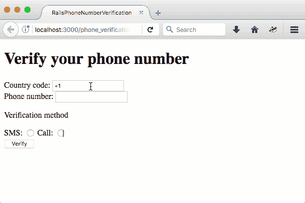
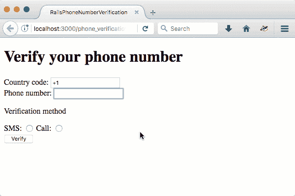

# 使用授权电话验证 API 在 Ruby on Rails 中验证用户电话号码

> 原文:[https://dev . to/twilio/verify-user-phone-numbers-in-ruby-on-rails-with-the-authy-phone-verification-API](https://dev.to/twilio/verify-user-phone-numbers-in-ruby-on-rails-with-the-authy-phone-verification-api)

如果你需要通过电话联系你的应用程序的用户，那么验证他们输入的电话号码确实是他们的是一个很好的实践。让我们看看如何在 Rails 5 应用程序中使用[授权电话验证 AP](https://www.twilio.com/docs/api/authy/authy-phone-verification-api) [I](https://www.twilio.com/docs/api/authy/authy-phone-verification-api) 来验证电话号码。

## 你需要什么

要编写这篇文章的代码，您需要:

*   一个 Twilio 账户
*   [你可以在 Twilio 控制台](https://www.twilio.com/console/authy/applications)中创建一个授权应用，你需要 API 密钥
*   安装了 Ruby 和 Rails，我用的是最新的 Rails 5.1.2 和 Ruby 2.4.1

## 入门

为此项目创建一个新的 Rails 应用程序:

```
rails new phone_verification
cd phone_verification 
```

<svg width="20px" height="20px" viewBox="0 0 24 24" class="highlight-action crayons-icon highlight-action--fullscreen-on"><title>Enter fullscreen mode</title></svg> <svg width="20px" height="20px" viewBox="0 0 24 24" class="highlight-action crayons-icon highlight-action--fullscreen-off"><title>Exit fullscreen mode</title></svg>

我们需要添加一些我们将在项目中使用的宝石，打开`Gemfile`，添加`authy`和`envyable`。Authy 将用于电话验证，可用于[管理环境变量](https://www.twilio.com/blog/2015/02/managing-development-environment-variables-across-multiple-ruby-applications.html)。

```
gem 'envyable'
gem 'authy' 
```

<svg width="20px" height="20px" viewBox="0 0 24 24" class="highlight-action crayons-icon highlight-action--fullscreen-on"><title>Enter fullscreen mode</title></svg> <svg width="20px" height="20px" viewBox="0 0 24 24" class="highlight-action crayons-icon highlight-action--fullscreen-off"><title>Exit fullscreen mode</title></svg>

安装 gems，然后从命令行初始化 envable:

```
bundle install bundle exec envyable install 
```

<svg width="20px" height="20px" viewBox="0 0 24 24" class="highlight-action crayons-icon highlight-action--fullscreen-on"><title>Enter fullscreen mode</title></svg> <svg width="20px" height="20px" viewBox="0 0 24 24" class="highlight-action crayons-icon highlight-action--fullscreen-off"><title>Exit fullscreen mode</title></svg>

打开`config/env.yml`并添加您的授权应用 API 密钥:

```
AUTHY_API_KEY: YOUR_API_KEY_HERE 
```

<svg width="20px" height="20px" viewBox="0 0 24 24" class="highlight-action crayons-icon highlight-action--fullscreen-on"><title>Enter fullscreen mode</title></svg> <svg width="20px" height="20px" viewBox="0 0 24 24" class="highlight-action crayons-icon highlight-action--fullscreen-off"><title>Exit fullscreen mode</title></svg>

现在，通过创建文件`config/initializers/authy.rb`初始化 Authy 本身，并添加以下代码:

```
Authy.api_key = ENV['AUTHY_API_KEY']
Authy.api_uri = 'https://api.authy.com/' 
```

<svg width="20px" height="20px" viewBox="0 0 24 24" class="highlight-action crayons-icon highlight-action--fullscreen-on"><title>Enter fullscreen mode</title></svg> <svg width="20px" height="20px" viewBox="0 0 24 24" class="highlight-action crayons-icon highlight-action--fullscreen-off"><title>Exit fullscreen mode</title></svg>

这就是我们需要的所有初始化，我们现在可以开始构建应用程序了。

## 构建 app

验证过程非常简单。

*   用户输入三位信息
    *   电话号码
    *   国家代码
    *   他们是想通过语音还是短信来验证
*   我们的应用程序向 API 发出请求来启动验证
*   用户收到带有 4 位数字代码的呼叫或文本消息
*   然后，他们将代码输入到应用程序的表单中
*   代码被发送到 API，并再次带有他们的电话号码和国家代码，以进行验证
*   如果它是正确的，那么用户已经验证了他们的号码

我们需要一个控制器，它既能显示我们需要的视图，又能进行初始化验证和实际验证电话号码。用
生成控制器

```
bundle exec rails generate controller phone_verifications new create challenge verify success 
```

<svg width="20px" height="20px" viewBox="0 0 24 24" class="highlight-action crayons-icon highlight-action--fullscreen-on"><title>Enter fullscreen mode</title></svg> <svg width="20px" height="20px" viewBox="0 0 24 24" class="highlight-action crayons-icon highlight-action--fullscreen-off"><title>Exit fullscreen mode</title></svg>

这将产生五个动作和五个视图。我们不需要创建和验证视图，所以您可以删除它们。它还会生成一些路线。打开`config/routes.rb`删除 5 条新路由，替换为:

```
 resources :phone_verifications, :only => [:new, :create] do |p|
    collection do
      get 'challenge'
      post 'verify'
      get 'success'
    end
  end 
```

<svg width="20px" height="20px" viewBox="0 0 24 24" class="highlight-action crayons-icon highlight-action--fullscreen-on"><title>Enter fullscreen mode</title></svg> <svg width="20px" height="20px" viewBox="0 0 24 24" class="highlight-action crayons-icon highlight-action--fullscreen-off"><title>Exit fullscreen mode</title></svg>

这创建了 5 条路线，您可以通过在命令行上运行`rails routes`来检查。他们长这样:

```
bundle exec rails routes
                       Prefix Verb URI Pattern                              Controller#Action
challenge_phone_verifications GET  /phone_verifications/challenge(.:format) phone_verifications#challenge
   verify_phone_verifications POST /phone_verifications/verify(.:format)    phone_verifications#verify
  success_phone_verifications GET  /phone_verifications/success(.:format)   phone_verifications#success
          phone_verifications POST /phone_verifications(.:format)           phone_verifications#create
       new_phone_verification GET  /phone_verifications/new(.:format)       phone_verifications#new 
```

<svg width="20px" height="20px" viewBox="0 0 24 24" class="highlight-action crayons-icon highlight-action--fullscreen-on"><title>Enter fullscreen mode</title></svg> <svg width="20px" height="20px" viewBox="0 0 24 24" class="highlight-action crayons-icon highlight-action--fullscreen-off"><title>Exit fullscreen mode</title></svg>

## 第一种观点

`new`动作需要向用户显示一个表格，记录他们的电话号码、所在国家的国家代码，以及他们是否希望通过短信或语音电话进行验证。

要生成国家代码列表，并创建一个我们可以用来按国家搜索的界面，包括[Authy JavaScript form helpers](https://github.com/authy/authy-form-helpers)。`app/views/layouts/application.html.erb`的`<head>`加上

```
 <%= stylesheet_link_tag    'application', media: 'all', 'data-turbolinks-track': 'reload' %>
    <%= stylesheet_link_tag    'https://cdnjs.cloudflare.com/ajax/libs/authy-form-helpers/2.3/form.authy.min.css', media: 'all', 'data-turbolinks-track': 'reload' %>
    <%= javascript_include_tag 'application', 'data-turbolinks-track': 'reload' %>
    <%= javascript_include_tag 'https://cdnjs.cloudflare.com/ajax/libs/authy-form-helpers/2.3/form.authy.min.js', 'data-turbolinks-track': 'reload' %> 
```

<svg width="20px" height="20px" viewBox="0 0 24 24" class="highlight-action crayons-icon highlight-action--fullscreen-on"><title>Enter fullscreen mode</title></svg> <svg width="20px" height="20px" viewBox="0 0 24 24" class="highlight-action crayons-icon highlight-action--fullscreen-off"><title>Exit fullscreen mode</title></svg>

现在，在`app/views/phone_verifications/new.html.erb`中，用下面的代码替换生成的代码:

```
<h1>Verify your phone number</h1>

<%= form_tag(phone_verifications_path, method: :post) do -%>
  <% if @response %>
    <% @response.errors.each do |key, message| %>
      <p><%= message %></p>
    <% end %>
  <% end %>
  <div>
    <%= label_tag "authy-countries", "Country code:" %>
    <%= select_tag "authy-countries", nil, name: 'country_code', 'data-show-as': 'number' %>
  </div>
  <div>
    <%= label_tag "phone_number", "Phone number:" %>
    <%= telephone_field_tag "phone_number", nil, name: 'phone_number' %>
  </div>
  <div>
    <p>Verification method</p>
    <%= label_tag "method_sms", "SMS: " %>
    <%= radio_button_tag "method", "sms" %>
    <%= label_tag "method_call", "Call: " %>
    <%= radio_button_tag "method", "call" %>
  </div>
  <%= button_tag "Verify" %>
<% end -%> 
```

<svg width="20px" height="20px" viewBox="0 0 24 24" class="highlight-action crayons-icon highlight-action--fullscreen-on"><title>Enter fullscreen mode</title></svg> <svg width="20px" height="20px" viewBox="0 0 24 24" class="highlight-action crayons-icon highlight-action--fullscreen-off"><title>Exit fullscreen mode</title></svg>

这段代码设置表单来提交这三个字段。使用 ID `"authy-countries"`意味着`select_tag`将被 Authy JavaScript 获取并扩充为一个可搜索的国家列表。

我们还使用`telephone_field_tag`创建一个类型为`"tel"`的 HTML 输入，以便移动设备显示一个输入电话号码的优化键盘。

启动服务器:

```
bundle exec rails server 
```

<svg width="20px" height="20px" viewBox="0 0 24 24" class="highlight-action crayons-icon highlight-action--fullscreen-on"><title>Enter fullscreen mode</title></svg> <svg width="20px" height="20px" viewBox="0 0 24 24" class="highlight-action crayons-icon highlight-action--fullscreen-off"><title>Exit fullscreen mode</title></svg>

导航到[http://localhost:3000/phone _ verifications/new](http://localhost:3000/phone_verifications/new)查看新表单，并试用国家代码字段。

[T2】](https://res.cloudinary.com/practicaldev/image/fetch/s--9uvainrC--/c_limit%2Cf_auto%2Cfl_progressive%2Cq_66%2Cw_880/https://twilioinc.wpengine.com/wp-content/uploads/2017/08/numberpicker.gif)

## 验证过程

现在，我们有了启动流程的表单，我们需要开始验证。使用输入到表单中的参数，我们将构建一个对 Authy phone 验证 API 的 API 请求并发送出去。如果成功，我们将呈现要求验证码的表单，否则我们应该重新呈现初始表单并显示错误。

在`app/controllers/phone_verifications_controller.rb`中，用下面的代码替换空的`create`方法:

```
 def create
    session[:phone_number] = params[:phone_number]
    session[:country_code] = params[:country_code]
    @response = Authy::PhoneVerification.start(
      via: params[:method],
      country_code: params[:country_code],
      phone_number: params[:phone_number]
    )
    if @response.ok?
      redirect_to challenge_phone_verifications_path
    else
      render :new
    end
  end 
```

<svg width="20px" height="20px" viewBox="0 0 24 24" class="highlight-action crayons-icon highlight-action--fullscreen-on"><title>Enter fullscreen mode</title></svg> <svg width="20px" height="20px" viewBox="0 0 24 24" class="highlight-action crayons-icon highlight-action--fullscreen-off"><title>Exit fullscreen mode</title></svg>

这里的关键部分是对`Authy::PhoneVerification.start`的调用。我们传递从用户那里收集的参数，包括联系他们的方式、电话号码和国家代码。如果对此的响应是 ok，那么验证过程将开始，否则存在问题。

我们已经内置了代码，以便在出现问题时显示错误。视图中的这些行处理:

```
 <% if @response %>
    <% @response.errors.each do |key, message| %>
      <p><%= message %></p>
    <% end %>
  <% end %> 
```

<svg width="20px" height="20px" viewBox="0 0 24 24" class="highlight-action crayons-icon highlight-action--fullscreen-on"><title>Enter fullscreen mode</title></svg> <svg width="20px" height="20px" viewBox="0 0 24 24" class="highlight-action crayons-icon highlight-action--fullscreen-off"><title>Exit fullscreen mode</title></svg>

还要注意，我们将电话号码和国家代码保存到会话中，以便以后使用。在一个完整的应用程序中，这些将根据数据库中的用户或电话号码记录保存，我们将在会话中保留记录的 ID。

## 挑战

我们现在需要用户输入验证过程发送给他们的 4 位数字。将以下代码添加到`app/views/phone_verifications/challenge.html.erb` :

```
<h1>Challenge</h1>

<%= form_tag(verify_phone_verifications_path, method: :post) do -%>
  <% if @response %>
    <% @response.errors.each do |key, message| %>
      <p><%= message %></p>
    <% end %>
  <% end %>
  <div>
    <%= label_tag "code", "Enter the code you were sent:" %>
    <%= text_field_tag "code" %>
  </div>
  <%= button_tag "Verify" %>
<% end -%> 
```

<svg width="20px" height="20px" viewBox="0 0 24 24" class="highlight-action crayons-icon highlight-action--fullscreen-on"><title>Enter fullscreen mode</title></svg> <svg width="20px" height="20px" viewBox="0 0 24 24" class="highlight-action crayons-icon highlight-action--fullscreen-off"><title>Exit fullscreen mode</title></svg>

## 验证时间

现在我们有了用户的 4 位数代码，我们需要用 API 来验证它。将`PhoneVerificationsController`中的空`verify`动作替换为:

```
 def verify
    @response = Authy::PhoneVerification.check(
      verification_code: params[:code],
      country_code: session[:country_code],
      phone_number: session[:phone_number]
    )
    if @response.ok?
      session[:phone_number] = nil
      session[:country_code] = nil
      redirect_to success_phone_verifications_path
    else
      render :challenge
    end
  end 
```

<svg width="20px" height="20px" viewBox="0 0 24 24" class="highlight-action crayons-icon highlight-action--fullscreen-on"><title>Enter fullscreen mode</title></svg> <svg width="20px" height="20px" viewBox="0 0 24 24" class="highlight-action crayons-icon highlight-action--fullscreen-off"><title>Exit fullscreen mode</title></svg>

这一次，这里的关键部分是向`Authy::PhoneVerification.check`发出请求，传入我们之前保存的电话号码和国家代码以及用户输入的代码。如果这次响应正常，则验证成功，我们可以清除会话并重定向到成功路径。在真实的应用程序中，您可能会标记用户或电话记录确实经过验证，并将其保存在数据库中。

如果代码错误，我们将再次显示挑战视图，以便用户在出错时可以重试。

最后，给`app/views/phone_verifications/success.html.erb` :
添加一条成功消息

```
<h1>Congratulations!</h1>
<p>You have successfully verified your phone number.</p> 
```

<svg width="20px" height="20px" viewBox="0 0 24 24" class="highlight-action crayons-icon highlight-action--fullscreen-on"><title>Enter fullscreen mode</title></svg> <svg width="20px" height="20px" viewBox="0 0 24 24" class="highlight-action crayons-icon highlight-action--fullscreen-off"><title>Exit fullscreen mode</title></svg>

## 我们来测试一下

如果之前没有启动服务器，现在就启动:

```
bundle exec rails server 
```

<svg width="20px" height="20px" viewBox="0 0 24 24" class="highlight-action crayons-icon highlight-action--fullscreen-on"><title>Enter fullscreen mode</title></svg> <svg width="20px" height="20px" viewBox="0 0 24 24" class="highlight-action crayons-icon highlight-action--fullscreen-off"><title>Exit fullscreen mode</title></svg>

前往[http://localhost:3000/phone _ verifications/new](http://localhost:3000/phone_verifications/new)并输入正确的详细信息。当你收到电话或短信时，在第二个表格中输入验证码，你会看到一条成功的消息，表明你的手机已经通过验证。

[T2】](https://res.cloudinary.com/practicaldev/image/fetch/s--83wPxhBI--/c_limit%2Cf_auto%2Cfl_progressive%2Cq_66%2Cw_880/https://twilioinc.wpengine.com/wp-content/uploads/2017/08/complete5.gif)

## 电话号码？已验证！

这就是如何开始使用 Rails 5 中的 Authy Phone 验证 API。你可以在 GitHub 上查看本文的完整代码。这个应用程序还远远没有完成当然，还有很多工作要做。你会想:

*   将电话号码及其验证状态保存到数据库中的用户模型中
*   更好地处理错误，让用户有机会重新发送或再次呼叫，或者检查和更新电话号码

如果您有任何问题或意见，请联系我们。请在下面给我留言或者在 Twitter 上给我留言。

* * *

*[用 Authy Phone Verification API 在 Ruby on Rails 中验证用户电话号码](https://www.twilio.com//blog/2017/08/verify-user-phone-numbers-in-ruby-on-rails-with-the-authy-verification-api.html)最初发表于 2017 年 8 月 30 日 [Twilio 博客](https://www.twilio.com/blog)。*