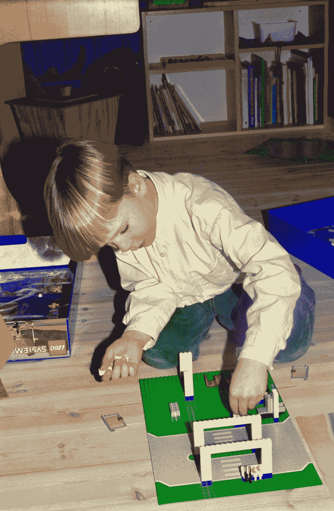
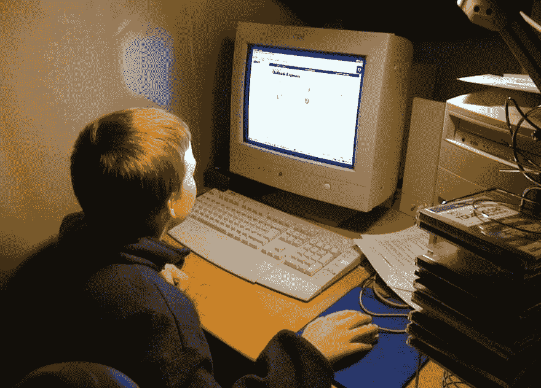
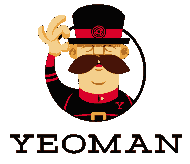
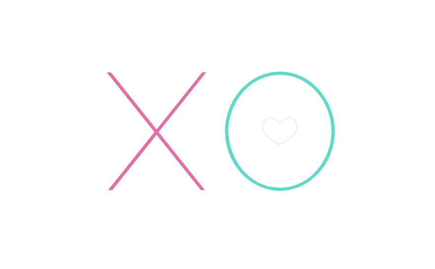
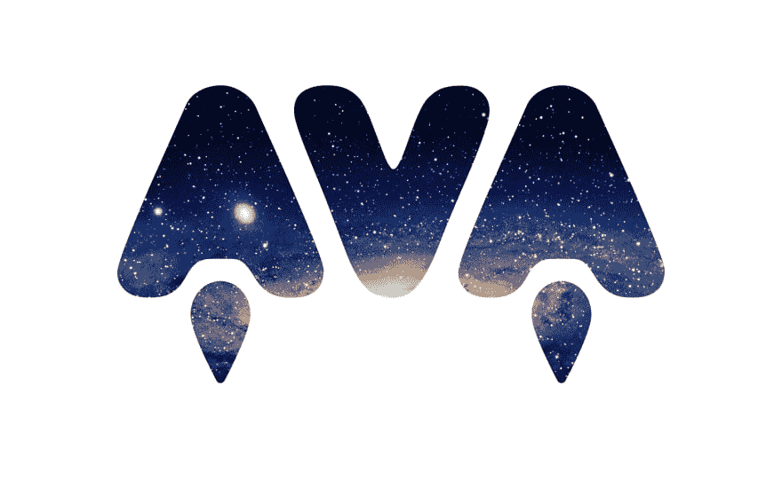
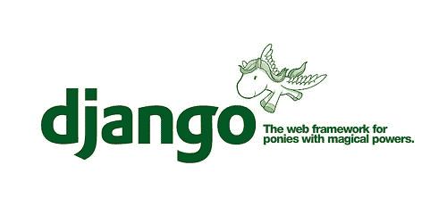
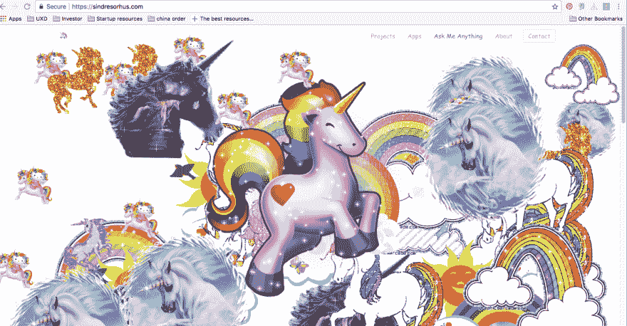
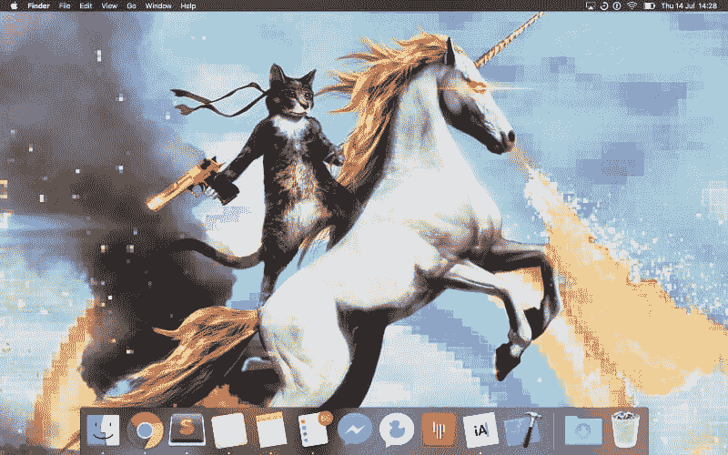

# 连线之间:开源开发者辛德雷·索胡斯访谈

> 原文:[https://dev . to/between the wires/between-the-wires-an-interview-with-open-source-developer-sindre-sor HUS](https://dev.to/betweenthewires/between-the-wires-an-interview-with-open-source-developer-sindre-sorhus)

<figure> 

<figcaption>在曼谷街头小吃店</figcaption>

</figure>

## **告诉我们一点关于你的童年和你成长的地方。**

我在挪威奥斯陆郊外长大。当我小的时候，我对乐高非常感兴趣。每年生日和圣诞节我都会得到乐高玩具。乐高真的激发了我早期建造东西的兴趣。有一次，我的房间里建了一个巨大的乐高城市，它几乎占据了整个房间。

<figure> 

<figcaption>小时候搭乐高</figcaption>

</figure>

## **你是怎么进入编程的？**

当我七岁的时候，我们家有了第一台电脑 Windows 95。我曾经玩过一个地图爆破游戏，游戏中的角色跳来跳去解决数学问题。几年后，我们终于可以上网了，这改变了我的一切。我花了很多时间在别人网页的留言簿上写东西，收集 gif。有一天，我对网站的工作方式感到好奇，发现了浏览器中的“查看源代码”按钮。

<figure> 

<figcaption>在一台家用电脑上，辛德雷正在查看微软的 Outlook Express</figcaption>

</figure>

对我来说，这是一个令人兴奋的发现。我只需点击右键，查看源代码，然后我就可以看到一切是如何制作的。一开始我不太明白，但当我一遍又一遍地看着同样的东西时，我开始明白它是如何工作的。我就是这样开始我的编程之旅的。最终，这激发了我对编程的兴趣。

我十岁的时候建了第一个网站。这是在看了几年的原始资料之后。它有各种各样的颜色，一个星星图案的背景，用媒体背景音乐制作动画——这是当时每个人在他们的网站上都有的东西之一。我用的是[微软 FrontPage](https://en.wikipedia.org/wiki/Microsoft_FrontPage) 。

有一次，我很无聊，所以在我爸爸的电脑上创建了数千个嵌套目录，结果导致电脑崩溃。我爸不得不重新格式化电脑；他印象深刻，同时也很恼火。这也是我失去第一个网站的原因。

后来在我上学期间，我迷上了 Flash 游戏，我们会在学校放假期间看很多 Flash 电影。我很好奇它们是如何制作的，但从来没有任何源按钮。所以我反编译了 swiff 文件，这很容易，因为它们没有混淆。这又一次给了我从其他人的工作中学习的机会。我开始修改别人的游戏，重新设计所有的角色，树立新的敌人，增加高分。当我意识到其他人也可以玩我粘在一起的游戏时，这是一个值得骄傲的时刻。

## **你在军队做了五年的前端开发人员和摄影师。当时的 web 开发是什么样的？**

<figure> 

<figcaption>军中的辛德雷</figcaption>

</figure>

高中毕业后，我被直接征召到挪威服兵役。我进入了媒体部门，在那里我花了大部分时间在公司内部网络上工作。晚上没什么事可做，因为我们住在营房里，所以我决定做点东西。但是我的大部分经历都是复制粘贴别人的 PHP 和 JavaScript，我不太明白它们是如何工作的。有一天，我偶然发现了 Python 和 Django，它们有 PHP 从未有过的很棒的文档和教程。我会每天阅读教程，并开始在工作中制作东西。

这就是我实际编码的开始。征兵结束后，我打算在上大学前去旅行。但是我得到了一份工作，来自军队中一个叫网络防御部队的单位。这很吸引人，所以我接受了邀请，在那里呆了 5 年。

<figure> 

<figcaption>辛德雷在军中做的 app</figcaption>

</figure>

## **你是怎么和 TodoMVC 和 Yeoman 扯上关系的？**

我在 2011 年左右开始使用 GitHub，但主要是作为消费者。我会四处逛逛，看看不同的回复，给它们标上星号，因为它们看起来很有趣。我修复了 README.md 文件中的一些错别字，但仅此而已。

有一天我偶然发现了 TodoMVC，它可以帮助你选择一个 JavaScript 框架。这是一个非常棒的想法，尽管事后看来，我们需要更多的高级应用程序来解决性能测试和框架能力的问题。关于 TodoMVC，我记得的第一件事就是它有一个很好的 logo。这看起来很肤浅，但这就是我开始的原因。

<figure> 

<figcaption>ToDoMVC 标志</figcaption>

</figure>

我非常喜欢这个标志，所以我决定多逛逛。我注意到他们没有真正的 jQuery 应用程序，所以我决定创建一个。我在周末提交并得到了项目维护者 Addy Osmani 的回复。他很快合并了我的公关，这对于像我这样的初学者来说是一次非常好的经历。我感觉很好，我的应用程序现在被包括在这个非常受欢迎的项目中。我这样做了几个星期，Addy 把我加入了这个非常酷的项目。

这真的让我对开源产生了兴趣。在此之前，我只是一个被动的消费者，但有了 TodoMVC，我尝到了维护一个工作量很大的大项目的滋味。但是我从那次经历中学到了很多。

几个月后，Addy 去了谷歌工作。他在谷歌的第一个项目是 Yeoman，现代网络应用的脚手架工具。因为我们在 TodoMVC 上合作得非常好，所以他决定邀请我作为外部贡献者。

<figure> 

<figcaption>约曼标志</figcaption>

</figure>

我们与 Yeoman 的最初目标是创建一套工具，每个人都可以用它来创建优秀的 web 应用程序。我们没有意识到的是，用一个工具解决所有人的问题是不可能的，因为网络上有太多的用例。Yeoman 成为一种流行的配置，许多开发人员创建了生成器来扩展适合他们自己用例的 Yeoman。

如果你看看 Create React App 或 Webpack，历史也会重演。它开始制造本应解决一个问题的产品，但是因为每个人都有不同的需求，问题就出现了。当你意识到这个工具不能涵盖一切，所以你添加配置。关键是要有一个平衡的方法。你必须说“不”,你需要知道什么时候说“不”。你可能会让一些用户失望，因为他们有模糊的用例。这是制作工具的难点，在开源项目中甚至更难，因为有太多的反馈。

## **你为什么热衷于开源？**

我喜欢开源，我认为它可以追溯到浏览器中的“查看源代码”按钮。在我看来，开源是构建软件最有效的方式，因为它使我们能够在彼此工作的基础上进行构建。如果任何一个人解决了一个难题，每个人都会受益。开源让我可以和来自世界各地的不可思议的人一起工作，否则我永远无法和他们一起工作。我们开始做对我们重要的事情，关注社区需要什么，而不是关注创收。

[Paul Irish](http://twitter.com/paulirish) 在 YouTube 上有一个很棒的视频，名为“[我从 jQuery Source 学到的十件事](https://www.youtube.com/watch?v=i_qE1iAmjFg)。这让我对阅读 jQuery 源代码产生了兴趣。保罗·爱尔兰是对的，你可以通过实际做你想学的事情来学到很多东西。

## **开源可持续性怎么样？**

这绝对是我最近想了很多的一个冲突点。我全职做开源已经大约三年了。我不挣钱，但如果能全职做这份有报酬的工作就好了。尤雨溪的 [Vue.js](https://vuejs.org/) 是一个很好的例子，说明了开源可持续性是如何工作的。他创建了一个每个人都想要的框架，并且已经被相当多的公司使用。其他公司和个人有动力投资他的项目，因为它对生产有用。关键是让你的项目可靠。我个人认为个人的贡献不足以维持一个项目。

我一直在考虑使用[Open collection](https://opencollective.com/)这样我们可以收集资金来奖励贡献者和活动推广。Webpack 在 T2 做了一项伟大的工作。我实际上很长一段时间都反对这一点，因为我担心，每当有人向这个项目投资时，就会有人期望我们采取行动。通常，如果一家公司投资一个项目，他们希望工作优先，问题快速解决。

我目前住在泰国，我想少于 1500 美元也没问题。

## **你有超过 1000 个 npm 包。你是如何保持如此高效率的？**

那是一种误解。人们看到数字 [1000 个包](https://www.npmjs.com/~sindresorhus)，他们认为我非常有效率，但他们没有意识到的是，这些包中的大多数都很小，而且是模块化的。它们出版的时候已经基本完成了。我喜欢把编程比作用乐高建造:我创造了许多乐高积木，它们可以被组装起来建造更大的建筑。在发布之前，我将它们与其他包一起使用，以确保它们能够解决问题。这也是为什么用户不会提交大量的功能请求，因为它们太小了。如果他们需要更多的东西，他们可以建立另一个模块。我 90%的时间都花在我最大的 10 个项目上。

## **在与苛求和有毒的人打交道时，你能给新的 OSS 贡献者什么建议？**

我已经做了六年的开源软件，所以我的脸皮已经很厚了。我不认为任何事情会再困扰我，因为我喜欢认为我已经经历了这一切。我和许多经历了一些毒性并戒了毒的初学者交谈过。开源应该是你做的一件有趣的事情，而不是你生活中压力的原因。

我对新开发者的建议是，你不应该让网络上的陌生人对你的情绪或动力产生负面影响。这不值得。如果你可以选择离开，那就接受吧——利用退订按钮。开源维护者需要记住，用户不是付费客户。我们在自己的空闲时间为他们免费提供一些东西

和有毒的人在一起，你需要永远做一个更大的人。这听起来不对，但我试图做的是用善意杀死他们。不知何故，它已经为我工作了很多年。例如，如果有人很讨厌，我会试着对这种情况保持开放和友好。我保证永远不会讽刺他们或用高人一等的口气跟他们说话。巨魔以你的烦恼和话语为食，所以当它不在的时候，他们会让你一个人呆着。

只要有静音选项，我都会使用，尤其是在 Twitter 上。意识到某人处于危险边缘是很好的，简单地关闭声音和输入比引起不必要的冲突要好得多。

## **你为自己的模块设计了一些 logos，很牛逼。你是怎么学设计的？**

<figure> 

<figcaption>XO 项目</figcaption>

</figure>

我开始跟随在线教程制作很酷的效果。以前用[素描](https://www.sketchapp.com/)，现在用 [Adobe Illustrator](https://www.adobe.com/products/illustrator.html) 。

我做设计真的很好玩，我觉得应该有更多的程序员去尝试。编程几个小时后，休息一下以不同的方式做一些创造性的工作是很好的。

它还通过创建标识使我的项目受益，因为它赋予项目更多的个性。通常当你在 GitHub 上输入一个 repo 时，你会得到同样的基于文本的东西:一个标题、一些简介和 README.md..事实证明，如果有一个标志，人们更有可能使用这个项目。例如，[来自乌克兰的开发者 Vadim Demedes](https://github.com/vadimdemedes) ，在 AVA 发布后立刻提交了这个[拉取请求](https://github.com/avajs/ava/pull/30)。瓦迪姆后来成为 AVA 团队的一员。他告诉我他对 AVA 感兴趣是因为它漂亮的标志。

<figure> 

<figcaption>辛德雷设计的 AVA 项目标志</figcaption>

</figure>

我对泰国了解不多。当我服兵役时，我计划去旅行。我得到了一份工作，最后又呆了四年。我只是随波逐流，因为生活就是这样。

有一天，我实际上正在准备接受谷歌的电话采访，我刚刚决定，如果我要去旅行，那就是现在，否则，永远不会发生。于是我取消了面试，第二天在单位递交了辞呈。我买了一张去泰国的单程票，仅此而已。

我在东南亚背包旅行了半年，在那里我遇到了我的女朋友。我最终定居在泰国，因为它是我的最爱。我喜欢它丰富的文化、友好的当地人和食物。我已经在泰国住了两年了。

我每周有三天在当地的咖啡店工作，因为我喜欢与人交流。除此之外，从九点到六点，我做大量的开源代码和维护工作，有时是我的副业。在大多数日子里，我会收到 20 多个拉取请求和大量的问题需要解决。晚上和女朋友 Im 在一起；我们都喜欢夜市里辛辣的街边小吃。有时工作需要，我发现自己深夜又回到了电脑前。

<figure> 

<figcaption>辛德雷和他的女朋友 Im 在泰国麦岛</figcaption>

</figure>

我没有学习泰语，因为虽然我擅长编程语言，但口语比任何编程语言都难，泰语尤其难。而我女朋友，泰语、俄语、英语、瑞典语都很流利。在某些时候，我想学习泰语和其他语言，但我没有时间。

## **是什么促使你开始 AVA 计划？**

我用了很多摩卡，因为我做了很多需要测试的模块。我对它的工作方式不是很满意。Mocha 注入了一些全局对象，但是它们没有在任何地方定义。因为我是在 Node.js 中做的，所以我有很多异步 API，用 Mocha 做起来不太方便。

我想要更简单、更适合我的用例的东西。所以一个周末，我决定继续努力，到周日晚上，我在 npm 上发布了 AVA 的 0.0.1 版本。尽管 JavaScript 是单线程的，但是 Node.js 中的 IO 可以并行发生，这是因为它的异步特性。AVA 利用了这一点，并发运行您的测试，这对于 IO 繁重的测试尤其有益。此外，测试文件作为独立的进程并行运行，这使得每个测试文件都有更好的性能和隔离的环境。

<figure> 

<figcaption>AVA 项目</figcaption>

</figure>

因为我没有时间修复 bug，而且我只想把它用在我自己的项目上，所以它是私有的。一年半之后，我终于为 AVA 设计了一个标志，清理了回购协议，写了很多文档。然后，我发布了这个项目。它成长了很多，因为我猜很多开发人员遇到了和我相似的问题。

大多数用户真的很高兴，因为我们一直都能收到关于这个项目的推文。他们真的很喜欢语法的简单和入门的容易。我只是用它来挠自己的痒，但结果是其他人也有同样的问题，并且喜欢我的解决方案

现在，我在管理项目上花了更多的时间，因为每周都有很多新的问题和请求，这使得我几乎没有时间编码。

## **你为什么决定进入 macOS 开发领域？**

我学过一点 Objective-C 编程，但是我没有很好的体验。所以当 [Swift](https://developer.apple.com/swift/) 出来的时候，我决定试一试。今年一月，我有了一个关于 Mac 应用程序的想法，而且我有一些空闲时间，所以我马上投入了进去。我通常就是这样学习新东西的。很自然。我从制造产品的愿望开始，然后我想出制造产品需要什么技能，然后我学习它们。想法先于计划。

Swift 最初比 JavaScript 难学得多，但 Swift 大放异彩，因为它是强类型的。当你编译的时候，如果你正确的使用选项，崩溃的可能性会小很多。我不喜欢 Swift 的唯一一点是，有时你仍然必须与 c 中的旧 API 进行交互。

<figure> 

<figcaption>Lungo 项目标志</figcaption>

</figure>

我写了一些生产力和实用程序。Lungo 是我写的一个菜单栏应用，你可以在 T2 应用商店找到它。我写的另一个是[电池指示灯](https://itunes.apple.com/us/app/battery-indicator/id1206020918?mt=12)。

## **你明年的计划是什么？你打算全职工作还是考虑其他方式来实现财务可持续发展？**

在过去的三年里，我一直靠积蓄生活，做开源软件。这在亚洲要容易得多，但不会永远持续下去。理想情况下，我希望以经济上可持续的方式做开源，但这很难，所以我可能会在明年做一些承包。

我尝试了一些不同的东西。我做的一件事就是在 [GitHub README.md](https://github.com/sindresorhus/awesome-nodejs) 文件中请求支持。我不会称之为广告，而是一个小横幅。我赚了一点钱，但是远远不够维持我的生活。

我可能会试一试帕特里翁。

## **在 JavaScript 生态系统中，你希望改进哪些方面？**

在我看来，JavaScript 生态系统已经很棒了，但是在浏览器方面我们还有很多问题需要解决。有很多项目都有这个巨大的构建脚本，只是为了得到一个简单的应用程序，这就是为什么我喜欢 [Node.js](https://nodejs.org/en/) 。

浏览器的问题在于它们非常复杂。您需要考虑网络，需要优化性能，有许多不同的用例、框架可供选择。每个人都试图简化它，但最终你太固执己见，然后你添加配置，但有太多的样板文件。我看不到一条简单的前进道路，除非你修复实际的平台，而不是在其上创建许多解决方案。我认为，当我们最终在浏览器中获得模块时，情况会有所改善。您可能不需要为每件事都构建一个步骤。

## **为什么 JavaScript 开发者痴迷独角兽？**

整个小马运动实际上始于 Django 社区。当你开始询问你想要的特性时，开发人员会说“我想要一个更快的 HTTP 解析器，或者”我想要一个能正常工作的 ORM。有一天，Django 邮件列表上的一个核心开发人员回复了一个特性请求:“不，你不能有一匹小马！整个独角兽运动都是从拒绝功能请求开始的。

甚至还有一个专门为可爱的小马建立的网站。

<figure> 

<figcaption>Django，拥有神奇力量的小马的网络框架。</figcaption>

</figure>

我不记得它是如何传播到 JavaScript 社区的。这是自然而然发生的事情之一。拥有像独角兽这样有趣又愚蠢的东西有助于我完成编程和操作系统，并提升我的士气。愚蠢的 gif 也是如此。

<figure>

<figcaption>ESPN.com 用 Konami 码变得不可思议。(来源:[http://kotaku . com/5230185/the-konami-code-makes-espncom-magic](http://kotaku.com/5230185/the-konami-code-makes-espncom-magical))</figcaption>

</figure>

<figure> 

<figcaption>辛德雷的网站</figcaption>

</figure>

<figure> 

<figcaption>辛德雷的笔记本电脑主屏</figcaption>

</figure>

这个项目得到了来自[frontendmasters.com](https://frontendmasters.com/)、 [egghead.io](https://egghead.io/) 、[微软 Edge](https://www.microsoft.com/en-us/windows/microsoft-edge) 和[谷歌开发者](https://developers.google.com/)的赞助。

[T2】](https://res.cloudinary.com/practicaldev/image/fetch/s--cy82EAmg--/c_limit%2Cf_auto%2Cfl_progressive%2Cq_auto%2Cw_880/https://betweenthewires.org/wp-content/uploads/2017/08/4partners.png%3Fx64656)

*本帖最初发表于[betweenthewires.org](https://betweenthewires.org/2017/09/04/sindre-sorhus/)T3】*