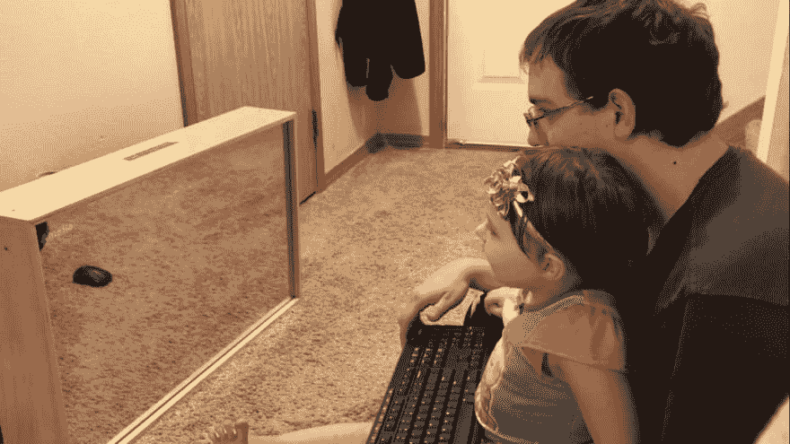
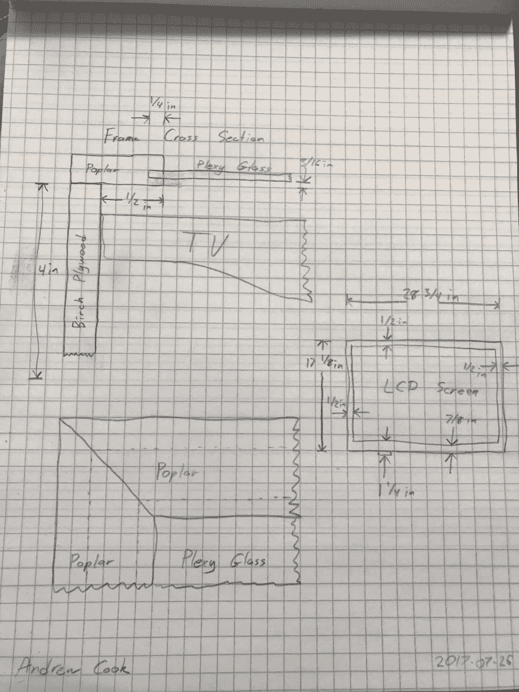
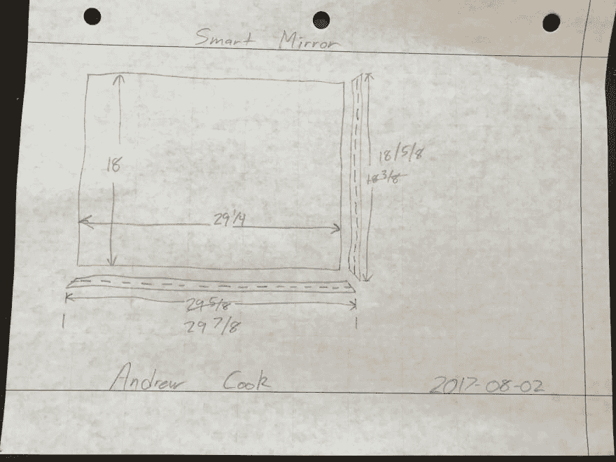
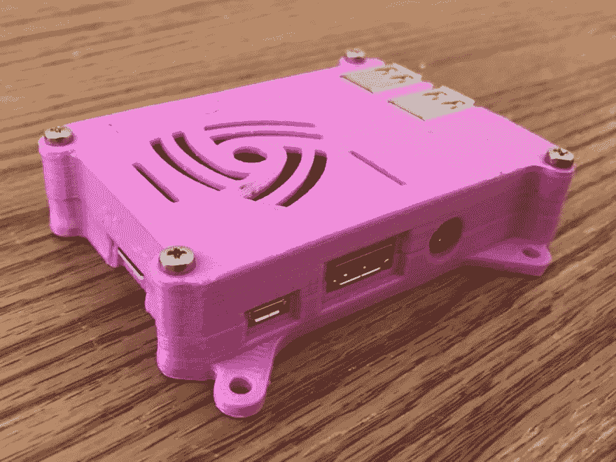
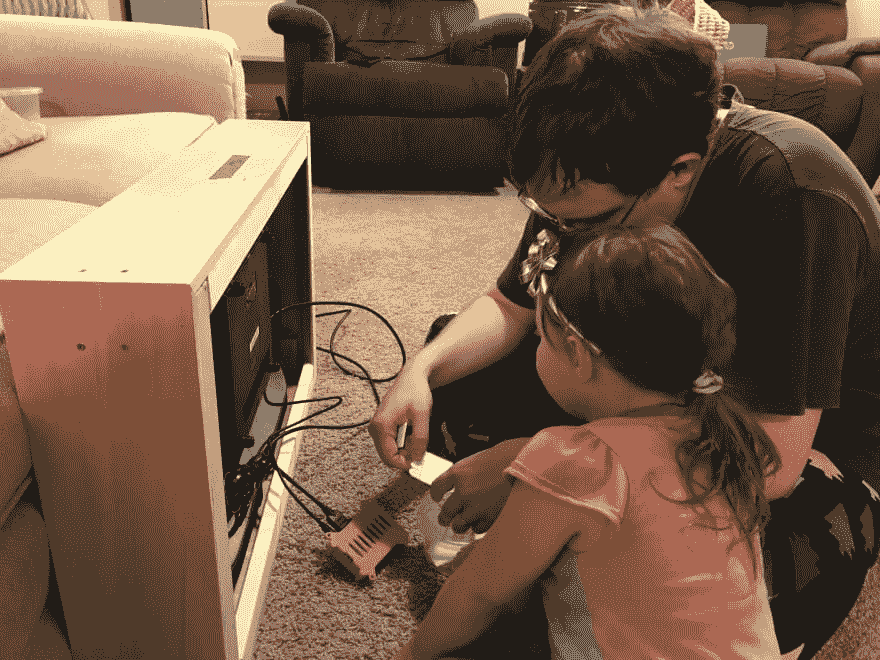
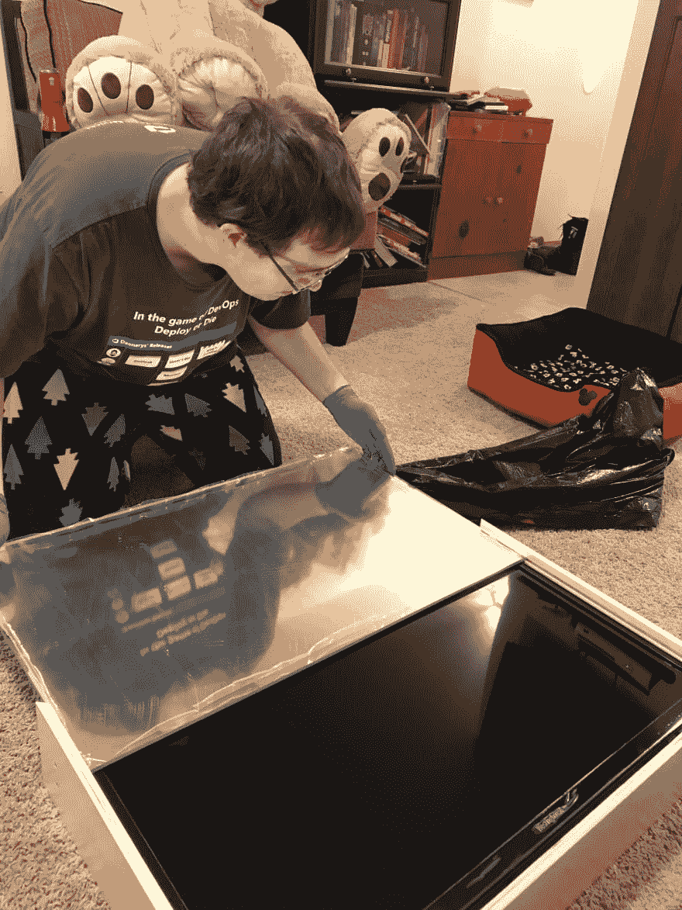
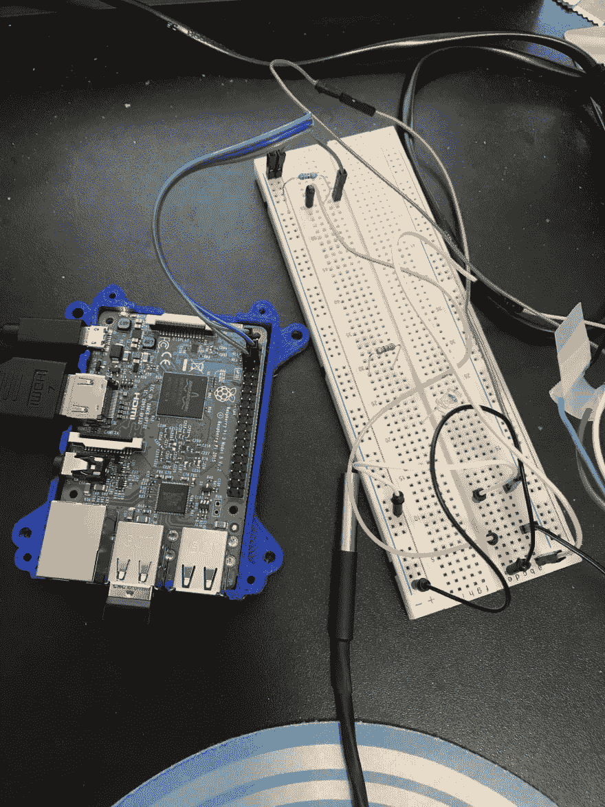

# 与我的父亲和女儿一起制作智能镜子

> 原文:[https://dev . to/codingwookie/crafting-a-smart-mirror-with-my-daughter](https://dev.to/codingwcookie/crafting-a-smart-mirror-with-my-dad-anddaughter)

这个月我和爸爸、女儿一起做了一个智能镜子，这个项目跨越了三代人 。这个想法始于几年前智能镜子的新奇。但是在我投入时间和金钱去做之前，我需要一个实际的理由去做。最近，这个理由出现了。在我们的厨房里有一块白板，我们在上面列出了一周的晚餐计划，我想升级一下。 除此之外，我在当地的技术会议上提交了一份智能镜子的演示想法，我的智能镜子演示[被选中](https://seattle.codecamp.us/Session/Details/217) 。(从而加速了我的时间线。)

[T2】](https://res.cloudinary.com/practicaldev/image/fetch/s--_O8R5EEf--/c_limit%2Cf_auto%2Cfl_progressive%2Cq_auto%2Cw_880/https://codingwithcookie.com/wp-content/uploads/2017/08/IMG_5604-1.png)

我知道我在智能镜架的设计上需要帮助，因为我生活在数字世界，设计软件生活在云 。 但是我的爸爸是一个生活在物质世界的机械工程师，他设计我们 飞 的飞机，尽管每天都有云 。一天晚上和我爸爸聊天时，他建议先画一些镜子的草图。

[T2】](https://res.cloudinary.com/practicaldev/image/fetch/s--zYQO4hBl--/c_limit%2Cf_auto%2Cfl_progressive%2Cq_auto%2Cw_880/https://codingwithcookie.com/wp-content/uploads/2017/08/IMG_5255-e1503120308978.jpg)

在和我爸又谈了几次，又修改了几次设计之后，我们决定为 做一个简单的盒子设计。由于我父亲比我更了解木工，他给了我一些建议。比如用橱柜的抽屉来装框架的侧面，因为它们已经有了一个凹槽来装玻璃。 并使用[法式楔子](https://en.wikipedia.org/wiki/French_cleat)将镜子固定在墙上，这也使得它能够被轻松移除，以便运输 。

[T2】](https://res.cloudinary.com/practicaldev/image/fetch/s--J4RxBSfZ--/c_limit%2Cf_auto%2Cfl_progressive%2Cq_auto%2Cw_880/https://codingwithcookie.com/wp-content/uploads/2017/08/Box-Design.jpg)

在这次的奋进中，我的妻子是巨大的支持者。她帮忙挑选了几十台电视，寻找价格、功能和尺寸合适的，适合我们厨房的 。但不会大到让运输变得麻烦。最后，她从百思买买到了一台电视，里面有我想要的所有东西。最棒的是它正在打折。

智能镜子最引人注目的部分是反光镜。 大多数家用镜子 都是用玻璃做的 ，但是使用玻璃最大的缺点，就是易碎，不太好运输 。我选择了塑料，因为它更轻、更透明、更耐用。很高兴与专家交谈，我住在西雅图，那里有一家很棒的当地塑料供应商。他们非常优秀，能够帮助我选择正确的塑料。他们建议使用丙烯酸树脂，我们甚至用他们的样品测试了我得到的镜面薄膜。除了他们的帮助，这并不是他们提供塑料的第一面智能镜子，所以我知道我走的是正确的道路 。

当决定在哪里组装车架时，选择很简单。我爸爸有一个新的车间和我们需要的所有工具，我有一个车库和一个工具箱。一旦我得到了木材、丙烯酸树脂和镜面胶片，我就去我爸爸的车间组装画框。我原以为要花 4-5 个小时，但组装镜子花了大约 15 个小时。但这可能是因为我们在制作镜子时改进了设计。也可能是因为我问了很多问题，比如为什么要粘这个还是拧那个。或者是因为和我爸玩得开心。回想起来，这是上述所有因素的结合。 在 3 天的时间里，我们切割、粘合、钉上、用螺丝将框架固定在一起，以固定电视、亚克力镜子和树莓派 。

自从用了几个电动工具，包括台锯、剁锯、钉枪，我女儿那部分 都没帮忙。但是当丙烯酸镜 被插入 时，她能够帮助完成最后的组装。她甚至能在最后组装时用电钻拧上盖子。

[T2】](https://res.cloudinary.com/practicaldev/image/fetch/s--TiWqXhqP--/c_limit%2Cf_auto%2Cfl_progressive%2Cq_auto%2Cw_880/https://codingwithcookie.com/wp-content/uploads/2017/08/IMG_5416-e1503121444596.jpg)

随着所有木工工作的完成，我和女儿开始把所有东西都连接起来。因为粉红色是她最喜欢的颜色，很明显，唯一的选择是 3D 打印粉红色的树莓派外壳。我们把树莓派放进粉红色的盒子里，然后用粘性 Velcro 把它贴在电视背面。通过使用 Velcro，树莓可以 断开 。因此，我可以展示将镜子变成智能镜子的计算机的大小。

[T2】](https://res.cloudinary.com/practicaldev/image/fetch/s--feY2Km6M--/c_limit%2Cf_auto%2Cfl_progressive%2Cq_auto%2Cw_880/https://codingwithcookie.com/wp-content/uploads/2017/08/IMG_5344.jpg)

现代电视通常都有一个 USB 接口，我妻子找到的那台确实有一个。我在电视上的 USP 端口测试了它，它能够为树莓派提供足够的电力。这意味着电视电源线是我唯一需要插入墙上插座的电缆。然后，我们将 USB 和 HDMI 电缆插入树莓 Pi 和电视，我们准备好了。通过车载 WiFi，我可以将智能镜子连接到互联网，无需任何其他电线。当断电时，它仍将作为传统的非智能镜子工作。

[T2】](https://res.cloudinary.com/practicaldev/image/fetch/s--OQfodUrV--/c_limit%2Cf_auto%2Cfl_progressive%2Cq_auto%2Cw_880/https://codingwithcookie.com/wp-content/uploads/2017/08/IMG_5529.jpg)

当你 4 岁的时候，在键盘上打字和编码很酷。(等她 14 岁的时候再看她的感受。)我女儿在智能镜子的软件部分得到了很多帮助。 因为她的拼写能力以她的名字结束，所以她能够打字，当她在智能镜子上看到它时非常兴奋 。

为了让她的名字出现，我们使用了 html。为了简单起见，我们只需通过 Chrome(全屏 F11)制作一个带有内嵌样式的静态 html 页面，就能让它正常工作。 在对 html 进行样式化的时候，背景需要尽可能的暗，以 最小化 光线通过镜子 。当屏幕关闭或完全变黑时，它就像一面普通的镜子。文本和图形需要尽可能明亮地显示出来，将其转化为智能镜子。在我的镜子上，我能找到一个透明度为 5%的胶片。

[T2】](https://res.cloudinary.com/practicaldev/image/fetch/s--W8uYmUBV--/c_limit%2Cf_auto%2Cfl_progressive%2Cq_auto%2Cw_880/https://codingwithcookie.com/wp-content/uploads/2017/08/IMG_5463-e1503122234543.jpg)

到目前为止，在回顾我的镜子时，我会在下次做一些不同的事情。首先，我会买一台更薄的电视。现在镜架有 4.5 英寸深，深到足以让你注意到，但又不会深到令人生厌。

接下来，我会订购已经安装了镜面薄膜的亚克力。我爸爸和我能够在 20 分钟内安装薄膜，但这导致了几个小气泡。极有可能是由于几小片灰尘使 被困在 胶片和亚克力之间。

此外，我会添加一个更风格化的前面。如果你看看我的智能镜子的角落，你会看到所有的胶合板层。这个 可以用一些漂亮的木头隐藏起来 更像一个相框。

最后，我想在电视和亚克力之间增加一个小间隙。目前，丙烯酸正在帮助支撑电视。这是在压克力上施加压力，使其稍微弯曲。这导致镜子轻微变形。

总的来说 ，构建智能镜子是一次很棒的体验，如果您有任何问题，请联系 。

我女儿和我正在做的下一个项目是在厨房里安装一些传感器，以跟踪冰箱和冰柜的温度 。 我希望让她更多地参与到这个项目和未来的项目中，因为她很乐意帮助和连接试验板上的传感器 。一旦我和她完成了这个故事，我期待着与你们分享。

[T2】](https://res.cloudinary.com/practicaldev/image/fetch/s--SnoPFXe1--/c_limit%2Cf_auto%2Cfl_progressive%2Cq_auto%2Cw_880/https://codingwithcookie.com/wp-content/uploads/2017/08/IMG_5601-e1503122167826.jpg)