# 寻找 Selenium IDE 的继任者

> 原文:[https://dev . to/briananderson 2209/in-search-of-the-selenium-ide-s-successor-25n 3](https://dev.to/briananderson2209/in-search-of-the-selenium-ide-s-successor-25n3)

<figure>[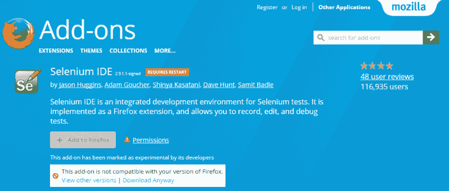](https://res.cloudinary.com/practicaldev/image/fetch/s--4MBD-XRP--/c_limit%2Cf_auto%2Cfl_progressive%2Cq_auto%2Cw_880/https://cdn-images-1.medium.com/max/978/1%2AJidOCWgcbQtICstuEJ3wAw.png) 

<figcaption>火狐附加网站上的 Selenium IDE</figcaption>

</figure>

现在，Selenium IDE 将被弃用已经不是什么秘密了。其实从 Firefox 55 开始就已经[停止工作了。作为](https://seleniumhq.wordpress.com/2017/08/09/firefox-55-and-selenium-ide/)[有史以来最流行的自动化测试工具之一](https://addons.mozilla.org/en-US/firefox/addon/selenium-ide/statistics/?last=365)，这促使人们寻找一个(更好的)继任者。

在本文中，我们将回顾 Selenium 的历史，了解 Selenium IDE 是什么，以及它为什么如此成功，并快速浏览它的一些潜在替代品。

<figure>[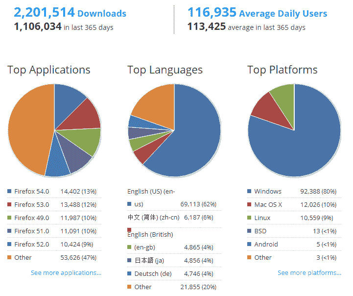](https://res.cloudinary.com/practicaldev/image/fetch/s--pb1VUq6Q--/c_limit%2Cf_auto%2Cfl_progressive%2Cq_auto%2Cw_880/https://cdn-images-1.medium.com/max/721/1%2AfPrr6coYZ3HBzT_jE5ji_Q.png) 

<figcaption>火狐插件页面</figcaption>

</figure>

硒 IDE 使用统计

### 开头

毫无疑问，Selenium 是最容易被误解的技术之一。它不是一个测试工具，可以放入充斥所有软件测试论坛和社交网站的“对比”问题或文章中。

<figure> 

<figcaption>哈金斯</figcaption>

</figure>

2004 年，[杰森·哈金斯](https://www.linkedin.com/in/jrhuggins)在 ThoughtWorks 测试一个内部应用程序。作为一个聪明的人，他意识到他的时间有更好的用途，而不是手动地对他所做的每一个改变进行相同的测试。他开发了一个 JavaScript 库，可以驱动与页面的交互，允许他在多种浏览器上自动重新运行测试。他将这个程序命名为 JavaScriptTestRunner。看到这个想法有可能帮助自动化其他 web 应用程序，他将 JavaScriptTestRunner 开源，后来改名为 Selenium Core。

<figure> 

<figcaption>保罗·哈曼</figcaption>

</figure>

不幸的是，要在同源策略下工作，Selenium Core 必须放在与被测应用程序(AUT)相同的源中。因此，另一个 ThoughtWork 的工程师，Paul Hammant，创建了一个服务器，它将作为一个 HTTP 代理，在一个虚构的 URL 下屏蔽 AUT，嵌入 Selenium Core 和一组测试，并提交它们，就好像它们来自同一个来源。这个系统被称为 Selenium 遥控器(Selenium RC)，或 Selenium 1。

<figure>[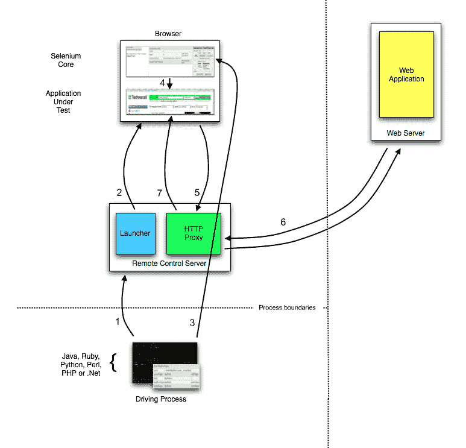](https://res.cloudinary.com/practicaldev/image/fetch/s--nFoJSqg0--/c_limit%2Cf_auto%2Cfl_progressive%2Cq_auto%2Cw_880/https://cdn-images-1.medium.com/max/773/1%2AqA8vC_aFI5lNme-Ilf8KOQ.png) 

<figcaption>硒遥控架构</figcaption>

</figure>

当 web 框架变得越来越复杂和强大时，web 浏览器沙盒 Javascript 环境的限制越来越限制了 Selenium Core 的有效性。

<figure> 

<figcaption>西蒙斯图尔特</figcaption>

</figure>

2006 年，一位名叫西蒙·斯图尔特的勇敢的谷歌工程师开始了他称之为网络驱动的项目。谷歌长期以来一直是 Selenium 的忠实用户，但测试人员不得不解决该产品的局限性。Simon 想要一个测试工具，使用浏览器和操作系统的“本地”方法直接与浏览器对话，从而避免沙盒 Javascript 环境的限制。与 web 浏览器通信的 WebDriver 的所有实现都应使用公共的有线协议。这个有线协议使用 JSON over HTTP 定义了一个 RESTful web 服务。

<figure>[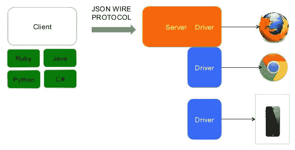](https://res.cloudinary.com/practicaldev/image/fetch/s--TENuJGcf--/c_limit%2Cf_auto%2Cfl_progressive%2Cq_auto%2Cw_880/https://cdn-images-1.medium.com/max/595/1%2AQqMN72tkhGGPVS6HiCb7oA.jpeg) 

<figcaption>硒 WebDriver 架构</figcaption>

</figure>

当流行的 web 浏览器的开发者(Google，Mozilla，Microsoft，Apple)开始采用和标准化协议时，Selenium WebDriver 成为了对 web 应用程序进行功能自动化测试的事实方式。

具有讽刺意味的是，许多测试自动化工具——出于他们的无知或营销目的——已经挖掘出了旧的 Selenium Core 的方式，声称它是 Selenium WebDriver 的创新替代品，并每天向他们的用户收取大笔费用。

必须指出的是，Selenium RC 和 Selenium WebDriver 仅仅是自动化浏览器的引擎。为了编写 Selenium 测试用例，需要推导出 web 元素(例如按钮)的 XPath(或 CSS)定位器，添加正确的命令，并将所有测试步骤放在一起。有构建在引擎之上的工具，为测试用例管理和报告增加了层。也有人喜欢把东西放在一起，以便更好地控制。这些都可以与其他解决方案进行比较，例如[统一功能测试(UFT)](https://software.microfocus.com/en-us/software/uft) 。将硒与 UFT 进行比较，就像将著名的内燃机与功能齐全的汽车进行比较，简而言之，就是将苹果与橙子进行比较。

<figure> 

<figcaption>【神谷城】</figcaption>

</figure>

为了进一步提高创建测试用例的速度，日本的 Shinya Kasatani 创建了 Selenium IDE，这是一个 Firefox 扩展，为开发自动化测试提供了一个易于使用的接口。Selenium IDE 有一个记录特性，它在用户执行操作时捕获用户操作，然后将它们导出为一个可重用的脚本，该脚本可以用多种编程语言中的一种来编写，以便以后执行。Selenium IDE 只是作为一个快速原型工具。他在 2006 年向硒项目捐赠了硒 IDE。

<figure>[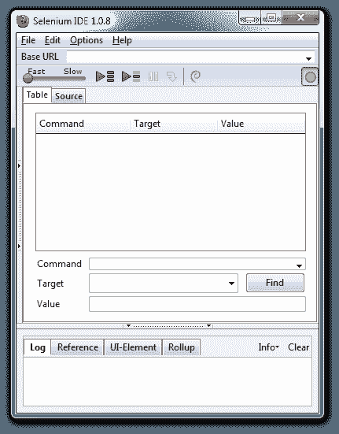](https://res.cloudinary.com/practicaldev/image/fetch/s--PgWKwwh---/c_limit%2Cf_auto%2Cfl_progressive%2Cq_auto%2Cw_880/https://cdn-images-1.medium.com/max/431/1%2Aq2twVixGkYbeNqchzsXgNQ.png) 

<figcaption>硒 IDE 的主用户界面</figcaption>

</figure>

### 善

如前所述， *Selenium IDE 最初是作为一个快速原型开发工具而设计的*。它没有为测试脚本提供迭代或者条件语句。但是，它可以通过自己的[插件系统](http://www.seleniumhq.org/projects/ide/plugins.jsp)进行扩展，为人们提供各种扩展点进行增强。随着时间的推移，[推出了越来越多的插件](http://www.seleniumhq.org/download/)，最终将 Selenium IDE 转变为一个成熟的功能测试自动化工具。

目前，Selenium IDE 不仅支持记录和重放，还支持适当的脚本编写、调试、报告等等。它还提供了一个最常用功能的综合列表，这样测试人员就不必自己编写了。毕竟，节省时间是吸引人们接受测试自动化的最有说服力的好处之一。

<figure>[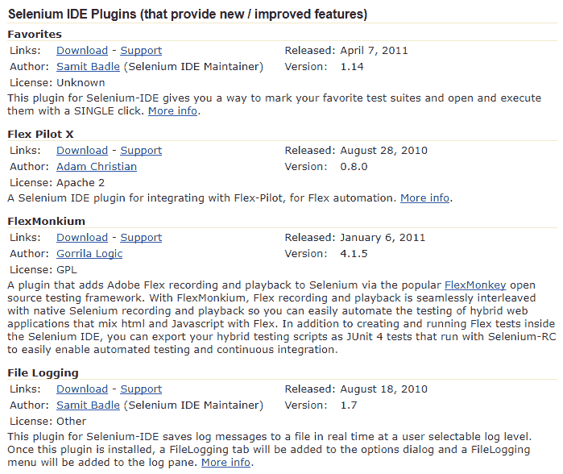](https://res.cloudinary.com/practicaldev/image/fetch/s--sfg4aj4p--/c_limit%2Cf_auto%2Cfl_progressive%2Cq_auto%2Cw_880/https://cdn-images-1.medium.com/max/699/1%2A_ecSQoFYQo1xWy3mlzc1rQ.png) 

<figcaption>硒 IDE 的插件页面</figcaption>

</figure>

正如 [Selenium 团队](http://www.seleniumhq.org/docs/01_introducing_selenium.jsp#brief-history-of-the-selenium-project)所说，Selenium 开发人员总是鼓励测试自动化中的最佳实践，这需要使用许多受支持的编程语言中的一种进行一些编程。这样做的缺点是，大多数基于 Selenium 构建的测试框架(例如[量角器](http://www.protractortest.org/#/))都非常以开发人员为中心。它们不能开箱即用，但是需要额外的步骤来安装和配置编程语言运行时和组件，然后测试人员才能开始他们的项目。我还没有考虑到培训测试工程师关于页面对象模型、测试用例组织等所需的时间。—有时甚至开发者也会弄错。

尽管有很高的准入门槛和陡峭的学习曲线，许多公司仍然坚持像 UFT 或 [TestComplete](https://smartbear.com/product/testcomplete/overview-b/) 这样的专有解决方案，这些解决方案为进行自动化测试提供了全面的功能，即使底层引擎可能不如 Selenium WebDriver。对于挑硒的人来说，硒 IDE 依然是最好的入门方式。此外，对于拥有少量自动化测试用例的小型测试工程师团队来说，Selenium IDE 甚至可以作为一个独立的工具，完全支持他们的自动化项目。

如果没有 Selenium IDE 提供的体验，Selenium 只会在开发人员社区中流行——那些不负责测试工作的人。测试工程师将不得不求助于商业服务来完成开源本可以做得很好的事情。

### 结束

尽管其生态系统在增长，但 Selenium IDE 本身自首次亮相以来并没有经历太多变化。一个原因是它已经完成了最初指定的使命。另一个原因是开发人员总是关注新的酷的东西，比如强大的框架和工具，而不是花时间为测试人员改进一个小工具。

虽然稳定，Selenium IDE 建立在 Firefox 的附加平台上，这在当时是好的，但现在已经不是了，因为 Firefox 已经失去了主导地位。Chrome 的附加平台与 Firefox 的完全不兼容，而且没有任何资源，没有一次尝试将 Selenium IDE 移植到其他网络浏览器。

当 Mozilla 在今年年底决定[关闭旧的附加平台](https://developer.mozilla.org/en-US/Add-ons/Overlay_Extensions/Firefox_addons_developer_guide)时，人们普遍认为 Selenium IDE 在不久的将来将不复存在。测试工程师必须寻找其他的东西。

<figure>[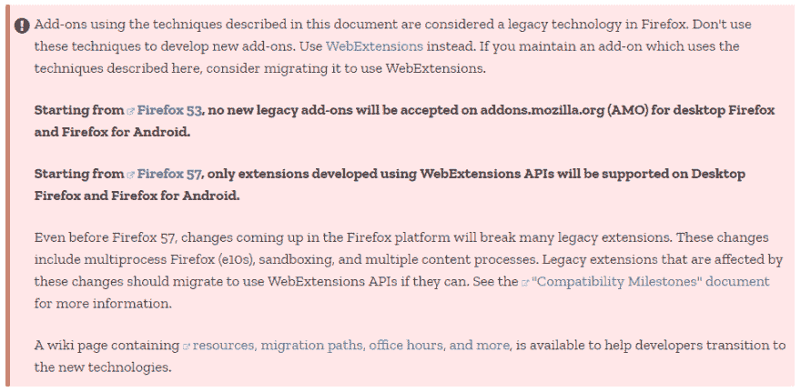](https://res.cloudinary.com/practicaldev/image/fetch/s--FFCKGKOV--/c_limit%2Cf_auto%2Cfl_progressive%2Cq_auto%2Cw_880/https://cdn-images-1.medium.com/max/981/1%2AI8K9arDCH612EmOpD4bJ0w.png) 

<figcaption>Mozilla 宣布其平台变更</figcaption>

</figure>

### 后辈

> *更新:很好的借鉴了* [*Selenium IDE 替代 Firefox & Chrome*](https://www.katalon.com/resources-center/blog/selenium-ide-alternative-firefox-chrome/#)

实际上有人试图为测试工程师创建基于 Selenium 的工具。它们应该易于安装，配备简单的脚本编写方法以及方便的日志记录、数据驱动测试、报告等功能。

一个接近 Selenium IDE 的尝试是机器人框架。机器人框架的基本想法是在[佩卡·克拉克](http://eliga.fi/)2005 年的硕士论文中形成的。同年，第一个版本在[诺基亚通信](https://en.wikipedia.org/wiki/Nokia_Networks)开发。测试用例是使用以表格格式编写的关键字测试方法编写的。还有 Robot Integrated Development Environment(RIDE ),它通过提供特定于框架的代码完成、语法突出显示等来简化测试用例的编写。

由于安装的复杂性、缺乏独立的测试记录器工具(而是通过一个… [Selenium IDE 的插件](https://blog.codecentric.de/en/2012/02/recording-robot-framework-keywords-with-selenium-ide/)实现)以及一种描述性水平适中的关键字驱动语言，Robot Framework 的前景未能实现。

<figure>[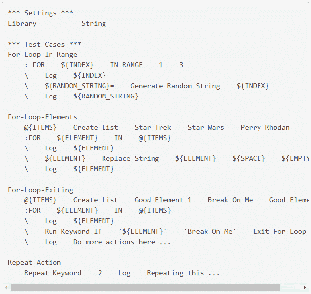](https://res.cloudinary.com/practicaldev/image/fetch/s--7Vjgb753--/c_limit%2Cf_auto%2Cfl_progressive%2Cq_auto%2Cw_880/https://cdn-images-1.medium.com/max/628/1%2AmcT45wnGIhfGKy2FyzEFHg.png) 

<figcaption>机器人框架的 for 循环语法</figcaption>

</figure>

第二次尝试——也是更现代的一次——是量角器。它带来的最好的东西是安装。在一两个命令中，所有的东西——包括测试框架和 Selenium web driver——都安装得很好。更新所需的步骤甚至更少。另一个好处是量角器使用 JavaScript。截至 2017 年，JavaScript 是最容易学习的编程语言之一，非常适合测试工程师，尤其是只有手工测试背景的人。

但是量角器目前只发展到这一步。量角器的不好之处在于它不是一个固执己见的工具。事情太没有准备，太灵活了，所以一些优秀的开发者不得不加入进来，建立项目，放置正确的报告插件，在其他成员开始工作之前写一些页面对象支架。更不用说量角器团队搞乱了同步/异步的东西——我相信测试工程师不需要知道这些。

第三个尝试，我最近才发现，是 [Katalon 工作室](http://www.katalon.com/)。令人惊讶的是，这是一个鲜为人知的好工具。当我找到它的时候，它被埋在 Selenium 的赞助商名单里。我对这个工具的最初印象是，它就像 Selenium IDE，还有更多。

我喜欢 Katalon Studio 的一个原因是它提供了最佳的安装体验。唯一要做的一步是解压软件包，然后就可以开始了。没有编程语言运行时，没有额外的组件或插件。

<figure>[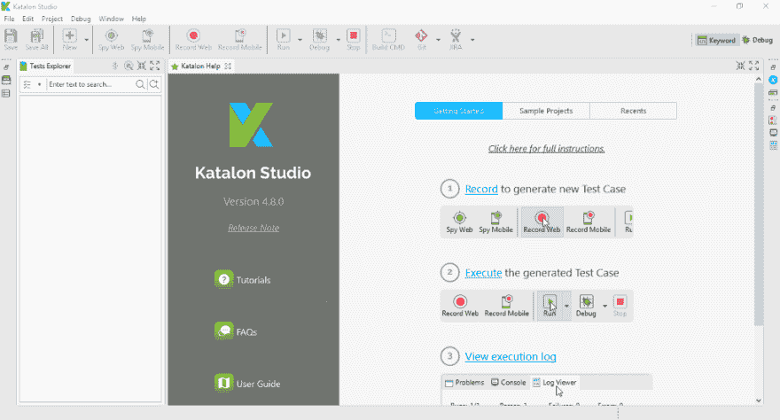](https://res.cloudinary.com/practicaldev/image/fetch/s--FOqGnbO6--/c_limit%2Cf_auto%2Cfl_progressive%2Cq_auto%2Cw_880/https://cdn-images-1.medium.com/max/1024/1%2AgUpyMB-Nb2neO6IKM5PLxA.png) 

<figcaption>卡塔龙工作室的欢迎画面</figcaption>

</figure>

与其他基于 Selenium 的工具相比，Katalon Studio 的脚本接口是独一无二的。它允许随时在基于关键字的表格(类似于 Robot 框架)和代码编辑器之间切换。这对于需要学习自己编写 Selenium 测试用例的人来说非常有帮助。

[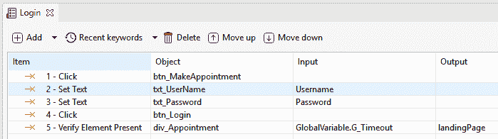T2】](https://res.cloudinary.com/practicaldev/image/fetch/s--Q-9pUlCw--/c_limit%2Cf_auto%2Cfl_progressive%2Cq_auto%2Cw_880/https://cdn-images-1.medium.com/max/699/1%2AL60qZuYanEqW2wB2qNuSHQ.png)

<figure>[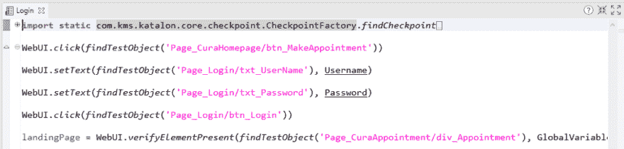](https://res.cloudinary.com/practicaldev/image/fetch/s--4UocJm7Z--/c_limit%2Cf_auto%2Cfl_progressive%2Cq_auto%2Cw_880/https://cdn-images-1.medium.com/max/1024/1%2AyWYYWD2T_IxyyLpS-_C2dw.png) 

<figcaption>在 Katalon Studio 中的两个脚本界面之间切换</figcaption>

</figure>

Katalon Studio 还具有记录功能，可以捕捉测试人员在 web 浏览器上的行为，以帮助测试设计过程。与 Selenium IDE 不同，这个特性可以在主要的 web 浏览器上工作——Chrome、Firefox 和 Internet Explorer。

这个工具似乎还提供了其他方便的功能，如报告和集成。我想在更彻底地探索之后，在另一篇文章中讨论它们。有趣的是，看到一个免费的基于 Selenium 的工具，其功能和设计与 UFT 这样的付费解决方案不相上下。

### *更新:*

> [*卡塔龙自动化记录仪*](https://www.katalon.com/resources-center/blog/katalon-automation-recorder/) *扩展为* [*Chrome*](https://chrome.google.com/webstore/detail/katalon-automation-record/ljdobmomdgdljniojadhoplhkpialdid?utm_source=chrome-ntp-icon) *和*[*Firefox*](https://addons.mozilla.org/en-US/firefox/addon/katalon-automation-record/)*已经由卡塔龙工作室团队推出。这个扩展是 Katalon 工作室黑客马拉松比赛的冠军项目。Katalon Automation Recorder 的开发是为了支持那些不再能够使用过时的 Selenium IDE 记录和回放自动化测试的用户，或者那些正在寻找方便的记录器的流行开源框架的用户。该扩展与 Chrome 和最新的 Firefox 浏览器兼容，我们将继续开发以支持新版本。*
> 
> 您可以使用该扩展来捕获 web 元素并记录 web 应用程序上的动作，从而轻松地生成测试用例。直观的界面允许用户快速编辑、调试和播放测试用例&测试套件。
> 
> *Selenium IDE 生成的 Selenese 脚本也可以加载到 Katalon Automation Recorder 中，导出为流行的语言和格式:C# (NUnit)、Java (TestNG 和 JUnit)、Ruby (RSpec)、Python (unittest)、Groovy (Katalon Studio)、Robot Framework。* [*了解更多！*](http://forum.katalon.com/discussion/4056/quick-guide#latest)

### 结论

Selenium IDE 以及 Selenium 整体而言都是改变了自动化测试历史的伟大技术。随着 Selenium IDE 慢慢消失，我希望其他伟大的开发人员将获得它的灵感，并与伟大的继任者一起继续让软件测试每天都变得更好的使命。