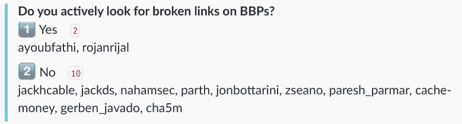

# 断链劫持-过期链接如何被利用。

> 原文：<https://dev.to/securitytxt/broken-link-hijacking---how-expired-links-can-be-exploited-ghe>

只要目标链接到过期的域或页面，就会出现断链劫持(BLH)。断链劫持有两种形式，反射和存储。这个问题已经在野外被利用了无数次，但令人惊讶的是，很少有研究人员积极地在 bug bounty 程序中寻找断开的链接。

[T2】](https://res.cloudinary.com/practicaldev/image/fetch/s--4hjyC_v8--/c_limit%2Cf_auto%2Cfl_progressive%2Cq_auto%2Cw_880/https://user-images.githubusercontent.com/18099289/30001780-873a820e-9098-11e7-9c53-ab746d322fc7.png)

这篇文章的目的是给你一个不同问题的基本概述，如果一个目标链接到一个过期的端点，可能会出现这些问题。

## 存储断链劫持

### 冒充

当一家公司删除他们的社交媒体账户时，他们可能会忘记删除网站上的链接。攻击者可以使用该用户名在社交媒体平台上创建一个帐户，并冒充该公司。

### 外部 JS 文件劫持

如果一个目标有一个外部 JS 文件，并且那个域/页面过期了，您可以声明它，然后您实际上已经存储了 XSS。

比方说，example.edu 有一个外部 JS 文件托管在 example.com 和 example.com 已经过期。

```
<!DOCTYPE html>
<html>
<head>
  <meta charset="utf-8">
  <meta name="viewport" content="width=device-width">
  Broken Link Hijacking
</head>
<body>
  <script src="//example.com/script.js"></script>
</body>
</html> 
```

Enter fullscreen mode Exit fullscreen mode

现在你可以接管 example.com，可以控制 example.edu 的 JS 文件。

### 信息泄露

劫持缺少`rel="noopener noreferrer"`属性的断开链接可能会将信息泄露给攻击者控制的页面。[【1】](https://github.com/cure53/HTTPLeaks)

此外，有时公司仍然链接到过期的分析页面。如果攻击者能够劫持过期页面，他们就可以监控流量，并可能收集目标用户的有价值信息。实际上，有人曾经在 Gratipay 的程序中找到过这样一个人:[https://hackerone.com/reports/111078](https://hackerone.com/reports/111078)。

### 内容劫持

攻击者可以通过接管过期的域/页面来劫持页面内容。一个很好的例子可以在 [@MisterCh0c](https://twitter.com/MisterCh0c) 的博客文章[中看到，“我是如何劫持包括凯蒂·佩里、夏奇拉在内的顶级名人推文的……”](https://hackernoon.com/how-i-hijacked-top-celebrities-tweets-including-katy-perry-shakira-fca3a0e751c6)。

[T2】](https://res.cloudinary.com/practicaldev/image/fetch/s--yGIYhvfw--/c_limit%2Cf_auto%2Cfl_progressive%2Cq_auto%2Cw_880/https://user-images.githubusercontent.com/18099289/30002343-55a8dfc4-90a7-11e7-95b2-052bb5a1a5a3.png)

## 反映断链劫持

你知道那种感觉吗，当你认为你已经反映了 XSS，但却无法突破`href`或`src`属性？

如果链接是 CDN 或文件托管服务，您可以构建一个恶意链接并将该文件托管在该服务上。诚然，这些是非常罕见的，但一定要记住，以防你将来遇到这个问题。

### 示例场景

[http://example.edu/?version=1.0.0](http://example.edu/?version=1.0.0)返回托管在 cdn.example 上的 JS 文件的特定版本。

```
<!-- http://example.edu/?version=1.0.0 -->
<!DOCTYPE html>
<html>
<head>
  <meta charset="utf-8">
  <meta name="viewport" content="width=device-width">
  Broken Link Hijacking
</head>
<body>
  <script src="//cdn.example/1.0.0/script.js"></script>
</body>
</html> 
```

Enter fullscreen mode Exit fullscreen mode

cdn.example 允许我们添加项目并托管恶意的 JS 文件。

```
<!-- http://example.edu/?link=maliciouspath -->
<!DOCTYPE html>
<html>
<head>
  <meta charset="utf-8">
  <meta name="viewport" content="width=device-width">
  Broken Link Hijacking
</head>
<body>
  <script src="//cdn.example/maliciouspath/script.js"></script>
</body>
</html> 
```

Enter fullscreen mode Exit fullscreen mode

## 工具

### 断链检查器

断开链接检查器将爬一个目标，并寻找断开的链接。每当我使用这个工具时，我喜欢运行:

```
$ blc -rof --filter-level 3 https://example.com/ 
```

Enter fullscreen mode Exit fullscreen mode

过了一段时间后，我经常发现自己为了防止误报而使它适应类似这样的东西:

```
$ blc -rfoi --exclude linkedin.com --exclude youtube.com --filter-level 3 https://example.com/ 
```

Enter fullscreen mode Exit fullscreen mode

链接:[https://github.com/stevenvachon/broken-link-checker](https://github.com/stevenvachon/broken-link-checker)

### twitterBFTD

misterch0c 发布了一个小脚本，可以在推文中找到过期的域名。

链接:[https://github.com/misterch0c/twitterBFTD](https://github.com/misterch0c/twitterBFTD)

## 参考文献

[1] GitHub。(2017).cure53/HTTPLeaks。[在线]可在:[https://github.com/cure53/HTTPLeaks](https://github.com/cure53/HTTPLeaks)[2017 年 9 月 3 日访问]。