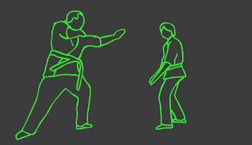

# 用代码表提高你的开发者技能

> 原文:[https://dev . to/mejiamanuel 57/improve-your-developer-skills-with-code-katas-5c 22](https://dev.to/mejiamanuel57/improve-your-developer-skills-with-code-katas-5c22)

[T2】](http://3.bp.blogspot.com/-5kFzJnG3IEw/WZdWGyzaqpI/AAAAAAAAKMs/47e0Ng-5F28Em5MJ0Dc_4FxoDNiJB8YgQCK4BGAYYCw/s1600/enter-the-dragon-original1.jpg)

也许，当你听到“形”这个词时，你首先想到的是李小龙的电影或者《功夫熊猫》😛。根据维基百科，形是:

日语单词，是详细编排的动作模式，可以单人或双人练习。“形式”这个术语通常用于非日本武术中的相应概念。”

换句话说，这是一套非常同步的动作，模拟了现实生活中的打斗，你练习这些动作越多，你就越擅长打斗。

但是....我们要讲的是**代码 Kata** ，不是练习如何踢腿和出拳，而是通过写一些漂亮的代码来练习。

我第一次听到“代码形”这个术语是在罗伯特·c·马丁的《干净的编码者》一书中，但最初的术语是由迪夫·托马斯在他的《实用程序员》一书中提出的。我在我的文章[中推荐了这两本书，它们是作为开发人员的必读之作](https://dev.to/mejiamanuel57/books-you-must-read-as-a-developer-54c7-temp-slug-6401587)。

**什么是代码形？**

这是一个专注于提高技能和技术的代码挑战。Katas 有不同的方式，一些训练编程基础，而另一些侧重于复杂问题的解决。你还可以找到带有数学问题、数据结构、游戏、设计模式和谜题的形，意在测试你创造性的解决问题的能力，而其他的则基于真实世界的编码场景。你可以单独做，两人一组或一组，我喜欢在一组中做，因为你可以看到其他人如何以不同的方式处理同样的问题。

为什么代码表对任何开发人员都很重要？

让我用另一个问题来回答这个问题:你如何成为一名伟大的跑步运动员、网球运动员或音乐家？是的，你说对了，简单的答案是通过练习。有天赋很有帮助，了解背后的理论也很有帮助...但是要成为一名优秀的开发人员，你需要练习提高你的代码技能。正如 Robert C. Martin 所说，在你的工作场所从早上 9 点到下午 5 点写代码是不够的，要成为一名优秀的开发人员，你还必须在家里写代码。练习是关键。因此，当你在工作或副业中面临问题时，你会知道哪种技巧更适合那个问题，因为你已经练习过类似的形了。

你可以在哪里练习你的代码形？

有很多页面可以提高你的代码技能，现在我和我的朋友 codewars.com 一起使用，我们每周设置 1 到 2 个招式，每个人完成后，我们互相比较并给出反馈。我邀请您尝试一下，您不会失望的。

如果你是新的形，你想使用 codewars.com，我建议你从低水平的困难形(Kyu 8)开始，然后随着你的进步选择更困难的:

[T2】](http://1.bp.blogspot.com/-w-SgsxjV7qM/Was4-S8CVTI/AAAAAAAAKgI/rh6Rr3v4E10g-CDjDf0KLVP2Pk7mlcT0QCK4BGAYYCw/s1600/Capture.JPG)

这里有一个[编码](https://www.quora.com/What-are-some-good-coding-competition-practice-sites) [比赛/练习地点](https://www.quora.com/What-are-some-good-coding-competition-practice-sites)的列表，如果你想要一些与我的推荐不同的东西。

我将以杰夫·阿特伍德(Jeff Atwood)帖子中的一段话作为结束，他是 [Stack Overflow](https://en.wikipedia.org/wiki/Stack_Overflow) 的联合创始人:

> “这是一个重要的区别。我可能每天都开车去上班，但我离职业司机还差得远。同样的，每天编程可能也不足以让你成为一名职业程序员。那么什么*可以把一个人变成职业司机或者程序员呢？你做什么练习？..."*

 *[T2】](http://1.bp.blogspot.com/-dFL5J1ifksE/Was7xmspKfI/AAAAAAAAKgU/3s6rg3w9KiofhxuoRnmdrwkdpdyyHgsmQCK4BGAYYCw/s1600/tumblr_nnf33pZFzt1qfcfclo1_500.gif)*