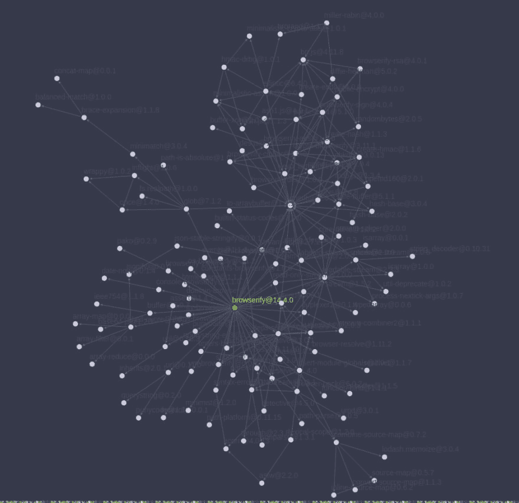

# 为什么包装经理需要挂钩系统

> 原文：<https://dev.to/zkochan/why-package-managers-need-hook-systems>

在[1.12](https://github.com/pnpm/pnpm/releases/tag/v1.12.0)版本中 [pnpm](https://github.com/pnpm/pnpm) 引入了安装挂钩。在这篇文章中，我想写一下为什么我认为包经理(pm)需要钩子。

## 我们为什么要钩进`node_modules`？

当安装节点项目的依赖项时，`node_modules`结构完全由依赖项的`package.json`文件控制(也称为清单)。因此，如果你的项目依赖于`foo@1.0.0`，而后者又依赖于`bar@2.0.0`，那么你将在你的`node_modules`中安装两个依赖项。虽然您可以更改项目的依赖项集，但是您无法控制依赖项的清单。

一个典型的依赖树是巨大的，你对你的大部分依赖没有所有权。只要分析你在 npm.anvaka.com T2 的依赖关系。例如，这是`browserify`的依赖关系图:

[T2】](https://res.cloudinary.com/practicaldev/image/fetch/s--h6T0Kq1f--/c_limit%2Cf_auto%2Cfl_progressive%2Cq_auto%2Cw_880/https://i.imgur.com/rynJysq.png)

如果你的`node_modules`里面某个包有 bug 怎么办？如果问题存在于根依赖关系中，那么您有三种选择:

1.  找到一个替代的，更可靠的包
2.  提交解决问题的“拉”请求(PR)
3.  创建你自己的包，用它来代替有问题的包

第二个选择似乎是正确的，我鼓励每个人尽可能频繁地做出贡献。但是，提交 PR 并不意味着您的更改将被合并/发布。即使它们会被合并出版，也不会马上发生，你可能要等上好几年。以下是一些常见问题:

*   该项目无人维护/维护不善
*   你做了突破性的修改，而作者不喜欢改动主要版本。在发布主要版本之前，作者将等待几个突破性的变化
*   作者认为 bug 不是 bug

如果有问题的包是根依赖项，那么您可以很容易地切换到另一个包或您的 fork。如果包是一个子依赖项，问题就更难解决了。在这种情况下，您的选择是:

1.  提交解决问题的 PR
2.  向依赖于错误包的包提交许多 PRs

使用钩子，您可以有第三种选择:创建一个 fork 并安装它，而不是有问题的包。因此，如果你有依赖于`bar@2.0.0`的`foo@1.0.0`，你可以有一个钩子来覆盖依赖关系。

假设`bar@2.0.0`中有一个 bug，你提交了一个修复的 PR。然而，bar 的维护者正在休假。你可以使用钩子从你的 PR 分支制作 pnpm 安装栏，而不是从 npm 注册表制作`bar@2.0.0`。

## 为什么钩子对 pnpm 的生存很重要

钩子在任何 PM 中都很好，但是对于 pnpm 来说，它们尤其重要。您可能已经知道，pnpm 创建了一个严格的符号链接 node_modules 结构。你可以阅读更多关于它的内容: [pnpm 的严格有助于避免愚蠢的错误](https://medium.com/pnpm/pnpms-strictness-helps-to-avoid-silly-bugs-9a15fb306308)

尽管 pnpm 创建的`node_modules`结构是 Node.js 兼容的，但是许多包都有一些只有通过 pnpm 安装时才会出现的错误。因此，pnpm 在一些流行的框架和工具上存在问题。

当然，我们试图通过公关来解决这些问题(我想对在 Angular 中成功解决了许多此类问题的 [aecz](https://github.com/aecz) 大声欢呼)。但是除了常见的问题之外，一些维护者充满敌意，拒绝接受 PRs，仅仅因为他们不喜欢 pnpm 或者认为 npm/Yarn 创建的 flat `node_modules`是一个特性(它不是)。

最后，我们有两个选择来为严格的 pnpm 修复生态系统:

1.  让 pnpm 足够受欢迎。在这种情况下，框架/工具的作者将使用 pnpm 以及 npm 和 Yarn 测试他们的产品。
2.  创建一个钩子系统来临时替换不能与 pnpm 一起工作的 bug 包。

依我看，第一种情况几乎是不可能的。如果不是 npm 的替代者，pnpm 不可能流行起来。

## 现实生活中的例子

有一个流行的包叫做 [resolve](https://github.com/browserify/resolve) ，用于解析来自`node_modules`的依赖(13k 依赖，一天 765K 下载)。不幸的是，对于 pnpm 来说，`resolve`在解析模块时会保留符号链接。这是 resolve 端的一个问题，因为 Node.js 在解析期间不保留符号链接。我做了一个[公关](https://github.com/browserify/resolve/pull/131)来解决这个问题，现在从版本 1.4 解决有一个选项不保留符号链接。

但是这并没有解决 pnpm 的问题。我们不能向 1.3K 依赖包提交 PRs 来更新`resolve`并将`preserverSymlink: false`传递给它。resolve 的主要维护者同意在下一个主要版本中切换该选项的默认值。所以我希望 Greenkeeper 会为我们创建 PRs，并且大多数包会将 resolve 更新到版本 2。

我创建了另一个带有重大变更的 [PR](https://github.com/browserify/resolve/pull/135) ，但是 resolve 的维护者希望在将 resolve 改为版本 2 之前等待更多重大变更。

我意识到我们不能改变世界，但我们可以改变 pnpm，所以我松开了`readPackage`钩子。我对 resolve 的修改可以通过 GitHub 上的 fork 获得，所以我们要做的就是告诉 pnpm 从 fork 安装 resolve。这可以通过在一个名为`pnpmfile.js`的文件中声明钩子来实现:

在安装过程中，pnpm 会首先将每个`package.json`传递给这个钩子，并使用钩子返回的`package.json`的版本。因此，这与 resolve 包依赖的版本无关，我的 fork 将被安装，该项目将与 pnpm 一起正常工作。

## 总结

我没有描述`readPackage`有用的所有用例。这是一个非常强大的工具，我想我们会学会如何聪明地使用它。

我还要感谢安德烈·内库劳，他让我相信这个挂钩系统是个好主意。

为了让它变得有一点互动，检查一下你在 GitHub 上有多少未解决的 PRs，然后在评论区发布这个数字。您可以使用[此链接](https://github.com/pulls)查看所有打开的 PRs。

## 要不要试试 pnpm？

只需通过 npm 安装 pnpm:`npm install -g pnpm`。并且在你想装东西的时候用它代替 NPM:`pnpm i foo`。

此外，你可以在 [pnpm GitHub repo](https://github.com/pnpm/pnpm) 或【pnpm.js.org】T2 了解更多信息。你可以在推特上关注 [pnpm 或者在](https://twitter.com/pnpmjs) [pnpm Gitter 聊天室](https://gitter.im/pnpm/pnpm)寻求帮助。

*本帖原载于[kochan . io](https://www.kochan.io/nodejs/why-package-managers-need-hook-systems.html)T3】*