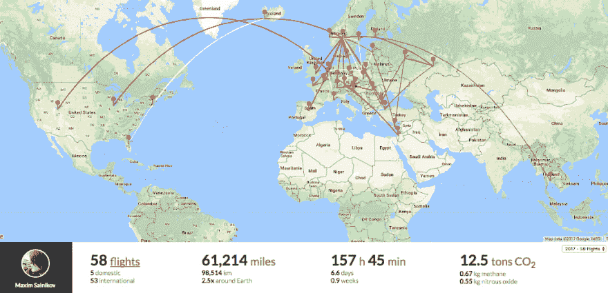
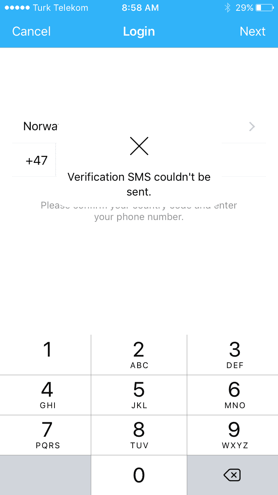
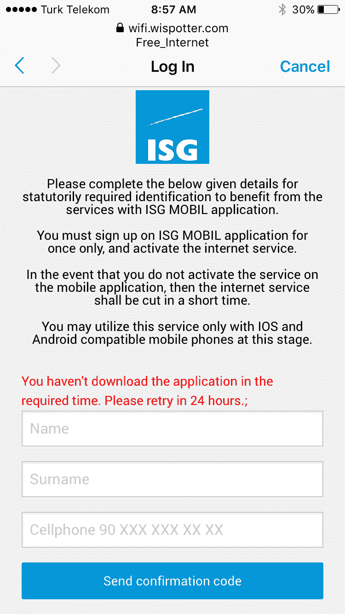
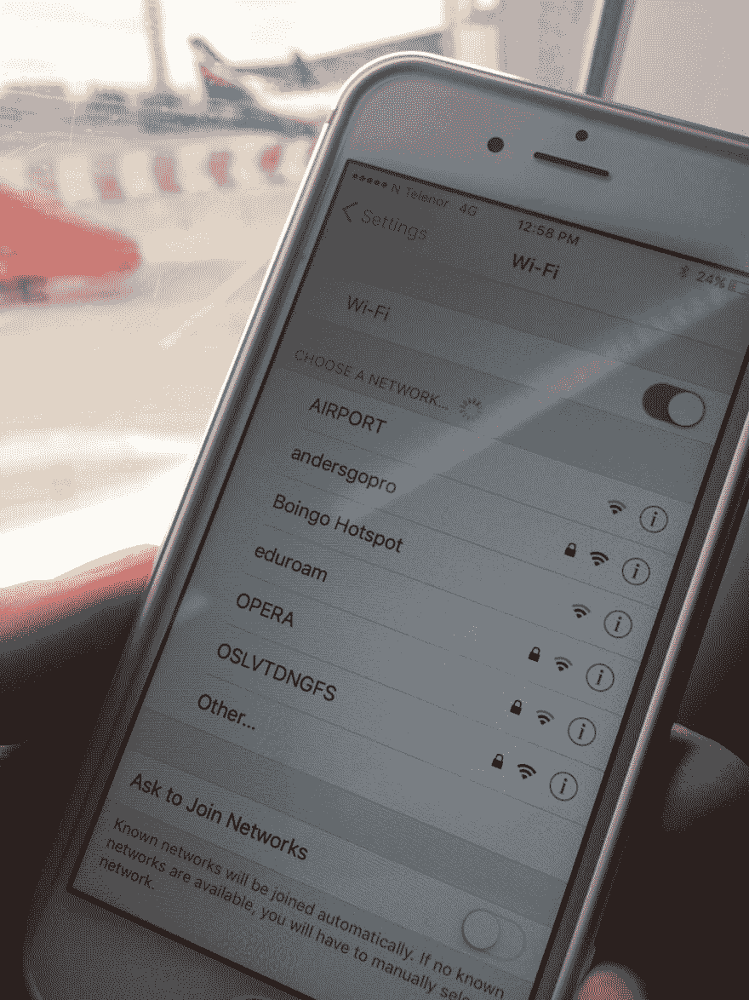
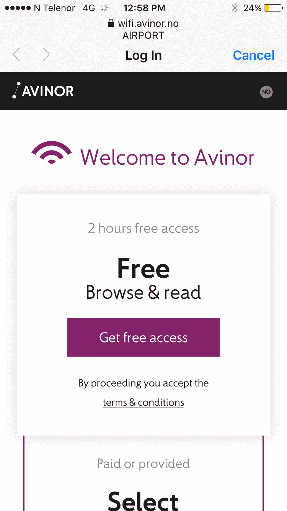

# 机场免费 wi-fi 流登机设计的最佳实践(不仅如此)

> 原文:[https://dev . to/web maxru/best-practices-in-the-design-on-boarding-to-the-free-wi-fi-flow-at-the-airports-and-not-only-p5f](https://dev.to/webmaxru/best-practices-in-the-design-of-onboarding-to-the-free-wi-fi-flow-at-the-airports-and-not-only-p5f)

<figure> 

<figcaption>我的 2017 年数字</figcaption>

</figure>

人类创造的设计神器无处不在。不管我们愿不愿意，他们无时无刻不在包围着我们。我不仅仅关注视觉上的东西，比如标志、招牌、盾牌，也不仅仅关注不同种类的用户界面(图形、语音等)。服务设计是我们一天中多次互动的东西。

我们用来在网站上注册、在加油站加满油、在线和离线订购披萨的所有不同场景都是由某人设计的(有意或无意)。显然:这项服务中包含的所有小动作的流畅对各方都有好处，而断流(或难以遵循一个)则没有。如何创建合适的服务？我坚信:90%的成功只是遵循常识+你设身处地为他人着想的能力。剩下的 10%是关于方法、最佳实践和帮助工具的知识，你可以从各种服务/产品设计教育项目中获得。我是一名 UI 工程师，每天与 JavaScript、前端框架、渐进式 web 应用功能打交道，我认为架构 UX(用户体验)是我工作中不可分割的一部分。

今天就来说一个简单的(？)服务:在机场组织公共 wi-fi。不是一般意义上的(当然，我们希望它快速、可靠、安全)，而是关于入职步骤。我是一个经常旅行的人，2017 年我已经有 58 次国际航班，今年剩余时间计划有 25 次以上。你可以想象，我经常在不同的机场遇到这种连接 wi-fi 的过程。嗯，在取消欧洲国际漫游后，对我的大多数旅行来说，这不再那么重要了，但“完全不需要 wi-fi”仍然是最好的情况(当你有欧洲 SIM 卡时，你在欧洲境内旅行，你不太关心消耗的蜂窝流量)。实际上，我们在本文中讨论的大多数要点适用于大多数公共 wi-fi 网络。机场的具体情况是:

*   规模大，多样性强。对于大量(成千上万)具有完全不同的技术技能、讲不同的语言、使用不同的设备的人来说，服务应该工作良好(下文中的“工作良好”我指的不是技术方面，而是入职流程的顺畅)。
*   安全限制。我从来没有在机场遇到过 100%开放的网络。你必须提供一些数据，至少是你对条款和条件的同意，有时相当含蓄(哦，这两个兄弟需要单独的文章)。设定真的要看国家，而且，我要相信！，他们收集的所有信息都是法律法规要求的，而不是营销部门要求的。
*   由于场馆特殊性，快速且不引人注目地加入。但是别说了。这时，我们开始列出我们实际上想从这个过程中得到什么。它应该有单独的一章。

我写这篇即兴文章的时机是什么？很简单:我遇到的又一次糟糕的 wi-fi 登机体验。我完全无法连接到我此刻正在寒心的机场的网络(等一下，我会给你这个恐怖的所有细节)，所以我启动了我的离线文本编辑器和打字。我为什么要这么做？让世界变得更美好！如果这篇文章说服了至少一个服务设计师/ wi-fi 网络维护者/大型公共场所的大老板去改进入职流程，我就是赢家！

让我们设定任务。我所说的“我们”是指负责服务设计的人，也就是说，对流程的某些部分有一些影响(或者至少有可能强烈建议):

> 为我们机场所有需要的人提供 wi-fi，让我们的顾客满意。

这两个部分对业务都很重要。提供能引起良好情绪的服务/产品是 UX 的基础，值得单独写一篇文章。基于我们可以假设的目标:

*   每次尝试获得服务不成功，我们都会赔钱。事实也确实如此。
*   在每一个案例中，当客户在获得服务的过程中不开心时，我们可能会失去一个客户(然后失去金钱，遵循上面的一点)(“下次我只会阅读离线报纸，而不是再次经历这个痛苦的入职过程”)。

所以，让我们为我们的公司省钱(通过为我们的服务设计客户省钱)，去完成我们的使命吧！

### 我们梦想的入职流程是什么

1.  **公共 wi-fi 应该免费**。句号。带宽足以满足日常娱乐/商务活动:冲浪、阅读、收发电子邮件、使用网络应用程序、观看视频(这里我不是指下载全尺寸电影)。或许，一些商务旅行者会需要比这更好的东西(保证高下载/上传速度)，但是让我们关注免费服务，就像关注подавляющее的用例一样。
2.  回到入职。应该是**尽可能的透明**。遥不可及(因为安全限制)的理想只是一个开放的网络，没有任何必要的行动，就像你的家庭 wi-fi 网络，但没有密码。你降落在你以前去过的机场，bum——立即得到过去几个小时的所有通知。我们应该向往这一点。**重要通知**:我不覆盖可能存在的安全漏洞，如假冒 wi-fi 网络。中间人攻击等等，我认为我们完全控制了机场的电磁场。
3.  如果不是 100%隐藏，那么入职应该**快速且不显眼**。这两个属性紧密相关。为什么要快？因为在终端之间奔波是一个普遍的使用案例，如果只有 20 分钟的话，没有人会花 10 分钟来完成入职流程(bum！我们失去了一个客户)。为什么不引人注目？同样的原因。日常生活中，我们不会在机场放松几个小时，我们去那里是为了一些任务:赶上另一趟航班，找到去城市的火车，也就是说，我们把注意力放在标志、屏幕、信息屏蔽、语音通知上，而不是放在连接无线网络所需的电话对话上。换句话说，我们不想被打扰太多。
4.  从停在登机口的飞机开始，连接到 wi-fi 应该是可能的**。作为一项规则，我们有一分钟的空闲时间坐着等待起飞。为什么要把宝贵的时间花在看着窗户和思考“为什么一切都这么慢，30 分钟后我有我的过境航班，我需要互联网来检查登机口号码！”**
5.  不允许有网络覆盖盲区。当你在填写一些表格的过程中失去了连接(*哦，表格……*我们将在下面介绍它们)并且不知道按下“在线”按钮将会重置一切时，这真是一次可怕的经历。

好吧。现在我们知道了适当的公共 wi-fi onboarding 应该是什么样子。让我们一步一步来，从这个过程中的小部分开始，试着想出一些该做和不该做的事情。下面列出的都是我根据个人经历得出的个人看法。我很乐意在这篇文章的评论中得到关于你的观点的反馈。你可以支持我的观点，也可以和他们争论。这一切都始于…

### 命名

一切都从名字开始，对吗？好的公共 wi-fi 网络名称免费提供了一些优势:

*   节省开支资源(如广告)，因为不需要解释选择哪个网络进行连接。
*   自我广告。一些不了解/不知道场馆内有免费 wi-fi 的客户可能会连接，因为他们在列表中看到了正确名称的网络
*   对品牌信誉有好处

#### 最佳实践

*   为用户提供一个最基本的必要环境，以帮助他们将您的机场免费网络与其他免费网络区分开来。稍后，在场馆外，当客户管理保存的 wi-fi 连接时，这一点也很重要。最小的上下文是什么？城市名称和/或机场名称(这取决于人们如何推理场地)，机场本身。这已经足够了。当然，没有万能的配方，只要遵循常识，去寻找人们如何习惯命名你的地方。例如，如果除了律师以外没有人将机场与运营商法人实体名称联系起来，就没有理由使用机场运营商法人实体名称。

#### 不良风气

*   使用 wi-fi 作为名称的一部分。这只是浪费宝贵的空间。毫无疑问，客户不希望他们的 wi-fi 连接设置对话框中有任何其他协议。
*   使用 free 作为名称的一部分。这是一个讨论点。你可以说“此外，我们有一个付费网络，我们必须表明这是免费的”。我的回答是:你的大多数访客的产品是免费网络。该名称应针对该受众进行优化(简化)。你可以在你的付费词上加一个额外的词比如 fast 之类的。经验法则:右边没有锁，名字中没有某种“商业”暗示的网络是免费的。

#### 请，千万不要

*   添加电信提供商名称，如 SuperTelecom Airport Wi-Fi。谁在乎，你的无线网下面用的是什么？相信我，即使是作为交易的一部分，要求你拥有这个名字的最甜蜜的合同条件，也不值得由此产生的混乱。我在某个地方见过的最糟糕的情况——只是一个服务提供商的名字。你怎么看——在这种情况下，有可能在没有解释的情况下吸引游客吗？
*   使用非字母字符，如 _、*、！！！以“修复”网络名称排序并吸引注意力。黑营销在这种情况下是行不通的。名字看起来造假，可疑，说到底也不严重。

### 网络数量

上一章的最后一个“请不要做”是关于命名技巧的用法，以将你的免费 wi-fi 网络与会场上的其他几十个网络区分开来。可悲的是，当你的机场名称以“Z”开头，并且在 wi-fi 连接对话框中不可见而不滚动时，为什么不在开头加上“_ ”?

我再问你一个问题。你的成千上万的访问者需要这几十个锁定的、技术性的、私人的网络吗，比如“仅提供材料”、“惠普云打印”、“BNNPKW”等等？我们如此关注干净的地板，遵循品牌识别准则以保持场地的视觉部分井然有序，我们不喜欢声音信息中的噪音。这种问题是一样的！如果有 5 个而不是 25 个 wi-fi 网络可供连接，就不需要这些命名技巧了。当然，我们不会禁止我们的 b2b 合作伙伴(餐馆、商店)的公用事业无线网络，也不会禁止 T2 机场的技术无线网络。但是在 wi-fi 设置中有一个很好的选项:隐藏这些网络。这应该不成问题:需要连接的员工会被告知网络名称。

当然，没有必要要求隐藏其他*公共*免费 wi-fi 网络，例如，位于机场的咖啡馆和餐馆。我只是说对*公用*、*技术*应用一些严格的政策。让我们保持 wi-fi 连接对话精简！

我在一个机场遇到的另一个奇怪的案例:3 个官方免费公共 wi-fi 网络由不同的(可能是竞争的)电信提供商运营。一片混乱。当然，所有的命名技巧，如 _ 和甚至 __ 都很到位。

总结:

#### 最佳实践

*   可见的公共免费 wi-fi 网络*非常有限*。

#### 请，千万不要

*   失去对场馆内无线网络数量的控制。

### 流量和定时

我能回忆起以下在机场连接 wi-fi 的主要流程(在之后的*，你在连接对话框中选择合适的网络，在*之前的*):*

*   单击按钮/链接。
*   用你的个人详细资料填写一些表格。从需要电子邮件的单字段表单，到类似应用程序的全面表单。
*   选择一个“赞助商”，观看一个广告(视频或横幅)。或者同样没有选择阶段。
*   在表格中输入您的电话号码，等待带有密码的短信，在下一个表格中输入。
*   表单的变体:创建一个帐户并登录。或者直接登录(如果您之前创建了此帐户。
*   *另一种方法*(参见“是什么案例激发了我写这篇文章？”章)。

作为常规做法，连接时间是有限的。从最贪婪的机场的 30 分钟到实际上无尽的 24 小时。这段时间过后会发生什么—取决于具体情况。有时候，你只需要再次进入入职流程，获得一次新的尝试。老实说，我不明白为什么要有时间限制。作为服务提供商，我们的目标是为机场游客提供互联网连接。乘客等飞机超过，比如说，两个小时，有什么问题吗？我认为，在技术设计阶段，机场运营商根据游客数量对同时连接的数量做了所有假设。

还有一种 wi-fi 连接开/关的情况需要我们注意:从空闲状态恢复。我知道，保持所有连接始终保持活动状态会极大地影响我们连接设备数量的可能性。一段时间不活动后断开设备连接不成问题，但确保恢复连接不会迫使我们的客户从一开始就经历入职流程非常重要。

#### 最佳实践

*   尽可能保持步数接近 1。如你所知，我们都同意在不可及的理想中零步骤。
*   闲置一段时间后重新连接，无需客户采取任何措施。

#### 不良风气

*   如果法律不要求，发送带有连接代码的短信。这是一种非常脆弱的方法，你必须支持各种各样的移动提供商，接收短信有不同的条件，毕竟这将花费你的钱。此外，你失去了所有没有移动电话的客户，也失去了所有已停机的客户，以及所有没有订购漫游服务的国际旅行者。

#### 请，千万不要

*   短信中的代码/密码长度超过 4 位(并包含除数字以外的内容)。我记得 8 个字符长的密码。你打开短信，把它复制到剪贴板，回到 wi-fi 后连接对话框，这已经消失了(在你切换到另一个应用程序后)。不过，训练记忆力很有效:)
*   强迫人们观看视频广告。即使是一分钟长的视频在我们的特定情况下也是非常令人失望的。你的广告客户不会对他们的品牌忠诚度感到满意。
*   最长连接时间不超过 2 小时。只是很可惜。

### 收集数据

我敢打赌，在你连接到互联网之前，99%在机场通过表格收集数据的情况是可以避免的。我完全理解——更好地了解您的场馆访客以提高服务质量是非常重要的。但是，当你参加跨航站楼马拉松比赛，为下一趟航班倒计时的时候，有许多其他渠道比你移动设备上的表格更有效。

这 1%是怎么回事？让我们保留它，以备某个国家的法律法规要求某些数据时使用。

经验法则:与你被告知要收集的每一个数据领域进行殊死搏斗。你的目标:完全没有形式。所有这些指标，如年龄、性别、商务/休闲旅行等，如果营销部门真的需要，必须在 wi-fi 连接流之外收集。

单独的邪恶是创建帐户的请求。你说真的吗？我必须填写表格并暴露我的常用密码(或记住新创建的密码)才能加入 wi-fi 网络？我的主要问题是为什么机场需要它？它带来了什么价值？我有一个令人失望的假设——这是“只是为了”，或者“这是我们互联网提供商的标准流程”，或者另一个无意的，“无意识”的原因。这种情况必须得到解决。

在这种非常特殊的情况下，关于收集数据还有另外一个想法:你永远不能相信它。仅仅因为人们在旅途中填写这些表格，他们就放入任何随机信息，以绕过验证器(好吧，我现在说的是我自己，并有勇气进行推断)。无论如何，我不会认真对待收集的统计数据。那为什么要收集它呢？

让我们总结一下:

#### 最佳实践

*   完全没有形式
*   要求隐式接受条款和条件，没有相应的复选框
*   一个大而清晰的连接按钮

#### 不良风气

*   收集你不太需要的数据
*   要求创建帐户

#### 请，千万不要

*   表单长度超过 3 个字段

#### 单独的清单将显示表格的最佳实践(如果您无法避免这些)

*   不要忘记进行适应性设计。大，可见的领域和领域的标题，没有水平滚动，隐藏一切不重要的。
*   使用 html 输入的类型属性。它将定制移动设备上的键盘布局，帮助用户输入，例如电子邮件。
*   尽可能避免长的选择列表。从 100 多项滚动列表中选择你的国家不是一件愉快的事。
*   明确而有帮助。如果需要收藏电话，尽量让对应的字段自我说明，比如左边有“+”会给出格式的提示。
*   对于复选框，确保它的标签也是可点击的。
*   提供清晰的错误信息，并在不明显的情况下给出修复方法的提示。
*   检查边缘案例。请记住，我们为世界上近 200 个国家的公民设计了一项服务，他们的姓名、地址/电话格式和思维方式有着巨大的差异。
*   测试，测试，测试(在不同的移动设备上)。尝试在旅途中填写表格。检查你需要的秒数。跳进机场游客的鞋子里！

### 是什么案子启发了我写这篇文章？

你无法想象。我既不会叫机场名，也不会对截图隐瞒什么。如果你愿意，你可以很容易地找到它。现在不要跟着我的步骤:

*   你用一个相当欺骗性的名字 Free_Internet 连接到网络
*   在那里，你面临一个事实:你需要一个应用程序来获得 30 分钟的免费 wi-fi。两个选择:我有应用，我没有应用。
*   好吧。我点击“我不知道”，然后得到一个表格输入我的电话号码，这是最糟糕的传统:不清楚使用哪种格式，无法输入“+”。
*   令人惊讶的是，它接受了我的国际格式的电话号码，没有领先的“+”，我收到短信与 PIN 码需要输入。
*   在提交下一个带有 PIN 的表单后，我得到了慷慨的 5(！)分钟的互联网连接运行到 App Store 或 Google Play(你好非 iOS/Android 手机和笔记本电脑所有者！)并下载应用程序。我从来没参加过这种比赛！
*   好了，这里是安装的应用程序，“Wi-Fi”按钮找到了，现在是时候再次输入您的电话号码了！一个显式的庞大的国家选择，而不是输入两个或三个数字的国家代码，我们仍然可以接受，只要给我们互联网！点击“发送”,这个解释一切的错误:

<figure> 

<figcaption>经典:寄语“从开发商到开发商”</figcaption>

</figure>

*   我不放弃！可能我要先去 wi-fi 属性选“现在我有这个应用了”？去那里。单击按钮。同样的表格-为什么他们又需要我的名字和号码？我有应用程序！无论如何，输入我的信息并获得:

<figure> 

<figcaption>乐意在 24 小时内返回查看！</figcaption>

</figure>

*   马克西姆，这是你今天尝试上网的压轴戏。请在 24 小时内飞回我们这里，再试一次你的运气。但是要快！

我不知道发生了什么。是我拿 app 太慢了吗？但是我现在有了！安装应用程序后，是否需要立即返回 wi-fi 连接对话框，而不尝试通过应用程序连接？不知道。我的电话接线员不受支持吗？但是我收到这条短信，上面有 5 分钟的试用代码。

你怎么看，有百分之几的潜在 wi-fi 用户成功完成了这一任务？即使在最好的情况下，当一切都按预期工作时，步骤的数量是如此之多，需求是如此之多，以至于我认为企业主会对用户数量之少感到惊讶。*只需重新构建服务，让它对你的客户友好，并停止损失你的钱*——这是一个显而易见的建议。

### 可能是什么相反的情况？

为了以积极的方式结束这篇文章，让我介绍一下奥斯陆机场的公共 wi-fi 服务。

*   它在飞机上接你/跟着你到你的座位

<figure> 

<figcaption>照片摄于飞机停到一个登机口</figcaption>

</figure>

*   你只需点击一下鼠标就能上网。只要按一个红色的大按钮(好的，紫色的)，你就到了！以非常用户友好的方式解决条款和条件问题。

<figure> 

<figcaption>紫色大按钮</figcaption>

</figure>

*   我仅有的一点小小的吸引力——网络名称可能更好。我不喜欢任何头衔对我大喊大叫。此外，介绍一下奥斯陆的背景也很有意义。
*   好了，还有第二个诉求:我们需要更少的 wi-fi 网络来展示。我们可以要求至少隐藏所有锁定的。我们的机场——我们的规则，顾客是上帝，对吗？
*   值得一提的是:这种近乎完美的登机流程并非始于奥斯陆机场。我记得你必须输入电话号码才能通过短信获得密码的时候，然后它被改为需要电子邮件的形式(并从我和数千名其他用户那里获得了几十个 [sdfhsdj@fjsdfjs.no](mailto:sdfhsdj@fjsdfjs.no) )，最后，在弄清楚*真正需要的东西*之后，它处于当前的形式。干得好，[阿维诺](https://avinor.no/en/)(接线员)！我很高兴参观我的家乡机场。

### 号召行动

你对机场的 wi-fi 网络有什么体验(好的和坏的)？可以在评论里分享一些案例吗？

### P.S

对于那些阅读这篇文章的人，我将分享一些个人常旅客的小贴士:

*   如果你预定了一排 3 个座位，并有以下组合:*免费免费免费，免费免费乘坐，免费免费乘坐*，选择选项 2 或 3 的非中间座位。很有可能有一个中间的座位没有被占用(你可以在那里放一些你的东西，比如夹克)
*   我个人更喜欢预订前排的座位，因为这是一个更好的先办理签证/护照手续的机会。不幸的是，在乘公共汽车到登机口的情况下，它不起作用。是的，我知道，根据统计，后排更安全。
*   如果您座位上方的行李架上没有空位，请选择您要离开的方向。顺着人流往前走几步，比往反方向去抢背包容易。