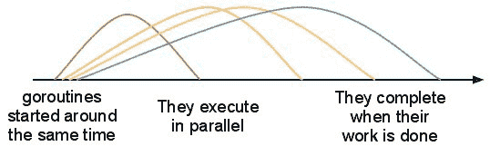

# 我是如何学习围棋编程的

> 原文:[https://dev.to/codehakase/how-i-learned-go-programming](https://dev.to/codehakase/how-i-learned-go-programming)

[T2】](https://res.cloudinary.com/practicaldev/image/fetch/s--3rFO85cD--/c_limit%2Cf_auto%2Cfl_progressive%2Cq_66%2Cw_880/https://thepracticaldev.s3.amazonaws.com/i/bkv3xbjb74epempcjone.gif)

Go 是一种相对较新的编程语言，没有什么比一种新的编程语言更让一个开发者疯狂的了，哈哈！和许多新的科技发明一样，围棋也是作为一项实验而诞生的。它的创造者的目标是想出一种语言来解决其他人的坏习惯，同时保留好的东西。它于 2012 年 3 月首次发布。从那以后，Go 吸引了来自各个领域和学科的许多开发者。

今年第二季度，我加入了 ViVA XD，这是一个飞行娱乐平台，一次改变一次世界。我们选择 Go 来建立整个基础设施。就性能及其快速简单的开发流程而言，Go 过去是/现在仍然是我们的绝佳选择。

在本文中，我将对 Go 语言做一个简短的介绍，它将作为进一步阅读的动力。

## 入门

我以前没有围棋的经验，作为一个标准，学习一门新的编程语言，我从查看 [Golang 官方网页](https://golang.org/)开始。我找到了我的操作系统的安装说明，教程，一个很棒的文档。这太可怕了(作为我用过的第一种静态类型语言)。[推荐了围棋之旅](https://tour.golang.org/welcome/1)，它是一个交互式围棋教程(与围棋捆绑在一起)，让我熟悉了围棋的语法和文字。我花了几天时间完成了这次旅行，并对 Go 环境中的东西如变量、类型、结构、指针、列表等是如何工作的有了一个概念。在这一点上，我并没有真正掌握所有关于 Go 的知识，在 ViVA XD 的第一个任务中，我在其他语言方面的经验给了我足够的知识。Go 做了一件了不起的工作，它让我们把源代码编译成一个适用于任何平台的二进制文件。我们的应用在 Linux 上运行，所以如果我们有一个在 Mac 上工作的开发人员，她可以很容易地编译它
`GOOS=linux go build`，并且在几秒钟内一个 Linux 构建就准备好了。

## 越走越深

我熟悉了语法和 Go 语言的其他重要部分，如 goroutines、并发性、错误处理、包、接口、双值赋值等。

### ðÿ˜‰也不例外

在 Go 中，函数通常会返回一个值和一个错误，但不仅限于此。函数可以返回多个值。在 Go 中处理错误很简单，我们检查第二个返回值(或者函数返回错误的位置)。这种结构提供了一种将错误从一点链接到另一点的好方法。

```
type Server struct {}

func main() {
    err := s.Run()
}

func (s *Server) Run() (err error) {
    http.HandleFunc("/", s.handleHomeRequest)
    err = http.ListenAndServe(":4000", nil)
    if err != nil {
        return err
    }
    return nil
} 
```

<svg width="20px" height="20px" viewBox="0 0 24 24" class="highlight-action crayons-icon highlight-action--fullscreen-on"><title>Enter fullscreen mode</title></svg> <svg width="20px" height="20px" viewBox="0 0 24 24" class="highlight-action crayons-icon highlight-action--fullscreen-off"><title>Exit fullscreen mode</title></svg>

### 变量和声明

在 Go 中，必须定义所有变量。我们不能有类似`x = 2`的任务。

```
package main

import (
    "fmt"
)

func main() {
    var num int
    num = 20
    fmt.Printf("The number is %d\n", num)
} 
```

<svg width="20px" height="20px" viewBox="0 0 24 24" class="highlight-action crayons-icon highlight-action--fullscreen-on"><title>Enter fullscreen mode</title></svg> <svg width="20px" height="20px" viewBox="0 0 24 24" class="highlight-action crayons-icon highlight-action--fullscreen-off"><title>Exit fullscreen mode</title></svg>

我们声明了一个类型为`int`的变量`num`。Go 默认情况下，给变量分配一个**零**值。整数被赋值 **0** ，布尔，`false`，字符串`""`，等等。这种模式看起来可能需要大量的输入，Go 也为我们提供了一个方便的操作符`:=`。
所以我们可以将上面的声明重写为`num := 29`

> 只要变量是新的，就可以使用`:=`。

### 二值赋值

Go 中的接口被用来做它们在任何语言中被设计用来做的事情，即逻辑地将具有相似行为的代码分组，而不是实现更少的代码。
在 Go 中，每个类型至少实现零个方法，这意味着每个类型实现一个特殊的零`interface{}`。当我们不知道变量是什么类型时，这是很有用的。

```
var someData interface{}
err := json.Unmarshal(raw_bytes, &someData)
if err != nil {
    log.Error(err)
} 
```

<svg width="20px" height="20px" viewBox="0 0 24 24" class="highlight-action crayons-icon highlight-action--fullscreen-on"><title>Enter fullscreen mode</title></svg> <svg width="20px" height="20px" viewBox="0 0 24 24" class="highlight-action crayons-icon highlight-action--fullscreen-off"><title>Exit fullscreen mode</title></svg>

为了从中获取类型，我们使用类型断言。这是一个简单的语句，如果断言失败，赋值将具有该类型的默认值。另一种方法是使用双值赋值。我们在类型断言语句中分配第二个值，该值将保存一个布尔值，表明它是否成功。

```
jsonStruct := someData.(map[string]interface{})
num := jsonStruct["num"].(int)
str, ok := jsonStruct["str"].(string)
if !ok {
    log.Error("error converting to string")
} 
```

<svg width="20px" height="20px" viewBox="0 0 24 24" class="highlight-action crayons-icon highlight-action--fullscreen-on"><title>Enter fullscreen mode</title></svg> <svg width="20px" height="20px" viewBox="0 0 24 24" class="highlight-action crayons-icon highlight-action--fullscreen-off"><title>Exit fullscreen mode</title></svg>

这同样适用于从地图中检索值

```
data := make(map[string]int)
data["result"] = 20
val, ok := data["result"] // returns false if key isn't found
if !ok {
    log.info("Value for key not found!!")
} 
```

<svg width="20px" height="20px" viewBox="0 0 24 24" class="highlight-action crayons-icon highlight-action--fullscreen-on"><title>Enter fullscreen mode</title></svg> <svg width="20px" height="20px" viewBox="0 0 24 24" class="highlight-action crayons-icon highlight-action--fullscreen-off"><title>Exit fullscreen mode</title></svg>

### 高楼期

大多数现代编程语言如 Python、Java 等都起源于单线程环境。它们中的大多数都支持多线程，但是它们仍然面临一些伴随并发执行、竞争条件、线程锁定和死锁而来的问题。这使得在这些语言上创建多线程应用程序变得困难。

在 Java 中(从研究来看，我没有 Java 的经验)，创建新线程并不是内存高效的。每个线程消耗大约 1MB 的内存堆大小。如果您开始运行数千个线程，它们会给堆带来巨大的压力，并且会由于内存丢失而导致系统关闭。此外，两个或多个线程之间的通信也非常困难。

Go 于 2009 年发布，当时多核处理器已经问世。Go 是在牢记并发性的基础上构建的。Go 有`goroutines`而不是线程。它们从堆中消耗了大约 2KB 的内存(T2)。所以一个人可以在任何时候旋转数百万个 goroutines。

[T2】](https://res.cloudinary.com/practicaldev/image/fetch/s--Sw280bDS--/c_limit%2Cf_auto%2Cfl_progressive%2Cq_auto%2Cw_880/https://cdn-images-1.medium.com/max/1600/1%2ANFojvbkdRkxz0ZDbu4ysNA.jpeg)

##### 使用 goroutines 的一些好处

*   Goroutines 允许您在共享数据结构时不必求助于互斥锁。
*   Goroutines 的启动时间比线程快。
*   Goroutines 使用*通道*，这是一种内置的方式，用于在它们之间进行安全通信。
*   Goroutines 和 OS 线程没有 1:1 的映射。单个 goroutine 可以在多个线程上运行。Goroutines 被复用到少量的 OS 线程中。

> Rob Pike 关于并发性的更多信息

### 写在围棋里？它易于维护

Go 有意省略了现代 OOP 语言的许多特性。

*   没有课。所有东西都被分成包。Go 只有结构。
*   不支持继承。Go 使得理解代码变得容易，因为不存在需要关注的超类。
*   没有例外
*   没有泛型
*   没有注释
*   没有构造函数

## 好转

在检查了所有官方围棋资源后，我一直在寻找更多关于围棋语言的知识，我发现了一些教围棋的很棒的内容。网上有[榜样围棋](https://gobyexample.com/)、[围棋预定](https://golang-book.com)、[有效围棋](https://golang.org/doc/effective_go.html)等。这些资源曾经帮助过我，现在仍然在帮助我，尽管有时这个话题令人沮丧，但现在一切都变得有趣了)

## 结论

Go 与其他面向对象语言有很大不同，它仍然有自己好的一面。它由谷歌提供支持，也被一些大公司使用，如 IBM、Intel、Medium、Adobe(**[https://github.com/golang/go/wiki/GoUsers](https://github.com/golang/go/wiki/GoUsers)**)。

在学习围棋之前，我有编程经验，大多数概念对我来说并不陌生，即使你是一个完全的初学者，围棋仍然很容易上手。

想分享一下你是怎么开始下围棋的，问我问题？请在评论中告诉我ðÿ™‚