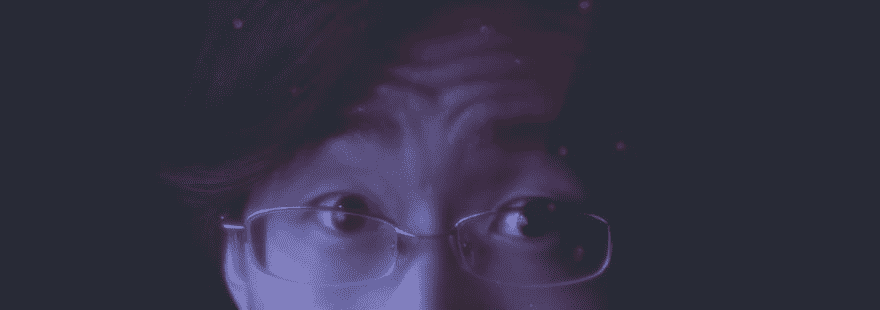

# 蓝光越少，睡眠越好

> 原文：<https://dev.to/gaiety/less-blue-light-better-sleep>

主动限制蓝光，不管是人工的还是自然的，都能让你成为一个更健康更快乐的人。不，真的，可以。

[T2】](https://res.cloudinary.com/practicaldev/image/fetch/s--sKCXvtvM--/c_limit%2Cf_auto%2Cfl_progressive%2Cq_auto%2Cw_880/https://thepracticaldev.s3.amazonaws.com/i/s4h5wvjxk9vu11cfr8eo.jpg)

<cite>照片由 [Juil Yoon](https://unsplash.com/photos/anhQGEYbnV4?utm_source=unsplash&utm_medium=referral&utm_content=creditCopyText) 在[Unsplash](https://unsplash.com/?utm_source=unsplash&utm_medium=referral&utm_content=creditCopyText)T5 拍摄</cite>

想象一个没有眼睛疲劳或昏昏沉沉的工作日。重新控制你舒适入睡的能力。通过对日常习惯的一些调整和减少蓝光的摄入，这可以成为现实。

## 什么？为什么是蓝光？

简而言之，更有害的光谱在蓝光波段内。这种窄波段的有害光线是造成眼睛疲劳和失眠的主要原因。[了解更多信息](http://www.allaboutvision.com/cvs/blue-light.htm)

## 眼睛疲劳

坐八个小时或更长时间盯着屏幕不是你的报酬——你的报酬是产生结果。只有健康的人才能做到这一点。随着时间的推移，眼睛疲劳会导致头痛和健康问题，导致你的眼睛慢慢退化。

### 起床。四处走动。

从电脑屏幕上休息一下。与你的同事交谈。**避免在办公桌前吃午餐**。当我们减少我们的蓝色时，让我们增加我们的绿色- **到外面**看看一些草、树、植物**来感觉神清气爽和充满活力**。晒晒太阳也会有所帮助。

### 过滤蓝光

就像有眼镜可以防晒一样，**有些眼镜可以过滤蓝光**。在柜台上可以买到蓝光过滤镜片，或者你可以*和你的眼科医生*讨论**把它们添加到你的下一副眼镜**。我个人在我的主眼镜中使用了蓝光过滤器，并且可以很高兴地说，没有明显的颜色失真来干扰我的设计工作。

更新:你已经在使用的一些应用程序，比如亚马逊的 Kindle 图书阅读服务，提供了深色或深褐色主题，以减轻眼睛疲劳。

像 [F.lux](https://justgetflux.com/) (或 [iOS 夜班](https://support.apple.com/en-us/HT207570)、 [Android Twilight](https://play.google.com/store/apps/details?id=com.urbandroid.lux) 、 [Linux 红移](http://jonls.dk/redshift/)等)这样的应用程序允许移除或减少*你设备的蓝光输出*。其中一些工具可以根据一天中的时间智能地减弱蓝光的量，或者根据计时器禁用。

## 在睡眠中

蓝光会激活我们大脑中的“唤醒”信号(什么？这不是科学博客)。在睡前 30-60 分钟避免这些叫醒信号，你不仅会*更容易入睡*，而且你会*更平稳地醒来*，没有那种昏昏沉沉的感觉。

如果你不能在睡觉前离开屏幕 30-60 分钟，那么重新考虑你的夜间习惯。更糟糕的是，如果你编码到深夜，然后立即尝试睡觉，你的大脑处于最活跃的状态，否则你会累垮的。相反，考虑早一点关掉屏幕，让你的大脑问题在休息时间和睡觉的时候得到解决——你可能会更有效率。

睡眠质量远比你获得的睡眠数量重要。如果你醒来时没有精神焕发，那么你需要重新考虑你的睡眠习惯。

* * *

为了加分，将咖啡因从你的饮食中完全或部分去除。尽可能避免睡前吃东西，在黑暗的房间里睡觉，不要被打扰。

## 总结

要真正实现健康的工作生活平衡，我们必须在身体和精神上照顾好自己。无论从短期还是长期来看，我们的睡眠质量都会极大地影响我们的情绪和健康。更好地管理我们生活中来自现代世界的过量蓝光可以带来更好的睡眠和更持久的良好视力，减少健康问题。

* * *

喜欢这篇文章吗？我也写了关于多相睡眠教会我什么是激情的文章。