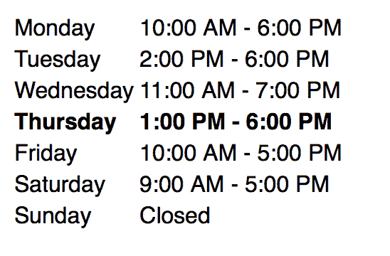

# 营业时间:一个 JavaScript 插件，为你的商业网站生成营业时间表

> 原文:[https://dev . to/Michael/open-hours-a-JavaScript-plugin-to-generate-an-hours-of-operations-table-for-your-business-website](https://dev.to/michael/open-hours-a-javascript-plugin-to-generate-an-hours-of-operations-table-for-your-business-website)

最近，我不得不与我的验光师预约。在他们的网站上，我注意到他们有一个营业时间的列表。让我印象深刻的是，一周中的当前日期和时间被自动加粗。我认为这是一个简单而有用的设计。

我现在的一个客户要开一家餐馆。我认为在他们即将推出的网站上添加这一小块界面会很棒，但我也认为它可能对任何其他业务都有用。所以我今天花了一些时间写了一个 JavaScript 插件，它允许你定义一个简单的 JavaScript 对象，并且插件会自动生成一个表格并添加到你的 DOM 中。

[T2】](https://res.cloudinary.com/practicaldev/image/fetch/s--2lk6VWWp--/c_limit%2Cf_auto%2Cfl_progressive%2Cq_auto%2Cw_880/https://thepracticaldev.s3.amazonaws.com/i/tygrmb0zsae4kjr2sbgh.png)

它是用纯 JavaScript 编写的，所以没有任何依赖性。如果你认为它对你未来的项目有用，[可以在 GitHub](https://github.com/michaellee/open-hours) 上随意下载。将来我可能会在这个插件中添加更多的东西，所以如果你想继续关注这个插件，[注册我的简讯](http://eepurl.com/bGXerj)。

* * *

最初发布于[李名炀](https://michaelsoolee.com/open-hours-javascript/)