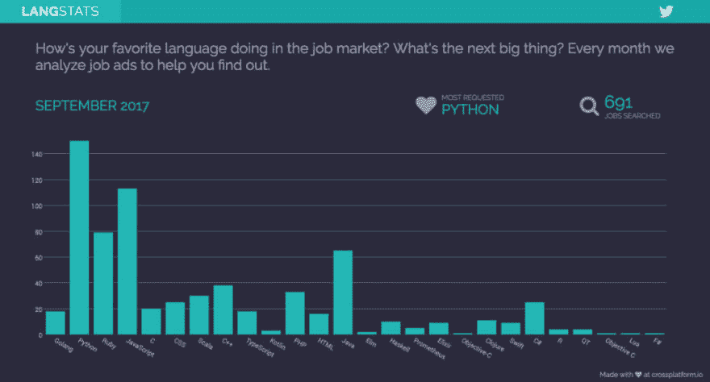
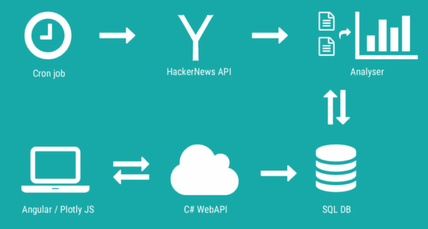

# 招聘信息显示的编程语言趋势

> 原文：<https://dev.to/alexandra/programming-language-trends-as-shown-by-job-postings-2hmo>

这个想法来自于认识到在技术领域工作意味着在一个动态和快节奏的环境中工作。事物总是在变化，不断学习的能力会给你的职业生涯带来变化。

事实上，*实用程序员*这本书建议每年至少学习一门新语言。

所以带着这种想法，我开始回答我接下来应该学什么的问题。还有什么比逆向工程就业市场，看看最需要的编程语言更好的方法。

所以，我准备开始建造原型。

## 建筑原型

我想象它是一个 web 应用程序，所以我的第一个挑战是技术性的:(重新)学习 web 开发的必要工具。我选择学习 Angular，并与 Plotly JS 文档进行斗争，以使前端。至于后端，在中断几年后，我必须重新熟悉 ASP.NET 和 Azure。

但是更有趣的挑战来自设计和数据可视化的角度。与其他具有更高数据密度的工具相反，这些工具在显示时也会产生更多的噪音，我有意识地决定使用最小化(清晰、整洁)的演示来提供快速的答案，即使这意味着显示更少的数据。

## 结果

事不宜迟，结果如下:

[T2】](http://langstats.azurewebsites.net)

## 技术堆栈

稍微深入一下技术细节，原型最终是一个生活在云中的 web 应用程序。前端用 Angular 和 PlotlyJS 编写，后端是 Azure 上传的跨平台 C# web API。应用程序数据存储在 Azure SQL 数据库中，并通过 Azure web 作业进行同步。

cron 作业每月运行一次，轮询上个月发布的所有作业的 HackerNews API。然后，它将这些结果提供给分析器，分析器用正确的关键字标记并将结果存储在数据库中。从网站端，Angular 向 C#后端发出一个请求，后者从数据库中读取统计数据，并返回由 PlotlyJS 显示的结果。

[T2】](https://res.cloudinary.com/practicaldev/image/fetch/s--I7wQRuap--/c_limit%2Cf_auto%2Cfl_progressive%2Cq_auto%2Cw_880/http://crossplatform.io/wp-content/uploads/2017/09/Screenshot-2017-09-01-18.54.26.png)

## 我学到了什么？

**开始小**。我有很多想做的功能，但是我决定不做。相反，我去构建最小的核心功能，并验证这个想法。我将添加的任何更改都将一点点发生。

不要使用你的工具的测试版本。我被(1)试图使用的东西咬了。NET Core，然后上传到 Azure，希望他们能合作，因为他们关系密切(他们根本不喜欢对方)。我还偶然发现了一个奇怪的实体框架跨平台错误，这是非常意外的，因为我总是假设任何错误都只会来自我的代码。

**仔细选择你的数据源**，因为它会影响你的结果。我从 HN API 获取数据，因此提取的趋势(大部分)适用于初创企业和发达国家。

注意你的外部依赖。有些月份，线程发布的时间比预期的要晚，所以最后一个教训是，无论何时处理外部依赖，都要有故障安全机制。

## 未来

已经有一个计划的功能列表，包括将视觉扩展到框架，显示特定语言随时间的演变，进行比较等。我最兴奋的是试图预测下个月或明年什么会流行。

感谢阅读！