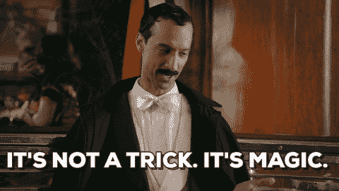
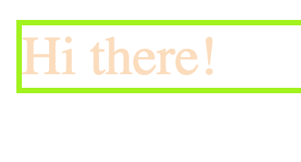
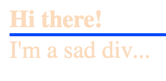
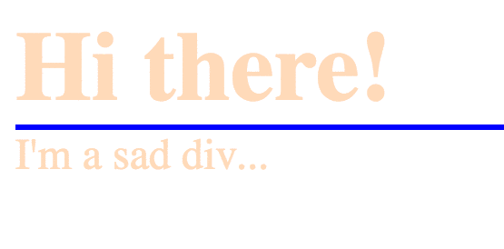
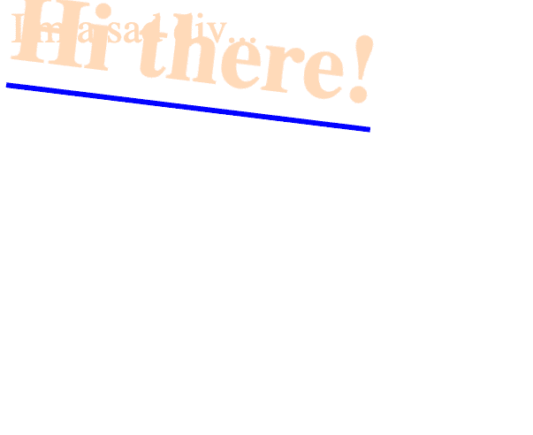

# CSS 动画可能很神奇

> 原文：<https://dev.to/rpalo/css-animations-are-probably-magic>

停下你现在正在做的事情，听我说，因为 CSS 动画是真正的魔法，是惊人的。

[T2】](https://res.cloudinary.com/practicaldev/image/fetch/s--JVlSMP9g--/c_limit%2Cf_auto%2Cfl_progressive%2Cq_66%2Cw_880/http://assertnotmagic.com/img/css-magic.gif)

现在我已经引起了你的注意，让我更清楚地解释一下我自己。如果你读过我的许多其他帖子，你可能会想，“等一下。你发表了关于 Python 和 Ruby 以及后端语言和脚本的文章。这都是什么前端废话？”对此，我带着极大的冒犯回答道:“胡说八道？！你的脸是废话。做前端的人都是天才(Genii？Genies？)让我们的世界看起来更美好，让我们的用户体验更流畅，以及其他一些我认为理所当然、甚至不知道的事情。但即便如此，CSS 动画足够神奇，应该与所有人分享，而不仅仅是一个幸运的子集。”因此，接下来的将是一个介绍和指南，即使是最暴躁的系统管理员也可以轻松地自己制作 CSS 动画。

我们开始吧。

## 背景

CSS。这是一种语言。对某些人来说，这很可怕。很多时候，对我来说，它最终看起来更像是我希望我的页面看起来如何的愿望清单，而不是一个精心计划和制作的样式表。为了保证我们都是从同一个地方开始，我将从最基础的部分开始。继续之前你应该知道的事情:

1.  HTML 是一种用于网页布局的标记语言。看起来是这样的。

```
<div>Hi there!</div> 
```

1.  CSS 是用来决定你的网站应该是什么样子的。看起来是这样的:

```
div {
    color: peachpuff;
    font-size: 20px;
    border: 2px solid chartreuse;
} 
```

1.  您会注意到，我在开始时指定了这些样式的目标是什么。我从上面瞄准我的`div`。(不用担心。一个`div`只是一个容器/盒子。)网页现在看起来像这样:

[T2】](https://res.cloudinary.com/practicaldev/image/fetch/s--o_2NQo4G--/c_limit%2Cf_auto%2Cfl_progressive%2Cq_auto%2Cw_880/http://assertnotmagic.com/img/css-peachpuff.png)

1.  通过向元素添加类和 ID，可以更具体地定位元素。

```
<div class="underlined" id="main-div">Hi there!</div>
<div>I'm a sad div...</div> 
```

1.  你可以像这样从你的 CSS 中访问这些类和 ID。

```
div {
    color: peachpuff;
}
.underlined {
    border-bottom: 2px solid blue;
}
#main-div {
    font-size: 36px;
    font-weight: bold;
} 
```

最终产品将会是这样的:

[T2】](https://res.cloudinary.com/practicaldev/image/fetch/s--vNAwS6Bh--/c_limit%2Cf_auto%2Cfl_progressive%2Cq_auto%2Cw_880/http://assertnotmagic.com/img/css-selectors.png)

注意主 div 是如何获得所有三种样式改进的，但是*两个 div*都获得了颜色，因为`div`部分针对它所应用的所有内容。

好吧！这应该能让我们加快速度。除此之外，还有一些事情可以让我们变得更复杂，但我现在先不去管它。

## 一注

随着我们的继续，应该知道目前并不是所有的浏览器都支持一些动画 CSS。我强烈推荐使用类似于 [this AutoPrefixer](https://autoprefixer.github.io/) 的站点或工具来生成相关的厂商前缀，这将允许所有这些在更多的浏览器中工作。将您的通用 css 复制/粘贴到输入窗口，运行 autoprefixer，并将输出 CSS 复制到您在 HTML 文档中引用的文件。或者，如果你是一个喜欢穿裤子的人，你可以使用一个工具来帮你做所有这些事情。

## 让我们来看看动画

事实证明，你可以用很多不同的方式制作很多东西的动画。让我们从简单的开始，然后从那里开始。

### 简单的方法:转场

转场是一种打开和关闭更改的方式，类似于手动模拟动画。有几个*伪选择器*可以用来根据用户正在做的事情应用样式。试试这个，继续我们之前的 HTML。

```
/* ... */
div:hover {
    background: #111;
    color: #CCC;
} 
```

[T2】](https://res.cloudinary.com/practicaldev/image/fetch/s--yiKb_P9w--/c_limit%2Cf_auto%2Cfl_progressive%2Cq_66%2Cw_880/http://assertnotmagic.com/img/css-hover.gif)

酷吧？然而，对于那些有设计眼光的人来说，你可能会抱怨这种转变有点突然和笨拙。我们要做的就是加一行！

```
div {
    color: peachpuff;
    transition: background 1s ease-in, color 1s ease-in;
} 
```

它平稳过渡！酷吧？但是我们想要更多的控制权！我们希望动画发生没有悬停！我们。想要。关键帧！

## [关键帧](#keyframes)

关键帧是钱的所在。您只需指定您希望在整个动画中进行的更改，值从 0%到 100%不等。如果你愿意，也可以用“从”代替 0%，用“到”代替 100%。由你决定。

```
@keyframes flip-flop {
  0% {
    transform: rotate(0deg);
    top: 0%;
  }
  40% {
    transform: rotate(180deg);
    top: 50%;
  }
  60% {
    transform: rotate(180deg);
    top: 50%;
  }
  100% {
    transform: rotate(360deg);
    top: 0%;
  }
} 
```

有一点要注意，我的 40%和 60%是一样的。这是因为我希望我的 div 在部分时间内暂停运动。如你所见，我所做的只是指定了整个动画的属性。浏览器应该会填充其余部分。要将此动画附加到您的 div，请插入以下内容:

```
#main-div {
  font-size: 36px;
  font-weight: bold;
  position: absolute;
  animation: flip-flop 3s infinite;
} 
```

注意，我加了一个`position: absolute`来增加 wow 因子。关键线是动画线。您可以指定要使用的关键帧动画的名称、时长和次数。你也可以使用更多的设置。让我们来看看。

[T2】](https://res.cloudinary.com/practicaldev/image/fetch/s--bhCQMW1u--/c_limit%2Cf_auto%2Cfl_progressive%2Cq_66%2Cw_880/http://assertnotmagic.com/img/css-flip-flop.gif)

好了，冷静下来。别炫耀了。一件事，有时形状变得奇怪，因为他们在火狐动画。如果你遇到这种情况，只需添加`outline: 1px solid transparent`。

## 总结起来

就是这样！你已经很好地掌握了 CSS 动画。很快你就可以制作 SVG 动画了(和这个没什么不同)，按钮等等！如果你已经做了一些像这样酷的东西，分享吧！或者，如果你有一些关于如何做得更好/更酷/更有效的建议，也请告诉我。Tutsplus 上的这个教程是一个非常有趣的教程，你应该在读完这篇文章后马上去做。为了看到更多酷/鼓舞人心/令人厌恶的惊人事物，你应该注册 [CodePen 时事通讯](https://codepen.io/accounts/signup)。我甚至没有在上面做什么，但是每周的简讯让我很开心。

* * *

*原发于我的博客[assert _ 不是魔术？](http://assertnotmagic.com)T3】*