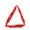
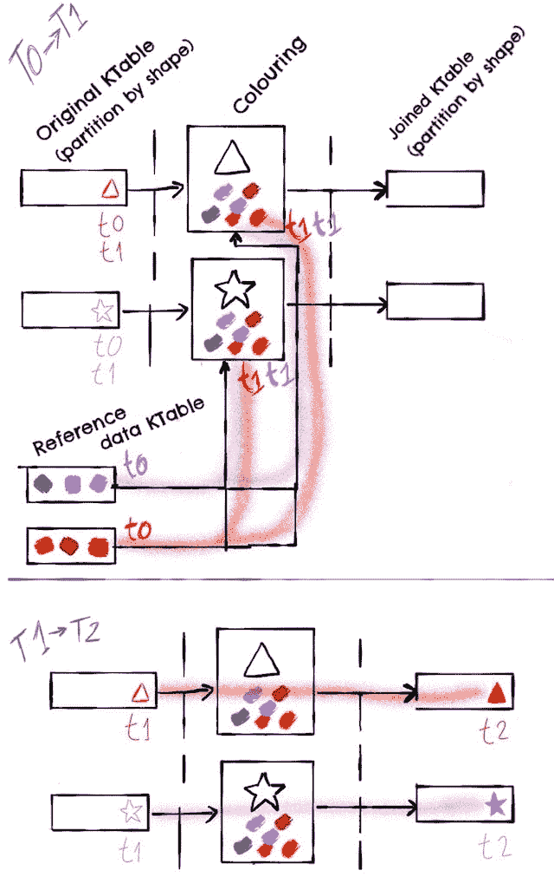
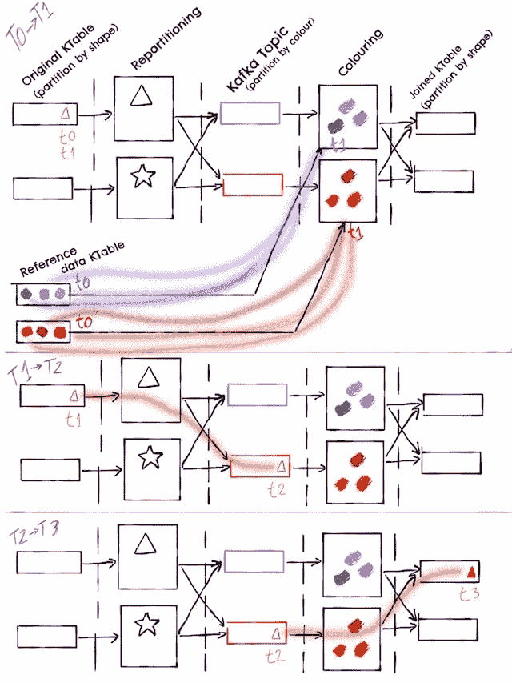
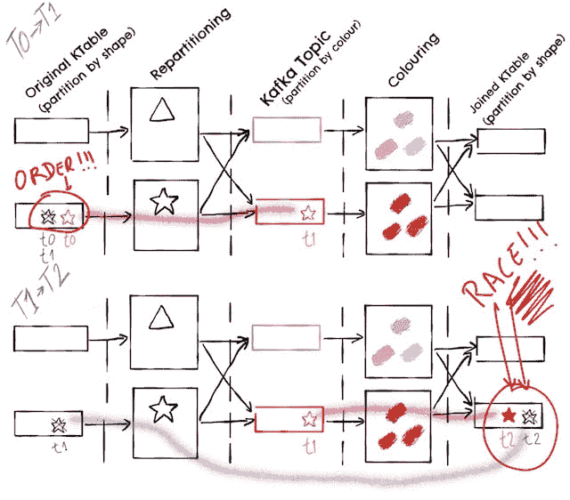
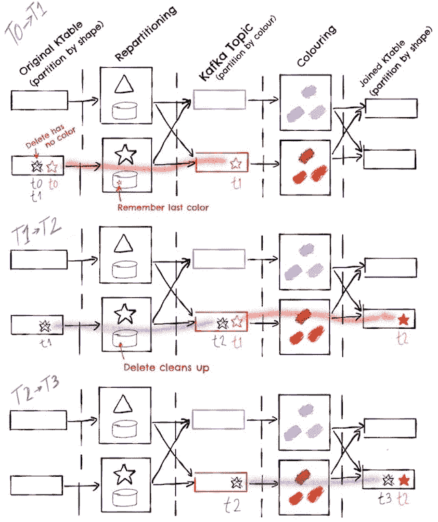
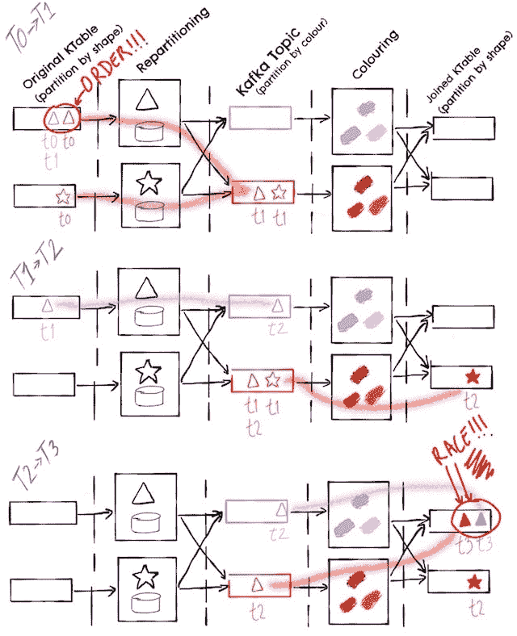
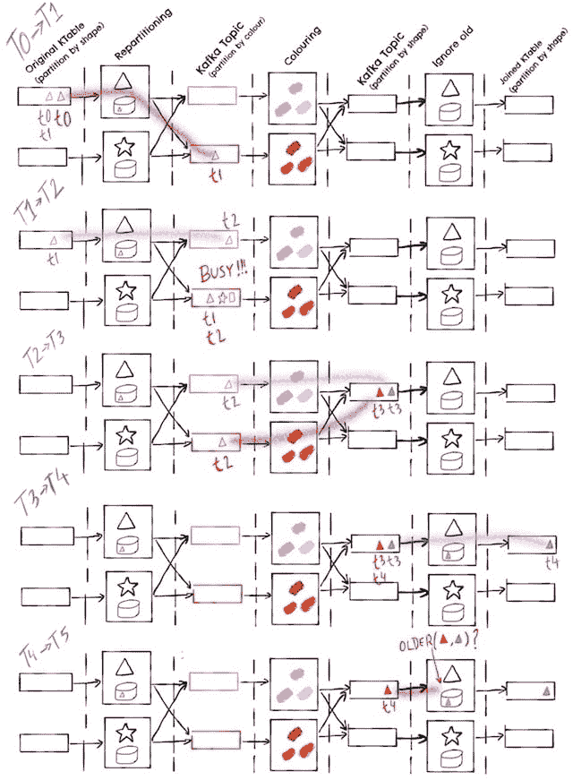
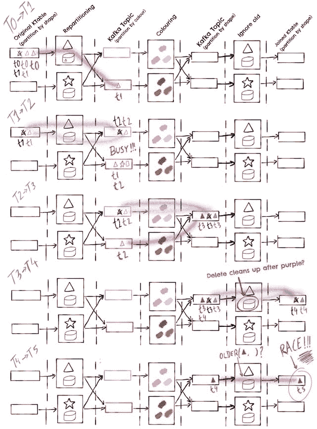

# 使用 Kafka Streams 的 KTables 和 GlobalKTables 加入有状态流处理

> 原文：<https://dev.to/danlebrero/joins-on-stateful-stream-processing-using-kafka-streams-ktables-and-globalktables>

*本文原载于[我的博客](http://danlebrero.com/2017/05/07/kafka-streams-ktable-globalktable-joining-reference-data/)T3】*

KafkaStreams 附带了一组很好的 API，允许人们加入 KStreams 和 KTables。

例如，在[的前一篇文章](http://danlebrero.com/2017/01/05/proof-of-concept-using-kafkastreams-and-ktables/#content)中，我们生成了一个 KTable，其中包含了我们想要发送电子邮件的客户列表。这张桌子看起来像是:

| 客户(键) | 位置 |
| --- | --- |
| 客户端 1 | #{1, 3} |
| 客户端 2 | #{4} |

但是我们也需要客户的一些个人信息，比如他们的名字，以便能够在邮件中正确地称呼他们。该数据将位于另一个 KTable 中，包含当前客户端的详细信息，例如:

| 客户(键) | 名字 | 姓 | 电子邮件 |
| --- | --- | --- | --- |
| 客户端 1 | 彼得（男子名） | 帕克 | 彼得·帕克@ dailybugle.com |
| 客户端 2 | 彼得（男子名） | 平底锅 | 彼得·潘@ neverland.com |

所以我们要做的相当于:

```
select client_data.email from positions, client_data where positions.key = client_data.key 
```

Enter fullscreen mode Exit fullscreen mode

使用 Kafka Streams API 是什么样子:

```
(->  (.join  us-share-holders  client-data  (k/val-joiner  [positions  client-data]  (:email  client-data)))  (.through  "final-result"  "final-result-store")) 
```

Enter fullscreen mode Exit fullscreen mode

这个 API 很好也很简单，但是它有两个限制:

1.  两个 KTables 必须有相同的键。
2.  两个 KTables 必须有相同数量的分区(这称为联合分区)。

修复第二个问题很简单，因为只需将 Kafka 主题复制到另一个具有正确分区数的 Kafka 主题。

## 连接不同键上的 KTables

用不同的键连接两个表的主要原因之一是添加某种引用或查找数据。

以[前一篇文章](http://danlebrero.com/2017/01/05/proof-of-concept-using-kafkastreams-and-ktables/#content)为例，我们有一个包含头寸数据的 KTable，例如:

| 位置 Id(关键字) | 客户 | 心脏 | 数量 | 交换 |
| --- | --- | --- | --- | --- |
| one | 客户端 1 | AAPL | One hundred | 全国证券交易商协会自动报价系统 |
| Two | 客户端 1 | 同ＶIＤＥＯ-ＯＮ- ＤＥＭＡＮＤ | five | LON |
| three | 客户端 1 | 运货单(freight bill) | Thirty-three | 全国证券交易商协会自动报价系统 |
| four | 客户端 2 | AAPL | Twenty-five | 全国证券交易商协会自动报价系统 |
| five | 客户端 3 | 同ＶIＤＥＯ-ＯＮ- ＤＥＭＡＮＤ | Thirty-three | LON |

为了使事情更简单，我们假设头寸已经有了股票交易所，但是实际上我们将有另一个 KTable，其中包含与股票相关的所有数据，比如交易所、名称、创建日期，...

因此，位置数据实际上会是这样的:

| 位置 Id(键) | 客户 | 心脏 | 数量 |
| --- | --- | --- | --- |
| one | 客户端 1 | AAPL | One hundred |
| Two | 客户端 1 | 同ＶIＤＥＯ-ＯＮ- ＤＥＭＡＮＤ | five |
| three | 客户端 1 | 运货单(freight bill) | Thirty-three |
| four | 客户端 2 | AAPL | Twenty-five |
| five | 客户端 3 | 同ＶIＤＥＯ-ＯＮ- ＤＥＭＡＮＤ | Thirty-three |

股票代码类似于:

| 跑马灯(钥匙) | 交换 | 名字 | 创建日期 |
| --- | --- | --- | --- |
| AAPL | 全国证券交易商协会自动报价系统 | 苹果公司 | One thousand nine hundred and seventy-six |
| 同ＶIＤＥＯ-ＯＮ- ＤＥＭＡＮＤ | LON | 沃达丰公司 | One thousand nine hundred and ninety-one |
| 运货单(freight bill) | 全国证券交易商协会自动报价系统 | 脸书公司 | Two thousand and four |

要连接这两个 KTables，我们需要相当于:

```
select * from positions, tickers where positions.exchange = tickers.key 
```

Enter fullscreen mode Exit fullscreen mode

对于 Kafka Streams，我们有两种选择，这取决于我们想要加入的最小 KTables 有多大。

### 选项 1:使用全局表的本地连接

大多数情况下，引用数据足够小，可以放在内存或磁盘中，因此在每个节点上拥有引用数据的副本比进行分布式连接更有效，因为进行分布式连接将需要在网络上移动数据。

从 Kafka 0.10.2.0 开始，Kafka Streams 引入了 GlobalKTable 的概念，就是这个，Kafka Stream 拓扑中的每个节点都有一个完整的引用数据副本，因此连接是在本地完成的。

在我们看这个选项的图表之前，让我们解释一下我们将要使用的图例。

我们将把跑马灯引用数据表示为特定颜色的笔触。比如 APPL 会: [](https://res.cloudinary.com/practicaldev/image/fetch/s--twKAxLch--/c_limit%2Cf_auto%2Cfl_progressive%2Cq_auto%2Cw_880/http://danlebrero.cimg/blog/ktable-join/ktable-join-APPL.jpg) 而 VOD 会: [](https://res.cloudinary.com/practicaldev/image/fetch/s--a29vHQL2--/c_limit%2Cf_auto%2Cfl_progressive%2Cq_auto%2Cw_880/http://danlebrero.cimg/blog/ktable-join/ktable-join-VOD.jpg)

我们将把每一个原始位置，也就是没有报价器参考数据的位置，表示为一个彩色的空形状。形状的颜色将与股票代码的颜色相对应。例如，位置 1 用于 APPL，所以我们将它表示为: [](https://res.cloudinary.com/practicaldev/image/fetch/s--zT-JfAGT--/c_limit%2Cf_auto%2Cfl_progressive%2Cq_auto%2Cw_880/http://danlebrero.cimg/blog/ktable-join/ktable-join-pos1-empty.jpg) ，而位置 2 用于 VOD 将表示为: [](https://res.cloudinary.com/practicaldev/image/fetch/s--DO8fBTer--/c_limit%2Cf_auto%2Cfl_progressive%2Cq_auto%2Cw_880/http://danlebrero.cimg/blog/ktable-join/ktable-join-pos2-empty.jpg)

将位置与跑马灯参考数据结合的结果将是填充的形状。例如位置 1 在加入后会变成: [](https://res.cloudinary.com/practicaldev/image/fetch/s--B4OqKQMk--/c_limit%2Cf_auto%2Cfl_progressive%2Cq_auto%2Cw_880/http://danlebrero.cimg/blog/ktable-join/ktable-join-pos1-full.jpg) ，位置 2 会变成: [](https://res.cloudinary.com/practicaldev/image/fetch/s--BDT6bBgt--/c_limit%2Cf_auto%2Cfl_progressive%2Cq_auto%2Cw_880/http://danlebrero.cimg/blog/ktable-join/ktable-join-pos2-full.jpg)

我们也将在图表中显示所需的卡夫卡主题。主题将按照形状进行分区，因此所有星形位置将进入一个分区，而所有三角形位置将进入另一个分区；或者按颜色，因此所有红色阴影将进入一个分区，而所有紫色阴影将进入另一个分区。

该图显示了从一个时刻到下一个时刻所处理的内容，使用线索可以轻松地跟踪头寸和报价参考数据在系统中的流动。

因此，全球表格图看起来像这样:

[T2】](https://res.cloudinary.com/practicaldev/image/fetch/s--y36w2bAt--/c_limit%2Cf_auto%2Cfl_progressive%2Cq_auto%2Cw_880/http://danlebrero.cimg/blog/ktable-join/ktable-join-global-ktable.jpg)

请注意在 T0->T1，Kafka Streams 如何在开始任何处理之前读取所有参考数据。

在 T1->T2 上，我们已经从图表中删除了“参考数据”主题，以使其更加简单。

因为两个节点都是彩色的，所以没有必要来回移动数据。

不幸的是，还不支持 KTable 到 GlobalKTable 的连接，它将在 Kafka 0.11.0.0 中出现(或者一旦[这张票](https://issues.apache.org/jira/browse/KAFKA-4628)完成)。

### 选项 2:分布式左外连接

但是如果你想加入的 KTables 很大呢？

已经有[一些讨论](https://issues.apache.org/jira/browse/KAFKA-3705)在未来的 Kafka Streams 版本中包含这个特性，但是在它可用之前，让我们看看如何使用可用的 Kafka Streams API 实现分布式、实时、容错的连接。

首先，我们需要对其中一个 KTables 进行重新分区，这样两个主题都由相同的属性作为键。这样，我们需要连接的行将在同一个节点中结束。

[T2】](https://res.cloudinary.com/practicaldev/image/fetch/s--X9Wrcob6--/c_limit%2Cf_auto%2Cfl_progressive%2Cq_auto%2Cw_880/http://danlebrero.cimg/blog/ktable-join/ktable-join-initial-explanation.jpg)

请注意每个着色任务是如何使用一半的颜色的，还要注意我们现在需要一个额外的 Kafka 主题来保存重新划分的数据。

值得一提的是，在 T0->T1，我们是依靠 Kafka Stream 的[流控制](http://docs.confluent.io/3.0.0/streams/architecture.html#streams-architecture-flow-control)在处理消息之前初始化引用数据。这个流控制试图在处理新记录之前处理旧记录，但是正如 Kafka 流的文档中所提到的，这是基于尽力而为的，这比 GlobalKTable 的保证要弱，但是它似乎工作得很好。

但是如果删除了一行呢？起初，我们只想将删除直接发送到结果主题似乎是合乎逻辑的，因为我们不需要加入任何东西。

这个选项的问题是，我们可能会以一个竞争条件结束，因为删除可能会超过新记录到结果主题的速度:

[T2】](https://res.cloudinary.com/practicaldev/image/fetch/s--YxSumd2d--/c_limit%2Cf_auto%2Cfl_progressive%2Cq_auto%2Cw_880/http://danlebrero.cimg/blog/ktable-join/ktable-join-delete-race-condition.jpg)

要解决这个问题，我们必须确保遵守消息到达的顺序。实现它的一种方法是依靠 Kafka 的每分区排序语义，并将删除发送到正在进行连接的节点，并由该节点将删除转发到结果主题:

[T2】](https://res.cloudinary.com/practicaldev/image/fetch/s--XTMqkaQH--/c_limit%2Cf_auto%2Cfl_progressive%2Cq_auto%2Cw_880/http://danlebrero.cimg/blog/ktable-join/ktable-join-delete-no-race.jpg)

请注意，在图中，我们在重新分区任务上添加了一个本地存储。请记住，在 Kafka 中，删除消息的有效负载为空，因此为了能够将删除发送到正确的分区，我们需要记住之前的值是什么，以便我们能够计算出需要将删除发送到哪个分区。

这将修复处理删除时的竞争条件，但是如果连接键发生变化，我们难道没有类似的竞争条件吗？

[T2】](https://res.cloudinary.com/practicaldev/image/fetch/s--PvGA372e--/c_limit%2Cf_auto%2Cfl_progressive%2Cq_auto%2Cw_880/http://danlebrero.cimg/blog/ktable-join/ktable-join-race-key-change.jpg)

不幸的是，对于这种竞争情况，我们不能依赖于处理的顺序，因为每次更新都将到达不同的节点。

一个可能的解决方案是在 join 之后添加一个额外的步骤，在这个步骤中，我们记住给定键的最后处理的消息的时间戳，并过滤掉比它更早的任何消息:

[T2】](https://res.cloudinary.com/practicaldev/image/fetch/s--suEvorZk--/c_limit%2Cf_auto%2Cfl_progressive%2Cq_auto%2Cw_880/http://danlebrero.cimg/blog/ktable-join/ktable-join-remove-old.jpg)

但是这又把我们带到了删除所发生的事情上，如果我们不小心的话，
我们可能会以下面的竞态条件结束:

[T2】](https://res.cloudinary.com/practicaldev/image/fetch/s--1IwxSZkj--/c_limit%2Cf_auto%2Cfl_progressive%2Cq_auto%2Cw_880/http://danlebrero.cimg/blog/ktable-join/ktable-join-remove-old-race-condition.jpg)

要解决这个问题，我们需要记住我们删除了行，但显然我们不想记住我们曾经删除的所有行，因为这将需要无限量的内存/磁盘，这意味着过滤任务将需要某种清理过程。

## 我们完成了吗？

好吧，这个解决方案没有考虑到引用数据在 KTable 上的改变和删除，但是这个帖子已经足够长了，这不是一个简单的问题。

我展示的代码和解决方案给我的感觉和我做任何并发工作时的感觉一样。我忘记了一些东西，我不确定它是否正确，单元测试不会证明其他的事情。

当然，我们探讨的一些场景可能不适用于您的领域。例如，在我们的例子中，一个位置不可能改变报价机，这简化了系统。

那么我们学到了什么？

当您的工具提供一个简单的高级 API 时，有状态流处理是一件轻而易举的事情，但是当您必须自己完成时，它更像是一个可能存在竞争条件的雷区。

你可以在这里找到所有的 Cojure 代码和一个完整的 Docker 环境。