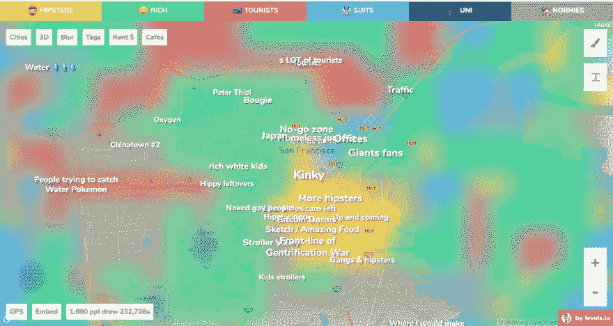

# 建立你的项目(让人们享受事物)

> 原文：<https://dev.to/davedri/on-building-your-project-and-letting-people-enjoy-things-51cm>

你知道你想造什么吗？

但是已经有一个东西在做类似的事情了？有人一定会当着你的面告诉你一切？

如果这听起来很熟悉，那么这里有两个快速推文和一个热点给你。

最近[皮特等级](https://levels.io/)制作了一个叫做[的帽衫地图](https://hoodmaps.com/)。你可能在[产品搜索](https://www.producthunt.com/posts/hoodmaps)上看到过。这是一个有趣的项目，可以让人们用其他信息覆盖谷歌地图。在这种情况下，有趣的参考主要城市的人口统计。

这是旧金山的地图。是的，它非常准确。虽然我不同意山景城的注释，我目前写这篇文章的地方，原因很明显😂。

 

<figcaption>实话实说——多色地图。</figcaption>

很酷吧？是的，我也这么认为。但是因为这是互联网，让我们准备好迎接不可避免的两极反应，3，2，1…

> 马修·塞弗特@ mnseifert[@马丁尼克](https://twitter.com/martinechenique) Hoodmaps 很有趣，但 [@spatialAI](https://twitter.com/spatialAI) 已经做了近 2 年的更好版本...2017 年 8 月 31 日下午 17:4111

我不想在这里不公平地指责马修，因为他愿意在这个问题上与彼得接触，这实际上很酷。

就像任何创建任何产品的创始人一样，我发现自己每周至少有几次站在彼得一边。一旦你把任何东西运出去，就会有无数人告诉你它已经存在于这个世界上了。不管你的专业领域或特定的视野。

但就像全球创业生态系统的任何成员一样(如果你正在阅读这篇文章，可能包括你)，我也必须学会如何将我对类似项目/产品的模式识别转化为创始人可以回答的问题。毕竟这是人类的天性，承认我们都本能地这样做是非常健康的。

令人惊叹的是，给它五分钟时间，让创始人解释他们的愿景，通常会很有启发性——这是另一个[提醒，不要每次看到熟悉的东西就大喊“辛普森一家干的”](https://en.wikipedia.org/wiki/Simpsons_Already_Did_It)。

> 皮特等级🏝@ levelsio问题是:你是想让 2M 出资打造一款永远不会有人用的隐身 app，还是真的推出一款今天 ppl 还能用的 app20:27PM-31 2017 年 8 月1189

皮特在这里似乎并不感到困扰，并且在回答时很开心。让我们记住，如果我们不把事情看得太个人化，互联网可以是一个有趣的地方🔥🔫).

这个简单的交流突出了我想用荧光笔标记的几个点，并在周围画了几个圈。排名不分先后…

### 建造任何你想建造的该死的激情项目

这个世界是一个神奇的地方，充满了神奇的人做着神奇的事情，因为他们想做。成为那些人中的一员(他们往往会成功)。

说到激情项目，真正重要的只有一个人。那就是你。

Pieter 是激情项目类别中的一个异类，因为他在过去几年中肯定是多产的。这就是为什么在既有趣又私人的事情上叫他出来更奇怪的原因。正如其他人指出的，已经获得了一定的文化吸引力。

激情项目永远是令人敬畏的。你做得越多，学得越多。你分享的越多，世界对你的要求就越高。想象一下，如果有人告诉 Linus 不要把开发 Linux 当成“只是一种爱好”，那该有多好？毕竟 Minix 已经存在了吧？

### 像真正的人类一样，学会要求澄清

几乎所有发明的东西都有一堆类似的东西。就像鸟儿一样。你见过有多少种鸟吗？有没有鸟类学家会说“笑翠鸟很有趣，但鹰在近两千年前就已经有了更好的飞行方式”？

不。因为那太荒谬了。

我的建议是，如果你遇到一个创始人，他从事的项目或产品似乎与你见过的其他东西相似，你就有机会了解这个领域的一些细微差别。试试这个…

“我不是那个领域的专家，但我熟悉[事物的名称]。你对此有什么看法？”

### 让人享受的东西

作为一个为软件团队共同创建了[文档工具的人，我当然可以理解。我必须在这里声明我明显的偏见。](http://corilla.com)

我可以向你保证可以问这些问题。如果你感兴趣，我会告诉你我们在 Corilla 的独特关注点，我们作为 Red Hat 内部初创公司的背景故事，甚至我是多么(真诚地)喜欢少数探索这一领域的类似公司。那是以后的博客文章。

但现在，它真的只是归结为一些明智的建议，亚当埃利斯如此完美地总结了像素形式的 T1…

 

<figcaption>摘自[亚当埃利斯](https://www.facebook.com/buzzfeedadam/photos/a.160195804031634.47416.136450789739469/1107530019298203/?type=3&theater)。</figcaption>

感谢阅读。这篇文章最初出现在[最小可行段](https://medium.com/minimum-viable-paragraph/on-building-your-project-and-letting-people-enjoy-things-a85589c3582d)上。