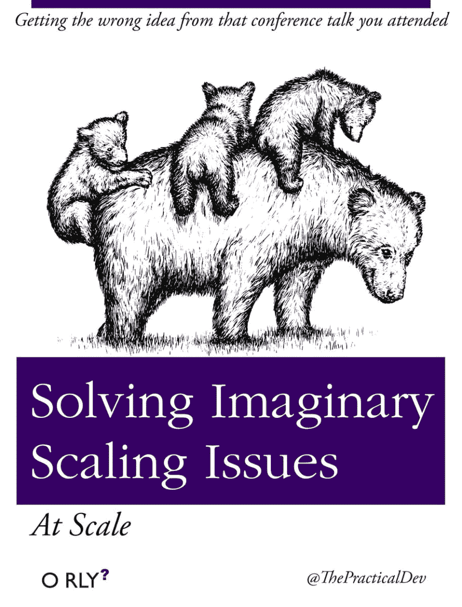

# 解决想象中的缩放比例，在规模(谈话！)

> 原文:[https://dev . to/Ben/solving-imaginary-scaling-at-scale-the-talk](https://dev.to/ben/solving-imaginary-scaling-at-scale-the-talk)

去年我做了这个滑稽的书的封面，并把它发到了推特上，发自 [@ThePracticalDev](https://twitter.com/thepracticaldev) :

> 实用 Dev[@ thepracticaldev](https://dev.to/thepracticaldev)第一章:名字很酷的数据库2016 年 11 月 21 日下午 17:27

NPM 联合创始人[劳里·沃斯](https://twitter.com/thepracticaldev)在推特*和*上用它激发了一场演讲。这个演讲是他今年夏天早些时候在[恐龙化石](https://dinosaurjs.org/)上做的，非常棒，绝对是信息丰富。强烈推荐看下面:

### 恐龙 2017:解决想象中的缩放问题，劳里·沃斯

[https://www.youtube.com/embed/FJByltoGnA8](https://www.youtube.com/embed/FJByltoGnA8)

“这是关于一知半解是一件危险的事情”——劳里·沃斯

# 👏 👏 👏 👏 👏