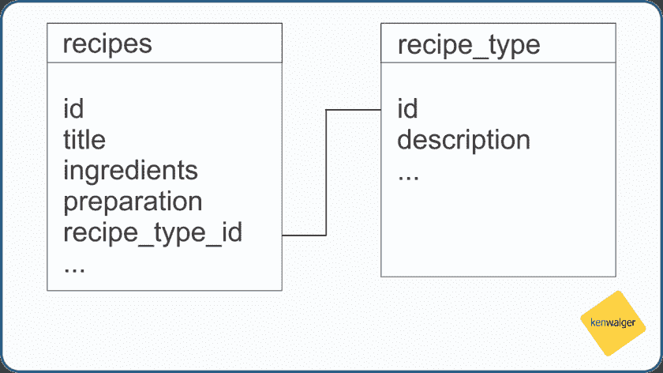
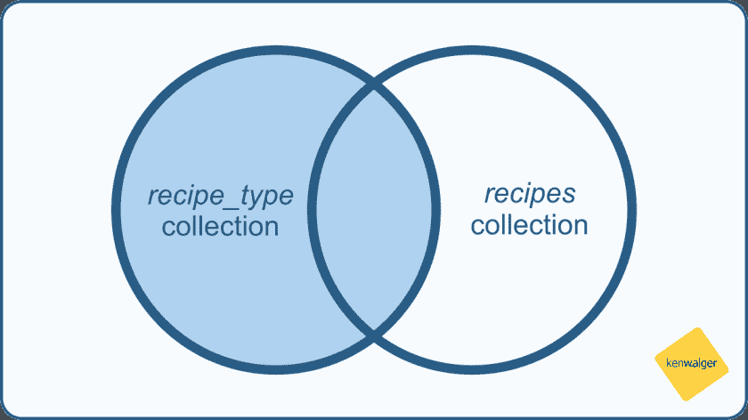

# 用$lookup 在 MongoDB 中执行连接

> 原文：<https://dev.to/kenwalger/performing-joins-in-mongodb-with-lookup-94n>

最终，似乎有必要同时在多个 [MongoDB](https://www.mongodb.com) 集合中查找数据。好吧，*必要的*，可能措辞强烈。“很有帮助可能更好。在 MongoDB 的 3.2 版本之前，进行连接是不可能的，但是随着该版本的出现，出现了`$lookup` [聚合阶段操作符](https://docs.mongodb.com/manual/reference/operator/aggregation/)。`$lookup`的引入允许在同一个数据库中没有[分片的](https://www.kenwalger.com/blog/nosql/mongodb-horizontal-scaling-sharding/)集合上执行左外连接。

对于本帖的数据，让我们利用食谱的概念。我将展示一些基本的传统 SQL 数据库表，并遍历一个连接的 SQL 语法。

[T2】](https://res.cloudinary.com/practicaldev/image/fetch/s--6cTfBvcZ--/c_limit%2Cf_auto%2Cfl_progressive%2Cq_auto%2Cw_880/https://i1.wp.com/www.kenwalger.com/blog/wp-content/uploads/2017/08/recipe_tables.png%3Fresize%3D840%252C472%26ssl%3D1)

### SQL 语法

让我们快速地看一下 SQL 中的左外连接是什么样子，以及 SQL 中的几种不同的语法。

###### 标准 SQL

```
SELECT recipe_type.decription, recipes.title
FROM recipe_type
LEFT OUTER JOIN recipes
ON recipe_type.id = recipes.recipe_type_id 
```

###### 甲骨文

```
SELECT recipe_type.description, recipes.title
FROM recipe_type, recipes
WHERE recipe_type.id = recipes.recipe_type_id(+) 
```

这两个表的左外部连接的结果将包含“左表(recipe_type)”中的所有行。

### $查找连接

[](https://res.cloudinary.com/practicaldev/image/fetch/s--HOidH1Fn--/c_limit%2Cf_auto%2Cfl_progressive%2Cq_auto%2Cw_880/https://i0.wp.com/www.kenwalger.com/blog/wp-content/uploads/2017/08/recipe_join_venn_diagram.png%3Fresize%3D840%252C472%26ssl%3D1) 

<figcaption>左外接</figcaption>

的概念

从概念的角度来看，我们的 join from `$lookup`应该与我们的 SQL 表兄弟相同。假设我们有一组食谱类型和一个食谱，我们的`$lookup`阶段将如下所示:

```
{
  $lookup:
    {
      from: "recipes",
      localField: "id",
      foreignField: "recipe_type_id",
      as: "recipe_categories"
    }
} 
```

然后我们的`$lookup`阶段基于`id`和`recipe_type_id`字段在两个文档之间进行相等匹配。它将向聚合管道文档中的文档添加一个新的数组字段，并将其传递到管道的下一个阶段。

现在，鉴于我们对 MongoDB 中的[模式设计](https://dev.to/kenwalger/schema-design-considerations-in-mongodb-6g0-temp-slug-8140812)和[文档模型](https://www.kenwalger.com/blog/nosql/document-model/)的了解，我们可能不需要这种精确的连接，因为这两个数据集*可能会*嵌入到一个或另一个集合中。但是，根据您的数据访问模式和应用程序需求，集合可能会利用引用。

### 总结起来

我希望这为`$lookup`聚合阶段以及如何在 MongoDB 中进行连接提供了一个有用而快速的介绍。虽然您可能不会发现自己一直在使用它，但它是一个很好的工具，在需要的时候随时可以使用。

这篇文章中有几个 MongoDB 特定的术语。我为[亚马逊 Echo](https://www.amazon.com/gp/product/B01DFKC2SO/ref=as_li_tl?ie=UTF8&camp=1789&creative=9325&creativeASIN=B01DFKC2SO&linkCode=as2&tag=kenwalgersite-20&linkId=f9e513223de2525a72b95cf9561db55b) 系列产品创建了一个 [MongoDB 字典](https://www.echoskillstore.com/MongoDB-Dictionary/45103)技能。检查一下你可以说“Alexa，问一下 MongoDB 什么是文档？并得到有益的回应。

* * *

*在 Twitter [@kenwalger](https://www.twitter.com/kenwalger) 上关注我，获取我发布的最新消息。*

[](http://www.facebook.com/sharer.php?u=https%3A%2F%2Fwww.kenwalger.com%2Fblog%2Fnosql%2Fmongodb%2Fperforming-joins-mongodb-lookup%2F&t=Performing%20joins%20in%20MongoDB%20with%20%24lookup&s=100&p%5Burl%5D=https%3A%2F%2Fwww.kenwalger.com%2Fblog%2Fnosql%2Fmongodb%2Fperforming-joins-mongodb-lookup%2F&p%5Bimages%5D%5B0%5D=https%3A%2F%2Fi1.wp.com%2Fwww.kenwalger.com%2Fblog%2Fwp-content%2Fuploads%2F2017%2F08%2Ffeature-2-e1504105105445.png%3Ffit%3D125%252C125%26ssl%3D1&p%5Btitle%5D=Performing%20joins%20in%20MongoDB%20with%20%24lookup)[](https://twitter.com/intent/tweet?url=https%3A%2F%2Fwww.kenwalger.com%2Fblog%2Fnosql%2Fmongodb%2Fperforming-joins-mongodb-lookup%2F&text=Hey%20check%20this%20out)[](https://plus.google.com/share?url=https%3A%2F%2Fwww.kenwalger.com%2Fblog%2Fnosql%2Fmongodb%2Fperforming-joins-mongodb-lookup%2F)[](http://www.reddit.com/submit?url=https%3A%2F%2Fwww.kenwalger.com%2Fblog%2Fnosql%2Fmongodb%2Fperforming-joins-mongodb-lookup%2F&title=Performing%20joins%20in%20MongoDB%20with%20%24lookup)[](http://www.linkedin.com/shareArticle?mini=true&url=https%3A%2F%2Fwww.kenwalger.com%2Fblog%2Fnosql%2Fmongodb%2Fperforming-joins-mongodb-lookup%2F&title=Performing%20joins%20in%20MongoDB%20with%20%24lookup)[](mailto:?subject=Performing%20joins%20in%20MongoDB%20with%20%24lookup&body=Hey%20check%20this%20out:%20https%3A%2F%2Fwww.kenwalger.com%2Fblog%2Fnosql%2Fmongodb%2Fperforming-joins-mongodb-lookup%2F)

用$lookup 在 MongoDB 中执行 joins 的帖子[首先出现在肯·w·阿尔杰](https://www.kenwalger.com/blog/nosql/mongodb/performing-joins-mongodb-lookup/)的[博客上。](https://www.kenwalger.com/blog)