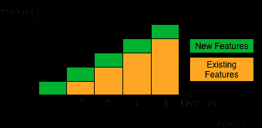
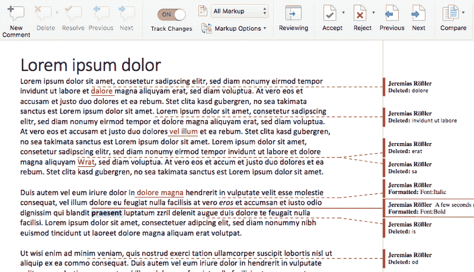

# 为什么没有办法绕过测试自动化(除了一个)

> 原文:[https://dev . to/roesslerj/why-no-way-around-on-test-automation-except-one](https://dev.to/roesslerj/why-there-is-no-way-around-test-automation-except-one)

现在，软件质量保证中的手工测试人员基本上是在打一场失败的仗。随着每一次冲刺和每一次迭代，特性的数量会随着软件的增长而增加，因为开发人员的工作(理想情况下)会增加。

[T2】](https://res.cloudinary.com/practicaldev/image/fetch/s--FkJnrzAH--/c_limit%2Cf_auto%2Cfl_progressive%2Cq_auto%2Cw_880/https://thepracticaldev.s3.amazonaws.com/i/iipmwwd23xo9e74kigdl.png)

但是人工测试人员的工作并没有增加。引入新功能时，必须对其进行测试。这部分工作与开发人员的数量成比例。但是软件会以有趣的方式崩溃。所以所有的特性都应该在发布前测试，包括现有的。如果一个团队有固定数量的开发人员和测试人员，随着时间的推移，测试人员肯定会落后。

只有三种可能的解决方案:

1.  随着软件的增长，添加更多的手动测试人员
2.  让用户找到你的 bug
3.  自动化测试

### 添加更多的手动测试人员

增加更多的人工测试人员意味着增加成本。随着组织和沟通开销的增加，团队中更多的人不会线性扩展。因此，即使有无限的预算(大多数公司没有)，这也只是一个有限的选择。即使是这样，也有很多原因，为什么做手工回归测试是一个坏主意。

### 让用户发现你的 bug

通过只测试一小部分特性或者不充分地测试它们来接受风险，只在某些情况下是可以接受的。谷歌和脸书没有实现生命关键软件，所以[向一小部分用户显示错误](https://www.darkcoding.net/software/facebooks-code-quality-problem/)对他们来说是一个可行的解决方案。这就是让他们实现连续交货的原因。但这种可能性往往是例外。如果您的软件是本地安装的，或者在任何方面都是关键的，这不是一个选项。

### 自动化测试

所以最终你会陷入这样的境地，你不得不自动化测试来处理这种不平等。这可能是为什么测试自动化在最近几年如此繁荣的原因，也是为什么测试自动化工程师现在如此受欢迎的原因。

测试人员之间有一个巨大且反复出现的讨论，测试自动化是否会最终取代人类测试人员。无论是谁认为测试自动化的原因和测试自动化的能力都是错误的。你必须自动化测试。但不是为了取代测试人员。您必须自动化测试，以便让测试人员能够完成他们的工作:对新特性进行正确的测试。

测试自动化被一些人鄙视。或者至少它[看起来是这样](http://www.satisfice.com/articles/cdt-automation.pdf)。他们一遍又一遍地重复，测试自动化不是自动化测试。并且测试自动化的价值非常有限。我明白这从何而来，也明白他们为什么如此强调这一点。我也明白

> 测试工具不是策略；测试自动化是一个开发过程；测试自动化是一项重大投资；测试自动化项目需要编程、测试和项目管理方面的技能。

虽然所有这些都是真的，但它主要指的是特定的工具和特定的体验。它没有解决我在这里强调的问题。我承认今天的大多数测试自动化工具远非完美，但那是另一个讨论的话题。

* * *

## 测试自动化做不到的事情

测试自动化非常类似于版本控制系统。它突出显示系统行为的变化，并要求用户验证或撤消这些变化。因此，它不能发现在测试创建时就存在的错误(历史错误)。因为这些类型的错误已经在测试中体现出来了。难以改变的现有测试甚至是有害的，因为它们*强制有缺陷的*行为。

测试自动化只能在旧的功能中发现新的错误，而且只能发现特定类型的错误。它只能找到表现为行为改变的错误。它不能推理或理解软件，所以测试自动化不会发现系统是否变得不一致。它没有找到*应该已经改变*以保持一致性的功能。因此，即使当使用测试自动化时，这也不是一个显而易见的事情。您仍然必须手工测试和检查旧的功能，以确保它与整个系统保持一致。

当然，彻底测试或测试所有内容是不可能的。我认为测试是一种风险成本计算。你愿意冒多大的风险，或者像别人说的“你看后视镜多久”？所以自动化测试的数量总是一个成本函数。

## 测试自动化能做什么

[T2】](https://res.cloudinary.com/practicaldev/image/fetch/s--X78MmR8I--/c_limit%2Cf_auto%2Cfl_progressive%2Cq_auto%2Cw_880/https://thepracticaldev.s3.amazonaws.com/i/e7m0iiev1fqjxsoczylm.png)

这就是测试自动化真正做的事情，尽管不是最理想的:它突出了变化。

测试自动化有助于检测曾经有效(并且被测试和认可)的功能何时停止工作。换句话说，测试自动化是一种帮助您发现被测系统行为中不需要的变化的方法。这些不想要的变化也被称为副作用或退化。从这个角度来看，回归测试和测试自动化是伪装的版本控制，也就是软件行为的版本控制。

测试自动化不是灵丹妙药，但是它会有所帮助。测试自动化是一种工具，一种支持，一种帮助测试人员完成大量工作的实用功能。

*TL；DR:随着软件的不断增长，测试自动化是没有办法的，除非你想让你的用户为你找到你的 bug。但是这意味着让测试人员能够做他们真正的工作:批判性地挑战系统，而不是变得盲目。*

这个帖子也在[媒体](https://medium.com/@roesslerj/why-there-is-no-way-around-test-automation-except-one-9c51aefd7806)上发表过。如果你喜欢它，请按 heart，twitter 或以其他方式传播消息。