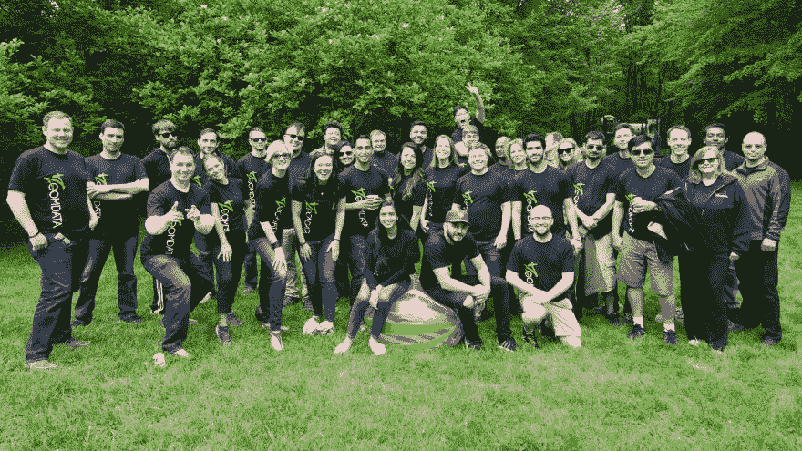
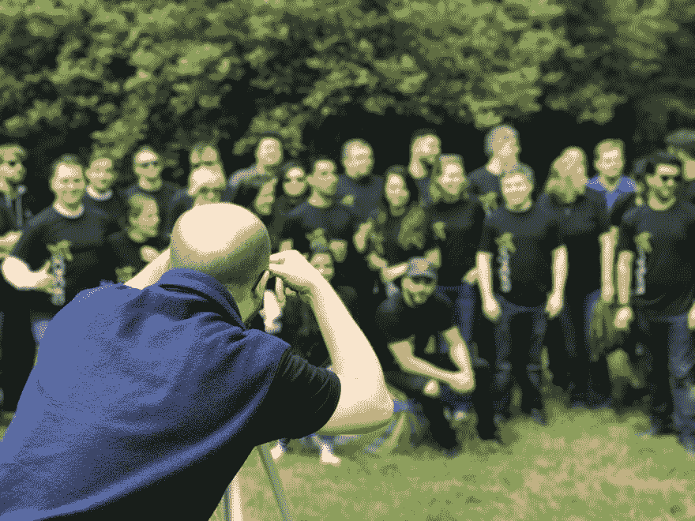

# 换工作和 X 计划

> 原文:[https://dev.to/ryanhaber/changing-jobs-and-x-plan-9ah](https://dev.to/ryanhaber/changing-jobs-and-x-plan-9ah)

[T2】](https://res.cloudinary.com/practicaldev/image/fetch/s--8RPix1LX--/c_limit%2Cf_auto%2Cfl_progressive%2Cq_auto%2Cw_880/http://api-ambassador.ghost.io/conteimg/2017/08/rhp_7183-reduced.jpg)

我要离开 Zoomdata。

不是他们。是我。是的，他们已经知道了。我不确定他们是否意识到我对此有多难过。

Blackboard 公司出乎意料地给了我一份非常难以接受的工作，你可能在学生时代就知道这家软件公司。他们想让我做很多我喜欢在 Zoomdata 做的事情，但加入了大量“下一步”的内容。了解我的人都知道我喜欢《下一步》。事实上，我一直都在关注它，并且睁大眼睛寻找它。我们通过保持敏捷和采取下一步行动在不稳定的世界中生存。

我想提三个(奥利维尔，你不骄傲吗？)分。

## 不是“过河拆桥”还不够。

公认的正确的智慧是，当我们离开一家公司或任何同伴时，要避免过河拆桥。当然，这种智慧部分是自私的，但也是一种优雅的忠告。简单、自私、自我辩护、情绪化和幼稚的事情就是告诉你所有的“敌人”你对他们的看法。困难的事情，慷慨的，细心的，理性的，成熟的事情是试着和那些天生对你没有吸引力的人交朋友或合作。在几个月的“尽力而为”之后，做最坏的打算会瓦解和抵消你所有的努力。这也表明你的努力并不是来自于取悦和高兴的真实愿望，发现别人最好的一面，减少自己最坏的一面。这表明你的努力远比这更愤世嫉俗。

假设你不是愤世嫉俗的，你真的想和那些人相处，你的退场是真正发光的时候。

在你的新雇主允许的范围内，尽可能多地提前通知。当然，你也会受到当前环境中看似谨慎的事情的限制。即使你不能提前几个月通知，因为你担心你现在的雇主会把你踢出局，你至少可以提前很久开始计划。

计划好你的退路。制作一个电子表格，列出未完成的工作和正在进行的职责。悄悄地、非正式地工作，或者，如果可能的话，公开地、正式地工作，把那些零散的事情处理好，让那些将要承担这些责任的人做好准备。

我把我的计划称为 X 计划。我从 X 开始，因为我没有名字。此外，如果电子表格应该是打开的，我不希望同事们在我宣布任何事情之前看到所谓的 *Ryan 计划优雅地离开 zoom data*。现在， *X* 代表从“转移”到“退出”的任何东西。

x 计划包括知识转移、责任移交和其他承诺履行的栏目。它包括显示谁将获得知识、谁将承担责任以及我向谁做出承诺的栏。它还包括每一步的最后期限和进度指标。换句话说，我把自己的退出当成了一个项目，就像其他项目一样。这种做法似乎固化了我的团队对我的尊重。当然，我写的是这个——不是他们。:)这种做法比让他们喜欢我却生我的气或者给我找借口要好得多。因为我已经能够给出很多通知，我的队友已经能够帮助我建立 X 计划，以便它能够尽可能地帮助他们。当你能帮助它发生时，这种情况是双赢的。

## 为下一份工作做前期准备。

你知道推动你的职业发展经常需要超越自我吗？那是“在下班时间有空或工作”的代码。这也是生活的事实。如果你想让你的职业发展速度快于预设速度，你必须比预设速度更聪明、更努力、更努力地工作。这在你开始之前就开始了。

有些工作是那种你在开始工作之前无法做太多准备的工作。不过，其他工作是你可以做的。我怀疑你可以在开始之前为大多数工作做好准备。看公司网站。与现有客户和员工交谈。与你未来的经理保持联系。

为了给你的新工作做准备，你必须开始逐步退出你的旧工作。你在周末和晚上为你的旧工作做的那些零碎的工作应该被为你的新工作准备的零碎的东西所取代。

你越能脚踏实地地跑，就越好。我们将看到我这次做得有多好，但是我为过渡到 Blackboard 做准备的基本策略包括以下措施:

*   注册 Blackboard 的在线社区并潜伏起来。没有写作。只是阅读。黑板上的人们，如果你们看到这封信，我正在做作业。:D
*   和一个公司使用 Blackboard 的朋友坐下来，让他给我演示一下它是如何工作的。
*   阅读他们的在线文档。
*   通过 LinkedIn 与未来的同事联系。

当我到达黑板时，我不会告诉他们，“嘿，我都知道。”太荒谬了。我不可能。这不是目标。我的目标是以比平时更快的速度落地。

## 我会想念我的动物伙伴们。

我上班是为了赚钱，不是为了交朋友。我有朋友。也就是说，交朋友是一种特别的快乐——即使是在工作中。在工作中，我们一起在战壕里度过了很多时间，如果我们每个人都好好表现，希望没有什么理由后悔。这就是我在 Zoomdata 的命运。我非常感激能够认识这样一群勤奋、聪明、有团队精神的人。我很高兴能和他们一起工作。“不要过河拆桥”对我来说很容易，因为我喜欢桥另一边的人。

[T2】](https://res.cloudinary.com/practicaldev/image/fetch/s--XWPpH7GR--/c_limit%2Cf_auto%2Cfl_progressive%2Cq_auto%2Cw_880/http://api-ambassador.ghost.io/conteimg/2017/08/Image-uploaded-from-iOS-copy-2.jpg)

Zoomdata 是一个非常酷的地方，有着非常特别的精神。希望我的未来有另一个像 Zoomdata 一样好的工作环境是不公平的。然而，人们可以希望。我不在公共场合表露情感，我讨厌甜言蜜语，但我会想念我的 Zoomder 家人，并尽我所能保留许多快乐日子的精神快照。

下一站，黑板。