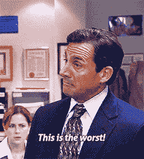
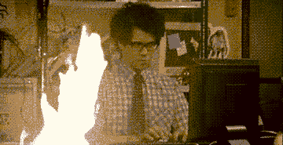
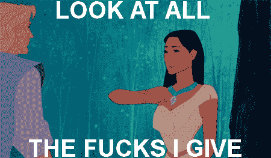
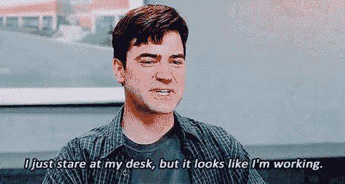
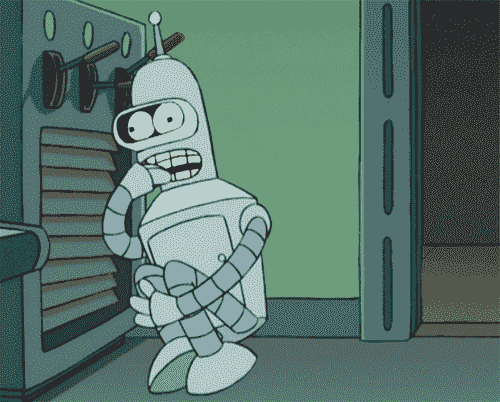

# 从 F 到 F，同时在 5 分钟内着火...

> 原文：<https://dev.to/pabloportugues/from-f-to-f-while-on-fire-in-5>

*最初发表在我的博客上:[从 F 到 F 虽然在 5...](https://bytemybits.gitlab.io/post/2017-07-04-from-f-to-f-on-fire-in-5/)T3】*

如果你在一家普通公司工作过，你可能会遇到一些很难相处的人。也许他们抱怨很多，或者只是很烦人，但是你觉得他们并没有做太多。你最终厌倦了他们的废话。多痛苦啊！

在迅速解雇那些有这些行为的人之前，我认为我们应该先试着理解是什么导致他们这样做。如果你想一想，我们默认是好奇的，我们渴望学习和理解为什么有些东西会这样或那样，那么我们如何到达我们不在乎的地步呢？

从我的经验来看，我会说这是几个阶段的结果，如*沮丧*、*缺乏兴趣*、*被解雇*、*安顿*和*恐惧*。我都经历过，也在其他人身上看到过。也许你是这么想的。这是我对它们自然进程的理解:

### 挫折

[T2】](https://res.cloudinary.com/practicaldev/image/fetch/s--nDHfieU6--/c_limit%2Cf_auto%2Cfl_progressive%2Cq_66%2Cw_880/https://bytemybits.gitlab.io/post-content/2017-07-04/this-is-the-worst.gif)

作为一名有着新鲜土地和两袋自信的新员工，你很快注意到许多可以改进的东西，所以你采取主动并开始努力。你很快发现你认为坏了的东西永远不会改变，因为有些人认为它目前工作得很好，不理解你的观点(他们已经习惯了，为什么要改变呢？)，或者是因为有大量的官僚主义和成本，这是不值得的。当你发现它应该是坏了的时候，你就开始做下颌下降。

不幸的是，我实际上看到了几个发生这种情况的场景。某些东西显然被打破了，为某些人提供了杠杆(顺便说一下，这是在我的肥皂剧经历中。我有奇怪的记忆...).很少有人最终会明白，为什么坏掉的东西不会改变，只是因为不改变是有道理的！

### 缺乏兴趣

[T2】](https://res.cloudinary.com/practicaldev/image/fetch/s--7QrLcJSf--/c_limit%2Cf_auto%2Cfl_progressive%2Cq_66%2Cw_880/https://bytemybits.gitlab.io/post-content/2017-07-04/not-my-problem.gif)

前一个的自然延续。你有改变的意愿，但却无能为力，你似乎找不到关心的理由，因为你为什么要关心呢？

### 免职

[T2】](https://res.cloudinary.com/practicaldev/image/fetch/s--L8oFjrWL--/c_limit%2Cf_auto%2Cfl_progressive%2Cq_66%2Cw_880/https://bytemybits.gitlab.io/post-content/2017-07-04/fucks-given.gif)

所有的注意力都集中在你自己和你自己的需求上，你开始忽视别人告诉你的任何重要的东西。不管他们说这是为了公共利益，甚至是为了你自己的利益，你只是做你必须做的确切数量的工作，而忽略你能做的其他事情。

恭喜你，你升级了，你现在在*不在乎*的舞台上！

### 沉淀

[T2】](https://res.cloudinary.com/practicaldev/image/fetch/s--CLRNLpop--/c_limit%2Cf_auto%2Cfl_progressive%2Cq_66%2Cw_880/https://bytemybits.gitlab.io/post-content/2017-07-04/looks-like-im-working.gif)

你得出结论，你真的不喜欢你工作的地方或你的工作方式，但工资并不差，还有医疗保险，周五那些美味的饼干太好吃了！

你得到了一个甜蜜点，即不要工作得太辛苦，但也要足够让你的职位没有风险。每天都大同小异，有规律的像时钟一样的例行公事接踵而至。

### 恐惧

[T2】](https://res.cloudinary.com/practicaldev/image/fetch/s--ipDzJQv---/c_limit%2Cf_auto%2Cfl_progressive%2Cq_66%2Cw_880/https://bytemybits.gitlab.io/post-content/2017-07-04/fear.gif)

我从两种形式上看到了这一点:第一种是因为福利和职位足以维持一个人的任何生活方式(我不会把生孩子称为一种生活方式，但它适用于我正在阐述的观点)。因此这意味着换工作必须非常仔细地权衡。(还有饼干，不能忘了！)

第二种通常表现为持续的*老板是废物*、*电脑是废物*、*工作是废物*、*全是废物*非常积极和建设性的态度。在我工作的第一周，有个家伙不停地烦我为什么要接受那份工作。他坚信我会后悔那个决定，而且我会讨厌在那里工作。我继续问他:“那你为什么还在这里？”对此他回答说:“这是一个伟大的问题，我不知道答案”。那个人后来被解雇了(在第*步*停留时间太长，是个混球)。

#### “我们走吧”

这里的要点是，人们不想改变的原因有很多，我只是通过多年与动机迥异的不同人打交道才明白这一点。有些你明白，有些你不明白，但不管怎样，和一个没有上进心的人一起工作是很糟糕的。)我上面描述的步骤。这对他们来说并不容易，我的意思是，为什么你愿意痛苦呢？(除非你是《悲惨世界》中的拉塞尔·克罗。那只是痛苦！)

我们大多数人都经历过，我们知道那有多糟糕。不关心最终会伤害到每个人，从长远来看更糟糕。与积极和兴奋的人一起工作比那些感觉他们需要在那里的人好一千倍。

所以，我努力去做的，也让其他人去做的，就是去帮助那些沮丧和需要帮助的人，即使那个人就是我们自己！这可能意味着成为试图改变某些事情的团队的一员，帮助人们找到一份不同的工作，或者只是通过交谈并找出他们最初失去动力的原因以及我们如何帮助他们找回动力。

除了工作之外，探索不同的事物也是很大的动力。有时候你只是觉得精疲力竭，这并不是因为工作本身不好，也不是因为和你一起工作的人令人讨厌，而是因为你只是需要一些完全不同的东西来刺激你的大脑，让你不要总是想着工作！

去徒步旅行吧(是的，真正的徒步旅行)！绑紧自行车，骑得比你想象的更久！学习一种乐器，加入一个乐队，发现一个全新的世界(并吮吸它，但同时有很多乐趣)！见鬼，就连园艺也很棒！我的一个朋友对物联网和辛辣食物产生了兴趣，现在正在一个自动化系统上种植后院鬼椒，几乎不需要任何照顾(实际上他是唯一一个可以吃到它们的人。和墨西哥胡椒混在奶瓶里有关)。

回头想想最初是什么激励了你，这是你迷失时的一个很好的参考。即使你最终认为那里不再适合你，那也绝对没问题！我发现在不同的地方工作，和不同的人一起工作，面对不同的问题，是一种非常刺激和令人敬畏的学习经历。生活是由经历组成的，不要把自己束缚在让你不开心的事情上，而是努力不断地走向相反的方向。是的，这不会在一夜之间发生，但这取决于你去实现它。

* * *

记住，我们是人类，这很复杂。

1.  沮丧- [办公室的我们](http://www.imdb.com/title/tt0386676/)
2.  缺乏兴趣-[IT 人群](http://www.imdb.com/title/tt0487831/)
3.  解散- [风中奇缘](http://www.imdb.com/title/tt0114148/)
4.  办公空间
5.  恐惧- [未来](http://www.imdb.com/title/tt0149460/)