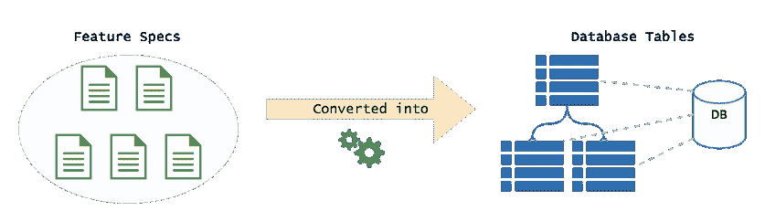
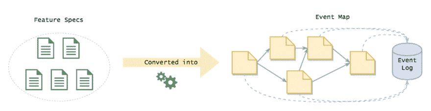
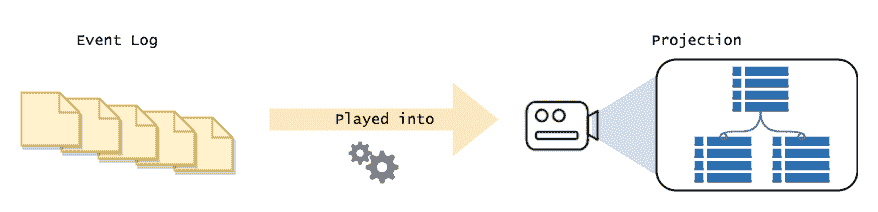

# 活动采购:它是什么，为什么它很棒

> 原文:[https://dev . to/barryo sull/event-sourcing-what-it-is and why-its-awesome](https://dev.to/barryosull/event-sourcing-what-it-is-and-why-its-awesome)

在上次的 PHPDublin meetup 上，有人问我“你是做什么的？”和往常一样，答案归结为“我设计和构建基于事件的应用程序”。这就引出了下面的问题。“什么是活动采购？”。

这就是这篇文章的出处，它是我解释活动采购及其带来的所有好处的最佳机会。

# 现状

在我们进入事件源的本质之前，让我们来谈谈 web 开发的现状。

从本质上讲，当前的 web 开发是数据库驱动的。当我们设计 web 应用程序时，我们会立即将规范转化为存储机制中的概念。如果是 MySQL，我们设计表格，如果是 MongoDB，我们设计文档。这迫使我们从当前状态的角度来考虑每一件事。"我如何存储这个东西，以便我可以检索(并可能改变)它？"。

[T2】](https://res.cloudinary.com/practicaldev/image/fetch/s--PodGpeUR--/c_limit%2Cf_auto%2Cfl_progressive%2Cq_auto%2Cw_880/https://thepracticaldev.s3.amazonaws.com/i/bv1l8eatoljyin82dykd.png)

这种方法有三个基本问题。

## 1。这不是我们想的那样

作为一个物种，我们不以状态来思考或交流。当我和你喝咖啡时，问你“发生了什么事？”你不要告诉我世界的现状，然后期望我去弄清楚发生了什么变化，那将是疯狂的。

“嗯，我有房子、汽车、冰箱、三个社交媒体账户、一只猫、右脚疼痛、对自己不擅长交谈的严重自我怀疑，还有另一只猫...等等"

明白我的意思吗？太疯狂了。事实上，你会告诉我自从我们上次谈话以来发生的新的事情，从这些事情中我可以知道你的世界现在是什么样子。简而言之，你告诉我一个故事，最简单的故事就是一系列事件。

## 2。单一数据模型

在上面的示例中，我们对读取和写入使用了相同的模型。通常，我们从写的角度设计我们的表，然后弄清楚如何在这些结构上构建我们的查询。这适用于小程序，但在大程序中就成问题了。你看，几乎不可能建立一个通用模型来优化读写。随着系统的增长，查询将变得越来越复杂，最终达到每个查询包含 10 个连接并且长达 100 行的程度。这很快就变得不可维护、脆弱且改变成本高昂。

## 3。我们会丢失业务关键信息

这是一个大的。对于一个标准表驱动的系统，你只存储世界的当前状态，你不知道你的系统最初是如何进入那个状态的。如果我问你“用户更改了多少次电子邮件地址”，你能回答吗？那么“有多少人在购物车中添加了一件商品，然后又删除了它，一个月后又买了这件商品”呢？由于您存储数据的方式，您正在丢失大量有用的业务信息！

# 事件采购

事件采购(ES)与此相反。你关注的不是当前的状态，而是随着时间的推移已经发生的变化。这是将你的系统建模为一系列事件的实践。

举个例子吧。假设我们有一个“购物车”的概念。我们可以创建一个购物车，向其中添加商品，删除商品，然后将其签出。

购物车的生命周期可以建模为以下事件序列:

| 事件 |
| --- |
| 1.购物车已创建 |
| 2.商品已添加至购物车 |
| 3.商品已添加至购物车 |
| 4.商品已从购物车中移除 |
| 5.购物车已结帐 |

这就是我们看到的，这是一个实际购物车的完整生命周期，被建模为一系列事件。这就是活动采购。简单哈！

[T2】](https://res.cloudinary.com/practicaldev/image/fetch/s--FL_ZjOYw--/c_limit%2Cf_auto%2Cfl_progressive%2Cq_auto%2Cw_880/https://thepracticaldev.s3.amazonaws.com/i/xz6bej22iw97t46v2g6w.png)

几乎任何过程都可以被建模为一系列事件。事实上，每个过程*都被*建模为一系列事件。与领域专家交谈，他们不会谈论“表”和“连接”(除非你已经向他们灌输了技术概念)，他们会将过程描述为可能发生的一系列事件以及应用于它们的规则。

## 你是如何执行业务规则的？

大多数商业运作都有约束，这是一个不能打破的硬性规定。在上面的例子中，一个硬性的规则是“一个项目必须在购物车中才能被移除”。如果一个商品从未被添加到购物车中，你就不能删除它，这一系列事件永远不会发生。因此，要实施这个约束，您需要回答这个问题，“这个项目存在吗？”，没有状态你怎么做到？

事实证明这很简单，您只需要检查该商品是否发生了“商品添加到购物车”事件，然后您就知道该商品在购物车中，并且可以将其删除。实施业务规则。

这就是你如何回答每个关于事件源系统中状态的问题，你重放事件的子集来得到你需要的答案。通常称为投射事件，最终结果是“投射”。

### 这不是又贵又费时吗？

一点也不。要实施约束，通常只需要最小的事件子集。获取一个概念的有用历史，比如一个`Cart`，通常是一个数据库调用。您加载事件并在内存中重放它们，“投影”它们，以构建您的数据集。这非常快，因为您是在本地处理器上完成的，而不是进行一系列 SQL 调用(与本地操作相比，网络调用慢得惊人，至少慢了两个数量级！).

## 向用户展示数据怎么样？

如果每个状态都来自事件，那么如何获取需要呈现给用户的数据呢？您是否每次都获取所有事件并构建数据集？

答案是不，你没有，那将是荒谬的。

您可以在后台构建它，将中间结果存储在数据库中，而不是即时构建。通过这种方式，用户可以查询数据，并以最小的延迟获得他们需要的精确形状的数据。实际上，您缓存了结果以备后用。

[T2】](https://res.cloudinary.com/practicaldev/image/fetch/s--O4HIIlNN--/c_limit%2Cf_auto%2Cfl_progressive%2Cq_auto%2Cw_880/https://thepracticaldev.s3.amazonaws.com/i/lhhlvel6ifqaj0y4otb7.png)

现在，事情变得非常有趣了。有了 ES，您不再受当前表结构的限制。需要以新的形式呈现数据？只需构建一个新的数据结构来回答这个问题。这给了你完全的自由，以任何你想要的方式来构建和实现你的读取模型，当不再需要旧的模型时，丢弃它们。

# 好处

我们已经看到了一些已经准备好的好处，但是让我们更深入一点，因为相信我，这种开发方式提供了许多我不能没有的好处。

## 1。短暂的数据结构。

由于所有状态都是从事件中派生出来的，所以您不再受应用程序当前“状态”的约束。如果您需要以新的方式查看数据，只需创建数据的新投影，将其投影成您需要的形状。与杂乱的迁移脚本说再见吧，您可以简单地创建一个新的投影，并丢弃旧的投影。老实说，我再也离不开这个了，这本身就让我觉得值得。

## 2。更容易与领域专家交流

正如我之前说过的，领域专家不考虑状态，他们将业务流程表达为一系列事件。通过构建事件源系统，我们完全按照他们的描述对系统建模，而不是将其转化为技术概念并丢失信息。这使得交流更加顺畅，我们现在用他们的语言交谈，这使得编写软件时变得完全不同。

## 3。表达模型

事件源迫使你将事件建模为第一类对象，而不是通过隐含的状态变化(即改变表格中的值)。这意味着您的模型将非常类似于您正在建模的实际流程。这让表格更加清晰，让您不会迷失在存储技术的细节中。它使隐式变得显式。

## 4。报告变得没有痛苦

在基于事件的系统中，生成复杂的业务报告变得轻而易举。你有所有已经发生的事件的完整历史，按时间顺序排列，这意味着你可以问任何你喜欢的关于历史数据的问题。

想想这有多强大！以前面的例子为例，您想知道有多少用户从购物车中移除了一件商品，然后在一周后购买了它。在标准的 web 应用程序中，这需要几周的开发时间，一旦发布，您必须等待数据填充，然后才能生成报告。对于 ES 系统，它从一开始就是内置的，因此您可以立即生成该报告。您还可以为之前的任何时间点生成报告。换句话说，你有一台时间机器。

## 5。组合服务变得微不足道

在标准的 web 开发中，将两个系统连接在一起通常是相当棘手的，并且经常会导致紧密耦合。ES 通过让服务通过事件进行通信来解决这个问题。当事情发生时，需要在另一个服务中触发一个流程吗？编写一个事件侦听器，每当该事件被触发时运行。这允许您添加新的集成/功能，而不必修改现有的域代码。

例如，假设您想在某人注册时发送一封欢迎电子邮件。不用修改核心注册代码，只需为“用户已注册”事件创建一个事件监听器，然后通过一些外部服务触发一封电子邮件。简单。

## 6。标准数据库上的闪电般速度

您不需要使用复杂的数据库来存储您的事件，一个标准的 MySQL 表就可以了。数据库针对仅追加操作进行了优化，这意味着存储数据很快，而修改数据很慢。这就是为什么 ES 在当前技术下工作得如此好，事件只是附加的。

## 7。易于更改数据库实现

由于事件源数据结构的短暂性，您现在可以完全自由地使用任何您喜欢的数据库技术来存储状态。这意味着你可以为这项工作选择最好的工具。如果你找到一个更好的工具，你可以在任何时候切换到它，这是零承诺。这给了你难以置信的自由。举个例子，我们目前正在将一些更复杂的项目从 MySQL 转移到 OrientDB，到目前为止，这是一件轻而易举的事情。

# 议题

和任何事情一样，ES 也不是免费的午餐。这里有一些你会遇到的惊喜。

## 1。最终一致性

一个专家系统最终自然是一致的。这意味着无论何时发生事件，其他系统都不会立即听到，在它们接收和处理事件之前会有一个短暂的延迟(比如说 100 毫秒),从而获得一致性。这意味着您不能保证您的预测中的数据是最新的。这听起来像是一件大事，但实际上不是。基于 ReactJS 构建的现代 web 开发应用程序将在用户执行操作时从动作中构建状态，因此查询端滞后几毫秒不成问题。

TBH，这实际上是塞翁失马，焉知非福。最终，一致的系统是容错的，可以处理服务中断。如果你正在使用微服务或无服务器架构构建一个分布式应用，它最终需要保持稳定的一致性。[参见 CAP 定理](https://en.wikipedia.org/wiki/CAP_theorem)。

## 2。事件升级

事件会随着时间的推移而改变，如果你没有提前计划，这可能会有点棘手。当一个事件改变形状时，你必须编写一个升级程序，将旧事件转换成新事件。当您从商店中读取事件时，这是动态完成的。将它们视为您的活动的迁移。没有听起来那么难，只要有一个升级事件的[策略](https://abdullin.com/post/event-sourcing-versioning/)就可以了。

## 3。开发者需要去编程

web 开发的现状是状态驱动的开发，这意味着开发人员将立即跳到表格中思考，而不是事件。我发现给开发者“去编程”需要时间，他们需要抛弃他们已经养成的所有坏习惯。这通常表现为纯粹的 CRUD 事件，并且不反映领域语言。解决这个问题的最好方法是将新开发人员与有经验的 ESers 配对。

# 结论

我们找到了。在这个阶段，很明显我喜欢事件采购。它解决了我们团队在构建大型分布式商业软件时面临的所有大问题。它让我们可以用他们的语言与企业交流，并且让我们可以自由地轻松改变和适应系统。再加上内置的商业分析，你就有了一个成功的组合。有一个学习曲线，但一旦你进入事件采购，你将永远不想回头，我知道我不想。

如果你有兴趣了解更多关于活动采购的信息，一定要订阅我的博客，在 twitter 上关注我。如果您想进一步讨论活动采购，请通过 [barry@tercet.io](mailto:barry@tercet.io) 联系我。