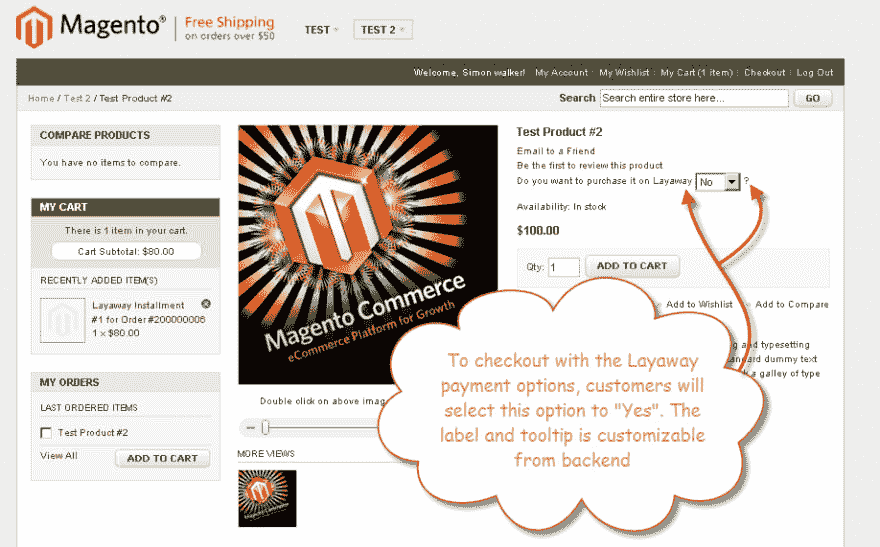
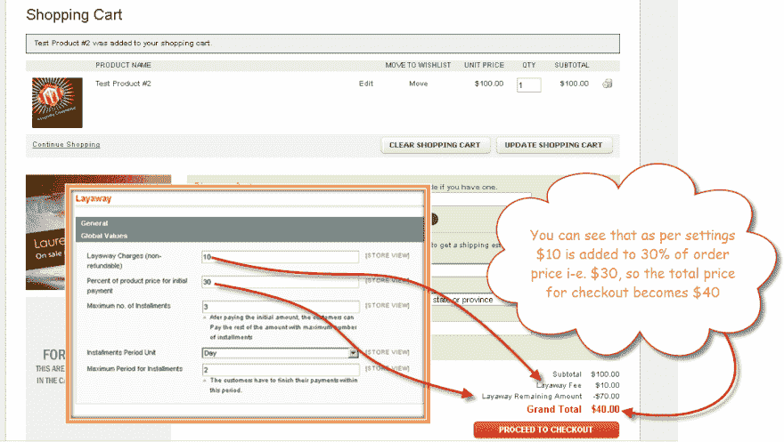

# FME 对 Magento 延期的部分付款

> 原文:[https://dev . to/simonwalkerfme/partial-payment-magento-extension-by-FME](https://dev.to/simonwalkerfme/partial-payment-magento-extension-by-fme)

FME 的部分付款 Magento extension 使您能够在您的电子商店中创建分期付款计划，以便以轻松的分期付款方式销售您的产品。配置首期付款以利用分期付款设施，并设置分期付款的次数和间隔。客户可以通过支付定金购买产品，并根据预先配置的设置以分期付款的方式支付剩余款项。

特点:

*   启用/禁用所有产品的分期付款
*   配置分期付款和分期付款计划
*   定义分期付款的总数和间隔
*   为每个产品配置全球或个人分期付款
*   将部分付款选项限于一种产品
*   添加固定或百分比的预付费用

更多详情-[https://www . fmeextensions . com/magento-lay away-partial-payments . html](https://www.fmeextensions.com/magento-layaway-partial-payments.html)

演示图像:

[T6】](https://res.cloudinary.com/practicaldev/image/fetch/s--vWruAEct--/c_limit%2Cf_auto%2Cfl_progressive%2Cq_auto%2Cw_880/https://www.fmeextensions.com/media/catalog/product/cache/1/thumbnail/9df78eab33525d08d6e5fb8d27136e95/f/r/front_2.png)