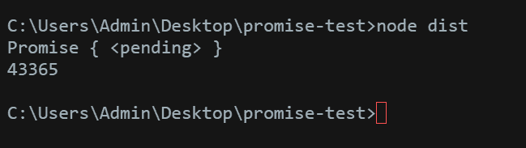

# 用 babel-plugin-promise 把任何回调变成承诺

> 原文:[https://dev . to/vaheqelyan/turn-any-callback-into-promise-with-babel-plugin-promise](https://dev.to/vaheqelyan/turn-any-callback-into-promise-with-babel-plugin-promise)

简而言之，我将告诉你如何将现有的回调转换为承诺。

我们需要使用巴别塔。

例如，让我们从 npm 获取一个[请求](https://www.npmjs.com/package/request)，并将其转换为一个承诺

```
yarn add babel-plugin-promise --dev 
```

<svg width="20px" height="20px" viewBox="0 0 24 24" class="highlight-action crayons-icon highlight-action--fullscreen-on"><title>Enter fullscreen mode</title></svg> <svg width="20px" height="20px" viewBox="0 0 24 24" class="highlight-action crayons-icon highlight-action--fullscreen-off"><title>Exit fullscreen mode</title></svg>

```
require("babel-polyfill");

import request from "request";

//@promisify<err,res> req
__ = request(arg1);

console.log(req("http://www.google.com"));

req("http://www.google.com")
    .then(res => console.log(res.body.length))
    .catch(err => console.log(err)); 
```

<svg width="20px" height="20px" viewBox="0 0 24 24" class="highlight-action crayons-icon highlight-action--fullscreen-on"><title>Enter fullscreen mode</title></svg> <svg width="20px" height="20px" viewBox="0 0 24 24" class="highlight-action crayons-icon highlight-action--fullscreen-off"><title>Exit fullscreen mode</title></svg>

让我们检查一下

[T2】](https://res.cloudinary.com/practicaldev/image/fetch/s--OHm0TR7e--/c_limit%2Cf_auto%2Cfl_progressive%2Cq_auto%2Cw_880/https://res.cloudinary.com/dmtrk3yns/image/upload/q_auto:best/v1504010920/ice_screenshot_20170829-164745_z1ixn5.png)

相当快

[巴别塔插件承诺](https://git.io/v5nOl)