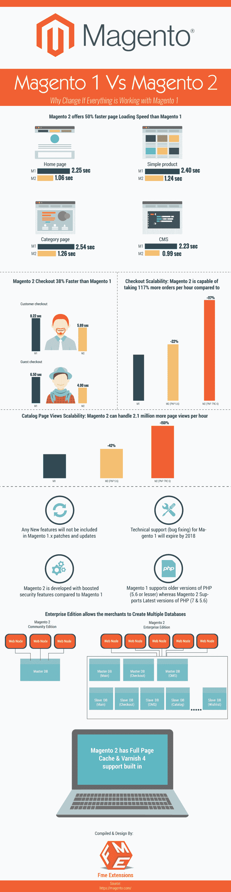

# Magento 1 与 Magento 2:性能、速度和功能比较

> 原文:[https://dev . to/simonwalkerfme/magento-1-vs-magento-2-性能-速度-功能-比较](https://dev.to/simonwalkerfme/magento-1-vs-magento-2-performance-speed-and-features-comparison)

众所周知，从 Magento 2 的开发阶段开始，在线电子商务社区和开发人员就对其着迷——试图猜测新的设计和功能。尽管距离 2015 年末 Magento 2 的发布已经过去了很长时间，但我们对 Magento 2 的迷恋仍在继续，电子商务平台仍是一个热门话题。然而，许多商家仍在质疑从 Magento 1 迁移到 Magento 2 是否值得。
要了解 Magento 2 比 Magento 1 的[优势，请进入下面列出的信息图。](https://www.fmeextensions.com/blog/magento-1-vs-magento-2-why-update-infographic/)

[T2】](https://res.cloudinary.com/practicaldev/image/fetch/s--2hMvHvW8--/c_limit%2Cf_auto%2Cfl_progressive%2Cq_auto%2Cw_880/https://www.fmeextensions.com/fme_blog/wp-content/uploads/2016/11/Magento-1-Vs-Magento-2.jpg)

当你权衡利弊时，升级背后的主要原因就出来了，Magento 1 的开发已经走进了死胡同。尽管 Magento 团队将继续支持旧版本直到 2018 年，但升级和补丁将与错误修复和其他重要的安全改进有关。Magento 1 不会增加新的功能，因为 Magento 的工作人员目前完全沉浸在 Magento 2 的开发和增长中。新平台还为 Magento 1 的速度问题提供了一个解决方案——在其社区版和企业版中都包含了整页缓存。Magento 2 被吹捧为页面加载速度快 50%(在目录和结账页面)，这意味着访客可以在不到 2 分钟的时间内访问一页内容。在 Magento 1 中，结帐过去是一个 4-5 步的过程，这是购物车废弃率较高的主要原因。Magento 2 解决了这个问题，它简化了结账流程，并加入了流行的支付网关，使结账速度提高了 38%。此外，Magento 2 提供了更大的可扩展性，因为更流畅的结账、改进的编码以及前端开发使该平台能够每小时处理约 250，000 个订单(比 Magento 1 多 117%)和超过 200 万个目录页面浏览量。由于使用了现代技术堆栈，Magento 2 也被认为更兼容其他流行的平台。