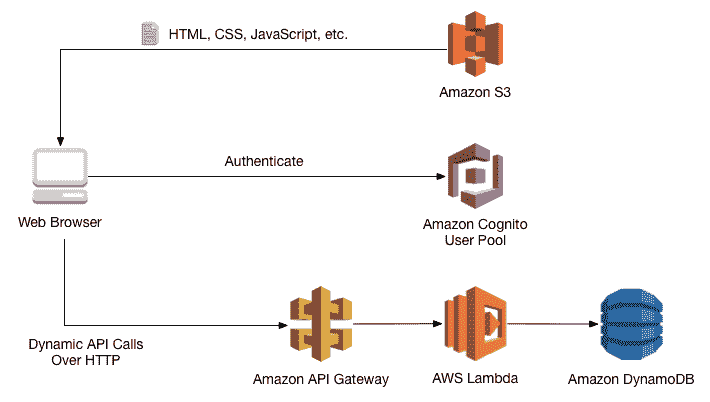
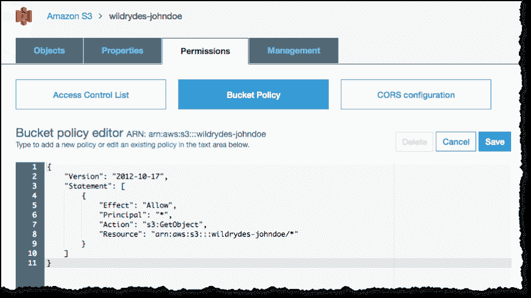
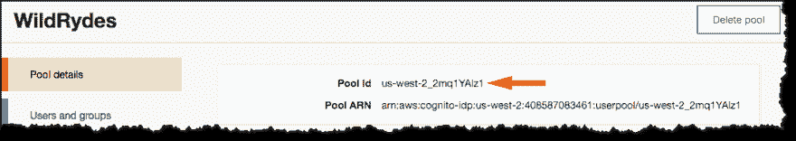
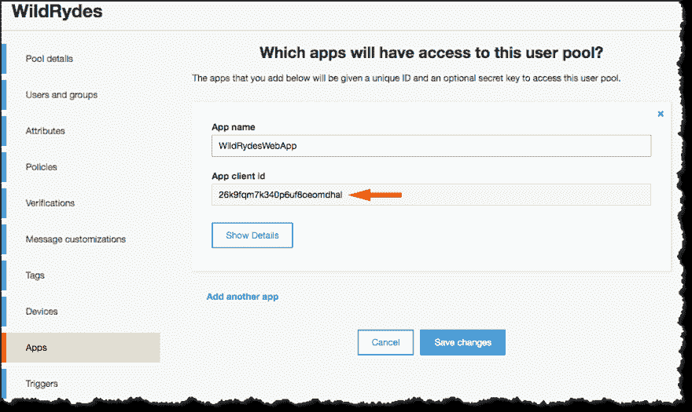
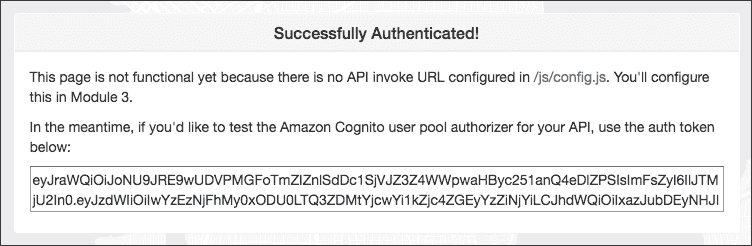
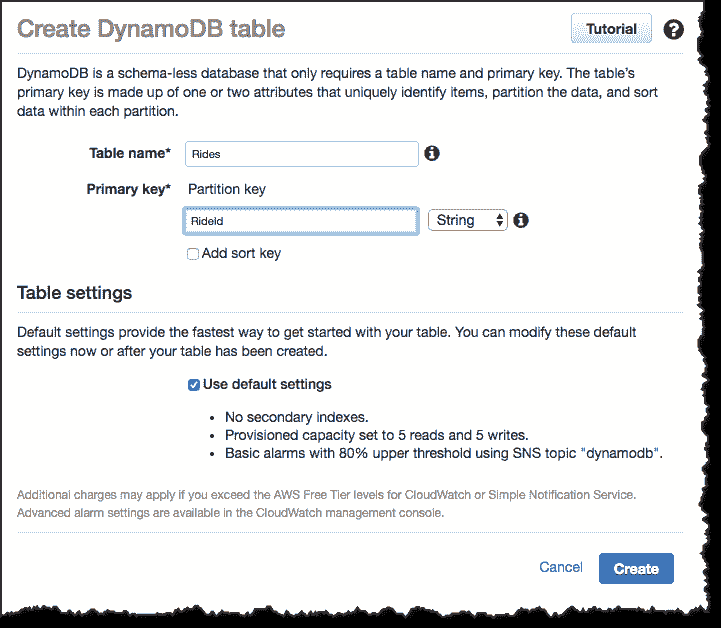
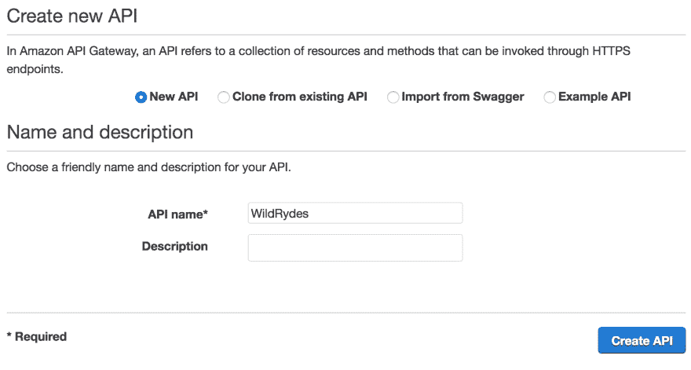
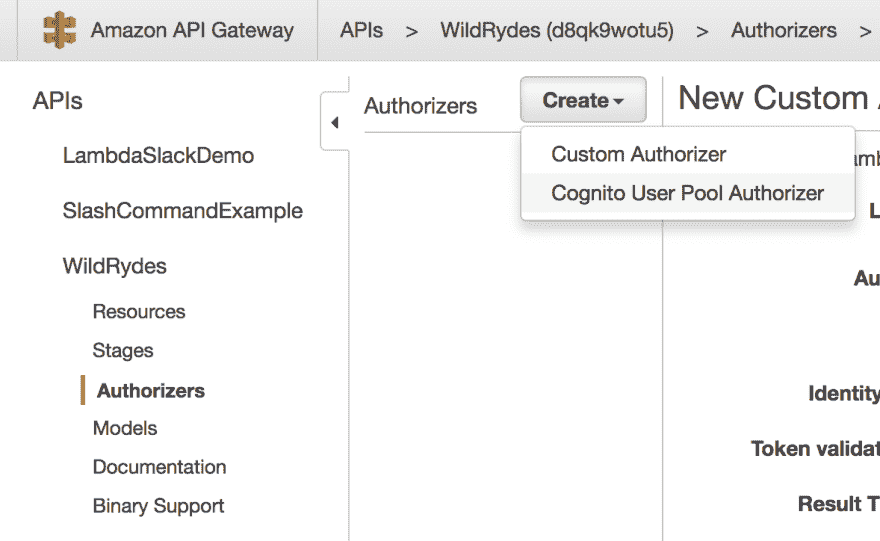
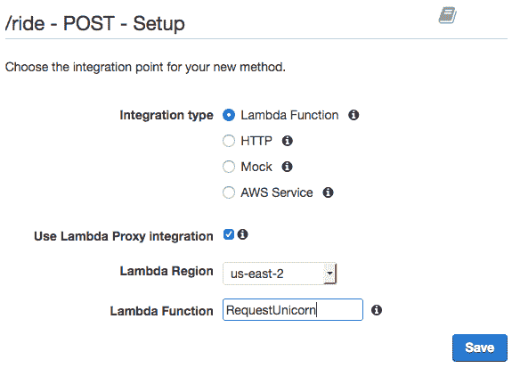

# 使用亚马逊 S3、Lambda、DynamoDB 和 API Gateway 构建 Web 应用程序的教程

> 原文:[https://dev . to/Connor 11528/tutorial-for-build-a-web-application-with-Amazon-S3-lambda-dynamo db-and-API-gateway](https://dev.to/connor11528/tutorial-for-building-a-web-application-with-amazon-s3-lambda-dynamodb-and-api-gateway)

[T2】](https://res.cloudinary.com/practicaldev/image/fetch/s--aWPgFrgB--/c_limit%2Cf_auto%2Cfl_progressive%2Cq_auto%2Cw_880/https://github.com/awslabs/aws-serverless-workshops/raw/master/WebApplicatiimg/wildrydes-complete-architecture.png)

我最近参加了旧金山市中心 AWS Loft 的无服务器日活动。在研讨会部分，我们构建了一个请求独角兽来接我们的无服务器 web 应用程序。AWS 团队在 Github 上提供了优秀的文档[，而](https://github.com/awslabs/aws-serverless-workshops/tree/master/WebApplication) [Rahul Sareen](https://www.linkedin.com/in/rahul-sareen-1b2bb86/) 在一次概述无服务器应用架构的技术活动上做了一次我所听过的最好的演讲。(此处提供该演示的幻灯片[)。](https://www.slideshare.net/AmazonWebServices/getting-started-with-aws-lambda-and-serverless-computing-79032206)

在研讨会部分，我们创建并部署了一个网站，该网站利用 S3 作为主机，DynamoDB 作为数据库，API Gateway 作为 RESTful 端点，Lambda 函数作为后端服务器处理。

本教程涵盖了我在 2017 年无服务器日第一次构建应用程序和使用其中一些服务的笔记。github 上的[提供了更多关于 following along 的详细说明，Wild Rydes 演示应用程序在 http://www.wildrydes.com/](https://github.com/awslabs/aws-serverless-workshops/tree/master/WebApplication)[上线](http://www.wildrydes.com/)。

## 第 0 步:关于 WildRydes

我们将在本教程中创建的应用程序称为 Wild Rydes。该应用程序是一个虚构的服务，用于命令独角兽来接我们。用户可以登录到应用程序，并从他们当前的位置请求独角兽。然后，应用程序会派遣一只独角兽去接用户。

[T2】](https://res.cloudinary.com/practicaldev/image/fetch/s--_tIa2-ew--/c_limit%2Cf_auto%2Cfl_progressive%2Cq_auto%2Cw_880/http://www.wildrydes.cimg/wr-home-top.jpg)

事不宜迟，我们开始吧。

## 第一步:身份访问管理

与大多数 AWS 教程一样，第一步是创建一个 IAM 用户来创建和提供我们的 AWS 资源。我设置了一个拥有 AdminAccess 的用户。最佳实践是使用这样的用户登录，而不是使用您的 root 帐户凭证登录和管理您的 AWS 资源。如果你不知道我在说什么，我建议你查看一下通过 AWS 认证开发者助理考试的云专家课程。第 3 章提供了关于为 AWS 帐户设置用户的简单易懂的视频说明。

如果你不喜欢，AWS 团队还提供了[详细说明](https://github.com/awslabs/aws-serverless-workshops/tree/master/WebApplication/3_ServerlessBackend)来创建一个 IAM 用户，该用户具有特定的权限(`AWSLambdaBasicExecutionRole`)来写入 DynamoDB 和 CloudWatch。如果你把你的 Lambda 函数和一个有管理员权限的用户关联起来，你的 Lambda 函数就可以访问任何服务。

您还需要确保在安装 [AWS CLI](https://github.com/aws/aws-cli) 时，它与您创建的用户相关联。创建新的 IAM 用户时，您有一次机会为该用户下载键-值对。在命令行中键入`aws configure`，您可以为 CLI 设置您的公开和秘密 API 密钥。

管理用户访问对于帐户安全和配置对我们 AWS 资源的访问非常重要。我们在设置时遇到了一些错误，所有的错误都与 IAM 有关，所以请确保您有权限做您正在尝试做的事情！(*亲提示* : `aws configure`帮忙)

## 第二步:简单存储服务静态网站(S3)

在本节教程中，我们将创建一个 S3 存储桶来托管 Wild Rydes 应用程序的静态部分。静态网站是指 HTML，CSS，Javascript 和图片文件。S3 提供对象存储，这意味着我们不能在上面运行操作系统，但是我们可以托管一个网站。

第一步是创建一个 S3 桶，并为该桶启用静态 web 托管选项。AWS 团队在这里提供了关于如何做这件事的详细说明[。](https://github.com/awslabs/aws-serverless-workshops/tree/master/WebApplication/1_StaticWebHosting)

当静态网站托管为 S3 存储桶启用时，该存储桶中的**index.html**文件的内容将按照以下 URL 结构对互联网公开访问:`http://BUCKET_NAME.s3-website-REGION.amazonaws.com/`其中 BUCKET_NAME 是您为存储桶指定的全球唯一名称，REGION 是您创建存储桶的区域(例如弗吉尼亚州的`us-east-1`或俄勒冈州的`us-west-2`)。

由于本教程侧重于 AWS 基础设施而不是静态网站编码，我们从 AWS 团队复制了 Wild Rydes 的文件。这段代码是开源的，在这里可以找到

将他们的 bucket 的内容复制到我们的 bucket 中的命令如下:

```
aws s3 sync s3://wildrydes-us-east-1/WebApplication/1_StaticWebHosting/website s3://YOUR_BUCKET_NAME --region YOUR_BUCKET_REGION 
```

<svg width="20px" height="20px" viewBox="0 0 24 24" class="highlight-action crayons-icon highlight-action--fullscreen-on"><title>Enter fullscreen mode</title></svg> <svg width="20px" height="20px" viewBox="0 0 24 24" class="highlight-action crayons-icon highlight-action--fullscreen-off"><title>Exit fullscreen mode</title></svg>

运行这个命令后，当我们刷新显示我们的 bucket 内容的页面时，我们所有的静态文件都应该出现在我们的 S3 bucket 中。如果您在使用命令行跨存储桶同步文件时遇到问题，请确保您以创建存储桶的同一个 IAM 用户身份登录，或者密钥/权限一致。

在我们的 bucket 的新内容中，需要注意的主要文件是 **js/config.js** 。我们将用来自 [Cognito](https://aws.amazon.com/cognito/) 和 [API 网关](https://aws.amazon.com/api-gateway/)的值编辑这个文件。

最后，我们希望确保我们的 bucket 可以通过互联网公开访问。为此，我们添加了一个存储桶策略，如下所示:

[T2】](https://res.cloudinary.com/practicaldev/image/fetch/s--pGxhSiH7--/c_limit%2Cf_auto%2Cfl_progressive%2Cq_auto%2Cw_880/https://github.com/awslabs/aws-serverless-workshops/raw/master/WebApplicatiimg/update-bucket-policy.png)

我们的 S3 存储桶策略的 JSON 模式:

```
{  "Version":  "2012-10-17",  "Statement":  [  {  "Effect":  "Allow",  "Principal":  "*",  "Action":  "s3:GetObject",  "Resource":  "arn:aws:s3:::YOUR_BUCKET_NAME/*"  }  ]  } 
```

<svg width="20px" height="20px" viewBox="0 0 24 24" class="highlight-action crayons-icon highlight-action--fullscreen-on"><title>Enter fullscreen mode</title></svg> <svg width="20px" height="20px" viewBox="0 0 24 24" class="highlight-action crayons-icon highlight-action--fullscreen-off"><title>Exit fullscreen mode</title></svg>

我的桶名为 **wildrydes-082317** 并在 **us-west-2** (俄勒冈州)内创建，因此我的静态网站文件可以在这里公开访问:【http://wildrydes-082317.s3-website-us-west-2.amazonaws.com/】T4

## 第三步:使用 Cognito 进行用户管理

在[的下一步](https://github.com/awslabs/aws-serverless-workshops/tree/master/WebApplication/2_UserManagement)中，我们将配置一个 Cognito 用户池来管理用户。这为用户提供了创建
账户、验证电子邮件地址和登录 Wild Rydes 网站的功能。

按照上面的说明，第一步是使用 AWS 控制台创建一个 Cognito 用户池。Cognito 用户池在云中为联合身份提供者(如谷歌和脸书登录)、密码恢复和用户授权安全提供现成的功能。你可以在这里了解更多关于用户池的信息。

当我们创建认知用户池和应用客户端时。App 客户端有权限调用未经认证的 API(比如 register、login 和 forgot passowrd)。记下您的**池 Id** 和**应用客户端 id** (如下所示)，因为我们将把这些值插入到 **js/config.js** 中

[T2】](https://res.cloudinary.com/practicaldev/image/fetch/s--jGUNarIE--/c_limit%2Cf_auto%2Cfl_progressive%2Cq_auto%2Cw_880/https://github.com/awslabs/aws-serverless-workshops/raw/master/WebApplicatiimg/pool-id.png)

[T2】](https://res.cloudinary.com/practicaldev/image/fetch/s--9iJjqmZJ--/c_limit%2Cf_auto%2Cfl_progressive%2Cq_auto%2Cw_880/https://github.com/awslabs/aws-serverless-workshops/raw/master/WebApplicatiimg/client-id.png)

进入您的 S3 桶，从 Cognito 下载并修改 **js/config.js** 中您合适的值。将文件重新加载到您的 S3 存储桶中。我们必须再做一次，用来自 API gateway 的值填充`invokeUrl`。在该文件中填充`cognito` javascript 对象将我们的静态 web 应用程序连接到 Amazon 的云认证服务。关于客户端用户管理的详细 jQuery 实现，请点击查看[文件。](https://github.com/awslabs/aws-serverless-workshops/blob/master/WebApplication/1_StaticWebHosting/website/js/cognito-auth.js)

一旦我们在配置文件中更新了 Cognito 对象，就可以在`YOUR_S3_URL/register.html`进入注册页面。在我的例子中，完整的 url 是:`http://wildrydes-082317.s3-website-us-west-2.amazonaws.com/register.html`。

注册并创建一个帐户。使用您的真实电子邮件地址！Cognito 会发送一封测试邮件，其中包含验证您帐户的链接。创建帐户后，当您查看电子邮件时，您将获得一个验证码，例如:`211658`。

转到`YOUR_S3_URL/verify.html`并输入您的电子邮件地址和确认码。

转到登录页面，使用您的新帐户登录:`/signin.html`

这个流程肯定可以优化。没有实现客户端路由，我们仍然有。html 附加到我们所有的路线。然而，您可以用自己选择的 Javascript 框架更新这段代码。将用户注册到 Cognito 的后端过程将保持不变，因为我们使用 Cognito 客户端 JS SDK。电子邮件验证是默认启用的选项，可以很容易地关闭。

您可以通过点击左侧导航面板上的**消息定制**导航到您的 Cognito 用户池来定制验证消息。

这里值得注意的是，我们可以使用其他认证服务，比如 [Auth0](https://auth0.com/) (他们有一个很棒的开发者博客)。这是亚马逊提供的教程，所以我们使用所有的 AWS 功能。

当我们成功创建用户、验证并登录后，我们将进入此屏幕:

[T2】](https://res.cloudinary.com/practicaldev/image/fetch/s--7434xSZ4--/c_limit%2Cf_auto%2Cfl_progressive%2Cq_auto%2Cw_880/https://github.com/awslabs/aws-serverless-workshops/raw/master/WebApplicatiimg/successful-login.png)

## 步骤 4:设置无服务器后端

在这一步中，我们将实现一个 Lambda 函数，每次登录用户请求 unicorn 时都会调用这个函数。Lambda 函数是使应用成为无服务器应用的核心功能。Lambda 函数是由 Amazon 提供的托管服务。我们提供 Lambda 函数的代码，并且只支付执行该函数所需的时间。我们不必处理供应 EC2 实例或弹性负载平衡(云应用程序的典型操作功能)。这种方法的主要优势是比专用云托管便宜得多。它还可以让我们更专注于编写代码，而不是操作。无服务器和 Lambda 函数是亚马逊的一项新服务，也是网络应用的新范例，因此需要一个学习曲线，但有可能为我们节省大量时间和金钱。

设置无服务器后端的完整步骤[在这里](https://github.com/awslabs/aws-serverless-workshops/tree/master/WebApplication/3_ServerlessBackend)可以找到。

在我们开始设置 Lambda 函数和无服务器应用程序之前，我们将创建一个 DynamoDB 数据库。DynamoDB 是亚马逊管理的 NoSQL 数据库。当用户请求独角兽时，我们将使用 DynamoDB 来存储关于乘车请求的信息。

[T2】](https://res.cloudinary.com/practicaldev/image/fetch/s--C7C_Y8l8--/c_limit%2Cf_auto%2Cfl_progressive%2Cq_auto%2Cw_880/https://github.com/awslabs/aws-serverless-workshops/raw/master/WebApplicatiimg/ddb-create-table.png)

当我们创建数据库时，请注意 ARN。它看起来会像这样:

```
Amazon Resource Name (ARN)  arn:aws:dynamodb:us-west-2:XXXXXXXXXXXX:table/Rides 
```

<svg width="20px" height="20px" viewBox="0 0 24 24" class="highlight-action crayons-icon highlight-action--fullscreen-on"><title>Enter fullscreen mode</title></svg> <svg width="20px" height="20px" viewBox="0 0 24 24" class="highlight-action crayons-icon highlight-action--fullscreen-off"><title>Exit fullscreen mode</title></svg>

既然已经创建了数据库，我们将为 Lambda 函数创建一个 IAM 角色。每个 Lambda 函数都必须有一个与之关联的 IAM 角色。IAM 角色定义了 Lambda 函数被允许与哪些 AWS 服务进行交互。在这种情况下，我们将使用`AWSLambdaBasicExecutionRole`。这个基本角色涵盖了 Wild Rydes 应用程序所需的功能- *将日志写入 Amazon CloudWatch，并将项目写入 DynamoDB 表*。

这里的提供了创建 IAM 角色的详细步骤[。](https://github.com/awslabs/aws-serverless-workshops/tree/master/WebApplication/3_ServerlessBackend)

现在我们已经创建了 DynamoDB 数据库，并准备好了与 Lambda 函数相关联的角色，我们可以创建函数本身了！

创建一个名为`RequestUnicorn`的 Lambda 函数。亚马逊网络服务团队在这里为 Lambda 函数[提供了 Node.js 脚本。我们的 Lambda 函数的完整代码如下:](https://github.com/awslabs/aws-serverless-workshops/blob/master/WebApplication/3_ServerlessBackend/requestUnicorn.js) 

```
const randomBytes = require('crypto').randomBytes;

const AWS = require('aws-sdk');

const ddb = new AWS.DynamoDB.DocumentClient();

const fleet = [
    {
        Name: 'Bucephalus',
        Color: 'Golden',
        Gender: 'Male',
    },
    {
        Name: 'Shadowfax',
        Color: 'White',
        Gender: 'Male',
    },
    {
        Name: 'Rocinante',
        Color: 'Yellow',
        Gender: 'Female',
    },
];

exports.handler = (event, context, callback) => {
    if (!event.requestContext.authorizer) {
      errorResponse('Authorization not configured', context.awsRequestId, callback);
      return;
    }

    const rideId = toUrlString(randomBytes(16));
    console.log('Received event (', rideId, '): ', event);

    // Because we're using a Cognito User Pools authorizer, all of the claims
    // included in the authentication token are provided in the request context.
    // This includes the username as well as other attributes.
    const username = event.requestContext.authorizer.claims['cognito:username'];

    // The body field of the event in a proxy integration is a raw string.
    // In order to extract meaningful values, we need to first parse this string
    // into an object. A more robust implementation might inspect the Content-Type
    // header first and use a different parsing strategy based on that value.
    const requestBody = JSON.parse(event.body);

    const pickupLocation = requestBody.PickupLocation;

    const unicorn = findUnicorn(pickupLocation);

    recordRide(rideId, username, unicorn).then(() => {
        // You can use the callback function to provide a return value from your Node.js
        // Lambda functions. The first parameter is used for failed invocations. The
        // second parameter specifies the result data of the invocation.

        // Because this Lambda function is called by an API Gateway proxy integration
        // the result object must use the following structure.
        callback(null, {
            statusCode: 201,
            body: JSON.stringify({
                RideId: rideId,
                Unicorn: unicorn,
                Eta: '30 seconds',
                Rider: username,
            }),
            headers: {
                'Access-Control-Allow-Origin': '*',
            },
        });
    }).catch((err) => {
        console.error(err);

        // If there is an error during processing, catch it and return
        // from the Lambda function successfully. Specify a 500 HTTP status
        // code and provide an error message in the body. This will provide a
        // more meaningful error response to the end client.
        errorResponse(err.message, context.awsRequestId, callback)
    });
};

// This is where you would implement logic to find the optimal unicorn for
// this ride (possibly invoking another Lambda function as a microservice.)
// For simplicity, we'll just pick a unicorn at random.
function findUnicorn(pickupLocation) {
    console.log('Finding unicorn for ', pickupLocation.Latitude, ', ', pickupLocation.Longitude);
    return fleet[Math.floor(Math.random() * fleet.length)];
}

function recordRide(rideId, username, unicorn) {
    return ddb.put({
        TableName: 'Rides',
        Item: {
            RideId: rideId,
            User: username,
            Unicorn: unicorn,
            RequestTime: new Date().toISOString(),
        },
    }).promise();
}

function toUrlString(buffer) {
    return buffer.toString('base64')
        .replace(/\+/g, '-')
        .replace(/\//g, '_')
        .replace(/=/g, '');
}

function errorResponse(errorMessage, awsRequestId, callback) {
  callback(null, {
    statusCode: 500,
    body: JSON.stringify({
      Error: errorMessage,
      Reference: awsRequestId,
    }),
    headers: {
      'Access-Control-Allow-Origin': '*',
    },
  });
} 
```

<svg width="20px" height="20px" viewBox="0 0 24 24" class="highlight-action crayons-icon highlight-action--fullscreen-on"><title>Enter fullscreen mode</title></svg> <svg width="20px" height="20px" viewBox="0 0 24 24" class="highlight-action crayons-icon highlight-action--fullscreen-off"><title>Exit fullscreen mode</title></svg>

目前我们可以用 Node.js、Python、Java 或 C#编写 Lambda 函数。上面的代码是一个 Node.js 函数，它检查用户是否被授权，在`recordRide`函数中写入 DynamoDB，并向用户发送一个随机的独角兽。检查完代码后，粘贴 Lambda 函数并创建它，保留默认的`index.handler`。

我们还可以配置一个测试事件来确保 Lambda 函数被正确调用。如果你想测试你的 Lambda 函数，粘贴样本[事件代码](https://github.com/awslabs/aws-serverless-workshops/tree/master/WebApplication/3_ServerlessBackend)并验证执行成功。

## 第五步:设置 API 网关

我们已经为我们的 Lambda 函数和静态网站设置好了一切。现在我们需要设置 API Gateway，这样我们的静态网站就可以触发 Lambda 函数。亚马逊的 [API 网关](https://aws.amazon.com/api-gateway/)允许我们创建暴露 HTTP 端点的 RESTful APIs。这些端点可以从浏览器调用。

最后一步是[创建一个 API 网关](https://github.com/awslabs/aws-serverless-workshops/tree/master/WebApplication/4_RESTfulAPIs)，它将成为我们的 REST API。在这一点上，我们可以使用像 [Swagger](https://swagger.io/) 或 [stoplight.io](http://stoplight.io/) 这样的工具。因为我们只创建一个 HTTP 端点，所以我们将手动创建它。

[T2】](https://res.cloudinary.com/practicaldev/image/fetch/s--uxhVY5Du--/c_limit%2Cf_auto%2Cfl_progressive%2Cq_auto%2Cw_880/https://github.com/awslabs/aws-serverless-workshops/raw/master/WebApplicatiimg/create-api.png)

创建 API 网关后，我们将 Cognito 连接到我们的端点。这样做允许 API Gateway 使用和测试由 Cognito 返回的 JWT 令牌。如果你不熟悉 JWT，你可以在这里查看一个示例应用程序[，在这里](https://github.com/connor11528/vuejs-auth-frontend)查看[。](http://connorleech.info/blog/use-express-angular-and-jwt-to-make-a-secure-app/)

为了将 Cognito 连接到 API 网关并保护我们的端点，创建一个 Cognito 用户池授权器:

[T2】](https://res.cloudinary.com/practicaldev/image/fetch/s--LLtyZUvE--/c_limit%2Cf_auto%2Cfl_progressive%2Cq_auto%2Cw_880/https://github.com/awslabs/aws-serverless-workshops/raw/master/WebApplicatiimg/create-user-pool-authorizer.png)

选择授权人。创建-> Cognito 用户池。

现在已经配置好了，我们为`POST /ride`端点创建一个新的**资源方法**。

[T2】](https://res.cloudinary.com/practicaldev/image/fetch/s--uVpA0b4V--/c_limit%2Cf_auto%2Cfl_progressive%2Cq_auto%2Cw_880/https://github.com/awslabs/aws-serverless-workshops/raw/master/WebApplicatiimg/api-integration-setup.png)

此处提供了更详细的说明[，但要点是我们选择了代理集成选项，并添加了我们在上一步中创建的 WildRydesLambda 函数 tat。选择方法请求卡，并在授权下选择我们的认知用户池。](https://github.com/awslabs/aws-serverless-workshops/tree/master/WebApplication/4_RESTfulAPIs)

我们还必须为我们的端点启用 CORS。在 API 网关控制台中，在**下操作**并替换默认值，选择**启用 CORS** 。一切都可以保留默认值。

通过选择**操作- >部署**来部署 API 网关。这会生成一个**调用 URL** ，我们必须将它包含在 **js/cofig.js** 中。在我的例子中，值是`https://tfyxh265h2.execute-api.us-west-2.amazonaws.com/prod`。这个端点是我们的网站通过调用 Lambda 函数的 AJAX 请求的。

现在一切都正常了。演示应用程序[可在此处](http://wildrydes-082317.s3-website-us-west-2.amazonaws.com/)获得。如果你有任何关于 Node.js 或 serverless 的问题，我可以在 twitter 上[找到你，AWS 团队的完整源代码在](https://twitter.com/Connor11528)[这里](https://github.com/awslabs/aws-serverless-workshops/tree/master/WebApplication)

感谢阅读！如果你喜欢，请分享/向上投票，这样更多的人可以跳上无服务器的潮流，喝库尔援助。

[T2】](https://res.cloudinary.com/practicaldev/image/fetch/s--hKLRfdIu--/c_limit%2Cf_auto%2Cfl_progressive%2Cq_66%2Cw_880/https://media3.giphy.com/media/VxoZWcyfgbzhe/giphy.gif)

*这篇文章还出现在[我的博客](http://connorleech.info/blog/Tutorial-for-building-a-Web-Application-with-Amazon-S3-Lambda-DynamoDB-and-API-Gateway/)T3 上*