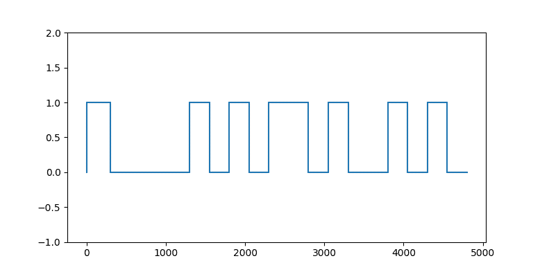
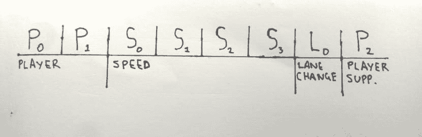
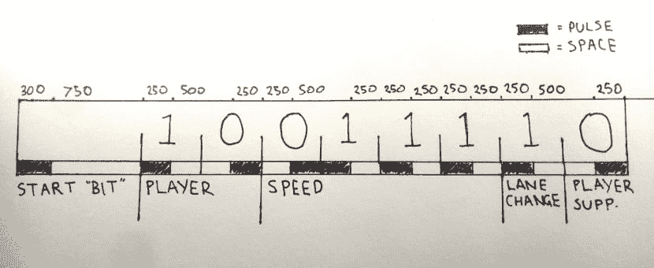
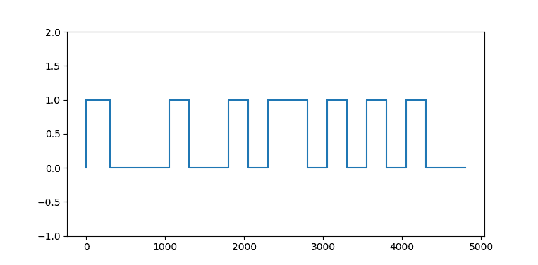

# 激光漂移:逆向工程槽车的乐趣和(可能)利润！

> 原文:[https://dev . to/buntine/laser-drift-reverse-engineering-slot-cars-for-fun-and-no-profit](https://dev.to/buntine/laser-drift-reverse-engineering-slot-cars-for-fun-and-no-profit)

在这个博客系列中，我讨论了[激光漂移](https://github.com/buntine/laser-drift)的创建，这是一个允许你通过实时模拟一到四个玩家的红外无线控制器来远程控制任何 Carrera 数字老虎车的系统。

在你阅读之前，请随意看看我的宣传视频或 Github 回购。

[https://www.youtube.com/embed/VmsQ4c20vLg](https://www.youtube.com/embed/VmsQ4c20vLg)

## 动机

几个月前，我和创意总监、战略主管以及其他各类技术人员参加了一次头脑风暴会议。这是一个多变的技能熔炉，在过去产生了许多令人惊讶的东西(和古怪的弗兰肯斯坦)。我们的客户让我们“用那些 BCI 设备中的一个做一些令人敬畏的事情”。对于那些不知道的人来说，**B**rain-**C**computer**I**interface 设备测量大脑中的电活动，并提供一个 SDK 来执行基于简单思想、情感和身体姿势的计算。

这些公开的简报通常都很棒，但是很难想出一个可行的主意，既能满足每个人对什么是了不起的概念，又能(但愿不会)符合预算。

我们最终决定采用由**大脑驱动的[吃角子老虎车](https://en.wikipedia.org/wiki/Slot_car)赛车**的想法，在这个想法中，用户会思考一些特定的想法，比如“推”，以使汽车移动。因此，简而言之，两到四名玩家将相互比赛，第一个跑完 *n* 圈的玩家将获胜。我们觉得这样会很好，因为(正如我们这些年龄足够大的人已经知道的)在老虎机系统中转弯是自动的。用户只需向前移动，剩下的事情就会迎刃而解。

这个想法也满足了其他一些先决条件——最重要的是它允许用户与现实世界互动。这位客户，也许是正确的，认为如果 BCI 设备能够移动物理对象而不是数字对象，那会更令人印象深刻。

对我来说，这个想法实际上包括两个独立的项目。首先:

*   PC - >吃角子老虎机:我们需要创建一个软件，使用简单的、与语言无关的命令来精确地控制吃角子老虎机上的四个玩家

第二:

*   **BCI - > PC** :我们需要创建一个软件来监听像“推”和“拉”这样的精神命令，然后把它们翻译成我上面提到的那些简单的命令

在这个系列中，我将讨论前者，因为它是两者中最有趣和最具挑战性的——尽管“精神控制”在新闻稿中听起来可能更酷。

这个项目分三个阶段进行。在这篇文章中，我将讨论前两个:

*   [研究和实验](#research)
*   [逆向工程](#reverse)

在另一篇文章中，我将讨论解决方案本身的创建:[激光漂移](https://github.com/buntine/laser-drift)。

## 研究和实验

我和同事们对老虎车的唯一体验是遥远的童年记忆，模拟车在单车道上疾驰。因此，眼下的第一项任务是找出 2017 年最先进的吃角子老虎车是什么样子。

哇！他们真的走了很长的路。

在过去，每辆车都需要占据自己的车道。如果任何两辆车进入同一车道，它们总是以完全相同的速度行驶。他们很有趣，但相对单调的玩具。

但那已经是过去了！因为大约在 2004 年，主要制造商开始引入数字系统，每辆车都可以被唯一识别(即使它们占用了同一车道)。因此，现在玩家可以自由地改变车道，模拟漏油，进站，配置制动性能，甚至代表真实世界的概念，如燃料水平和轮胎爆裂。所有这一切都将在最终结果中考虑到一个全新的层面 *badassery* 。

下一个拜访点是决定我们将与哪家老爷车制造商合作。事实证明，吃角子老虎机世界有两个主要玩家: [Scalextric](https://www.scalextric.com/uk-en/) 和 [Carrera](http://www.carrera-toys.com/en/) 。爱好者的普遍看法是，Scalextric 面向年龄较大的业余爱好者，而 Carrera 面向只想找乐子的年轻人。但是这两种选择都有很高的质量。

在四处查看了一番后，我发现卡雷拉提供了一个名为 [AppConnect](http://www.carrera-toys.com/en/products/digital-132/accessories/appconnect-538/) 的蓝牙接口，可以让人们对汽车速度进行编程，设置燃料水平并执行各种其他任务。一个叫 Thomas Kemmer 的人也在底层协议中发布了 [Python 绑定](https://github.com/tkem/carreralib)，这意味着我可以很容易地编写一个 Python 程序来控制汽车。我开始觉得这整件事可能比我最初想的要简单得多...

哦，无知是福。

当我意识到卡雷拉所说的“编程车速”是指蓝牙接口可以用来在比赛前为**辆车预编程各自的最高速度时，我的兴奋很快就消失了。在比赛期间*是没用的！唉，我们还是订购了新的(而且相当昂贵！)[Carrera Digital 132 GT Championship Wireless+](http://www.carrera-toys.com/en/products/digital-132/sets/gt-championship-1300/years-2016/)set 和 bluebooth 适配器不管用。这套特殊的装置配有无线控制器，通过红外线与赛道上的控制单元进行通信(至少，这是我在官方论坛上读到的)。***

在这一点上，我意识到没有官方的方法可以用电脑实时控制每辆车。所以我们开始了制图。

第一个想法是使用类似于[线性致动器](https://www.motiondynamics.com.img/magictoolbox_cache/80543c918ed05ba09145ba56f4b3651f/3/0/30444/original/3335263249/50_light_industrial_jqjh-k3.jpg)的东西来物理地按压[控制器](http://www.carrera-toys.com/fileadmin/user_upload/products/acc/zubehoehr_42012_.jpg)上的加速器。控制器本身将被安置在某种底盘中，我们将使用一个业余爱好者的微控制器，如 [Arduino](https://www.arduino.cc/) 在需要时按下每个控制器。如果你看了这个视频[的前 20 秒](https://www.youtube.com/watch?v=gnLSE44leyU)，应该很明显这是如何工作的。

这样做的好处是，我们不需要打开 Carrera 套件的机罩，只需模仿拇指按压即可。尽管它确实需要为每个控制器添加一大堆额外的硬件，以及一些项目中没有人声称拥有的专业技能。它也没有给我们真正想要的精确度，因为我们发现的致动器倾向于缓慢地驱动 T1。

下一个想法是逆向工程控制器的红外信号。我们可以模拟整个控制器阵列，只要我们能在正确的时间发送正确的数据包。我的意思是，控制器基本上就像非常简单的电视遥控器，对不对？这也需要一些硬件，但至少不需要焊接。

我在网上做了一些额外的研究，我能够找到斯蒂芬·heãÿ的一些有趣的作品，他展示了控制器发送的红外数据包的基本内容。这意味着我们已经完成了一些逆向工程。我已经知道便宜的基于 USB 的红外收发器很容易买到，比如 Irdroid 的[这款。](http://www.irdroid.com/wp-content/uploads/2013/11/IMG_0586-Small.jpg)

所以我们决定:我们将使用红外收发器来模拟控制器发送给控制单元的数据。一个简单的设备将充当所有的控制器。

当我仔细观察我们拥有的控制器时，一个额外的曲线球扔给了我。它们不是我读过的 38khz 红外控制器，而是 2.4ghz 射频控制器！这将使沟通变得更加困难。事实证明，红外控制器已于 2013 年退役，取而代之的是更高级的射频型号。幸运的是，新的控制单元似乎仍然支持旧的控制器。所以我在易趣上买了我想要的旧装备。

## 逆向工程

我购买的红外收发器是 IR droid T1。有趣的是，它是在保加利亚用改造过的 SD 卡读卡器手工制作的。我选择这个设备的原因是因为它由 Linux 环境的主流红外工具套件 [Lirc](http://lirc.org) 提供开箱即用的支持。LIRC 是一个软件包，允许您解码和发送许多(但不是所有)常用遥控器的红外信号。对它的全面介绍超出了本文的范围，但是只要知道 lirc 能够在 Linux 环境中发送和接收 IR blasts 就足够了。

逆向工程的一个重要部分是采取小步骤。在试图达到最终目标之前，试着对设备的工作原理有个大概的了解。对我来说，第一个停靠点是看看来自控制器的信息是什么样子的。为此，我使用了 lirc 提供的一个名为 [mode2](https://linux.die.net/man/1/mode2) 的低级工具。模式 2 只是监听原始红外数据，并将其打印到`STDOUT`。

让我解释一下红外数据是什么样子的。

红外设备通常通过一种称为脉码调制(PCM)的方法对发送给接收器的信息进行编码，在这种方法中，红外发光二极管快速开关。当发射器“关闭”时，我们称之为空间。当发射器“开启”时，我们称之为脉冲。有几种将二进制编码成脉冲和间隔的常用方法，但都涉及所述脉冲和间隔之间的转换。

在我的例子中，我期望看到随机出现的一系列脉冲和空白被打印到`STDOUT`。但我一无所获。无论我做什么，我都不能从控制器得到任何输出。我花了接下来的一个小时来解决为什么 Carrera 控制单元可以接收 IR 数据，而我却不能。直到我把我的红外收发器对准控制单元本身，我才意识到事情没那么简单。

控制单元(技术上来说是单元上的红外装置)实际上每隔大约 70 毫秒发出以下信号:

```
pulse 800
space 700
pulse 550 
```

数字是微秒。我们在这里看到的是一个 800 微秒的脉冲，一个 700 微秒的空间，然后是一个 550 微秒的脉冲。这个过程无限重复。

事实证明，控制器只有在收到控制单元的指令时才会做出反应。按下按钮实际上不会导致红外传输。它只是更新控制器本身中微控制器的一些状态。我认为这对于同步控制器很重要，这样它们的传输就不会在接收端纠缠在一起。

酷毙了。所以我做的下一件事是将同步信号从我的收发器传输到控制器，看看它返回了什么。这是我得到的回复:

```
pulse 300
space 1000
pulse 250
space 250
pulse 250
space 250
pulse 500
space 250
pulse 250
space 500
pulse 250
space 250
pulse 250
space 250
pulse 250 
```

在一个朋友的建议下，我写了一个小脚本，用一个阶跃图来形象化这个过程，图中一个脉冲是高的，一个间隔是低的。

[T2】](https://res.cloudinary.com/practicaldev/image/fetch/s--9Kxk1eEU--/c_limit%2Cf_auto%2Cfl_progressive%2Cq_auto%2Cw_880/https://thepracticaldev.s3.amazonaws.com/i/ddgfz1li00l8cigbzutn.png)

我做了很多次这个测试。我可以看到传输每隔 60 毫秒重复一次，并且总是以 300 的脉冲开始，然后是 750 或 1000 的间隔。这肯定是开始位，它告诉控制单元爆炸来自控制器，其余的传输是有效载荷。

起始位之后是一系列脉冲和间隔，它们总是为`250`或`500`。

经过一些额外的实验和研究，我推测卡雷拉使用[曼彻斯特编码](https://en.wikipedia.org/wiki/Manchester_code)来编码他们的数据包。在曼彻斯特编码中，一位表示为从低到高或从高到低的转换。具体来说，`1`被编码为一个**N**s 的脉冲，后跟一个**N**s 的间隔，而`0`被编码为一个**N**s 的间隔，后跟一个**N**s 的脉冲

正如我们所看到的，在我们的例子中。因此每位需要 500 微秒。将这些数字相加(减去起始位)得到`4000`。还有`4000 / 500 = 8`。因此，数据包由一个起始位和八个数据位(一个字节)组成。

参考斯蒂芬·heãÿ的工作，这已经节省了我很多时间，我能够确认每个控制器发送的数据包的结构。每个控制器发送开始位，随后是代表玩家的两位、**四位**和**一位**来指示是否按下了变道按钮。等等，那只有七位！？

事实证明，也有一个尾随位，似乎是用来代表额外的球员。我认为它被添加到末尾是为了向后兼容旧型号。这也解释了为什么数据字上没有结束位——它允许有效载荷的未来扩展，同时保持向后兼容性。

我在下面画出了有效载荷的内容。

[T2】](https://res.cloudinary.com/practicaldev/image/fetch/s--ii5RLY11--/c_limit%2Cf_auto%2Cfl_progressive%2Cq_auto%2Cw_880/https://thepracticaldev.s3.amazonaws.com/i/nnkfmmv1hk0m2dltp0y8.jpg)

举个例子，假设我们是 3 号玩家，按下变道按钮，以速度 7 行驶。我们的 8 位看起来像这样:

```
10011110 
```

为了使用曼彻斯特编码将这些位编码成脉冲和间隔，我们可以首先添加*起始位*:

```
pulse 300
space 750 
```

然后我们开始一个接一个地加入每一位。记住，在曼彻斯特编码中，比特被表示为一个跃迁。所以让我们加上 1(一个脉冲后跟一个空格):

```
pulse 300
space 750
pulse 250
space 250 
```

到目前为止一切顺利。让我们添加下一位，一个 0(一个空格后跟一个脉冲):

```
pulse 300
space 750
pulse 250
space 250
space 250
pulse 250 
```

啊哦！现在我们有两个连续的空格。我们可以通过简单地将它们合并成一个更长的空间来解决这个问题:

```
pulse 300
space 750
pulse 250
space 500
pulse 250 
```

酷毙了。每当我们看到一个`0->1`或一个`1->0`时，我们会将一端与另一端合并，以产生一个 500 微秒的脉冲或间隔。现在让我们添加其余的位:

```
pulse 300
space 750
pulse 250 # 1
space 500 # 0
pulse 250
space 250 # 0
pulse 500 # 1
space 250
pulse 250 # 1
space 250
pulse 250 # 1
space 250
pulse 250 # 1
space 500 # 0
pulse 250 
```

我们完事了。

这是另一种表现形式:

[T2】](https://res.cloudinary.com/practicaldev/image/fetch/s--rBSFD5a0--/c_limit%2Cf_auto%2Cfl_progressive%2Cq_auto%2Cw_880/https://thepracticaldev.s3.amazonaws.com/i/fo2sparatgw0ihs701k4.jpg)

当我们把它想象成一个阶梯图时，数据包与我上面展示的非常相似。你应该能看出 250 秒和 500 秒爆发的区别。

[T2】](https://res.cloudinary.com/practicaldev/image/fetch/s--LEvfsxA8--/c_limit%2Cf_auto%2Cfl_progressive%2Cq_auto%2Cw_880/https://thepracticaldev.s3.amazonaws.com/i/2inkwvh6t99vmbj6hruv.png)

这样，逆向工程项目就完成了。在这里，我可以使用 lirc 来监听来自 Carrera 控制单元的同步信号，并使用一些硬编码的数据包进行响应。

在我解决了一些小的时间问题后，当**我看到汽车移动**时，我非常高兴！至少对我来说，这足以证明这个想法并不完全疯狂。

下面是我第一次在没有物理控制器的情况下让汽车移动的视频。在这个视频中，我忽略了卡雷拉设置的红外塔的所有同步工作。我只是一遍又一遍地重复同样的信息，希望时机是正确的。这解释了为什么汽车只能以很小的速度行驶。

[https://www.youtube.com/embed/WsgaB_ByTto](https://www.youtube.com/embed/WsgaB_ByTto)

## 激光漂移

哇，这个帖子太长了...

我将把最终结果的细节留给另一篇博文。现在，你可以在 Github 上查看[激光漂移，或者观看我在本文顶部嵌入的宣传片视频。](https://github.com/buntine/laser-drift)