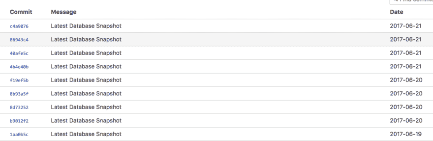
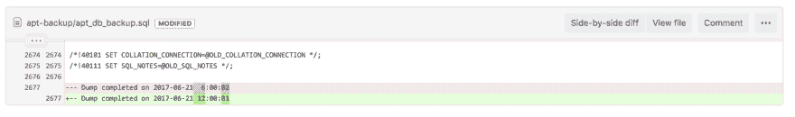

# 简单免费的自动化数据库备份

> 原文:[https://dev.to/arvesolland/easy 免费自动数据库备份](https://dev.to/arvesolland/easy--free-automated-database-backups)

因此，您构建了一些东西，它正在运行，现在您需要运行某种自动化的数据库备份。

仅仅用几行代码和一个 git 库就能实现这一点不是很好吗？对——我也是这么想的。最近，我与低带宽区域的站点、服务器和用户进行了大量的工作，我不得不提出一个数据库备份解决方案，它可以在几乎任何系统上运行，并且不需要太多带宽。
我发现在这种情况下对我特别有效的一个解决方案是一个小型 shell 脚本，它将数据库转储到一个 sql 文件，然后将更改推送到 git 存储库。

这种方法有几个好处:

*   易于设置——您只需要 git 存储库、一个小型 shell 脚本和一个 cron 作业
*   低带宽—通过使用 git，您将只推送 sql 备份中已更改的行，而不是整个文件。
*   易于跟踪更改——通过使用 git 您可以使用您最喜欢的用户界面轻松浏览提交，查看数据库实际发生了哪些更改

# 怎么做

*   创建一个 git 存储库来保存你的数据库备份(Bitbucket 允许免费的私有存储库)
*   在您的服务器上，将 git 存储库克隆到一个文件夹中。
    `git clone git@bitbucket.org:yourusername/db-backup.git .`

*   创建一个 shell 脚本，我们称之为 run-db-backup.sh，它将把您的数据库转储到这个文件夹中，然后添加更改，提交并推送到 git

```
#!/bin/bash
localPATH=’pwd’
echo “Dump Database”
cd /home/ec2-user/db-backup
mysqldump -u dbusername -p”yourdbpasswordhere db_name > db_backup.sql
echo “Commit changes to git and push”
git add .;git commit -m “Latest Database Snapshot”; git push origin master
echo “Done” 
```

<svg width="20px" height="20px" viewBox="0 0 24 24" class="highlight-action crayons-icon highlight-action--fullscreen-on"><title>Enter fullscreen mode</title></svg> <svg width="20px" height="20px" viewBox="0 0 24 24" class="highlight-action crayons-icon highlight-action--fullscreen-off"><title>Exit fullscreen mode</title></svg>

*   创建一个 cron 作业，以您期望的时间间隔执行您的新 shell 脚本`0 */6 * * * /home/ec2-user/run_db_backup.sh`

现在，您可以登录 git 存储库，观察自动化数据库备份的流入。:)

[](https://res.cloudinary.com/practicaldev/image/fetch/s--KaWUmmzf--/c_limit%2Cf_auto%2Cfl_progressive%2Cq_auto%2Cw_880/https://thepracticaldev.s3.amazonaws.com/i/4ttiolboes5uslb5ktmp.png) 
*比特桶提交列表*

[](https://res.cloudinary.com/practicaldev/image/fetch/s--59AYf0Mv--/c_limit%2Cf_auto%2Cfl_progressive%2Cq_auto%2Cw_880/https://thepracticaldev.s3.amazonaws.com/i/xp8z7xyf3b3yitht3kox.png) 
*监督提交修改*

# 恢复备份

要从存储库中恢复特定的提交，只需在进行 git 检验时引用您的提交 ID/hash:

`git checkout 0d1d7fc32 (where 0d1d7fc32 would be your commit hash)`

现在，您可以将您的 db-backup.sql 文件导入到您的数据库中，并享受一杯实至名归的咖啡。

*这是一篇来自[原媒文章](https://medium.com/@ArveSolland/easy-free-automated-database-backups-fc21a18f6b56)T3】的交叉帖子*