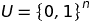
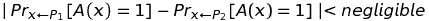
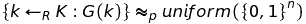

# 随机与伪随机

> 原文：<https://dev.to/artis3n/random-vs-pseudorandom>

图片来源:[xkcd.com/221](https://www.xkcd.com/221/)_

在与朋友和开发人员的讨论中，我觉得伪随机性有一种普遍的不确定性，特别是在它与加密随机性的关系中。我经常听到关于在软件开发中为敏感操作生成秘密材料的安全和“正确”方法的困惑。我想我会试着解释这些概念。如果你不熟悉术语 [CSPRNG](#CSPRNG) 以及它与 [PRNG](#PRNG) 或 [TRNG](#TRNG) 的比较，为什么`Math/rand`应该*永远不要*成为秘密密钥的来源，而且，想要了解，那么这篇文章就是为你准备的。我们将讨论为什么我们甚至需要伪随机性，从数学上定义术语“伪随机”的含义，并以现代编程语言中的安全伪随机接口作为结束。

首先，让我们定义一些术语。我们所说的“随机”数据是什么意思？对于我们的关注点，“随机”数据是由随机性产生的。我喜欢用事物本身来定义它。我的意思是“随机”数据的值集是一个[均匀分布](https://en.wikipedia.org/wiki/Uniform_distribution_(continuous))。每个值都是同等可能的；数据没有模式。因此，“随机”数据是由随机性产生的。另一方面，“伪随机”数据是从数学公式中得出的随机性。这些公式产生的数据是*统计随机的*；数据看起来是随机的，实际上，*数据是随机的*，但是它是从确定性过程中得到的。这安全吗？如果你做对了，是的。如果公式中有一个缺陷，或者公式的输入中有一个弱点，那么你将失去统计的随机性，从而失去任何保密性。那么我们为什么需要讨论呢？为什么我们要冒着泄露秘密数据的风险使用派生的随机性而不是真正的随机性呢？嗯，因为下面这个问题:

> 真正的随机很难

的确，与我们的密码函数相比，我们更喜欢将随机性作为构建模块，但是很难获得很多真正的随机性，尤其是在有限的时间内。假设我想传达一个信息。我只希望我的收件人能够阅读它，所以我必须加密邮件。如果我想以真正的随机性安全地发送我的消息，那么我需要一个随机序列(密钥)，至少是我的消息的长度。如果我使用的密钥小于我的消息长度，我将不得不重复使用该密钥来加密所有内容。这是 [Vigenere 密码](https://en.wikipedia.org/wiki/Vigen%C3%A8re_cipher#Cryptanalysis)的主要问题。使用重复的密钥，可以猜测密钥的长度，并使用该重复来破解密码。所以，如果我想使用真正随机的数据，我的密钥必须*至少*和我的消息一样大。当然，如果我在多条消息中使用相同的随机数据，那么我就是在重复我的密钥，攻击者可以破解这个“[多时间密码本](https://crypto.stackexchange.com/a/108)所以我需要至少和我的消息一样大的随机数据，并且这些数据只能使用一次。这种类型的加密被称为[一次性密码本](https://en.wikipedia.org/wiki/One-time_pad)。这是不幸的，因为这是很多关键材料。我们甚至还没有意识到这样一个事实，即想要阅读我的消息的人必须有相同的随机序列才能解密它，这是一次性密码本的一个大问题，也是为什么它在实践中不常使用的原因。然而，今天我们将把密钥传输的问题放在一边，只考虑我们需要多少随机性来发送这个消息。我将如何获得足够的随机性？嗯，我必须收获随机现象，要么是来自我的计算机的不可预测的指标，如系统驱动程序产生的噪声，要么是其他不可预测的外力，如大气噪声或[放射性衰变](https://www.fourmilab.ch/hotbits/how3.html)，等到我有足够的时候。事实上，这就是今天计算机获取真正随机序列的方式(从外部来源获取，如宇宙中的背景辐射，需要一些工作来设置，但这已经完成了——通常是在研究实验室中)，但这需要太长时间才能获得足够的材料来进行加密操作。

面对这个密钥大小的问题，密码学家提出了伪随机性的概念。他们不是从随机的数据序列中获取他们的密钥，而是使用一小部分随机序列并*将其扩展为一个更长的伪随机密钥。这种结构被称为[伪随机发生器](https://en.wikipedia.org/wiki/Pseudorandom_generator) (PRG)。PRGs——现在我们大多使用称为 [PRFs 和 PRPs](http://www.crypto-it.net/eng/theory/prf-and-prp.html) 的后代构造——允许我们安全地发送消息，同时需要少得多的随机数据。我们只需要一个微小的随机数据“种子”,它被拉伸成一个更长的伪随机序列。只要生成器产生“好的”随机数据，并且数学公式安全地延伸数据，我们就可以获得大量的随机性，而不需要直接产生所有的数据。我们如何知道 PRG 是否是“好的”密码学家已经证明，当不可预测的 PRG 在计算上无法与真正的随机数据区分开来时，它是安全的。也就是说，如果我们设计一个预测器，在给定先前生成的数据的情况下预测序列中的下一位数据，该预测器将无法区分伪随机函数生成的数据和真正随机函数生成的数据。PRP 和 PRF 还有其他保证和条件，但我们今天不打算讨论这些，因为我们当前的讨论不需要它们。形式上，“计算不可区分性”描述如下。如果你对离散代数不感兴趣，可以跳过下一节，因为我将继续讲述如何将这些知识应用到软件开发中。*

[T6】](https://res.cloudinary.com/practicaldev/image/fetch/s--kwyJZggx--/c_limit%2Cf_auto%2Cfl_progressive%2Cq_auto%2Cw_880/https://github.com/arikalfus/arikalfus.github.io/blob/dev/_asseimg/random_pseudorandom/computational_indistinguishable.png%3Fraw%3Dtrue)

假设我们的伪随机函数是 P 1 ，随机函数是 P 2 。让我们将 P 1 和 P 2 设置为上述集合`U`上的两个分布。这个引理说，当伪随机函数 P 1 上的某个统计测试`A`的输出的下一位等于 1 的概率足够接近随机函数 P 2 上的相同概率以至于可以忽略时，我们实现了计算不可区分性。如果我们用上面的离散代数，那么小于可以忽略不计。这种可能性也许不完全是 50%,但也有可忽略不计的接近(19960 . 689686899617...%).如果 PRG 的输出与 [TRG](#TRG) 的输出在计算上无法区分，那么我们认为 PRG 正在安全地处理数据。警告是 PRG 必须是“不可预测的”,以满足上述条件；也就是说，来源于真正随机数据并进入生成函数`G`的种子`k`产生看起来像随机数据的输出。这正式描述如下:

[T2】](https://res.cloudinary.com/practicaldev/image/fetch/s--b-acSPvB--/c_limit%2Cf_auto%2Cfl_progressive%2Cq_auto%2Cw_880/https://github.com/arikalfus/arikalfus.github.io/blob/dev/_asseimg/random_pseudorandom/prg_secure.png%3Fraw%3Dtrue)

这表明从我们的密钥空间`K`中随机选择并插入到我们的 PRG `G`中的密钥`k`产生的输出与从统一密钥空间中随机选择的数据出现的概率相同。如果我们的 PRG 满足这些条件，我们认为它是“不可预测的”

好的——我们有一个不可预测的 PRG，在计算上无法与随机区分。我们能自信地说 PRG 是安全的吗？是的——我们现在就要谈到这一点。我们能证明 PRG 是安全的吗？从数学上来说，我们是否能证明这一点还是未知数。我认为，这就是围绕伪随机性的许多困惑的来源。人们听错了，而不是听到“你不能证明 PRG 是安全的。”然后他们会想“啊哦！必须避免这种情况！”这是因为密码学家在使用伪随机函数和生成器时利用了特定的安全概念。一次性密码本，一种使用长度等于信息长度的随机数据的加密算法，拥有[的完美保密性](https://crypto.stackexchange.com/a/15575)，这是由[克劳德·香农](https://en.wikipedia.org/wiki/Claude_Shannon)引入的概念。完美的保密性意味着攻击者不可能破解密码。当我们说 PRG 是安全的时，我们使用的是语义安全或计算保密的概念。攻击者打破语义安全并非不可能；相反，攻击者破解密码是不可行的。这就是为什么像安全 PRP[AES](https://en.wikipedia.org/wiki/Advanced_Encryption_Standard)这样的密码是安全的。随着时间的推移，成功的攻击确实会发生，这需要开发人员使用越来越大的密钥大小。针对某一密钥大小的攻击是不可行的，变得可行，然后密钥大小必须增加，使得攻击再次变得不可行。例如，具有 1024 位密钥的 RSA 被认为是不安全的，而具有 2048 位密钥的 RSA 则是安全的。密码本身没有被破坏，但是不再具有 1024 位密钥的 RSA 的语义安全性。当你在像 https://howsecureismypassword.net 这样的网站上输入你的密码，收到几十亿年的时间(如果你有一个好的密码)，你会对你的密码感觉良好。你知道，虽然拥有数十亿年历史的攻击者可以破解你的密码，但担心这一点是完全不可行的，因为这实际上不可能发生。这就是为什么我们可以说 PRG 是安全的——语义安全。大多数现代密码依赖于“硬”的计算机科学问题，如[分解大素数](https://en.wikipedia.org/wiki/Integer_factorization)和[计算离散对数](https://en.wikipedia.org/wiki/Discrete_logarithm)，这些问题在任何可行的时间内都无法解决[1](#quantum)——语义安全。因此，即使您放弃伪随机数据而选择真正的随机数据，您仍然要将该数据输入到一个密码中，该密码依赖于与 CSPRNGs 相同的安全保证。你可能也好不到哪里去。

让我们回顾一下我们的现状。我们已经讨论了伪随机性的必要性，并详细讨论了伪随机意味着什么以及为什么伪随机性是安全的。现在，从哪里可以使用“安全”的 PRG？要检查的最重要的事情——无论您使用的是随机数生成器还是伪随机数生成器——是生成器是否是加密安全的。那意味着没有`Math/rand`。任何常规随机数生成器都不是密码不可预测的，因此不适合任何密码操作。任何标识为 CSPRNG 的东西都是好的*，如果*其背后的加密是有根据的。显然，没有咒语[不要开发自己的密码](https://security.stackexchange.com/a/18198)，任何关于密码的文章都是不完整的。你会弄错的。(除非你是[莫邪](https://moxie.org/)，这样的话，嗨:蝴蝶结:。)

坚持使用公共的、普及的加密库。libna 是一个很棒的库，它将在你的操作系统内核中使用 CSPRNG 函数，帮助你保持你的代码独立于操作系统。在这一点上，大多数编程语言中都有针对 lib 钠的[绑定。内核级 CSPRNG 比 OpenSSL 等用户级软件 CSPRNG 更受欢迎。我并不是说 OpenSSL 不安全；将您的加密操作保留在内核中只会减少您的攻击面，我相信这是一个好的实践。我应该提一下，libna 是一个很大的库，有很多加密操作支持。如果你只需要一个 CSPRNG，那么利钠可能不是你的最佳选择。](https://download.libsodium.org/doc/bindings_for_other_languages/)[这篇文章](https://paragonie.com/blog/2016/05/how-generate-secure-random-numbers-in-various-programming-languages)是找到最适合你的编程语言的 CSPRNG 库的绝佳资源。我强烈建议通读一遍。我不打算在本文中更深入地讨论这个领域，因为这些很棒的资源已经存在，我不能再添加任何新的东西。

我将以一组文章来结束这篇文章，这些文章更详细地解释了为什么应该使用 lib 钠或您的操作系统版本的 Linux 的`getrandom`系统调用；在旧的 Linux 内核上，您将使用`/dev/urandom`。下面的文章讨论了`/dev/urandom`的优点，因为`getrandom`是相对较新的 Linux 内核。然而，这是对`/dev/urandom`的一个重要改进，如果可能的话应该使用。如果你喜欢这篇文章，请分享给你的朋友和同事，并在下面留下评论。

*   [关于铀世界的神话](https://www.2uo.de/myths-about-urandom/)——强烈推荐在`/dev/urandom`和`/dev/random`的背景下继续这个话题
*   [如何安全地生成随机数](https://sockpuppet.org/blog/2014/02/25/safely-generate-random-numbers/)——提示:使用`/dev/urandom`(更好的是，`getrandom`)
*   在他们的标准库中包含 lib 钠...编程语言安全的前沿？
*   [只需使用 lib 钠](https://paragonie.com/blog/2015/09/how-to-safely-implement-cryptography-in-any-application)

不，你们这些书呆子，我不打算进入量子密码分析。[↩](#r1)t5】