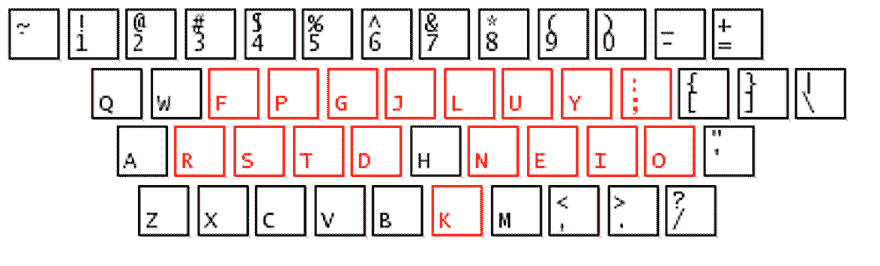
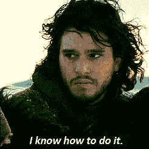

# Colemak 键盘与 Colemak 相处一周

> 原文:[https://dev.to/kevcui/one-week-with-colemak-489k](https://dev.to/kevcui/one-week-with-colemak-489k)

[T2】](https://res.cloudinary.com/practicaldev/image/fetch/s--2WneI3cN--/c_limit%2Cf_auto%2Cfl_progressive%2Cq_auto%2Cw_880/https://cdn-images-1.medium.com/max/1000/1%2Af9faYiSaK7qnUoXfSSn5YA.png)

上周末，我决定[从 QWERTY 切换到 Colemak 键盘布局](https://dev.to/kevcui/why-i-switch-to-colemak-keyboard-layout-190i-temp-slug-1657816)。从那以后我受了很多苦吗？当然没有，嗯，可能有一点。经过“为期一周的强化打字训练”，实际上我很喜欢用 Colemak 打字的新鲜感觉。我很高兴现在我能够在 Colemak 键盘布局上以平均每分钟 50 字的速度打字**。我会说，对于日常生活来说已经足够好了。如果你碰巧对切换到 Colemak 感兴趣，这里是我上周每天的简短笔记，以及我的“强化”训练是什么样子的。**

### D1——周六

*   花费时间:1 小时
*   打字速度:每分钟 15 字

[T2】](https://i.giphy.com/media/has1WKhoorwLS/giphy.gif)

#### 计划？去做吧！

有一些不同的方法可以帮助人们逐步转向 Colemak。一种有趣的方法叫做 [Tarmak](https://forum.colemak.com/topic/1858-learn-colemak-in-steps-with-the-tarmak-layouts/) (过渡的 Colemak)学习布局。Tarmak 总共有 4 种布局，*4 种 Tarmak 布局中的每一种都从上一步改变 3-4 个新键，直到您完全过渡到 Colemak。*

事实上，这听起来是个好计划。但是我没有走那条路，我选择了一个疯狂的方法:突然戒除法。我去掉 QWERTY，马上用 Colemak。因为我相信我可以立刻完全适应 Colemak 的变化。最后，这一切都是为了训练**肌肉记忆**。

#### 记住布局

首先，记住[布局](https://colemak.com/wiimg/8/80/Colemak_layout_2.png)。为了熟悉 Colemak 布局，我花了 30 分钟反复输入字母表“abcdefgh……”，直到我 100%确定所有 26 个字母都在正确的位置。

### D2——周日

*   花费的时间:3 小时(3 次 1 小时的会议)
*   打字速度:每分钟 25 字

[T2】](https://res.cloudinary.com/practicaldev/image/fetch/s--pyItR7qH--/c_limit%2Cf_auto%2Cfl_progressive%2Cq_66%2Cw_880/https://3.bp.blogspot.com/-vORSs1Agga4/UrbyY7kXPPI/AAAAAAAAPd0/bnmMeUBEL5U/s1600/little-finger-nod.gif)

#### 大脑完全控制

我把版面背下来之后，真正的“强化”训练就开始了。我用的主要网站是[快速打字在线](https://www.speedtypingonline.com/typing-test)。一篇又一篇文章，我不停地打字。同时，我必须让我的大脑确切地知道我需要做什么，然后我的手指就会被迫去做。这个擦除肌肉记忆的过程是缓慢的。我的大脑需要高度集中，以便控制我手指的每一个运动，并防止这些运动由旧的肌肉记忆初始化。

#### 小指软弱无力

我确实意识到的一个困难是我的右手小指比其他手指弱。在 QWERTY 之前，它控制字母“P ”,而字母“P”的出现频率远低于字母“O”。现在使用 Colemak，它必须处理字母“O”。右手小指肩膀上突然增加的沉重工作负荷使它变得笨拙。我真的能感受到需要字母“O”的“停”的瞬间。所以我要重点训练小指，甚至更多。

### D3 -周一

*   花费的时间:1 小时培训+ 8 小时工作
*   打字速度:每分钟 28 字

[T2】](https://i.giphy.com/media/m6tmCnGCNvTby/giphy.gif)

#### 生产力？

当我决定彻底戒掉时，我不想走弯路，所以我把我的笔记本电脑的键盘布局也改成了 Colemak。我记得我的第一次和第二次登录尝试都失败了，在那之后，没有什么真正的挣扎。说实话，25 WPM 左右的打字速度对于日常工作来说已经足够了，但是效率……嗯……尤其是在聊天 app 里回复别人的问题时，让另一边的人比平时多等了一点时间，感觉很抱歉。除此之外，当我在编码/编写脚本时，我觉得我有更多的时间进行思考，这可能是一件好事。

#### 智能手机出！

正如 Colemak 的发明者所提到的， *Colemak 不建议用于智能手机，因为与 QWERTY 相比，它增加了手指的移动和错误率。在智能手机上，我会推荐 QWERTY 布局的手势输入*。<sup>[【2】](#link2)</sup>再者，在智能手机键盘上打字的肌肉记忆是不一样的。因此，我仍然会继续在智能手机中使用 QWERTY 布局，直到有一天为智能手机发明另一种“高级”键盘布局。

### D4——星期二

*   花费时间:1 小时训练+ N 小时工作+ N 小时想象
*   打字速度:每分钟 30 字

[T2】](https://i.giphy.com/media/1qyXr3Dtl7pRe/giphy.gif)

#### 运用想象力

我发现了一个不需要实体键盘就能进行打字训练的神奇方法:运用我的想象力。例如，当我乘坐公共交通工具时，我喜欢听播客。我从耳机中听到了这些单词，然后我把手举在空中，移动手指来输入这些单词。看着我的其他人可能会认为我可能是一个钢琴家，或者可能是一个疯子。

### D5——周三

*   花费时间:1 小时训练+ N 小时工作+ N 小时想象
*   打字速度:每分钟 40 字

[T2】](https://i.giphy.com/media/TkWeMtX2N9z2M/giphy.gif)

#### 针对性训练

是时候对一些常用后缀进行更有针对性的训练了。理论上，如果我能无意识地把它们打出来作为一种反射，我的打字速度会提高很多。所以我列了一个需要重点关注的后缀:

```
-ly, -ing, -ion, -er, -or, -ment, -ous, -ful, -able 
```

<svg width="20px" height="20px" viewBox="0 0 24 24" class="highlight-action crayons-icon highlight-action--fullscreen-on"><title>Enter fullscreen mode</title></svg> <svg width="20px" height="20px" viewBox="0 0 24 24" class="highlight-action crayons-icon highlight-action--fullscreen-off"><title>Exit fullscreen mode</title></svg>

另一方面，我发现我在顶排字母“f”、“g”、“l”和“y”上犯了很多错误。我在脑子里不停地关注它们:先要准，再要快。

此外，我通过跟随[typing.com](https://www.typing.com/student)的课程开始系统地学习打字。我跳过了整个初学者课程和一些专为 QWERTY 设计的课程。

### D6——周四

*   花费时间:1 小时训练+ N 小时工作+ N 小时想象
*   打字速度:每分钟 50 字

[T2】](https://res.cloudinary.com/practicaldev/image/fetch/s--yZJpOBut--/c_limit%2Cf_auto%2Cfl_progressive%2Cq_66%2Cw_880/https://i.imgur.com/rE9hjAG.gif)

#### 重复，重复，重复…

每天，我打字都比昨天好。我感觉到我的肌肉记忆力正在一点点提高:现在我不需要考虑未来的布局了！这意味着当我在键盘上打字的时候，我可以在脑子里想其他的事情。绝对是个好兆头，吃起来好甜。这是重复的力量和永不放弃的结果。

### D7 -星期五

*   花费时间:1 小时训练+ N 小时工作+ N 小时想象
*   打字速度:每分钟 52 字

[T2】](https://i.giphy.com/media/6ffREbfXxiTnO/giphy.gif)

#### 玩乐时间到了

经过这些天的练习，我知道我已经走上了成功的正轨。虽然继续使用网上[快速打字](https://www.speedtypingonline.com/typing-test)和在[typing.com](https://www.typing.com/student)上基础课对我的日常生活很重要，但学习打字也可以充满乐趣，没有重复的乏味。是时候去发现新的东西，找点乐子了:

*   [TypingCAT](https://thetypingcat.com/typing-speed-test/) :就是一个普通的打字网站。但是它的 UI 超级干净舒服。会让你打字的时候感觉很牛逼。
*   这个网站要求你完成整篇文章，然后显示你的分数，而不是通常的时间盒方法。他们的打字材料真的很好。它们通常有 50-100 个单词，由字母、数字和标点符号组成。
*   打字比赛是赛车游戏的一种形式。它支持多人一起“赛车”。它的 UI 是 okish，材质一般。但是如果你想看看你在压力下的表现，这是一个很好的游戏。

### D(n) -未来…

[T2】](https://res.cloudinary.com/practicaldev/image/fetch/s--yisPdS5s--/c_limit%2Cf_auto%2Cfl_progressive%2Cq_auto%2Cw_880/https://i.imgur.com/ySplUIE.png)

#### 1。将大写锁定用作…？

Colemak 将 Caps Lock 键映射到退格键。在左手上有另一个退格来平衡双手的使用是有意义的。但是到目前为止我根本不用。也许我会映射到 Esc，在 Vim 里有用。

#### 2。改掉坏习惯

我还是需要改掉一些使用 QWERTY 的坏习惯:

*   总是用左手拇指轻敲空格键
*   总是使用左小指来点击 Shift

我知道如何正确地做它，但是…好吧，我将来会正确地做它。

#### 3。Colemak x Vim

Vim 的新布局是一项艰巨的挑战。我有过几次由“gg”和“dd”引起的“哎呀”时刻。但我不认为我会重新映射键，使原来的 Vim 风格一样。我更喜欢和 Colemak 一起从头学起。这里是 [Colemak/vim 小抄](https://c1.staticflickr.com/6/5060/5421396271_68f3d12c9e_b.jpg)<sup>[【3】](#link3)</sup>。我知道使用 Colemak 完全运行 Vim 需要一段时间。

#### 4。找回“QWERTY 模式”？

作为副作用，QWERTY 的肌肉记忆完全丧失。我不能再用 QWERTY 布局打字了。我应该训练自己以后把 QWERTY 模式拿回来吗？我猜没有 _(ツ)_/

* * *

[1]ystein Bech gad mar:[Tarmak 是如何工作的？](https://forum.colemak.com/topic/1858-learn-colemak-in-steps-with-the-tarmak-layouts/)

【2】Shai Coleman:[Colemak 适合智能手机吗？](https://colemak.com/FAQ#Is_Colemak_suitable_for_smartphones.3F)

【3】Aimee Rivers:[《科尔马克与维姆》:但是 h/j/k/l 呢？](https://sermoa.wordpress.com/2011/12/16/colemak-and-vim-but-what-about-hjkl/)