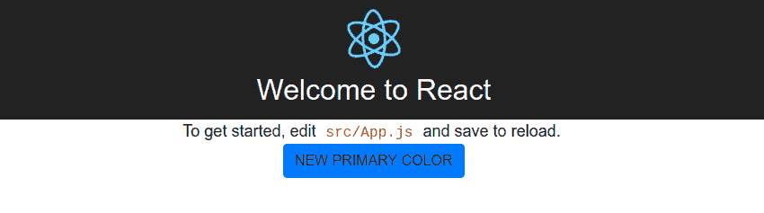
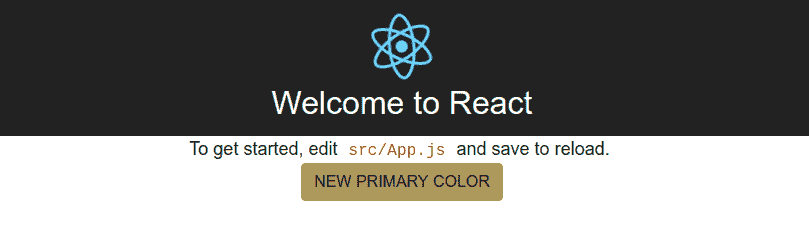

# React +自定义引导 4 Sass[可能已弃用]

> 原文：<https://dev.to/sabatesduran/add-custom-bootstrap-4-sass-to-create-react-app>

我需要一种从 Sass 文件定制 Bootstrap 4 的方法，以便更容易地更改变量值。

### 要求

*   node . js
    T0】

*   纱线

```
$ curl -sS https://dl.yarnpkg.com/debian/pubkey.gpg | sudo apt-key add -
echo "deb https://dl.yarnpkg.com/debian/ stable main" | sudo tee /etc/apt/sources.list.d/yarn.list 
```

Enter fullscreen mode Exit fullscreen mode

*   安装 create-react-app 包(你可能需要使用`sudo` ) `$ yarn global add create-react-app`

### 创建您的 react 应用程序

```
$ create-react-app bootstrap4-react-app 
```

Enter fullscreen mode Exit fullscreen mode

### 添加 Sass(此部分来自`create-react-app`包[文档](https://github.com/facebookincubator/create-react-app/blob/master/packages/react-scripts/template/README.md#adding-a-css-preprocessor-sass-less-etc)

#### 创建`/src/styles/`文件夹

在你的项目文件夹中执行`$ mkdir src/styles`

#### 安装 Sass 的命令行接口，并行运行任务的包和 Bootstrap 4。

```
$ yarn add node-sass-chokidar npm-run-all bootstrap 
```

Enter fullscreen mode Exit fullscreen mode

#### 在`package.json`中添加新任务

```
"scripts":  {  "build-css":  "node-sass-chokidar --include-path ./src/styles --include-path ./node_modules src/styles/ -o src/styles/",  "watch-css":  "npm run build-css && node-sass-chokidar --include-path ./src/styles --include-path ./node_modules src/styles/ -o src/styles --watch --recursive",  "start-js":  "react-scripts start",  "start":  "npm-run-all -p watch-css start-js",  "build":  "npm run build-css && react-scripts build",  "test":  "react-scripts test --env=jsdom",  "eject":  "react-scripts eject"  } 
```

Enter fullscreen mode Exit fullscreen mode

如你所见，如果你查看你的`package.json`，这是新的命令:
`build-css`:从`/src/styles/`目录构建 css。
`watch-css`:变化的原因。来自`/src/styles/`目录的 scss 文件。
`start-js`:执行旧的启动命令。
`start`:并行运行`whatch-css`和`start-js`。
`build`:构建 css，构建脚本。

### 创建 sass 文件

现在我们可以在我们的`styles`目录中创建`index.scss`和`_custom_bootstrap.scss`(这将在构建时创建一个`index.css`)。

我们使用' _ '来跳过这个独立于索引文件构建的文件，而是将文件导入到`index.scss`中。

```
// My Bootstrap configuration
@import 'custom_bootstrap';

// Bootstrap library
@import 'bootstrap/scss/bootstrap';

// Here you can import more .scss files or write scss code.
... 
```

Enter fullscreen mode Exit fullscreen mode

#### 添加自定义变量

在“`_custom_bootstrap.scss`中，我们可以覆盖在`./node_modules/bootstrap/sass/_variables.scss`中找到的引导变量。

例如，我们将更改主要主题颜色:

` `scss
//新颜色
$ New-color:# ad 9 a5b；`

 `//来自 _ variables . scss
$ theme-colors 的颜色数组:(
初级:$new-color，
次级:$gray-600，
成功:$green，
info:$青色，
警告:$yellow，
danger: $red，
light: $gray-100，
dark: $gray-800
)！违约；

 ``Since we don't have some variables you will have to copy them from the` _variables.scss`。`

 `下一步是将 CSS 文件加载到`index.js`中，在从`App`组件:`import './styles/index.css';`导入之前添加这一行

要启动应用程序，只需在您的项目文件夹中执行`yarn start`并开始更改变量，终端会告诉您是否您的`scss`文件有一些错误，并且每次您更改文件时，都会重新构建 index.css 并重新加载页面，以便您可以看到更改。

这是之前和之后:

[T2】](https://res.cloudinary.com/practicaldev/image/fetch/s--pbbC52nv--/c_limit%2Cf_auto%2Cfl_progressive%2Cq_auto%2Cw_880/https://thepracticaldev.s3.amazonaws.com/i/gczt961p97lh0r44doyo.png)

[T2】](https://res.cloudinary.com/practicaldev/image/fetch/s--qzNCjrx7--/c_limit%2Cf_auto%2Cfl_progressive%2Cq_auto%2Cw_880/https://thepracticaldev.s3.amazonaws.com/i/mjqmk3bhqsit3dxz5001.png)

* * *

这是我的第一篇文章，所以如果你有一些意见或建议总是很有帮助的。

谢谢，我希望这篇文章对你有用。``