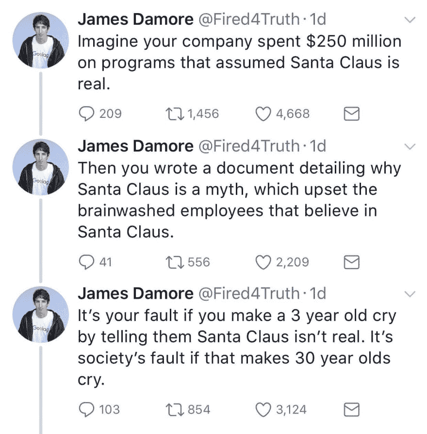
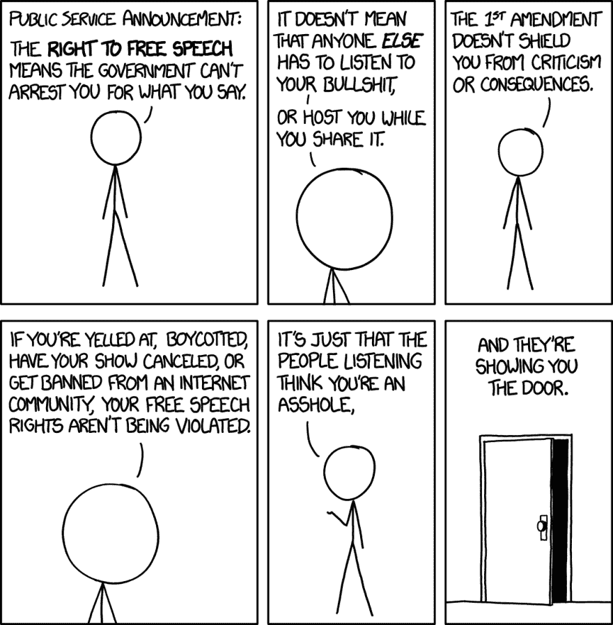

# 降低标准

> 原文：<https://dev.to/maxart2501/on-lowering-the-bar>

你们中的一些人肯定听说过最近的一个案例，谷歌的软件工程师发表声明，反对这家搜索巨头在员工队伍中的包容性做法。詹姆斯·达莫尔(这是他的名字)认为，谷歌提高员工多样性的举措违反了人才在性别和种族群体中的自然(“生物”)分布，不利于在软件开发中创建尽可能最好的团队。

这份备忘录在谷歌员工中疯传，然后公开，在社交媒体上引起了严重的轩然大波。

达莫尔随后于 8 月 8 日被解雇。

我必须澄清，这篇冗长的帖子不是对 James Damore 的回复——我不认识他，也没有兴趣认识他——而是邀请每一位开发人员避免 Damore 备忘录中如此明显的谬误。

## 善后事宜

然后，他发现自己陷入了在旧金山没有薪水生活的困境，所以他利用突然声名狼藉的时刻来进一步捍卫自己的立场，事实上成为了保守派和“另类右翼”支持者的殉道者。

你以此为生。(显然这很有效，因为他收到了一些工作提议。)

在他新发现的政治活动中，他创建了一个名为@Fired4Truth 的新 Twitter 账户(对不起，不会链接)，这或多或少地表明了他有多自我。和他一起工作一定很愉快。

他最近的一些推文让我相信，我需要在所有的喧嚣中放下一些想法:

[T2】](https://res.cloudinary.com/practicaldev/image/fetch/s--QayMqRtG--/c_limit%2Cf_auto%2Cfl_progressive%2Cq_auto%2Cw_880/https://thepracticaldev.s3.amazonaws.com/i/cmk5g47gsyn3i0fxdzid.jpg)

有人回答说，他把成功女性比作圣诞老人之类的虚构人物——他没有。公平地说，他从来没有排除过特别有才华的女性的可能性，但这不是重点。

真正的问题是，他仍然坚定地认为，所有改善多样性的努力都是朝着一种错觉的方向发展，即一个平均分布的人类多样性是可能的。事实上，这肯定不是预期的目标。

## 酒吧

在宣言中，最有争议的一点谈到了“通过降低假阴性率，可以有效降低‘多元化候选人’门槛的招聘做法”。由此可见，达莫尔是这样想象世界的:

很简单:有一个明确的挑战，你努力尝试，你要么通过，要么失败。简单古老的精英统治，人类进化的现代方式。这是公平的，这是诚实的，这让整个社会放心。

但现实是不同的。这是不公平的，这是欺骗性的，这是可怕的。这通常会排除参加挑战的机会。或者如果你能承受，你从来没有工具和教育去面对它。即使在这种情况下，你也能感受到别人的社会压力，他们告诉你，你应该忘记这件事，因为它不适合你。

简而言之，现实世界的挑战更像这样:

[T2】](https://res.cloudinary.com/practicaldev/image/fetch/s--TjmO4gs3--/c_limit%2Cf_auto%2Cfl_progressive%2Cq_auto%2Cw_880/https://thepracticaldev.s3.amazonaws.com/i/ykfs5sdgtgdri31zo773.png)

许多人会像往常一样聚集在酒吧前，尽他们最大的努力，并处理回应。其他人不会努力尝试，有些人会完全弄错。但有些人可能想尝试，但他们所处的环境不允许他们这样做。因为挑战是根据某种教育和文化量身定做的。

(大多数)行业都是这样的。每天都有候选人被拒绝，但问题是:*没有人*能确定，在*的每一个*案例中，这是一个正确的决定。

## 精确科学(不)

原因很简单:关于审查候选人的文献没有定义一门精确的科学。有统计数据，有推测，有假设，但是人类科学不会给你*定理*和它们的证明，不会给你精确、可靠的公式或定义明确的方法来应用它们。因此，观察和实验是有限的，很难排除所有可能的偏见和孤立的背景。

如果有一个行业可以证明这一点，那就是它。太多的大学辍学生——那些几乎没有机会面试，更不用说被雇佣的人——在这方面取得了巨大的成功。我说的是像比尔·盖茨、史蒂夫·乔布斯、马克·扎克伯格、拉里·埃里森、迈克尔·戴尔之类的人。

即使在谈论开发者的时候，也有很多人因为各种原因被拒绝。你也可以找到“大”的名字。

最终，像谷歌这样的公司，即使采用了最好的招聘实践，也会觉得自己可能会错过一些宝贵的人才。这里的目标不是降低标准，而是创造一个更好的标准。

[T2】](https://res.cloudinary.com/practicaldev/image/fetch/s--ylWnxoM6--/c_limit%2Cf_auto%2Cfl_progressive%2Cq_auto%2Cw_880/https://thepracticaldev.s3.amazonaws.com/i/2voouwg7un0bz4528of4.png)

现在，来自特定人群的候选人确实越来越少——女性，但也有一些少数民族。虽然*可能*是生物原因，但我们再次*不是*在谈论一门精确的科学。因此，探索自然平衡和个人成长的(可能有巨大影响力的)文化背景之间的界限是完全合理的。

这就是这些举措的目的。谷歌的职责不是为所有人提供更好的教育环境和更公平的机会(在某种程度上，这甚至可能不符合谷歌的最佳利益——稍后会有更多介绍)，但它正在尽力而为。达莫尔是特权社会的一员，这个社会把他放在最好的教育系统中——对一个才华横溢的人来说是完美的——但他似乎不明白这一点。

享有特权不是罪过。无视自己的特权。

## 但是多样性为什么重要呢？

一个问题可能仍然徘徊在那些仍然感觉被所有那些“多元化项目”所“背叛”的人中间，那些认为其他人“过得更容易”是不公平的人:为什么这很重要？已经有无数的好候选人，比谷歌可以使用的还要多，那么为什么山景城不能至少让*一件事*——它的招聘过程——公平而清晰，成为一个不公平和黑暗的社会的指路明灯呢？

实际上，还有另一个方面需要考虑。

IT 公司董事会通常采用的白板面试无疑是公司自身文化和身份的产物。如果候选人已经充分适应了上述文化，他们就通过了测试。从这个意义上说，是*文化在复制自己*。

如果这对你来说听起来特别危险，那是因为确实如此。在一个飞速发展的行业和社会中，不改变你的基本立场去适应和接受新的观点是一个致命的错误。我们几乎每天都在 IT 行业看到这种情况:曾经的巨头公司跌落悬崖，遭受长期痛苦，裁员，最终消失。

准将。雅达利。黑莓手机。诺基亚。雅虎。即使是苹果、IBM 这样的巨头，过去也是冒着很大的风险，靠孤注一掷才活了下来。前者通过回忆史蒂夫·乔布斯的远见卓识；后者把车轮给了一个领导制造业的人...[饼干](https://en.wikipedia.org/wiki/Louis_V._Gerstner_Jr.)，以及其他烘焙产品。

因此，更加多样化的招聘流程可能会阻止这一切。文化上的多样性是成功的关键，它提供了新兴市场的新观点，吸引了被忽视的细分市场的用户和顾客。这可能不能保证生存下来——无论如何，没有什么能打败一个糟糕的领导——但这可能有所帮助。以最小的风险和成本，至少对谷歌这样的公司来说是这样。

## 《宣言》有那么糟糕吗？

读达莫尔的宣言并没有让我震惊。老实说，我自己也是我之前说的特权群体的一部分，但这不是原因。原因是我确实*见过*远近的同事持有与达莫尔相似的职位。

如果 Damore 的观点在开发者中引起共鸣，表达出来有什么不好？他的解雇到底是正当的吗？还是谷歌此举只是为了在不作为的情况下避免公众反弹？简而言之，简单陈旧的审查制度？

让我们先说宣言的论点是...挺可怜的。如果你想证明一个观点——展示你认为的真相——你最好的办法是对这个问题采取科学的方法。否则，这只是你的观点，虽然有些人可能会上当，但其他人不会买账。

这份备忘录没有遵循科学路线。相反，它专注于政治偏见，这是非常不相关的，因为它们是基于纯粹的任意假设，以及它们如何导致领导人...基本上，不同意他。

当然，这只是一种解释。对于一个显然无法解释的问题，科学的方法并不是给出一个对你来说容易的解释:而是问“为什么会这样？”，然后收集数据，*然后*给出解释。

Damore 简要提到他要求解释，但没有收到任何解释。他没有报告具体询问了什么，如何询问，以及向谁询问。如果检索数据遇到困难，*你应该停止阐述理论*，而是报告问题。你不会建议补救措施和不同的方法，因为你没有路可走。只是一根脆弱、不稳定的绳子，连接着几篇精选的人类科学论文和你自己的主观观察。

他可能说得对，即使是要求解释也会遭到高层的反对，这肯定是谷歌应该调查的一个问题。毕竟，桑德尔·皮帅[也解决了这个问题](http://mashable.com/2017/08/07/google-ceo-sundar-pichai-manifesto-response/)，显示了一个领导者应有的公正态度。

## 压制异议还是保护少数？

虽然允许人们表达不同意见是最基本的，但达莫尔做的远不止这些。想象一下，如果宣言在你的公司成为主流。想象你是一个刚刚登机的女人。你对此有何感想？

你的同事会认为你被聘用是因为这对你来说更容易。或者，在招聘过程中没有“多元化项目”的情况下，他们会认为你走了某种“捷径”,因为从生物学角度来看，你作为一名开发人员没有那么有天赋。

是的，这就是要传递的信息，不要抱别的希望。因为，作为人类，我们喜欢把事情简单化。

这就是为什么会有一个充满敌意的工作空间，这是多层次的错误。这违反了任何体面的行为准则。这是终止合同的合理理由，这是詹姆斯·达莫尔应得的。

因为言论自由并不意味着不承担后果。因为每样东西都有一个相关的 xkcd 条，这里有一个:

[T2】](https://res.cloudinary.com/practicaldev/image/fetch/s--FeIyTixX--/c_limit%2Cf_auto%2Cfl_progressive%2Cq_auto%2Cw_880/https://imgs.xkcd.com/comics/free_speech_2x.png)