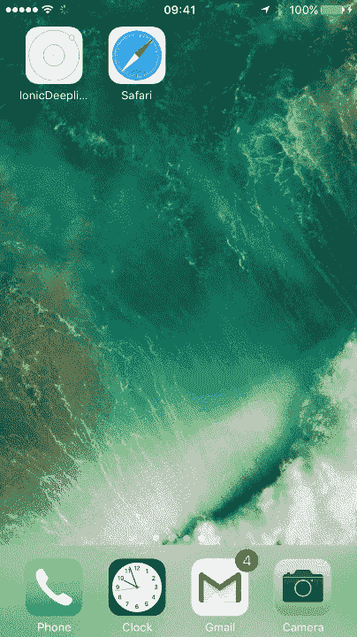
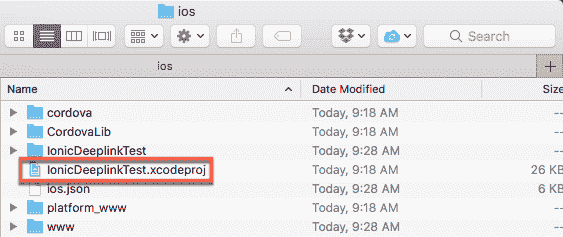
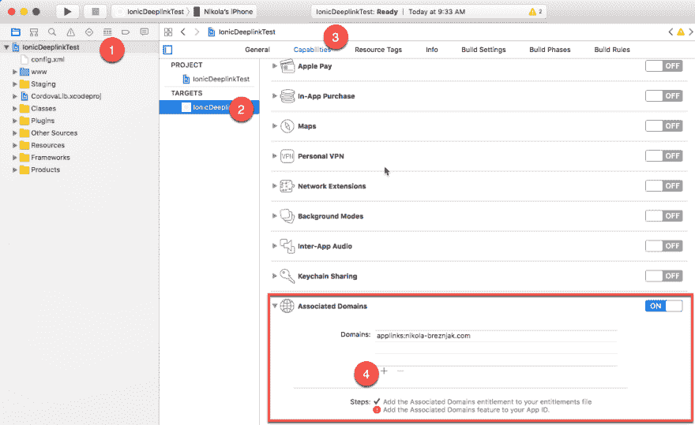

# 如何通过 Ionic 原生深度链接插件在 Ionic 1 应用中使用深度链接

> 原文：<https://dev.to/nikola/how-to-use-deep-linking-in-ionic-1-apps-with-ionic-native-deeplinks-plugin>

*原载于[我的博客](http://www.nikola-breznjak.com/blog/javascript/ionic/use-deep-linking-ionic-1-apps-ionic-native-deeplinks-plugin/)*

在本教程中，我将向您展示如何在 **Ionic 1** 应用程序中使用深度链接，以及最初为 Ionic 2 和 Ionic 3 制作的 [Ionic 原生深度链接插件](http://ionicframework.com/docs/native/deeplinks/)。希望我能为你节省一些时间，这样你就不用自己解决这个问题了。我将指出官方文档在传递附加参数时设置正确链接方面的不足。

所以，让我们开始吧！

## 演示项目

你可以在 Github 上查看这个项目的代码。

这是正在运行的应用程序，在这里你会注意到如何通过点击链接将你带到应用程序的特定屏幕。另外，额外的嵌套(打开一个“聊天”的详细屏幕)也是可行的:

[T2】](https://res.cloudinary.com/practicaldev/image/fetch/s--PyyU2qp_--/c_limit%2Cf_auto%2Cfl_progressive%2Cq_66%2Cw_880/http://i.imgur.com/VeDiqnF.gif)

## 循序渐进

以下是你可以采取的步骤，来完成和我在 Github 上发布的项目一样的最终工作项目。

基于 tabs 模板启动一个新的 Ionic 1 项目:

`ionic start IonicDeeplinkTest tabs`

添加深度链接插件:

```
ionic plugin add ionic-plugin-deeplinks --variable URL_SCHEME=nikola --variable DEEPLINK_SCHEME=http --variable DEEPLINK_HOST=nikola-breznjak.com --save 
```

这里需要注意的几件事是:

*   **URL_SCHEME** -一个字符串，你可以把它放在你的链接中，这样一旦点击，你手机的操作系统就会知道打开你的应用程序。在我的例子中，链接看起来像`nikola://something`
*   **DEEPLINK_SCHEME** -很可能你会想把 **https** 放在这里，但我已经把 **http** 放在这里，因为我的网站(还)不支持 SSLðÿ˜
*   你应该把你的域名放在这里

上面命令的输出应该是这样的:

```
Fetching plugin "ionic-plugin-deeplinks" via npm

Installing "ionic-plugin-deeplinks" for ios

Installing dependency packages: 

{
  "mkpath": ">=1.0.0",
  "xml2js": ">=0.4",
  "node-version-compare": ">=1.0.1",
  "plist": ">=1.2.0"
} 
```

现在，正如在[官方插件文档](http://ionicframework.com/docs/native/deeplinks/)中提到的，这个插件最初是通过 Ionic Native 为 Ionic 2+应用程序提供的。但是，如果我们这样安装的话，我们可以将 Ionic Native 与 Ionic 1 一起使用([关于这个主题的官方文件](https://github.com/ionic-team/ionic-native/blob/v2.x/README.md)):

`npm install ionic-native --save`

现在，将`node_modules/ionic-native/dist`文件夹中的`ionic.native.min.js`复制到一个新的`lib/ionic-native`文件夹中。

然后，在`index.html`中添加:

`<script src="lib/ionic-native/ionic.native.min.js"></script>`

就在

`<script src="cordova.js"></script>`

线。

接下来，运行以下命令:

`npm install --save @ionic-native/deeplinks`

最后，打开`app.js`文件，并在`platform.ready`回调函数中添加以下代码:

```
$cordovaDeeplinks.route({
    '/chats/:chatId': {
        target: 'tab.chat-detail',
        parent: 'tab.chats'
    },
    '/account': {
        target: 'tab.account',
        parent: 'tab.account'
    },
    '/chats': {
        target: 'tab.chats',
        parent: 'tab.chats'
    }
}).subscribe(function(match) {
    $timeout(function() {
        $state.go(match.$route.parent, match.$args);

        if (match.$route.target != match.$route.parent) {
            $timeout(function() {
                $state.go(match.$route.target, {chatId: match.$args.chatId});
            }, 800);
        }
    }, 100); // Timeouts can be tweaked to customize the feel of the deeplink
}, function(nomatch) {
    console.warn('No match', nomatch);
}); 
```

另外，不要忘记在`app.js`文件的`angular.module`函数中添加`ionic.native`:

`angular.module('starter', ['ionic', 'starter.controllers', 'starter.services', 'ionic.native'])`

并在`.run`函数中注入`$cordovaDeeplinks`。

仅供参考，app.js 文件的完整内容现在应该是这样的:

```
// Ionic Starter App

// angular.module is a global place for creating, registering and retrieving Angular modules
// 'starter' is the name of this angular module example (also set in a <body> attribute in index.html)
// the 2nd parameter is an array of 'requires'
// 'starter.services' is found in services.js
// 'starter.controllers' is found in controllers.js
angular.module('starter', ['ionic', 'starter.controllers', 'starter.services', 'ionic.native'])

.run(function($ionicPlatform, $cordovaDeeplinks, $timeout, $state) {
    $ionicPlatform.ready(function() {
        // Hide the accessory bar by default (remove this to show the accessory bar above the keyboard
        // for form inputs)
        if (window.cordova && window.cordova.plugins && window.cordova.plugins.Keyboard) {
            cordova.plugins.Keyboard.hideKeyboardAccessoryBar(true);
            cordova.plugins.Keyboard.disableScroll(true);

        }
        if (window.StatusBar) {
            // org.apache.cordova.statusbar required
            StatusBar.styleDefault();
        }

        $cordovaDeeplinks.route({
            '/chats/:chatId': {
                target: 'tab.chat-detail',
                parent: 'tab.chats'
            },
            '/account': {
                target: 'tab.account',
                parent: 'tab.account'
            },
            '/chats': {
                target: 'tab.chats',
                parent: 'tab.chats'
            }
        }).subscribe(function(match) {
            console.log('matching');
            console.dir(match);
            $timeout(function() {
                $state.go(match.$route.parent, match.$args);

                if (match.$route.target != match.$route.parent) {
                    $timeout(function() {
                        $state.go(match.$route.target, {chatId: match.$args.chatId});
                    }, 800);
                }
            }, 100); // Timeouts can be tweaked to customize the feel of the deeplink
        }, function(nomatch) {
            console.warn('No match', nomatch);
            console.dir(nomatch);
        });
    });
})

.config(function($stateProvider, $urlRouterProvider) {

    // Ionic uses AngularUI Router which uses the concept of states
    // Learn more here: https://github.com/angular-ui/ui-router
    // Set up the various states which the app can be in.
    // Each state's controller can be found in controllers.js
    $stateProvider

    // setup an abstract state for the tabs directive
        .state('tab', {
        url: '/tab',
        abstract: true,
        templateUrl: 'templates/tabs.html'
    })

    // Each tab has its own nav history stack:

    .state('tab.dash', {
        url: '/dash',
        views: {
            'tab-dash': {
                templateUrl: 'templates/tab-dash.html',
                controller: 'DashCtrl'
            }
        }
    })

    .state('tab.chats', {
            url: '/chats',
            views: {
                'tab-chats': {
                    templateUrl: 'templates/tab-chats.html',
                    controller: 'ChatsCtrl'
                }
            }
        })
        .state('tab.chat-detail', {
            params: {chatId: 0},
            url: '/chats/:chatId',
            views: {
                'tab-chats': {
                    templateUrl: 'templates/chat-detail.html',
                    controller: 'ChatDetailCtrl'
                }
            }
        })

    .state('tab.account', {
        url: '/account',
        views: {
            'tab-account': {
                templateUrl: 'templates/tab-account.html',
                controller: 'AccountCtrl'
            }
        }
    });

    // if none of the above states are matched, use this as the fallback
    $urlRouterProvider.otherwise('/tab/dash');
}); 
```

一些你应该放在你的网站上的链接示例如下:

```
<a href="nikola://account">Open Account</a>
<a href="nikola://chats">Open Chats</a>
<a href="nikola://app/chats/4">Open chat detail 4</a> 
```

我创建了一个简单的演示页面，如果你愿意，你可以测试一下，这里是。只要在你的手机上打开这个链接，当你在你的手机上运行了演示应用程序后，你应该会看到链接工作了。带你到应用程序中适当的部分。

仅供参考，该文件的内容是:

```
<!DOCTYPE html>
<html>
<head>
    Deeplinking test

    <style type="text/css">
        a {
            font-size: 80px;
            margin: 40px;
            display: block;
        }

        body {
            text-align: center;
        }
    </style>
</head>
<body>
    <a href="nikola://account">Open Account</a>

    <a href="nikola://chats">Open Chats</a>

    <a href="nikola://app/chats/4">Open chat detail 4</a>
</body>
</html> 
```

**这里最重要的部分**，也是我浪费了大部分时间的部分`nikola://app/chats/4`。也就是说，起初我期望你只应该把它写成`nikola://chats/4`，但是通过在官方回购中找到关于这个的[错误报告](https://github.com/ionic-team/ionic-plugin-deeplinks/issues/63)，我意识到你必须把一些东西作为后缀(我在这里写了`app`)。

现在，要在您的设备上运行应用程序，首先要做好准备:

`ionic prepare ios`

然后，打开`platforms/ios/IonicDeeplinkTest.xcodeproj`文件:

[T2】](https://res.cloudinary.com/practicaldev/image/fetch/s--QATT2eDB--/c_limit%2Cf_auto%2Cfl_progressive%2Cq_auto%2Cw_880/http://i.imgur.com/4SFXq7N.png)

并且，确保字符串`nikola`(当然，根据您的使用情况更改该字符串——通常是应用程序的名称)设置如下图所示:

[T2】](https://res.cloudinary.com/practicaldev/image/fetch/s--qO-pUGVf--/c_limit%2Cf_auto%2Cfl_progressive%2Cq_auto%2Cw_880/http://i.imgur.com/ZmYJBIG.png)

有关设置 Xcode 的任何潜在附加信息，请查看官方博客文章。

这是正在运行的应用程序，在这里你会注意到如何通过点击链接将你带到应用程序的特定屏幕。另外，额外的嵌套(打开一个“聊天”的详细屏幕)也通过传入参数来工作。

[T2】](https://res.cloudinary.com/practicaldev/image/fetch/s--PyyU2qp_--/c_limit%2Cf_auto%2Cfl_progressive%2Cq_66%2Cw_880/http://i.imgur.com/VeDiqnF.gif)

## 结论

我希望这是有帮助的，它节省了你一些时间来解决这个问题。

如果你想知道如何为 Ionic 2，3+应用程序做到这一点，那么在[官方文档](http://ionicframework.com/docs/native/deeplinks/)中显示的更加简单。