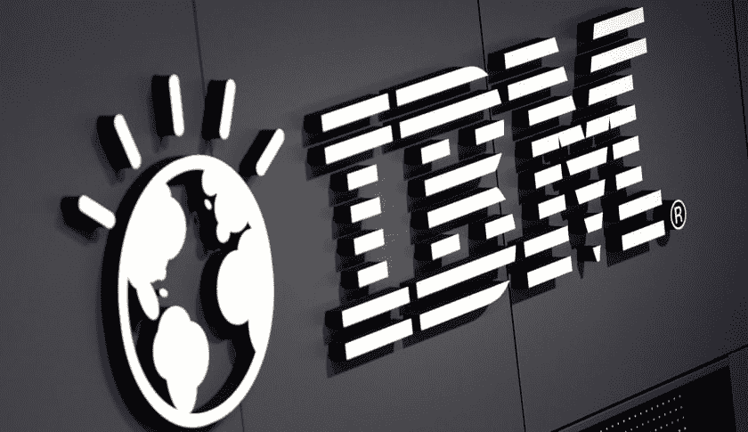
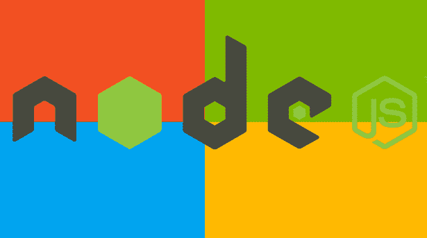

# JavaScript 正在吞噬世界

> 原文:[https://dev . to/anthonydelgado/JavaScript-is-eating-the-world](https://dev.to/anthonydelgado/javascript-is-eating-the-world)

如果你还没有听说这个消息，JavaScript 和 NodeJS 正在独自蚕食软件世界。NodeJS 是一个开源的服务器端 JavaScript 环境，基于 Google Chrome 中的 V8 JS 引擎。NodeJS 曾经只被认为是“潮人”技术，现在它正迅速成为构建 web 应用程序最常用的环境之一，并开始进入企业。

下面是 5 家大公司的列表，它们已经采用了流行的“hipster”服务器端 JavaScript 引擎，用于高流量、高知名度的制作项目。

### #1 网飞

[T2】](https://res.cloudinary.com/practicaldev/image/fetch/s--L6N5I7Ln--/c_limit%2Cf_auto%2Cfl_progressive%2Cq_auto%2Cw_880/https://media.licdn.com/mpr/mpr/AAEAAQAAAAAAAAjkAAAAJDBlMmY4MjNjLWViYTYtNGYyMi04OGNiLTU0NmUyZTA0YzNkZg.jpg)

Nexflix 使用 JavaScript 和 NodeJS 将他们的网站转变成一个单页面应用程序。传统上，网飞一直是一个企业 Java 商店，但“随着我们从数据中心迁移到云，我们转向了一个更加基于服务的架构，”Trott 说。该公司正在将过去的单一 Java 应用程序分解为一系列较小的服务。Java 仍然支持网飞的后端，但用户看到的所有东西都来自 Node。除了 Node，网飞也在他们的堆栈中使用 ReactJS。

[https://www.youtube.com/embed/p74282nDMX8](https://www.youtube.com/embed/p74282nDMX8)

### #2 贝宝

[T2】](https://res.cloudinary.com/practicaldev/image/fetch/s--a66qcuN5--/c_limit%2Cf_auto%2Cfl_progressive%2Cq_auto%2Cw_880/https://media.licdn.com/mpr/mpr/AAEAAQAAAAAAAAdgAAAAJDg4ZDdhNWE4LTZiNzgtNDQ0ZS1iZDA1LTJhZjU4YzcwY2U5NA.jpg)

PayPal 也在从 Java 转向 JavaScript 和 NodeJS，用于他们的网络应用平台。PayPal 开始使用 NodeJS 作为原型平台，当它被证明非常有效时，他们决定在生产中试用它。PayPal 在产品中首次使用 NodeJS 并不是一个次要的应用程序；这是他们的账户概览页面，是该应用最受欢迎的功能之一。作为保险，PayPal 团队同时使用 Java 开发了相同的“帐户概览”重建，结果证明了他们的假设，即 JavaScript 团队能够更快、更有效地构建产品。由于这种转变，PayPal 已经发布了一个名为 [KrakenJS](http://krakenjs.com/) 的 ExpressJS 开源扩展，可以为 NodeJS 服务器增加一层额外的安全性和可扩展性。

[https://www.youtube.com/embed/-00ImeLt9ec](https://www.youtube.com/embed/-00ImeLt9ec)

### #3 妖孽

优步在 Node.js 分布式 Web 架构上建立了庞大的司机/乘客匹配系统。在下面的 Node.js 互动大会上，看看优步的 Tom Crouche 的主题演讲。汤姆是一名高级网站可靠性工程师，他讲述了 Node.js 在优步的使用情况，以及未来的发展如何要求社区拓展 Node.js 的边界和期望。优步的 [GitHub 页面](http://uber.github.io/)也是了解该公司最关键系统的良好资源。

[https://www.youtube.com/embed/ElI5QtUISWM](https://www.youtube.com/embed/ElI5QtUISWM)

### #4 IBM

[T2】](https://res.cloudinary.com/practicaldev/image/fetch/s--h_aI_oIa--/c_limit%2Cf_auto%2Cfl_progressive%2Cq_auto%2Cw_880/https://media.licdn.com/mpr/mpr/AAEAAQAAAAAAAAgGAAAAJGRhZDk3ZmM3LTRlOTctNDE5Zi1hY2IwLTUxMWZhMDU5MWJjYg.jpg)

IBM 也采用了 NodeJS。IBM 的 Myles Borins 在过去的 NodeJS 互动会议上讲述了他的经历。以下是他不得不说的:“2015 年 10 月，我被分配到金矿中的金丝雀上工作，这是一个烟雾测试实用程序，可以自动运行 node.js 生态系统中各种模块的单元测试。CITGM 取得了令人难以置信的成功，在整个生态系统和节点核心本身中发现了各种回归。

[https://www.youtube.com/embed/8is8iKlo8oQ](https://www.youtube.com/embed/8is8iKlo8oQ)

### #5 微软

[T2】](https://res.cloudinary.com/practicaldev/image/fetch/s--0Zg8JYc5--/c_limit%2Cf_auto%2Cfl_progressive%2Cq_auto%2Cw_880/https://media.licdn.com/mpr/mpr/AAEAAQAAAAAAAAgtAAAAJGFjNGM1MjFkLTJjNmQtNDM0NC04MDAwLTI5MWExMWZiNDM4Mw.jpg)

甚至微软也接受了 NodeJS，提供了与他们的 Azure 平台的直接集成，发布了大量针对 Node 的教程，他们甚至宣布计划分叉该项目，并建立自己的 Node 版本，由他们的 Edge Javascript 引擎而不是 Chrome 的 V8 驱动。

[https://www.youtube.com/embed/TSBZIoLWJQo](https://www.youtube.com/embed/TSBZIoLWJQo)