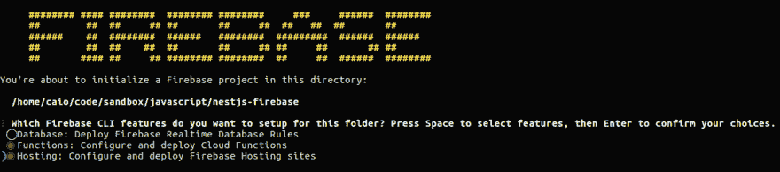
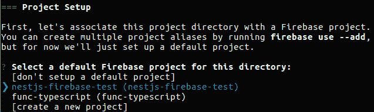
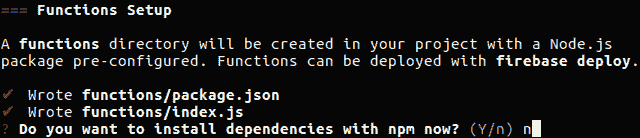
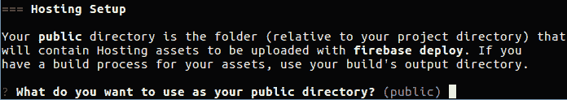
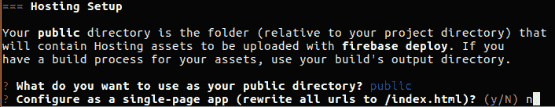
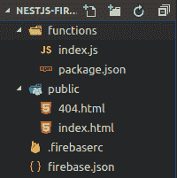
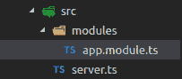

# 用 Typescript 和 Nest 在 Firebase writen 中托管 API

> 原文：<https://dev.to/caiorcferreira/hosting-an-api-in-firebase-writen-with-typescript-and-nest>

本周，我决定测试 Firebase 是否适合一个个人项目，为此我需要了解如何使用 [Nest](https://github.com/kamilmysliwiec/nest) framework 托管一个用 Typescript 编写的 API，这可不是一件容易的事情！正因为如此，我决定写下成功之路，并记录下我遇到的一些问题。

作为免责声明，我知道这是一个非常具体的项目，没有多少人(如果有的话)会用这样的堆栈来构建，但是如果你想的话，你可以用这个[库](https://github.com/caiorcferreira/nest-js-firebase)来加速这个过程，这个库是我在作为一个初学者回购发表这篇文章时写的。
现在，即使你不会用这个栈来构建什么东西，你也可以得到一些提示，我会在这篇文章的最后留下这些提示，它们可能会帮助你用不同的栈来启动一个项目。

### 先决条件

您需要安装以下软件包:

*   Firebase 工具
*   @ Google-cloud/函数-模拟器
*   网络包
*   Nodemon

##### *提示 1*

我见过很多人在运行 firebase 模拟器时遇到问题，这是用来在本地运行项目的。我建议按以下方式安装:

1.  如果你已经安装了 firebase 工具，用`$ npm remove -g firebase-tools`卸载它。

2.  然后，用`$ npm install -g @google-cloud/firebase-functions`安装包@ Google-cloud/functions-emulator。

3.  然后，重新安装 firebase 工具:`$ npm install -g firebase-tools`。

### 建筑工程脚手架

创建您的项目文件夹，并输入它

```
$ mkdir nestjs-firebase
$ cd nestjs-firebase 
```

Enter fullscreen mode Exit fullscreen mode

使用 Firebase CLI 创建初始项目

```
$ firebase init 
```

Enter fullscreen mode Exit fullscreen mode

当您运行此命令时，会出现一个配置菜单提示，然后按照以下步骤操作:

*   用空格标记函数和托管功能，然后按 enter 键。
*   设置您的 Firebase 项目
*   输入`n`不安装 npm 依赖项
*   按 enter 键使用默认的托管目录作为公共目录。
*   输入`n`禁用单应用配置

然后，打开您最喜欢的代码编辑器。我将使用 Visual Studio 代码。你会看到下面的文件夹结构:
[](https://res.cloudinary.com/practicaldev/image/fetch/s--TZUHg_xF--/c_limit%2Cf_auto%2Cfl_progressive%2Cq_auto%2Cw_880/http://gdurl.com/JQtv)

现在用`$ cd functions`进入 functions 文件夹，用下面的代码更新其中的 package.json 文件。

```
{  "name":  "nestjs-firebase",  "description":  "NestJS app with Cloud Functions for Firebase",  "scripts":  {  "build":  "webpack",  "serve":  "webpack && firebase serve --only functions,hosting",  "serve:dev":  "nodemon -w *.ts --exec npm run serve",  "deploy":  "webpack && firebase deploy --only functions,hosting"  },  "dependencies":  {  "firebase-admin":  "~4.2.1",  "firebase-functions":  "^0.5.9",  "@nestjs/common":  "*",  "@nestjs/core":  "*",  "@nestjs/microservices":  "*",  "@nestjs/testing":  "*",  "@nestjs/websockets":  "*",  "@types/express":  "^4.0.37",  "express":  "^4.15.4",  "redis":  "^2.7.1",  "reflect-metadata":  "^0.1.10",  "rxjs":  "^5.4.0",  "typescript":  "^2.3.2"  },  "devDependencies":  {  "@types/node":  "^7.0.5",  "ts-loader":  "^2.3.3",  "webpack-node-externals":  "^1.6.0"  },  "private":  true  } 
```

Enter fullscreen mode Exit fullscreen mode

然后，运行`$ npm install`。之后，创建 src 文件夹`$ mkdir src`并删除 *index.js* 。接下来，用这个创建 *webpack.config.js* `$ > webpack.config.js`。

```
// webpack.config.js
'use strict';

const nodeExternals = require('webpack-node-externals');

module.exports = {
    entry: './src/server.ts',
    output: {
        filename: 'index.js', // <-- Important
        libraryTarget: 'this' // <-- Important
    },
    target: 'node', // <-- Important
    module: {
        rules: [
            {
                test: /\.tsx?$/,
                loader: 'ts-loader',
                options: {
                    transpileOnly: true
                }
            }
        ]
    },
    resolve: {
        extensions: [ '.ts', '.tsx', '.js' ]
    },
    externals: [nodeExternals()] // <-- Important
}; 
```

Enter fullscreen mode Exit fullscreen mode

现在，在 src 文件夹中创建 this 结构，内容如下。
[](https://res.cloudinary.com/practicaldev/image/fetch/s--LPpo8W1K--/c_limit%2Cf_auto%2Cfl_progressive%2Cq_auto%2Cw_880/http://gdurl.com/6nFi)T4】

```
// server.ts
import * as functions from 'firebase-functions';
import * as express from 'express';

import { NestFactory } from '@nestjs/core';
import { ApplicationModule } from './modules/app.module';

const server = express();
const app = NestFactory.create(ApplicationModule, server);

app.init();
exports.api = functions.https.onRequest(server); 
```

Enter fullscreen mode Exit fullscreen mode

```
// app.module.ts
import { Module } from '@nestjs/common';

@Module({})
export class ApplicationModule {} 
```

Enter fullscreen mode Exit fullscreen mode

最后这样更新 firebase.json。

```
{  "hosting":  {  "public":  "public",  "rewrites":  [{  "source":  "**",  "function":  "api"  }],  "ignore":  [  "firebase.json",  "**/.*",  "**/node_modules/**"  ]  }  } 
```

Enter fullscreen mode Exit fullscreen mode

而且，如果您想在 API 中使用根 url，您需要删除或重命名 *public/index.html* 。
T3】

##### *提示二*

如果你在 Linux 上(不知道其他 OS 有没有这种情况)，运行`$ firebase serve`的时候可能会有问题。这是由权限问题引起的，您可以用两种方法解决这个问题:

1.  使用 sudo 从 firebase 运行 serve 和 deploy 命令。
2.  将全局 node_modules 中 firebase-tools 文件夹的所有者更改为您的用户。

我推荐第二种方法，否则，当 nodemon 重新启动服务器时，它不会终止之前的进程，所以每次重新启动时，firebase 工具都会看到端口 5000 被使用，并开始侦听另一个进程，这将在您的计算机中堆积起来。

### 结论

现在，您可以开发您的项目并使用以下命令运行它:

*   构建应用程序`$ npm run build`
*   运行服务器`$ npm run serve`
*   运行服务器进行开发`$ npm run serve:dev`
*   将其部署到 Firebase `$ npm run deploy`

希望我能帮助到一些人，如果你有问题或建议，请留下你的评论。

谢谢大家！

### Fonts

[https://medium . com/Netscape/firebase-cloud-functions-with-typescript-and-web pack-7781 c 882 a 05 b](https://medium.com/netscape/firebase-cloud-functions-with-typescript-and-webpack-7781c882a05b)

[https://github . com/ultra saurus/firebase-functions-typescript](https://github.com/ultrasaurus/firebase-functions-typescript)

[https://stack overflow . com/questions/44871075/redirect-firebase-hosting-root-to-a-cloud-function-is-not-work](https://stackoverflow.com/questions/44871075/redirect-firebase-hosting-root-to-a-cloud-function-is-not-working)

### 提示

[提示 1——Firebase 模拟器问题](#tip-1)
[提示 2——Firebase serve 命令问题](#tip-2)