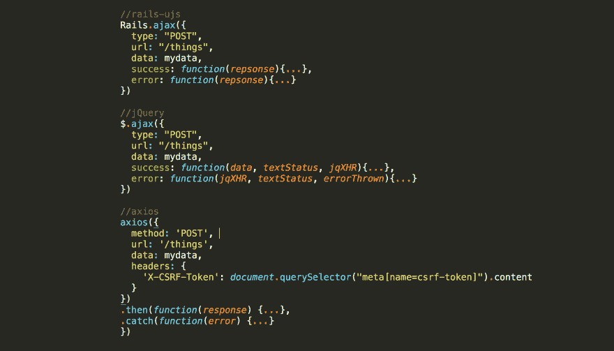

# 如何在 Rails 5.1 中进行 AJAX 调用

> 原文:[https://dev.to/learnetto/how-to-make-ajax-calls-in-rails-51](https://dev.to/learnetto/how-to-make-ajax-calls-in-rails-51)

[T2】](https://res.cloudinary.com/practicaldev/image/fetch/s--HFBXQBw2--/c_limit%2Cf_auto%2Cfl_progressive%2Cq_auto%2Cw_880/https://thepracticaldev.s3.amazonaws.com/i/0wdo3c4b6tqpotx3oy94.png)

*最初发表于[Learnetto.com](https://learnetto.com/blog/how-to-make-ajax-calls-in-rails-5-1)T3。*

Rails 在 5.1 版本中首次没有将 jQuery 作为依赖项。Rails 过去依赖 jQuery 获得不引人注目的 JavaScript 特性，但现在它自带了具有相同特性的库 [**rails-ujs**](https://github.com/rails/rails/tree/master/actionview/app/assets/javascripts) 。

Rails 中 jQuery 最常见的用例之一是通过表单和链接进行 AJAX 调用。如果您是第一次使用 Rails 5.1，您可能会对如何进行 AJAX 调用感到困惑，尤其是像数据格式和包含 CSRF 令牌这样的事情。

所以这个小教程将带你通过几个方法做到这一点:

**1。使用 rails-ujs(无 jQuery)**

一个新的 Rails 5.1 应用程序自动将 rails-ujs 脚本包含在应用程序的 application.js 文件中:

```
//= require rails-ujs 
```

<svg width="20px" height="20px" viewBox="0 0 24 24" class="highlight-action crayons-icon highlight-action--fullscreen-on"><title>Enter fullscreen mode</title></svg> <svg width="20px" height="20px" viewBox="0 0 24 24" class="highlight-action crayons-icon highlight-action--fullscreen-off"><title>Exit fullscreen mode</title></svg>

如果你不想把它放在那里，只是有选择地使用它，比方说，如果你正在用 Rails 的新 webpacker 支持制作一个单独的 React 前端，那么你可以通过把它作为一个包安装来使用 Rails-ujs:

```
$ yarn add rails-ujs 
```

<svg width="20px" height="20px" viewBox="0 0 24 24" class="highlight-action crayons-icon highlight-action--fullscreen-on"><title>Enter fullscreen mode</title></svg> <svg width="20px" height="20px" viewBox="0 0 24 24" class="highlight-action crayons-icon highlight-action--fullscreen-off"><title>Exit fullscreen mode</title></svg>

然后在您的 JavaScript 文件中导入并启动它:

```
import Rails from ‘rails-ujs’
Rails.start() 
```

<svg width="20px" height="20px" viewBox="0 0 24 24" class="highlight-action crayons-icon highlight-action--fullscreen-on"><title>Enter fullscreen mode</title></svg> <svg width="20px" height="20px" viewBox="0 0 24 24" class="highlight-action crayons-icon highlight-action--fullscreen-off"><title>Exit fullscreen mode</title></svg>

从 application.js :
中删除这一行

```
//= require rails-ujs 
```

<svg width="20px" height="20px" viewBox="0 0 24 24" class="highlight-action crayons-icon highlight-action--fullscreen-on"><title>Enter fullscreen mode</title></svg> <svg width="20px" height="20px" viewBox="0 0 24 24" class="highlight-action crayons-icon highlight-action--fullscreen-off"><title>Exit fullscreen mode</title></svg>

现在让我们假设我们想要对一个 API 端点/事物进行一个 AJAX POST 调用，其中包含一些数据，如下所示:

```
mydata = {
 thing: {
  field1: value1,
  field2: value2,
}} 
```

<svg width="20px" height="20px" viewBox="0 0 24 24" class="highlight-action crayons-icon highlight-action--fullscreen-on"><title>Enter fullscreen mode</title></svg> <svg width="20px" height="20px" viewBox="0 0 24 24" class="highlight-action crayons-icon highlight-action--fullscreen-off"><title>Exit fullscreen mode</title></svg>

使用 rails-ujs 进行 AJAX POST 调用看起来与使用 jQuery 进行调用是一样的:

```
Rails.ajax({
  type: "POST", 
  url: "/things",
  data: mydata,
  success: function(repsonse){...},
  error: function(repsonse){...}
}) 
```

<svg width="20px" height="20px" viewBox="0 0 24 24" class="highlight-action crayons-icon highlight-action--fullscreen-on"><title>Enter fullscreen mode</title></svg> <svg width="20px" height="20px" viewBox="0 0 24 24" class="highlight-action crayons-icon highlight-action--fullscreen-off"><title>Exit fullscreen mode</title></svg>

除了一件事！据我所知，你不能简单地发送 JSON 数据。所以我们需要像这样手动将 mydata 转换成 application/x-www-form-urlencoded 内容类型:

```
mydata = 'thing[field1]=value1&thing[field2]=value2' 
```

<svg width="20px" height="20px" viewBox="0 0 24 24" class="highlight-action crayons-icon highlight-action--fullscreen-on"><title>Enter fullscreen mode</title></svg> <svg width="20px" height="20px" viewBox="0 0 24 24" class="highlight-action crayons-icon highlight-action--fullscreen-off"><title>Exit fullscreen mode</title></svg>

在提交请求之前，jQuery 会自动进行这种转换。

我假设 rails-ujs 有一些自动的方法来做这件事，但是我在文档或者代码 中找不到任何东西。

如果你知道，告诉我**。**

 **rails-ujs 自动负责在请求中包含 CSRF 令牌。

**2。使用 jQuery**

如果手动数据转换让您厌烦，您仍然可以使用 jQuery。无论如何，您可能会依赖 jQuery 来处理应用程序中的其他事情，所以这里有几种使用 jQuery 和 Rails 进行 AJAX 调用的方法:

**2.1 使用 jquery-rails gem**

这个宝石曾经自动包含在以前版本的 Rails 中。您可以通过将它添加到您的 Gemfile:
来安装它

```
gem 'jquery-rails' 
```

<svg width="20px" height="20px" viewBox="0 0 24 24" class="highlight-action crayons-icon highlight-action--fullscreen-on"><title>Enter fullscreen mode</title></svg> <svg width="20px" height="20px" viewBox="0 0 24 24" class="highlight-action crayons-icon highlight-action--fullscreen-off"><title>Exit fullscreen mode</title></svg>

然后运行:

```
$ bundle install 
```

<svg width="20px" height="20px" viewBox="0 0 24 24" class="highlight-action crayons-icon highlight-action--fullscreen-on"><title>Enter fullscreen mode</title></svg> <svg width="20px" height="20px" viewBox="0 0 24 24" class="highlight-action crayons-icon highlight-action--fullscreen-off"><title>Exit fullscreen mode</title></svg>

并在您的 application.js 文件中包含 jquery 和 jquery _ ujs:

```
//= require jquery
//= require jquery_ujs 
```

<svg width="20px" height="20px" viewBox="0 0 24 24" class="highlight-action crayons-icon highlight-action--fullscreen-on"><title>Enter fullscreen mode</title></svg> <svg width="20px" height="20px" viewBox="0 0 24 24" class="highlight-action crayons-icon highlight-action--fullscreen-off"><title>Exit fullscreen mode</title></svg>

这就是你所需要的。现在您可以用通常的方式进行 AJAX 调用:

```
$.ajax({
  type: "POST", 
  url: "/things",
  data: mydata,
  success: function(data, textStatus, jqXHR){...},
  error: function(jqXHR, textStatus, errorThrown){...}
}) 
```

<svg width="20px" height="20px" viewBox="0 0 24 24" class="highlight-action crayons-icon highlight-action--fullscreen-on"><title>Enter fullscreen mode</title></svg> <svg width="20px" height="20px" viewBox="0 0 24 24" class="highlight-action crayons-icon highlight-action--fullscreen-off"><title>Exit fullscreen mode</title></svg>

jquery_ujs 负责包含 CSRF 令牌，jquery 自动将数据转换为 application/x-www-form-urlencoded 内容类型。

**2.2。使用来自 npm 的 jquery 包**

如果您不想使用 jQuery 的 gemi 化版本，可以从 npm:
将它作为 JavaScript 包安装

```
$ yarn add jquery
$ yarn add jquery-ujs 
```

<svg width="20px" height="20px" viewBox="0 0 24 24" class="highlight-action crayons-icon highlight-action--fullscreen-on"><title>Enter fullscreen mode</title></svg> <svg width="20px" height="20px" viewBox="0 0 24 24" class="highlight-action crayons-icon highlight-action--fullscreen-off"><title>Exit fullscreen mode</title></svg>

然后将它们导入您的 JavaScript 文件:

```
import $ from ‘jquery’
import {} from ‘jquery-ujs’ 
```

<svg width="20px" height="20px" viewBox="0 0 24 24" class="highlight-action crayons-icon highlight-action--fullscreen-on"><title>Enter fullscreen mode</title></svg> <svg width="20px" height="20px" viewBox="0 0 24 24" class="highlight-action crayons-icon highlight-action--fullscreen-off"><title>Exit fullscreen mode</title></svg>

如果已经安装了 jquery-rails gem，请确保删除它，并从 application.js 中删除 jquery 和 jquery_ujs

您可能会得到一个错误消息，说 jQuery 没有定义。在 webpack 配置文件中，将其添加到 config.plugins 数组:

```
new webpack.ProvidePlugin({
 $: “jquery”,
 jQuery: “jquery”
}), 
```

<svg width="20px" height="20px" viewBox="0 0 24 24" class="highlight-action crayons-icon highlight-action--fullscreen-on"><title>Enter fullscreen mode</title></svg> <svg width="20px" height="20px" viewBox="0 0 24 24" class="highlight-action crayons-icon highlight-action--fullscreen-off"><title>Exit fullscreen mode</title></svg>

现在您将能够使用 jQuery 进行 AJAX 调用。

**3。使用 axios**

[**axios**](https://github.com/mzabriskie/axios) 是一个基于承诺的 HTTP 库。您可以使用它从 node.js(在服务器上)发出 HTTP 请求，也可以从浏览器发出 AJAX 请求。

如果您不需要 jQuery 的任何其他特性，这是一个不错的选择。要在 Rails 5.1 应用程序(带 webpacker)中使用 axios，请安装它:

```
$ yarn add axios 
```

<svg width="20px" height="20px" viewBox="0 0 24 24" class="highlight-action crayons-icon highlight-action--fullscreen-on"><title>Enter fullscreen mode</title></svg> <svg width="20px" height="20px" viewBox="0 0 24 24" class="highlight-action crayons-icon highlight-action--fullscreen-off"><title>Exit fullscreen mode</title></svg>

然后将其导入您的 JavaScript 文件:

```
import axios from ‘axios’ 
```

<svg width="20px" height="20px" viewBox="0 0 24 24" class="highlight-action crayons-icon highlight-action--fullscreen-on"><title>Enter fullscreen mode</title></svg> <svg width="20px" height="20px" viewBox="0 0 24 24" class="highlight-action crayons-icon highlight-action--fullscreen-off"><title>Exit fullscreen mode</title></svg>

现在我们可以这样调用 AJAX:

```
axios({
  method: 'POST', 
  url: '/things',
  data: mydata,
  headers: {
    'X-CSRF-Token': document.querySelector("meta[name=csrf-token]").content
  }
})
.then(function(response) {...},
.catch(function(error) {...}
}) 
```

<svg width="20px" height="20px" viewBox="0 0 24 24" class="highlight-action crayons-icon highlight-action--fullscreen-on"><title>Enter fullscreen mode</title></svg> <svg width="20px" height="20px" viewBox="0 0 24 24" class="highlight-action crayons-icon highlight-action--fullscreen-off"><title>Exit fullscreen mode</title></svg>

这里需要注意一些事情:

我们必须包括 CSRF 令牌头。与 jquery_ujs 和 rails-ujs 不同，它不会自动包含在 axios 请求中。

我们可以将其指定为默认设置，以避免在所有 AJAX 调用中重复使用:

```
const csrfToken = document.querySelector("meta[name=csrf-token]").content 

axios.defaults.headers.common[‘X-CSRF-Token’] = csrfToken 
```

<svg width="20px" height="20px" viewBox="0 0 24 24" class="highlight-action crayons-icon highlight-action--fullscreen-on"><title>Enter fullscreen mode</title></svg> <svg width="20px" height="20px" viewBox="0 0 24 24" class="highlight-action crayons-icon highlight-action--fullscreen-off"><title>Exit fullscreen mode</title></svg>

我们可以使用 promises 语法*访问成功和错误响应。然后*。

另一个选择是使用 [**获取**](https://developer.mozilla.org/en-US/docs/Web/API/Fetch_API/Using_Fetch) ，但这是一个实验性的 API，并不是在所有浏览器中都默认可用。所以你最好使用 [**Github 的聚合填充库**](http://fetch) 。我更喜欢用 axios 来获取，因为获取响应需要首先被转换成 json，而且错误处理也会令人困惑。**