# 如何在数字海洋服务器上用 Laravel 创建灯栈

> 原文：<https://dev.to/rizwan_saquib/how-to-create-lamp-stack-with-laravel-on-digital-ocean-server>

Laravel 已经成为各种项目的首选 PHP 框架。从一个简单的网络应用到巨大的企业门户，laravel 可以胜任所有领域的任务。这个健壮的框架是非常通用的，并且受到一个非常热情的开发者和用户社区的支持。Laravel 的一个优点是它易于安装，并且兼容所有的开发环境，只有一个例外；Laravel 框架在云服务器上的安装。

在本教程中，我将带你完成在 Ubuntu 上安装 Laravel powered LAMP stack 的步骤。出于本教程的目的，我将使用运行 Ubuntu 16.04.2 的 DigitalOcean (DO)云服务器。

## 连接做云服务器

连接到云服务器最常见、最方便的方式是通过安全外壳(SSH)。这个 shell 为连接到云服务器并在其上执行命令提供了一个安全可靠的通信通道。

SSH 是预先构建在 Linux 环境中的。对于 MS Windows，可以使用 [PuTTY](http://www.chiark.greenend.org.uk/~sgtatham/putty/latest.html) 来启用它们。要连接到云服务器，您必须拥有以下凭据:

*   服务器 IP 地址
*   用户名
*   密码或 SSH 密钥

启动 PuTTY 并填写服务器 IP 地址。

[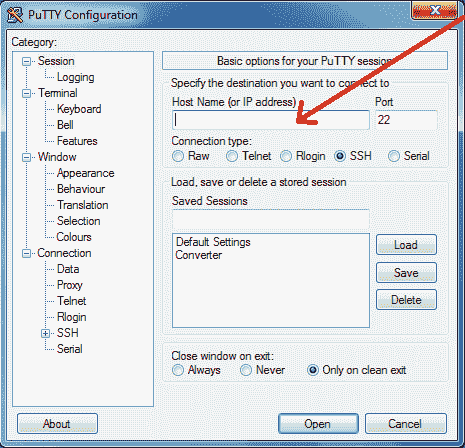T2】](https://res.cloudinary.com/practicaldev/image/fetch/s--USELWPCc--/c_limit%2Cf_auto%2Cfl_progressive%2Cq_auto%2Cw_880/https://cdn.filestackcontent.com/kZRwprtKR3KDlvrNmfmb)

点击**打开**。您将看到一个安全警告，通知您以前没有连接到此服务器。如果你确定你得到了正确的 IP 地址，点击**是**。

[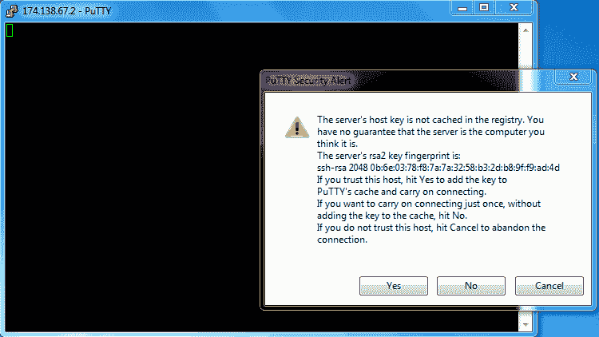T2】](https://res.cloudinary.com/practicaldev/image/fetch/s--PYEB1Ma4--/c_limit%2Cf_auto%2Cfl_progressive%2Cq_auto%2Cw_880/https://cdn.filestackcontent.com/pEJUNnnRRSjWx8KN8bgS)

接下来，插入服务器的登录凭证(用户名和密码)。
**注意:**您将无法在控制台屏幕上看到密码。

[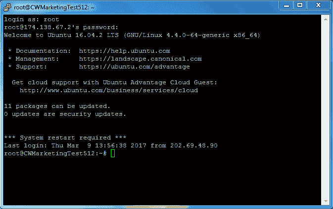T2】](https://res.cloudinary.com/practicaldev/image/fetch/s--nflXQd2R--/c_limit%2Cf_auto%2Cfl_progressive%2Cq_auto%2Cw_880/https://cdn.filestackcontent.com/NCG7tCoSzeerrnnXH7JI)

现在，您已经输入了用户名和密码，应该可以成功连接到服务器了。

## 灯栈简介

LAMP stack 是开源软件的集成和互连设置。该设置由 **L** inux、 **A** pache web 服务器、 **M** ySQL(一个开源 RDBMS)和 **P** HP 组成。

LAMP stack 可能是为 web 开发设置服务器的最常见的解决方案。这种通用选择的一个重要原因是成本因素-灯组的所有组件都可以免费使用。此外，各个组件背后的社区非常活跃，补丁和更新经常发布，以确保一切都处于最佳工作状态。

## 检查包的更新

在安装 LAMP stack 之前，更新服务器上所有可用的软件包。为此，请使用以下命令:

`$ apt-get update`
`$ apt-get upgrade`
T2】

[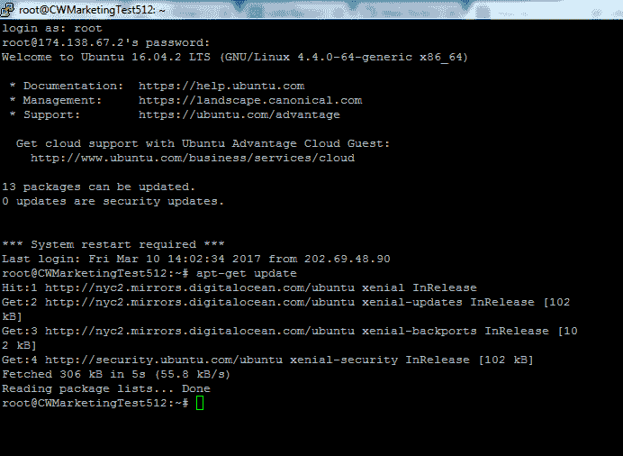T2】](https://res.cloudinary.com/practicaldev/image/fetch/s--VEoJZ7d7--/c_limit%2Cf_auto%2Cfl_progressive%2Cq_auto%2Cw_880/https://cdn.filestackcontent.com/ifr993zPQjm3hjMIfNmQ)

这是重要的一步，因为所有包的最新版本确保了过程的其余部分和随后的 Laravel 开发过程顺利进行。

让我们从部署灯堆栈开始！我们从安装 Apache web 服务器开始。

## 安装 Apache Web 服务器

Apache 是一个开放源代码的 web 服务器，它托管着互联网上大约 50%的网站。要在 DO cloud 服务器上安装 Apache 服务器，请使用以下命令:

`$ apt-get install apache2`

[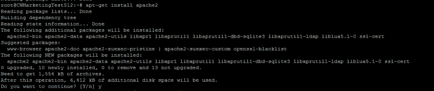T2】](https://res.cloudinary.com/practicaldev/image/fetch/s--YI42jmOp--/c_limit%2Cf_auto%2Cfl_progressive%2Cq_auto%2Cw_880/https://cdn.filestackcontent.com/YP9VzwtSE2jlLOUocfKx)

在安装过程中，可能会询问您是否需要额外的磁盘空间。按下 **Y** ，Apache 安装过程将恢复。

安装完成后，启动浏览器，在地址栏中输入服务器的 IP 地址。如果安装成功，您应该会看到以下页面:

[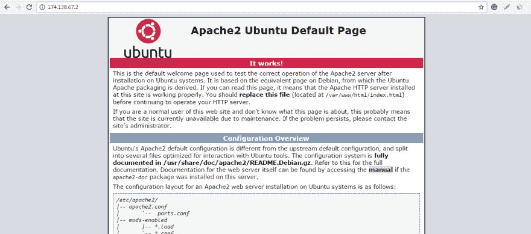T2】](https://res.cloudinary.com/practicaldev/image/fetch/s--vhTnoglG--/c_limit%2Cf_auto%2Cfl_progressive%2Cq_auto%2Cw_880/https://cdn.filestackcontent.com/abJmJKAeQei2NQJM1fJT)

默认情况下，Apache 被配置为运行位于 **/var/www/html** 文件夹中的服务器脚本。为了改变这种行为并确保服务器执行来自 **public_html** 文件夹的脚本。我将配置 **000-default.conf** 文件(位于 apache2/sites-enabled 文件夹中。使用以下命令导航到该文件夹:

`$ cd /etc/apache2/sites-enabled`

[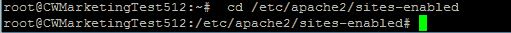T2】](https://res.cloudinary.com/practicaldev/image/fetch/s--CW9rNZ4P--/c_limit%2Cf_auto%2Cfl_progressive%2Cq_auto%2Cw_880/https://cdn.filestackcontent.com/FKTCmlxYRlOsHgv5a6Te)

现在，要在 Vim 中打开配置文件，使用以下命令:

`$ vim 000-default.conf`

找到 **DocumentRoot** 的条目，按 **i** 编辑文件，然后用 **public_html** 替换 **html** 。查看下面的截图:

[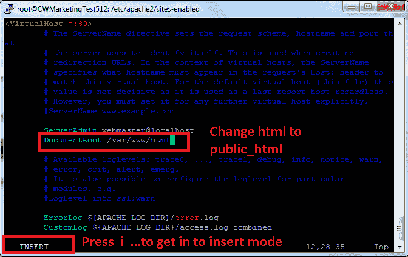T2】](https://res.cloudinary.com/practicaldev/image/fetch/s--3dwwIcEK--/c_limit%2Cf_auto%2Cfl_progressive%2Cq_auto%2Cw_880/https://cdn.filestackcontent.com/8MDHnENcSHeWHxxaHdTx)

完成后，按 Esc，然后按 **:wq** 保存并退出编辑器。接下来，将 **/var/www/html** 文件夹重命名为 **public_html** 。为此，请使用以下一组命令:

`$ cd /var/www`
`$ mv html public_html`
T2】

[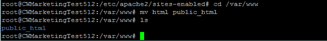T2】](https://res.cloudinary.com/practicaldev/image/fetch/s--NR4Tue4_--/c_limit%2Cf_auto%2Cfl_progressive%2Cq_auto%2Cw_880/https://cdn.filestackcontent.com/UTuOeDVZToRoI8c2vIwJ)

现在，我有了一个工作的 public_html 文件夹，用下面的命令重新启动 web 服务器服务:

`$ service apache2 restart`

要尝试新设置，请在浏览器中重新输入 IP 地址。您应该会看到 Apache 服务器的欢迎页面。您的 Apache 服务器已经启动并运行了！

## 安装 MySQL DBMS

现在让我们安装 MySQL，这是一个流行的关系数据库管理系统，通常用于 PHP 应用程序。

要在云服务器上安装 MySQL，请转到根文件夹，通过输入以下命令启动安装过程:

`$ cd`

T1】

该过程将暂停以征求您的许可。键入 **Y** 并按回车键。在下一个窗口中，设置 MySQL root 用户的密码。

[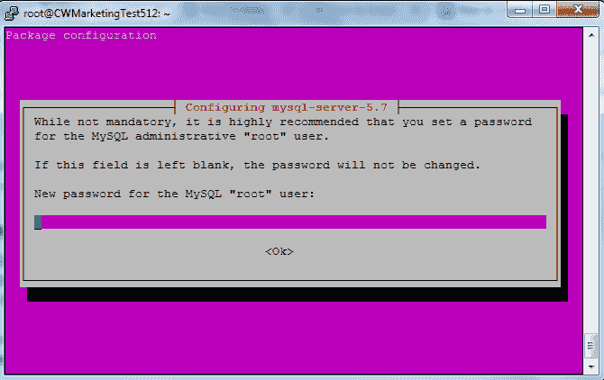T2】](https://res.cloudinary.com/practicaldev/image/fetch/s--b5Hom7Gt--/c_limit%2Cf_auto%2Cfl_progressive%2Cq_auto%2Cw_880/https://cdn.filestackcontent.com/10p7pUpQKu6FYhRa2Tvy)

这一过程很快就会结束。接下来我会根据 LAMP 栈的要求配置 MySQL。输入以下命令:

`$ mysql_secure_installation`

该命令将要求您输入根用户的密码。

**注意:**输入密码时将看不到。

接下来，设置以下配置:

*   按下 **Y** 来设置验证密码插件。
*   选择密码验证策略的级别。(出于本教程的*目的，我选择了最低)。
*   输入 **N** 以便不更改 root 密码并点击 Enter，然后输入 **Y** 删除匿名用户并点击 Enter。
*   如果您想禁止 root 用户远程登录，请键入 **N** 并按回车键。
*   现在，键入 **Y** 删除测试表和数据库并按 Enter 键，然后再次键入 **Y** 并按 Enter 键。

完成这些步骤后，您应该会看到**全部完成！**在屏幕上。 **MySQL** 数据库管理系统现已成功安装和配置。

## 安装 PHP

现在我们开始安装 PHP。超文本预处理器的缩写，PHP 是一种开源的 web 脚本语言，非常适合创建动态网站。要在您的服务器上安装最新版本的 PHP，请键入以下命令:

`$ apt install php7.0-cli`

这个命令将在服务器上安装 PHP。在这个过程的开始，你可能会被问到是否要继续？按下 **Y** 。

[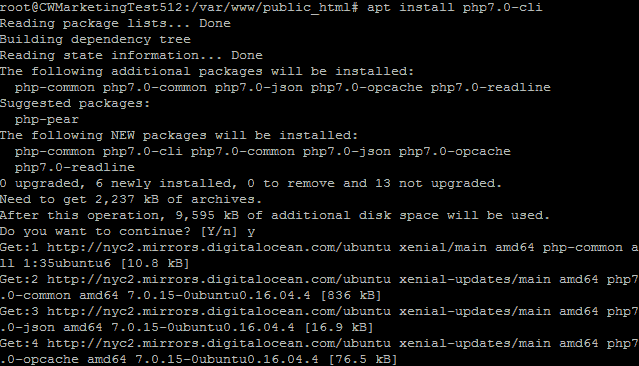T2】](https://res.cloudinary.com/practicaldev/image/fetch/s--qSdx-bt4--/c_limit%2Cf_auto%2Cfl_progressive%2Cq_auto%2Cw_880/https://cdn.filestackcontent.com/2GuRjCfT9C02boJaHExW)

安装完成后，安装 PHP 的 **lib_apache2 mod** 。接下来，重新启动 Apache 服务。对这两项任务使用以下命令:

`$ apt install libapache2-mod-php7.0`
T1】

转到 **public_html** 文件夹，创建一个简单的 PHPinfo 文件。使用以下命令:

`$ cd`
`$ cd /var/www/public_html`
`$ rm index.html`

现在，按下 **I** 并输入以下代码:

`<?php echo phpinfo(); ?>`

通过按下 **Esc** 保存并键入 **:wq** 保存并退出。现在，通过在浏览器的地址栏中输入服务器 IP 地址来测试这个文件。您应该会看到类似这样的内容:

[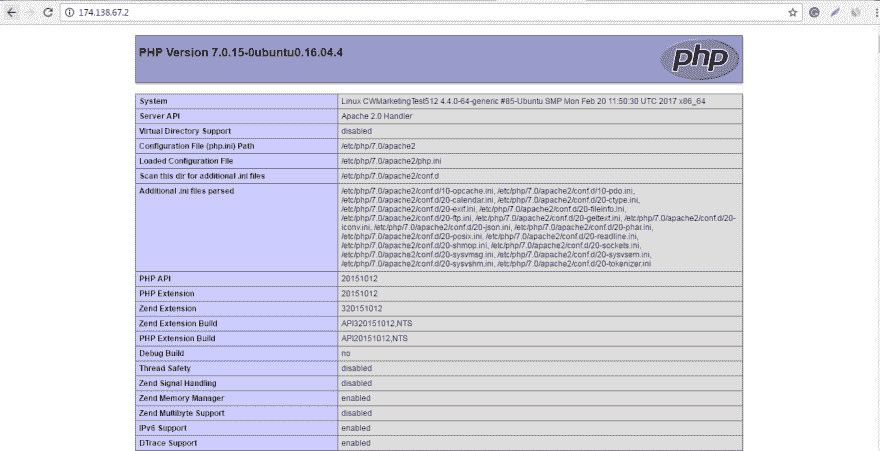T2】](https://res.cloudinary.com/practicaldev/image/fetch/s--Ro1Q2xa7--/c_limit%2Cf_auto%2Cfl_progressive%2Cq_auto%2Cw_880/https://cdn.filestackcontent.com/KuqKUQLCRkKu7i8v83Cy)

至此，**灯**栈已经成功安装在 **DO 云**服务器上。然而，还有一些工作要做。

## 安装 PHPmyAdmin

开发人员需要一个 UI 来管理 MySQL。PHPmyAdmin 是 MySQL 最流行的开源 GUI 之一。要在服务器上设置 PHPmyAdmin，请执行以下命令:

`$ apt-get install php7.0-mbstring`
`$ apt-get install mcrypt`
`$ service apache2 restart`

该过程将要求您选择要安装的服务器。选择 **Apache** 并按回车键。接下来，提供您的 MySQL 凭证。PHPMyAdmin 将被安装在 **/usr/share/phpmyadmin** 。

接下来，我将在 public_html 文件夹中创建相关的符号链接。键入以下命令，转到 public_html 文件夹并创建符号链接:

`$ cd`
`$ cd /var/www/public_html`
`$ ln -s /usr/share/phpmyadmin`

[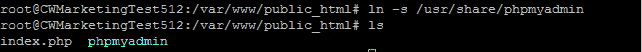T2】](https://res.cloudinary.com/practicaldev/image/fetch/s--DJJ2GJHi--/c_limit%2Cf_auto%2Cfl_progressive%2Cq_auto%2Cw_880/https://cdn.filestackcontent.com/IO5uTdCUSAuVEiv51lve)

现在在浏览器中输入**your _ server _ IP/phpmyadmi**n。您将看到 PHPmyAdmin 的登录表单:

[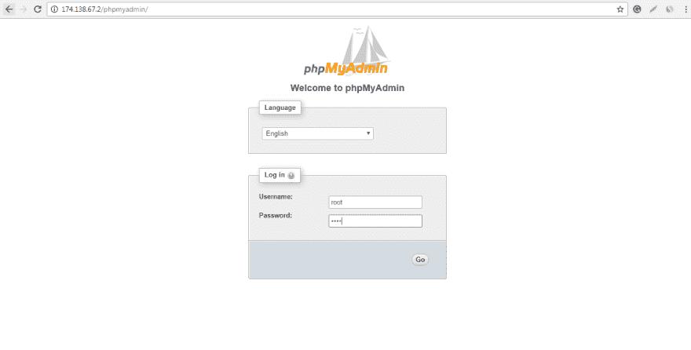T2】](https://res.cloudinary.com/practicaldev/image/fetch/s--CwpUWc1h--/c_limit%2Cf_auto%2Cfl_progressive%2Cq_auto%2Cw_880/https://cdn.filestackcontent.com/OXSFMO1cQfWU4RGone4t)

现在，我将通过创建一个**来保护它。使用 PHPMyAdmin 文件夹中的 Vim 访问文件。这个安全措施将确保只允许您的服务器的 IP 与 PHPMyAdmin 通信:**

`$ cd phpmyadmin`
T1】

按下 **I** 并输入以下代码:

`order allow,deny`
T1】

现在，你的 Laravel 项目已经准备好了！但是在你开始你的项目之前，重要的是着手建立一些你的开发项目需要的预备资源。

## 安装 Git 和 Composer

Git 和 Composer 是使用 Laravel 的两个基本资源。Git 是一个免费的开源分布式版本控制系统，旨在处理大量的项目。Composer 是一个非常有用的工具，可以帮助管理 PHP 中的依赖关系。Composer 允许您声明项目所依赖的库，它将为您管理它们。

我将使用一个简单的命令开始安装 git:

`$ apt-get install git-all`

这个命令是让 git 运行 Laravel 项目所需要的。

现在我将安装 [Composer](https://getcomposer.org/download/) 并把它移到 **Bin** 文件夹，这样我就可以在命令行上使用它了。在该过程中使用以下命令:

`$ php -r "copy('https://getcomposer.org/installer', 'composer-setup.php');"`
T1】

`$ php composer-setup.php`
`$ php -r "unlink('composer-setup.php');"`
T2】

## 使用 Composer 安装 Laravel

现在要安装 Laravel，转到 **public_html** 文件夹，键入以下命令:

`$ cd`
`$ cd /var/www/public_hmtl`
`$ composer create-project --prefer-dist laravel/laravel myapplication`
`$ cd myapplication`
T4】

至此，Laravel 已经安装完毕，可以使用了。要测试安装是否成功，请在浏览器中键入**your _ server _ Ip _ address/my application/public**。您将看到 Laravel 欢迎页面。

[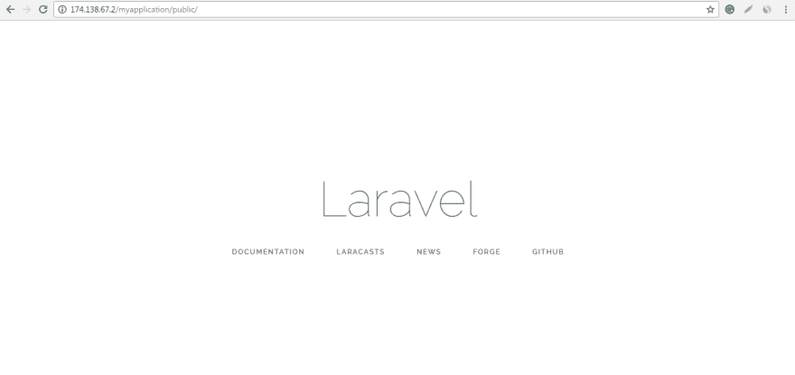T2】](https://res.cloudinary.com/practicaldev/image/fetch/s--RMK-GUFM--/c_limit%2Cf_auto%2Cfl_progressive%2Cq_auto%2Cw_880/https://cdn.filestackcontent.com/vkfUughNSEub6zJCASgu)

## 在托管平台上部署 Laravel

正如你所看到的，这是一个完全合法的，但是在云主机上直接设置服务器的漫长而乏味的过程。更不用说不断需要监控和维护您的服务器！。

要体验高性能堆栈、简单的部署流程以及对您的服务器和相关资源的轻松管理和监控，您的最佳选择是与 Cloudways 等[托管 laravel 托管](https://www.cloudways.com/en/laravel-hosting.php)提供商签约。

Cloudways 拥有业内最好的 PHP 堆栈之一，包括 Nginx、Varnish、Apache、PHP-FPM、Memcached/Redis、MySQL 和完整的 PHP 7 支持。只需点击几下**,你就可以将你的应用托管到(谷歌、亚马逊、数字海洋、Vultr 和 Kyup)上。**

还有诱人的折扣优惠和免费信贷。例如，使用优惠券代码: **WPMUDEV** 可以免费获得 50 美元的信用点数！

## 结论

在本教程中，我介绍了 LAMP stack，然后讨论了在运行 Ubuntu 的 DO cloud 服务器上安装该堆栈。接下来，我在 LAMP stack 上安装了 Laravel，然后提到了一种更快的替代方法，您可以使用 Cloudways 来准备您的 Laravel 环境。

但是请注意，LAMP stack 是任何服务器上最基本的设置，它可以让你运行一个基于 PHP 的网站。但是行业发展很快，将灯堆限制为仅仅是一个基本的解决方案。其他流行的解决方案使用 LEMP 堆栈，其中 Apache 被轻量级和强大的 Nginx 所取代，或者使用 Nginx 和 Apache 一起使用的堆栈，以及强大的缓存技术，如 Varnish cache 等。