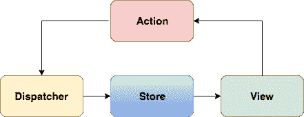

# Redux 的内容和原因

> 原文:[https://dev.to/pmbanugo/the-what-and-why-of-redux](https://dev.to/pmbanugo/the-what-and-why-of-redux)

*本文最初发表在[推手](https://blog.pusher.com/the-what-and-why-of-redux/)上，在推手客作家计划*下

Redux！Redux！！Redux！！！Redux 到底是什么，我为什么需要它？当我开始学习如何构建单页应用程序(SPA)以在我的应用程序中包含丰富的交互时，我问过自己这个问题。SPA 能够重新呈现 UI 的不同部分，而不需要服务器往返。这是通过将代表应用程序状态的不同数据从这些数据的表示中分离出来实现的。
**视图**层将这些数据呈现给用户界面。一个视图可以由不同的组件组成。例如，考虑一个带有产品列表页面的在线商店。该页面可以包含表示不同产品及其价格的组件、购物车中所有商品的直观计数，以及建议购买类似商品的组件。
**m****odel**层包含了视图层要渲染的数据。视图中的每个组件相互独立，每个组件为给定的数据呈现一组可预测的 UI 元素，但是多个组件可以共享相同的数据。当模型发生变化时，视图会重新渲染并更新受模型更新影响的组件。

## 问题

应用程序状态可以存储在内存中的随机对象中。也可以在 DOM 中保存一些状态。但是分散的状态很容易导致难以管理的代码。很难调试。如果多个视图或组件共享相似的数据，有可能将这些数据存储在不同的内存位置，并且视图组件之间不会同步。随着视图与模型的分离，数据从模型传递到视图。如果存在基于用户交互的更改，这将更新模型，并且该模型更新可能触发对另一个模型的更新，并且还更新另一个视图组件，这也可以触发对模型的更新。
这种不可预测的数据流的一个已知问题是脸书的通知漏洞。登录脸书后，您会看到新邮件的通知。当您阅读它时，通知会被清除。在网站上进行一些交互后，通知再次出现，然后您检查并没有新消息，通知被清除。当你与应用程序交互更多时，通知会再次返回，如此循环往复。

## 目的

如果状态管理不当，很容易增加代码的复杂性。因此，最好有一个存放数据的地方，特别是当相同的数据必须在视图中的多个地方显示时。对于杂乱无章的数据流，很难推断状态变化并预测状态变化的可能结果。

## 解决方案:单向数据流和单一事实来源

如果状态管理不当，很容易增加复杂性。因此，最好有一个存放数据的地方，特别是当相同的数据必须在视图中的多个地方显示时。视图组件应该从这个单一的源读取数据，而不是单独保存它们自己的相同状态的版本。因此，需要一个**单一的真相来源**。
在脸书，他们想要一种更简单的方法来预测状态变化，因此提出了一种叫做**通量**的模式。Flux 是一种用于管理数据流的数据层模式。它规定数据应该只向一个方向流动，应用程序状态包含在一个位置(事实的来源)，修改状态的逻辑只在一个位置。

**通量**

[T2】](https://res.cloudinary.com/practicaldev/image/fetch/s--eZpzvdZq--/c_limit%2Cf_auto%2Cfl_progressive%2Cq_auto%2Cw_880/https://d2mxuefqeaa7sj.cloudfront.net/s_63B4E43BA537867EAD57F5241A742310DDD5F5BB13D7F1315135B403A279EEA3_1501269221237_the-what-and-why-of-redux.png)

上图描述了不断变化的数据流。

*   数据从**商店**(真实的来源)流向**视图**。视图读取数据并呈现给用户，用户与不同的视图组件交互，如果他们需要修改应用程序状态，他们通过**动作**来表达他们的意图。
*   Action 捕获任何事物与应用程序交互的方式。它是一个带有“类型”字段和一些数据的普通对象。**调度员**负责向商店发出行动。它不包含更改状态的逻辑，而是由存储本身在内部完成。
*   您可以有多个存储，每个存储包含不同应用程序域的数据。存储对与其维护的状态相关的动作做出响应。如果它更新了状态，它还会通过发出事件来通知连接到该存储的视图。
*   视图获得通知并从存储中检索数据，然后重新呈现。当状态需要再次更新时，它会经历相同的循环，这允许一种简单的方法来推理您的应用程序并使状态变化可预测。

通过实现只允许数据单向流动的应用程序体系结构，可以创建更可预测的应用程序状态。如果出现了一个错误，单向的数据流将更容易查明错误在哪里，因为数据遵循严格的通道。

这种模式有多种实现方式。我们有 [Fluxxor](http://fluxxor.com/) 、 [Flummox](https://github.com/acdlite/flummox/) 、[回流](https://github.com/spoike/refluxjs)等，但 Redux 却傲视群雄。Redux 采用了 Flux 的概念，并对其进行了改进，以创建一个可预测的状态管理库，该库允许轻松实现日志记录、热重装和时间旅行、撤销和重做，从 Elm 架构中获得线索并避免实现这些功能的复杂性。Redux 创建者 Dan Abramov 创建它的目的是获得更好的开发者工具支持，[热重装和时间旅行调试](https://www.youtube.com/watch?v=xsSnOQynTHs)但仍然保持 Flux 带来的可预测性。Redux 试图使状态突变可预测。
Redux 紧随 Flux 的脚步，拥有 3 个概念:

*   真相的单一来源:我已经提到了这样做的必要性。Redux 有它所谓的**店**。存储区是一个包含整个应用程序状态的对象。不同的状态存储在对象树中。这使得实现撤销/重做变得更加容易。例如，我们可以使用 Redux 存储和跟踪购物车中的商品以及当前选择的产品，这可以在商店中建模如下:

```
 {
        "cartItem" : [
            {
                "productName" : "laser",
                "quantity" : 2
            },
            {
                "productName" : "shirt",
                "quantity" : 2
            }
        ],
        "selectedProduct" : {
            "productName" : "Smiggle",
            "description" : "Lorem ipsum ... ",
            "price" : "$30.04"
        }
    } 
```

<svg width="20px" height="20px" viewBox="0 0 24 24" class="highlight-action crayons-icon highlight-action--fullscreen-on"><title>Enter fullscreen mode</title></svg> <svg width="20px" height="20px" viewBox="0 0 24 24" class="highlight-action crayons-icon highlight-action--fullscreen-off"><title>Exit fullscreen mode</title></svg>

*   **状态是只读的**:状态不能被视图或任何其他进程直接改变(可能是网络回调或其他事件的结果)。为了改变状态，你必须通过发出一个动作来表达你的意图。动作是描述您的意图的普通对象，它包含类型属性和一些其他数据。动作可以被记录并在以后重放，这有利于调试和测试。以购物车为例，我们可以按如下方式启动一个操作:

```
 store.dispatch({
      type: 'New_CART_ITEM',
      payload: {
                   "productName" : "Samsung S4",
                   "quantity" : 2
                }
    }) 
```

<svg width="20px" height="20px" viewBox="0 0 24 24" class="highlight-action crayons-icon highlight-action--fullscreen-on"><title>Enter fullscreen mode</title></svg> <svg width="20px" height="20px" viewBox="0 0 24 24" class="highlight-action crayons-icon highlight-action--fullscreen-off"><title>Exit fullscreen mode</title></svg>

`dispatch(action)`发出动作，并且是触发状态改变的唯一方式。要检索状态树，您需要调用 store.getState()。

*   **Reducer**:Reducer 负责计算出需要发生什么样的状态变化，然后转换它以反映新的变化。Reducer 是一个纯粹的函数，它接受前一个状态(即将改变的当前状态)和一个动作，根据动作类型决定如何更新状态，转换它并返回下一个状态(更新后的状态)。继续我们的购物车示例，假设我们想要向购物车添加一个新商品。我们分派一个类型为 **NEW_CART_ITEM** 的动作，在 reducer 中，我们通过通读动作类型并相应地采取行动来决定如何处理这个新的变更请求。对于购物车，它将向购物车中添加新产品:

```
 function shoppingCart(state = [], action) {
      switch (action.type) {
        case 'New_CART_ITEM':
          return [...state, action.payload]
        default:
          return state
      }
    } 
```

<svg width="20px" height="20px" viewBox="0 0 24 24" class="highlight-action crayons-icon highlight-action--fullscreen-on"><title>Enter fullscreen mode</title></svg> <svg width="20px" height="20px" viewBox="0 0 24 24" class="highlight-action crayons-icon highlight-action--fullscreen-off"><title>Exit fullscreen mode</title></svg>

我们所做的是返回一个新的状态，除了来自动作的新状态之外，它还是旧购物车项目的集合。您应该返回一个新的状态对象，而不是改变以前的状态，这确实有助于时间旅行调试。有些事情你绝对不能在减速器内做，它们是:

*   改变它的论点。
*   执行副作用，如 API 调用和路由转换。
*   调用非纯函数。

## 实际例子

为了演示 Redux 的工作方式，我们将制作一个简单的 SPA 来展示如何在 Redux 中管理数据，并使用 React 呈现数据。
要设置，在终端中运行以下命令:

```
$ git clone git@github.com:StephenGrider/ReduxSimpleStarter.git
$ cd ReduxSimpleStarter
$ npm install 
```

<svg width="20px" height="20px" viewBox="0 0 24 24" class="highlight-action crayons-icon highlight-action--fullscreen-on"><title>Enter fullscreen mode</title></svg> <svg width="20px" height="20px" viewBox="0 0 24 24" class="highlight-action crayons-icon highlight-action--fullscreen-off"><title>Exit fullscreen mode</title></svg>

我们刚刚为我们将在本节中构建的内容克隆了一个入门模板。它设置了 react 并下载了 Redux 和 react-redux npm 包。我们将构建一个应用程序，允许我们对待办事项或提醒某些事情的关键字做简短的笔记。

动作是必须有类型的普通 JavaScript 对象，reducers 根据指定的动作决定做什么。让我们定义常量来保存不同的动作。在`./src/actions`中创建一个名为`types.js`的新文件，内容如下:

```
 export const FETCH = 'FETCH';
    export const CREATE = 'CREATE';
    export const DELETE = 'DELETE'; 
```

<svg width="20px" height="20px" viewBox="0 0 24 24" class="highlight-action crayons-icon highlight-action--fullscreen-on"><title>Enter fullscreen mode</title></svg> <svg width="20px" height="20px" viewBox="0 0 24 24" class="highlight-action crayons-icon highlight-action--fullscreen-off"><title>Exit fullscreen mode</title></svg>

接下来，我们需要定义动作，并在需要时调度它们。动作创建器是帮助创建动作的函数，结果传递给`dispatch()`。编辑动作文件夹中的`index.js`文件，内容如下:

```
 import { FETCH, DELETE, CREATE } from './types';

    export function fetchItems() {
      return {
        type: FETCH
      }
    }

    export function createItem(item) {
      let itemtoAdd = {
        [Math.floor(Math.random() * 20)]: item
      };

      return {
        type: CREATE,
        payload: itemtoAdd
      }
    }

    export function deleteItem(key) {
      return {
        type: DELETE,
        payload: key
      }
    } 
```

<svg width="20px" height="20px" viewBox="0 0 24 24" class="highlight-action crayons-icon highlight-action--fullscreen-on"><title>Enter fullscreen mode</title></svg> <svg width="20px" height="20px" viewBox="0 0 24 24" class="highlight-action crayons-icon highlight-action--fullscreen-off"><title>Exit fullscreen mode</title></svg>

我们定义了 3 个动作来创建、删除和检索商店中的商品。接下来，我们需要创建一个缩减器。`Math.floor(Math.random() * 20`用于为正在添加的新项目分配唯一键。这不是最佳选择，但是为了演示的目的，我们将在这里使用它。在 reducer 目录下添加一个名为`item-reducer.js` :
的新文件

```
 import _ from 'lodash';
    import { FETCH, DELETE, CREATE } from '../actions/types';

    export default function(state = {}, action) {
      switch (action.type) {
        case FETCH:
          return state;
        case CREATE:
          return { ...state, ...action.payload };
        case DELETE:
          return _.omit(state, action.payload);
      }

      return state;
    } 
```

<svg width="20px" height="20px" viewBox="0 0 24 24" class="highlight-action crayons-icon highlight-action--fullscreen-on"><title>Enter fullscreen mode</title></svg> <svg width="20px" height="20px" viewBox="0 0 24 24" class="highlight-action crayons-icon highlight-action--fullscreen-off"><title>Exit fullscreen mode</title></svg>

定义了一个缩减器后，我们需要使用 **combineReducer()** 函数将它连接到我们的应用程序。在 reducer 文件夹中，打开并编辑文件`index.js` :

```
 import { combineReducers } from 'redux';
    import ItemReducer from './item-reducer';

    const rootReducer = combineReducers({
      items: ItemReducer
    });

    export default rootReducer; 
```

<svg width="20px" height="20px" viewBox="0 0 24 24" class="highlight-action crayons-icon highlight-action--fullscreen-on"><title>Enter fullscreen mode</title></svg> <svg width="20px" height="20px" viewBox="0 0 24 24" class="highlight-action crayons-icon highlight-action--fullscreen-off"><title>Exit fullscreen mode</title></svg>

我们将创建的 Reducer 传递给 combinedReducer 函数，其中的关键是 reducer 负责的状态。记住，reducers 是返回应用程序状态的纯函数。对于一个较大的应用，我们可以为一个特定的应用领域使用不同的减速器。通过 **combineReducers** 函数，我们告诉 Redux 如何创建我们的应用程序状态，因此，思考和设计如何在 Redux 中建模你的应用程序状态是你应该预先做的事情。
Redux 设置了如何管理我们的状态，接下来的事情是将视图(由 React 管理)连接到 Redux。在**组件**目录下创建一个新文件`item.js`。这将是一个智能组件，因为它知道如何与 Redux 交互来读取状态和请求状态更改。将以下内容添加到该文件:

```
 import React, { Component } from 'react';
    import { connect } from 'react-redux';
    import * as actions from '../actions';

    class Item extends Component {
      handleClick() {
        this.props.deleteItem(this.props.id);
      }

      render() {
        return (
          <li className="list-group-item">
            {this.props.item}
            <button
              onClick={this.handleClick.bind(this)}
              className="btn btn-danger right">
              Delete
            </button>
          </li>
        );
      }
    }

    export default connect(null, actions)(Item); 
```

<svg width="20px" height="20px" viewBox="0 0 24 24" class="highlight-action crayons-icon highlight-action--fullscreen-on"><title>Enter fullscreen mode</title></svg> <svg width="20px" height="20px" viewBox="0 0 24 24" class="highlight-action crayons-icon highlight-action--fullscreen-off"><title>Exit fullscreen mode</title></svg>

该组件显示一个项目，并允许我们删除它。`connect()`函数使 React 组件处于哑状态(即不了解 Redux，也不知道如何与之交互),并生成一个智能组件，将动作创建者连接到组件，这样，如果调用动作创建者，返回的动作将被分派给 reducers。
我们还将制作第二个智能组件，将以前的组件呈现为一个项目列表，并允许我们添加新的项目。用下面的内容更新 components 文件夹中的文件`app.js`:

```
 import _ from 'lodash';
    import React, { Component } from 'react';
    import { connect } from 'react-redux';
    import * as actions from '../actions';
    import Item from './item';

    class App extends Component {
      state = { item: '' };

      componentWillMount() {
        this.props.fetchItems();
      }

      handleInputChange(event) {
        this.setState({ item: event.target.value });
      }

      handleFormSubmit(event) {
        event.preventDefault();

        this.props.createItem(this.state.item, Math.floor(Math.random() * 20))
      }

      renderItems() {
        return _.map(this.props.items, (item, key) => {
          return <Item key={key} item={item} id={key} />
        });
      }

      render() {
        return (
          <div>
            <h4>Add Item</h4>
            <form onSubmit={this.handleFormSubmit.bind(this)} className="form-inline">
              <div className="form-group">
                <input
                  className="form-control"
                  placeholder="Add Item"
                  value={this.state.item}
                  onChange={this.handleInputChange.bind(this)} />
                <button action="submit" className="btn btn-primary">Add</button>
              </div>
            </form>
            <ul className="list-group">
              {this.renderItems()}
            </ul>
          </div>
        );
      }
    }

    function mapStateToProps(state) {
      return { items: state.items };
    }

    export default connect(mapStateToProps, actions)(App) 
```

<svg width="20px" height="20px" viewBox="0 0 24 24" class="highlight-action crayons-icon highlight-action--fullscreen-on"><title>Enter fullscreen mode</title></svg> <svg width="20px" height="20px" viewBox="0 0 24 24" class="highlight-action crayons-icon highlight-action--fullscreen-off"><title>Exit fullscreen mode</title></svg>

这是一个智能组件(或容器),一旦组件被加载，它就调用`fetchItems()`动作创建器。我们还使用了 connect 函数将 Redux 中的应用程序状态链接到 React 组件。这是通过使用函数`mapStateToProps`实现的，该函数将 Redux 状态树对象作为输入参数，并将它的一部分(items)映射到 React 组件的 props。这允许我们使用`this.props.items`来访问它。文件的其余部分允许我们接受用户输入并将其添加到应用程序状态。
使用`npm start`运行应用程序，并尝试添加一些项目，如下图所示:

[https://cdn.filestackcontent.com/uztmtifmQVfOckMNSY8Z](https://cdn.filestackcontent.com/uztmtifmQVfOckMNSY8Z)

## 总结

支持页面上多个组件的丰富交互意味着这些组件有许多中间状态。SPA 能够呈现和重绘 UI 的任何部分，而无需重新加载整个页面和服务器往返。如果数据管理不当，分散在整个 UI 中或放在内存中的随机对象中，事情很容易纠缠在一起。因此，最好将视图和视图的模型分开。Redux 在明确定义管理数据的方式以及数据如何变化方面做得很好。它由三个核心原则驱动，即:

*   应用程序状态的单一来源。
*   readonly 状态，确保视图和网络回调都不会直接写入该状态。
*   以及通过纯函数转换状态，称为减速器，以实现可预测性和可靠性。

因此使其成为 JavaScript 应用程序的可预测状态容器。

## 进一步阅读

*   [通量概念](https://github.com/facebook/flux/tree/master/examples/flux-concepts)
*   【Redux 入门
*   [时间旅行调试](https://www.youtube.com/watch?v=xsSnOQynTHs)

在这里找到源代码[。](https://github.com/pmbanugo/Simple-Redux-Example)