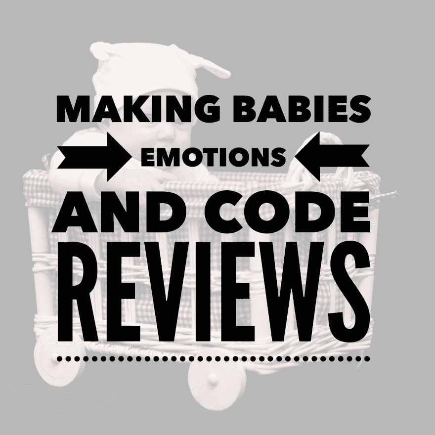

# 制造婴儿、情感和代码审查

> 原文：<https://dev.to/lpasqualis/making-babies-emotions-and-code-reviews>

这篇文章最初发表在 [CoderHood](https://coderhood.com) 上，名为[造人，情感和代码评论](https://www.coderhood.com/code_reviews/)。CoderHood 是一个致力于软件工程人类层面的博客。

[T2】](https://res.cloudinary.com/practicaldev/image/fetch/s--cKX0GiBj--/c_limit%2Cf_auto%2Cfl_progressive%2Cq_auto%2Cw_880/https://thepracticaldev.s3.amazonaws.com/i/4ygmkknrwej5gob5vn2p.png)

## 打代码造人。

一个男人抱着一个婴儿向你走来。他用充满爱意的眼神看着包裹，然后把目光转向你。“你怎么看？”他说，“他是我的孩子！我给他洗澡，给他穿衣服，给他梳头。我刚刚完成，刚好赶上最后期限。他不漂亮吗？你怎么看？”

你研究了孩子几分钟，一句话也没说。这个男人站在你面前，等待着，将他的重心从一只脚转移到另一只脚上，将他的目光从你身上转移到他怀里的动物身上，再回到你身上。

你终于抬起头来说:“我不了解他；他有一个奇怪的头，你需要盖住，他的衣服不匹配，气味告诉我他需要换尿布。请为此做点什么。”

我省略了对话的其余部分，因为包含咒骂语。

## 问题。

代码评审可能会有这种感觉。对于所有相关人员来说，披露开发人员的爱心工作出了问题是很困难的。由于开发人员倾向于认同他们的代码，就像父母认同他们的孩子一样，任何批评的暗示，即使是建设性的，也会导致伤害感情。

尽管如此，代码审查，尽管可能很难，在任何开发团队中都是至关重要的。它们的功能是作为一种工具来防止明显的错误，它们增加了进展的透明度，并且它们促进了知识的传播，使每个人都意识到他们不在工作的产品部分正在发生什么。

## 有效的代码评审。

一些专家试图创建规则和方法来指导如何进行代码评审。例如，在 IBM 网站上发表的这篇名为[“同行评审的 11 个被证实的实践”](https://www.ibm.com/developerworks/rational/library/11-proven-practices-for-peer-review/)的文章中，给出了下面的指导方针:每小时评审少于 300-500 行代码，一次评审不超过 200-400 行代码。

我不相信固定的规则和措施，因为不是所有的代码都是平等的。审查一行复杂的代码可能需要几分钟，而一整页简单的代码可能需要几秒钟。也就是说，以下是我的建议，排名不分先后:

### 理解代码。

如果你是评审者，努力真正理解你正在评审的代码。这需要时间，不能操之过急。如果您需要提出问题和澄清，请在代码中以注释的形式提出。这样，未来的开发人员将从相同的文档中受益。

### 保持评论小。

坚持相对小的点评；如果你使用敏捷方法，一个小故事的代码就足够了。如果要审查的代码量太大，适当的代码审查可能必须从会议开始，在会上开发人员给出源代码和架构的指导纲要。

### 避免审美大战。

作为审阅者，不要花时间报告缩进和格式问题。实用程序的存在是为了自动设计代码的样式，不值得花时间去挑剔美学。相反，花时间配置一个优秀的美化器，按照团队接受的标准来设计代码。

### 避免讨论琐事。

作为评审者，避免将琐碎的事情作为需要解决的问题提出来。开发人员有不同的做事方式，小的差异是可以预料的。每一个小细节的争斗都会导致代码评审成为一种没人想要的折磨。

### 有时没有问题。

如果代码看起来不错，不需要任何修改，这是可以的。不要期望每次审查都有问题，也不要觉得有义务去发现需要改正的地方。

### 了解问题、架构、领域。

确保您理解编写代码是为了解决的问题以及它所属的系统的一般架构。

### 表面坏但不忘好。

表扬你喜欢的代码的方面，并指出你从中学到的东西。不要小看这部分。指出积极的一面将会强化良好的实践，并让开发人员开心。

### 点评的是代码，而不是写代码的人。

确保只关注代码，而不是写代码的人。你不是在评判开发商；您正在帮助他或她完善代码以防止问题。避免用可能让开发人员感觉受到评判或批评的方式表达任何东西。指出代码中的问题是好的，批评写代码的人不是好的。

### 不要往心里去。

当有人评论你的工作时，记住你不是你的代码。评审者是在帮助你发现问题，而不是批评你的工作能力。谦虚一点，不要往心里去。即使是畅销书作家也有编辑；类似地，即使是最好的开发人员也有发现问题的评审人员。

### 从中吸取教训。

当你回顾某人的工作时，试着从中学习。您正在寻找潜在的问题，但是遇到许多聪明的解决方案并不罕见，如果学会了这些解决方案，您将成为更好的开发人员。

如果你的代码正在被评审，从你的同行给你的评论和建议中学习；它会提高你的技能，让你变得更强。

* * *

### 如果你喜欢这篇文章，请保持联系！

*   在 CoderHood 上找到我所有的帖子。
*   在 LinkedIn 上加入我的职业网络。
*   在推特上关注我。
*   加入我的脸书主页。
*   最后，请在 dev.to 上关注我！