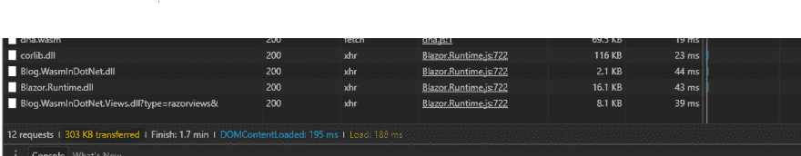

# ASP.NET 核心中的 Web 组装

> 原文：<https://dev.to/samueleresca/web-assembly-in-aspnet-core>

*最初发布于:[samueleresca.net](https://samueleresca.net)T3】*

> **WebAssembly** 或 **wasm** 是一种低级的[字节码](https://en.wikipedia.org/wiki/Bytecode)格式，用于 in- [浏览器](https://en.wikipedia.org/wiki/Web_browser)[客户端脚本](https://en.wikipedia.org/wiki/Client-side_scripting)，由 [JavaScript](https://en.wikipedia.org/wiki/JavaScript) 演化而来。

WebAssembly 是网络游戏的改变者。这是一个受我们研究启发的新兴标准，旨在为 web 应用提供接近本机的性能。随着时间的推移，许多现有的应用和 JavaScript 框架可能会使用 WebAssembly 来显著减少加载时间，同时提高运行时的性能。下面的文章将展示如何在 ASP.NET 核心中实现 Web assembly。我之前在以下文章中写过关于 ASP.NET 核心的内容:

[使用 ASP.NET 核心](https://samueleresca.net/2017/02/implementing-solid-data-access-layers-using-asp-net-core/)
[实现 SOLID REST API 单元测试 ASP.NET 核心标识](https://samueleresca.net/2017/03/unit-testing-asp-net-core-identity/)
在开始之前，让我们从技术角度来看一下 web 组装技术。

## 深入 web 组装

WebAssembly 是一种获取用 JavaScript 之外的编程语言编写的代码并在浏览器中运行这些代码的方法。

#### 关于解释器和编译器

通常，有两种翻译成机器语言的方法:

*   口译员:口译员很快开始工作。在开始运行代码之前，您不必经历整个编译步骤。你只要开始翻译第一行并运行它；
*   编译器:—它需要更多的时间来启动，因为它必须从头开始执行编译步骤。但是循环中的代码运行得更快，因为它不需要在每次循环中重复翻译；

#### JIT 编译器

JavaScript 创建于 1995 年。它的设计速度并不快。2008 年，浏览器开始变得更有竞争力，他们增加了**实时编译器**，也被称为 **JITs** 。JIT 的作用类似于**解释器**和**编译器**:当 JavaScript 运行时，JIT 可以看到模式，并基于这些模式使代码运行得更快，这就是**解释器**的部分。如果相同的代码行运行几次，该代码段称为 warm。如果跑得多，那就叫热。当一个函数开始变热时，JIT 会把它送到**编译**。那么它将存储编译结果。

#### 最后，Web 组装

编译器采用高级编程语言，并将其翻译成机器代码。WebAssembly 是一种概念性机器的机器语言，**浏览器**——目前对 WebAssembly 支持最多的编译器工具链叫做 [**LLVM**](https://en.wikipedia.org/wiki/LLVM) 。还有另外一个工具叫做 [Emscripten](http://kripken.github.io/emscripten-site/) 。目前使用起来稍微容易一点。它有自己的后端，可以通过编译到另一个名为 asm.js 的目标，然后将其转换为 WebAssembly 来生成 WebAssembly。

### Web 组装 vs Javascript

WebAssembly 模块定义了可以从 JavaScript 中使用的函数。因此，就像您从 npm 下载一个模块并调用作为其 API 一部分的函数一样，您将来也能够下载 WebAssembly 模块。事实上，这个想法不是使用 WebAssembly 或使用 JavaScript。开发人员将在同一个应用程序中同时使用 WebAssembly 和 JavaScript。在许多情况下，WebAssembly 比 JavaScript 更快，因为:

*   **获取** WebAssembly 花费的时间更少，因为它比 JavaScript 更紧凑，即使压缩后也是如此；
*   **解码** WebAssembly 比解析 JavaScript 花费的时间少；
*   **编译**和**优化**花费的时间更少，因为 WebAssembly 比 JavaScript 更接近机器码，并且已经在服务器端经过优化；

## 在 ASP.NET 组装网页

ASP.NET 核心的 Web 组装**是个谎言**. ASP.NET 核心的 web 组装现状可以在这里找到:[https://github.com/aspnet/Mvc/issues/6457](https://github.com/aspnet/Mvc/issues/6457)。
然而, [Steve Sanderson](http://blog.stevensanderson.com/about.html) 在 WebAssembly 的浏览器上组装了一个很酷的 Razor 原型:Blazor 。Blazor 是一个实验性的 web UI 框架，使用 C#/Razor 和 HTML，通过 WebAssembly 在客户端运行。它跑了。NET 代码在浏览器中通过一个小的，可移植的。NET 运行时调用的 **DotNetAnywhere** 编译成 WebAssembly。

#### [DNA。](#dna)

DNA 代表任何地方的点网。它用 C 语言编写，被设计得尽可能小和便携，允许。NET 软件在资源有限的设备上使用。NET 运行时。DNA 可以被编译成。wasm 并在浏览器中执行。

### 双手放在布拉索身上

布拉佐碾过了**。NET Core 2.0 预览版 3** 或更高版本。有两种方法可以设置项目示例:

*   **Visual Studio 2017.3****或更高版本:**通过安装以下[扩展。](https://github.com/SteveSanderson/Blazor/releases/download/v0.2.1/Blazor.VSExtension.vsix)然后使用文件- >新建项目，并从 **Web** 类别中选择 **Blazor 应用程序**；
*   **Visual studio 代码，Rider IDE:** 项目脚手架扩展仅在 Visual studio 上可用。但是你可以在 GitHub 上找到 project 的基础模板:https://GitHub . com/Steve Sanderson/Blazor/tree/master/template/my application；

要在 VS 中启动应用程序，只需像往常一样按 F5 或 Ctrl+F5。一旦你的应用程序运行，你可以编辑它的`cshtml`文件，应用程序会自动更新。

## 最后的想法

总之，Blazor 只是一个惊人的实验。这是**而不是**一个生产就绪的解决方案。但是项目背后的想法和在 ASP.NET 核心中使用 Web 组装的可能性可能是一个惊人的特性。更一般来说，同样的概念可以应用到其他语言，例如:Java、Swift 或 Go。

### 性能考虑

好吧，说真的？你是否在你的网页上发布了一个完整的. net 核心库？！[T2】](https://res.cloudinary.com/practicaldev/image/fetch/s--plnyAq44--/c_limit%2Cf_auto%2Cfl_progressive%2Cq_auto%2Cw_880/https://samueleresca.net/wp-content/uploads/2017/08/Capture.png)

嗯，从截图可以看到，传过来的尺寸是`~303 kb`。如果我们想到一个用 Javascript 编写的现代 web 框架，比如 angular 2，它的大小是`566K Jan 4 22:03 angular2.min.js`。所以， **Blazor 框架是一个很好的切入点**。有关更多信息:

[网页组装的卡通介绍——林·克拉克](https://hacks.mozilla.org/2017/02/a-cartoon-intro-to-webassembly/)

[。NET 和 WebAssembly -这是前端的未来吗？](https://www.hanselman.com/blog/NETAndWebAssemblyIsThisTheFutureOfTheFrontend.aspx)

[史蒂夫·桑德森的 NDC 演讲](https://www.youtube.com/watch?v=MiLAE6HMr10)

封面图片作者:葛饰北斋-山下的风暴。干杯:)