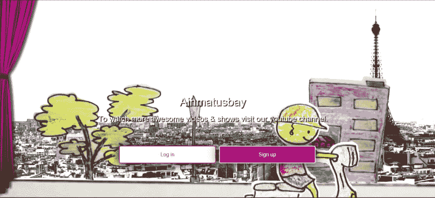

# 制作带有背景视频的登录页面

> 原文:[https://dev . to/rounakpolley/making-landing-page-with-background-video](https://dev.to/rounakpolley/making-landing-page-with-background-video)

在 [CodePen](https://codepen.io) 上看到 Pen [一个带有 Rounak Polley (](https://codepen.io/cfjr/pen/oeEVpK/) [@cfjr](https://codepen.io/cfjr) )背景视频的登陆页面。

 
我创作的这支笔只是为了展示如何有效地嵌入 youtube 视频作为背景。抬头！虽然我们可以将任何视频用于实际网页的实验目的，但请始终使用有版权的视频。

幸运的是，我使用了我自己的 youtube 频道的视频。

登陆页面是`user`访问一个网站时首先登陆的，这对于给人留下第一印象极其重要。也许你想展示你的品牌或产品，或者添加一个与你的网站相关的内容。
创建视频的方法有很多，但我认为创建一个包含底层视频的视频比其他视频更具挑战性。

这是我发现的...

如果我们只是复制和粘贴嵌入的代码，并设置`<iframe>`占据整个屏幕，我们将会在视频周围留下大量的黑色空间，当我们调整浏览器窗口的大小时，这些空间会自动调整，显然没有人想要这样！(不特别是在登陆页面上)。
所以，我尝试了另一种方式，我尝试将背景添加为一个*动画 gif* (在声音上有所妥协&实际上我没有见过带音频的登陆页面，但我也想要音频)。唉，我找不到任何在线资源来创建一个长于一分钟的 gif，甚至我的 photoshop 在将一个 2 分 32 秒的视频转换成 gif 时也出现了问题。
我尝试了一些其他的事情，比如对在`<iframe>`中创建的`<video>`元素进行样式化，直到我意识到我需要使我的嵌入式 iframe 具有响应性。但是，它在极窄的浏览器尺寸下也会分解，露出下面的白色背景，所以我添加了一个固定位置的底部居中渐变作为背景。
困扰我的一件事是，我无法让 youtube 视频循环播放(如果用户在页面上停留足够长的时间，他/她可能会发现这一点)我按照官方消息来源所说的做了 [YouTube 嵌入式播放器和播放器参数](https://developers.google.com/youtube/player_parameters)(其他消息来源给出了相同的信息。)也就是`loop=1`。

此外，更多的颜色或梯度覆盖可以添加到背景视频的顶部，就像我添加了一个框架窗帘。
我还在带有**登录** & **注册**按钮的页面上添加了一些简单的文字(带有文字阴影以提高可读性)，并带有免费赠送的按钮样式。将常用的引导类添加到所需的前台组件中就完成了。

和通常的完整代码一样...

在 [CodePen](https://codepen.io) 上看到 Pen [一个带有 Rounak Polley (](https://codepen.io/cfjr/pen/oeEVpK/) [@cfjr](https://codepen.io/cfjr) )背景视频的登陆页面。