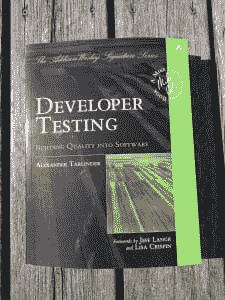

# 开发者测试

> 原文:[https://dev.to/henrikwarne/developer-testing-4mgh](https://dev.to/henrikwarne/developer-testing-4mgh)

我最近发现了由 [Alexander Tarlinder](https://twitter.com/alexander_tar) 写的书[Developer Testing-Building Quality Into Software](https://www.amazon.com/Developer-Testing-Building-Addison-Wesley-Signature/dp/0134291069/)，我立刻想去读它。即使我内心是一个开发人员，但我一直对软件测试感兴趣(我甚至做过两年测试员)。 

我认为这本书的主题《开发人员测试》非常及时。越来越多的测试责任被交给开发人员，这似乎是一个大趋势。它源于向微服务、开发运营和“您构建它，您运行它”原则的转变。另一个驱动力是开发人员测试框架的流行，从 JUnit 开始，现在包括更多。这些框架鼓励并帮助开发人员编写自动化测试。

尽管有增加开发者测试的趋势，我的感觉是许多开发者仍然没有足够好地测试他们的程序。例如，他们可能会测试“快乐路径”，但不会测试不同的错误处理案例。这就是为什么我对这本明确针对开发人员测试的新书感到兴奋。

在序言中，作者声明这不是一本适合初学者的书，你应该有至少三年的开发经验才能充分利用它。他还写道，这本书的目的是概述他所涉及的每个主题。你应该能在一个小时或更短的时间内读完每一章。我认为他在开发人员测试方面做得很好，章节也很容易阅读。不过，我觉得这本书*还是*适合新开发者。几乎所有今天开始工作的开发人员从工作的第一天起就会接触到单元测试、模仿、持续集成等等。因此，在我看来，他们将立即受益于阅读这本书。

那么，到底什么是开发者测试呢？作者的定义是，测试代码是开发人员所做的一切。这包括编写单元和集成测试，实现持续集成，以及为测试自动化提供基础设施。在他看来，不包括性能测试、安全测试、可用性测试或测试病理案例。

### 我最喜欢什么

虽然书中涵盖了许多测试工具和技术，但对我来说最有趣的部分是关于如何进行可测试性设计的部分。考虑到可测试性而设计的软件更有可能被测试。如果测试得好，bug 就会少。换句话说，可测试性是软件质量的驱动力。以下是我喜欢的具体部分:

**可测性**。可测性可分为可观性、可控性和微小性。可观察性意味着必须很容易获得和检查一段代码产生的结果。可控性意味着在执行测试之前，我们必须能够将测试中的程序置于我们想要的状态。最后，我们想要测试的部分越小(就特性和代码行而言)，测试就越容易。这听起来似乎显而易见，但事实并非如此。这本书的主要好处是它把重点放在编写可测试的代码上，关于可测试性的这一章(第四章)是书中最好的。

**间接输入/输出，状态，时间耦合**。第六章展示了当存在副作用时，当使用间接输入(如系统属性、文件、队列、系统时钟)时，当保持复杂状态时，或者当调用序列很重要时，代码的可测试性是如何受到影响的。

**依赖关系**。第九章给出了许多依赖如何负面影响可测试性的例子，以及如何构建代码使其仍然是可测试的。示例包括处理文件和系统时钟。在这两种情况下，最好的策略是将数据处理从纯 I/O 或时间操作中分离出来。

我喜欢的其他章节是第三章(定义测试词汇)，第十二章(不同类型测试的定义)，第十四章(经典风格的测试驱动开发的例子，与 mockist 风格相反)和第十八章(更复杂的自动测试)。

### 我最不喜欢什么

我以前的一个同事(hello Andreas)在测试这个主题上给了我一些很棒的建议(也适用于代码评审)。除了你通常要检查的内容之外，你还应该问:“少了什么？”。在这里问这个问题，我想到了两个我认为也可以包括在内的主题。

**探索性测试**。书中所有的重点都放在结果的自动检查上，探索性测试被明确排除在外。自动测试很重要，但它们通常是测试整个系统的子集。但最终，所有部件和功能必须在完整的环境中协同工作。因此，我认为，即使对于开发者来说，也有必要确保系统作为一个整体按预期运行。最好的方法是探索您开发的特性在完整环境中的行为。然后，重点更多地放在练习这些特性和寻找不寻常或意想不到的事件上，而不是检查。因为这种类型的测试不在这里讨论，所以[探索一下吧！](https://www.amazon.com/Explore-Increase-Confidence-Exploratory-Testing/dp/1937785025/)是一本很好的伴侣书。

**性能测试**。作者还将性能测试排除在开发人员测试之外。然而，我认为作为一名开发人员，你也有责任编写性能良好的代码。为了确保这一点，设置一些性能测试是有用的。在我工作过的地方，开发人员总是参与性能测试工作。此外，开发人员在建立基础设施和编写任何所需的定制工具方面处于有利地位。

此外，第五章，契约式编程，和第十六章，复制，还不错，但它们是我最不感兴趣的。

### 零零碎碎

其他一些小观察:

*   每章末尾的总结是我读过的所有技术书籍中最好的——它们简洁地抓住了这一章的关键点。
*   作者引入术语“程序元素”来使用，而不是写“方法或函数”——非常好。
*   插图是专业完成的，我更喜欢一些书使用的业余手绘。
*   标题和副标题的字体大小对我来说有点太接近了——有时很难区分级别。
*   有几个地方使用了奇怪的单词或短语——更好的编辑会有所帮助。

### 总结

编写好的软件需要测试。开发人员测试很好地介绍了开发人员可以用来测试自己代码的各种方法和工具。然而，这本书的主要好处是它对如何设计可测试性的建议。大多数开发人员应该已经熟悉了许多测试技术，比如单元测试。但总的来说，这是一个很好的概述，它将有助于把注意力放在尽可能有效地测试代码的重要实践上。