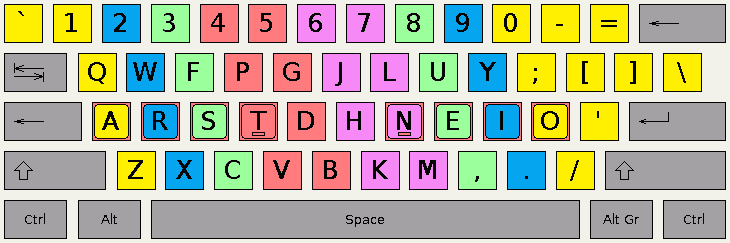

# 为什么我切换到 Colemak 键盘布局？

> 原文:[https://dev . to/kev Cui/why-I-switch-to-colemak-keyboard-layout-24h 4](https://dev.to/kevcui/why-i-switch-to-colemak-keyboard-layout-24h4)

[T2】](https://res.cloudinary.com/practicaldev/image/fetch/s--wIKm2SuE--/c_limit%2Cf_auto%2Cfl_progressive%2Cq_auto%2Cw_880/https://colemak.com/wiimg/e/ef/Colemak_fingers.png)

[Colemak](https://colemak.com/FAQ) ，读作/' ko:lmk/(Coal-Mac)，是基于 QWERTY 的键盘布局。它由 [Shai Coleman](https://ie.linkedin.com/in/shaicoleman) 开发，于 2006 年发布。Colemak 键盘布局看起来像:

```
q w f p g j l u y ;
   a r s t d h n e i o
    z x c v b k m , . / 
```

<svg width="20px" height="20px" viewBox="0 0 24 24" class="highlight-action crayons-icon highlight-action--fullscreen-on"><title>Enter fullscreen mode</title></svg> <svg width="20px" height="20px" viewBox="0 0 24 24" class="highlight-action crayons-icon highlight-action--fullscreen-off"><title>Exit fullscreen mode</title></svg>

Colemak 有什么特别之处？为什么我决定从 QWERTY 换到 Colemak？

### 原因一:弃用 QWERTY

众所周知，QWERTY 最初是为打字机设计的，用来解决打字杆相互碰撞和卡住的问题。背后的想法是*将最常见的字母排列在难以触及的位置，以减慢打字员的速度，并尽量避免打字机堵塞*。

如果你对更多关于 QWERTY 的故事感兴趣，QWERTY 的诅咒是一篇很好的文章。

既然机械打字机已经退出历史舞台，所有的现代电脑都不存在“机械卡死”的问题，为什么我们还需要承受 QWERTY 低效的痛苦？是时候让 QWERTY 光荣退役了。算了吧！

### 理由二:我想要挑战

当我 14 岁的时候，我开始在学校学习用打字机打字。是的，一台真正的打字机，太神奇了！我仍然记得当打字棒打在纸上时的评论，声音和感觉是如此令人满意。在学期末，我以每分钟 70 个字的速度顺利通过了打字考试。现在已经 15 年了，我的速度保持在每分钟 75 英里左右。对我来说，显然一点都没有改善…

作为一个渴望新鲜事物并痴迷于效率的家伙，我不相信 75 WPM 是我的极限。恐怕 QWERTY 本身就是障碍。也许另一个键盘会解放我的能力。这就是为什么我想挑战一下我打字的速度。

### 理由三:效率是关键

Colemak 的设计符合人体工程学，舒适快捷。<sup>[【2】](#link2)</sup>

根据[腕骨分析](http://mkweb.bcgsc.ca/carpalx/?popular_alternatives)，在 10 种键盘布局中，Colemak 的打字力度相当低。腕骨详细分析<sup></sup>显示:

*   Colemak 的 home row 使用率很高，为 74%，而 QWERTY 为 34%，Dvorak 为 71%
*   Colemak 底排使用率较低，为 9%，与 Dvorak 相同，比 QWERTY 高 15%
*   Colemak 在手部使用上更加平衡，有 6%的偏好使用右手。德沃夏克在右翼有 14%的支持率，而 QWERTY 在左翼有 15%的支持率

有一个应用程序可以分析不同的键盘布局。它叫做[键盘布局分析器](http://patorjk.com/keyboard-layout-analyzer/#/main)。我很好奇结果会如何。所以我试着输入:

1.  英国广播公司最近的一篇文章
2.  乔治·r·r·马丁[传记](https://www.biography.com/people/george-r-r-martin-20786615?_escaped_fragment_=)
3.  我的一个 [python 脚本](https://github.com/kevcui/hearthstone-cards-searcher/blob/master/hsSearch.py)
4.  我的博客[index.html](https://raw.githubusercontent.com/kevcui/kevcui.github.io/master/index.html)
5.  我的一个博客[贴](https://kevcui.github.io/2016/12/23/my-year-2016/)纯文本

这 5 轮的结果:Colemak 每轮得分最高。

高 home row 使用率、更短的手指移动距离和平衡的左右手 Colemak 的这些优势使其成为提高效率和人体工程学的最佳键盘布局之一。

### 理由四:简单易学

我记得 5 年前，我打算换成德沃夏克。但是经过一周的努力，我彻底失败了。因为从 QWERTY 到 Dvorak 的过渡短语真的很难，所以我还没有好到在工作中只用 Dvorak。因此，它要求我同时记住 2 种不同的键盘布局，这对于我的大脑是可能的，但对于我的肌肉是不可能的。我当时在开玩笑:我至少需要 2 个月的假期来训练没有任何生产力的德沃夏克。

去学 Colemak，我觉得会是一个不同的故事。Colemak 基于 QWERTY 布局，这意味着它没有改变一切的可怕前景。Colemak 的布局相当类似于 QWERTY，只有 17 个不同的键，而 Dvorak 有 33 个，只有两个字母 P 和 E 可以从一只手移动到另一只手，而 Dvorak 有 22 个。<sup>[【4】](#link4)</sup>

Colemak 很容易学。我只花了 30 分钟就记住了 Colemak 键盘布局，没有任何挫败感。经过一天的训练，现在我已经习惯了。我估计两天的周末应该足够我有一个合理的打字速度。下周一在工作中使用 Colemak 不会让我头疼。

* * *

这些诱人的理由给了我转用 Colemak 的动力。我想我必须面对这个挑战，下周我会忙于训练。挑战开始了，改变就在现在。

快乐打字科尔马克！

[](https://res.cloudinary.com/practicaldev/image/fetch/s--J9y8XVNk--/c_limit%2Cf_auto%2Cfl_progressive%2Cq_66%2Cw_880/https://media0.giphy.com/media/toXKzaJP3WIgM/giphy.gif)

* * *

[1] HowStuffWorks: [为什么 QWERTY 键盘上的键是这样排列的？](https://computer.howstuffworks.com/question458.htm)

【2】Shai Coleman:[Colemak 优点](https://colemak.com/)

【3】Carpalx:[Colemak 打字省力](http://mkweb.bcgsc.ca/carpalx/?colemak)

【4】Eric Limer:[为什么我要重新学习打字](http://www.popularmechanics.com/technology/a20524/learning-to-type-again-colemak)