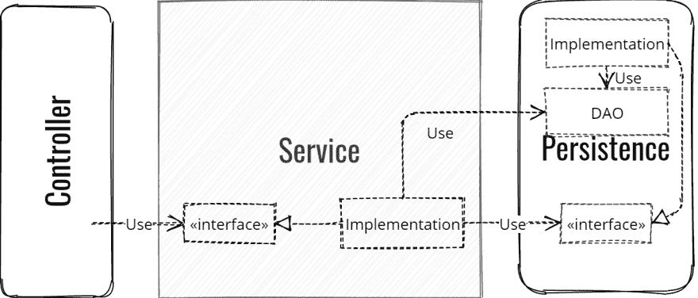
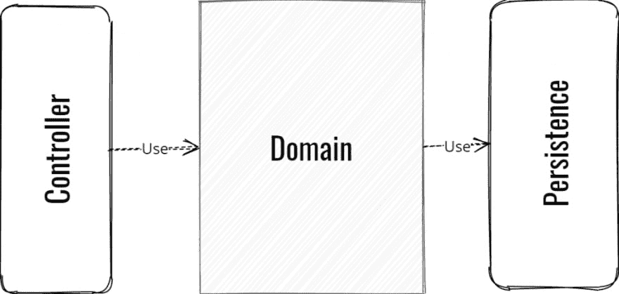
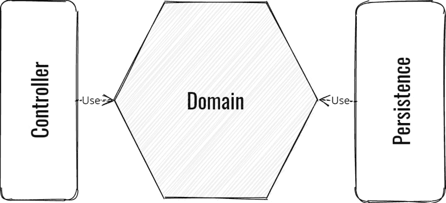
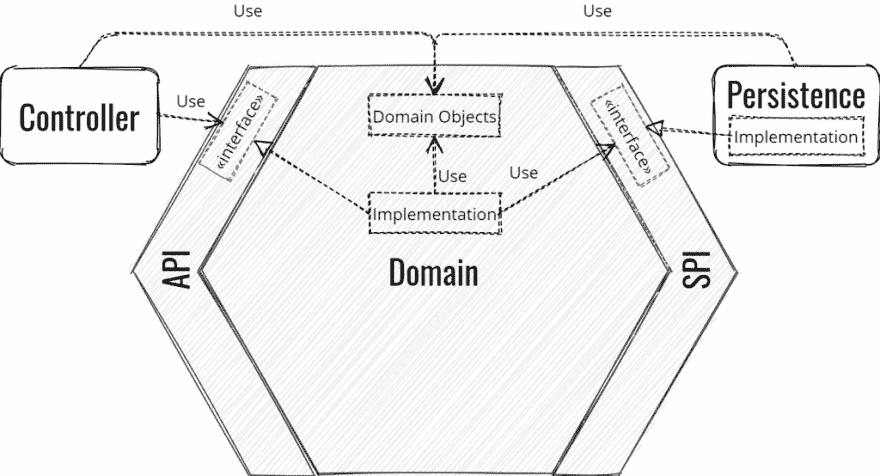
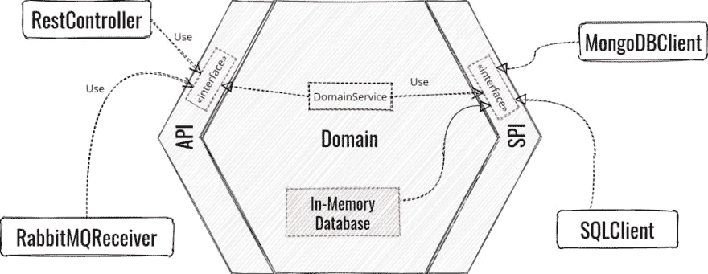
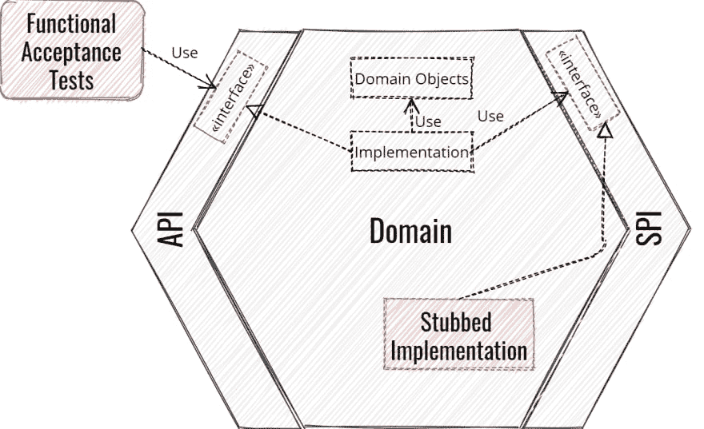
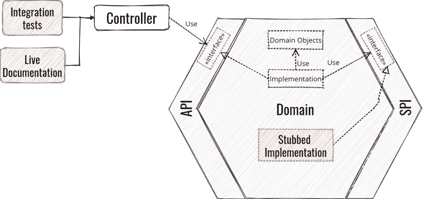
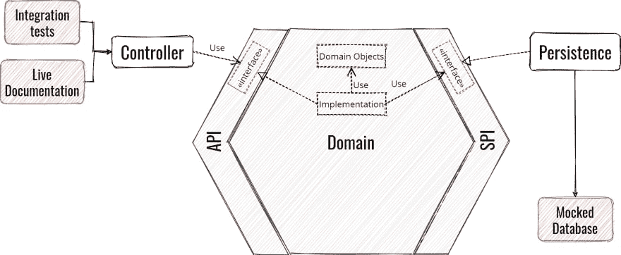

# 六边形建筑:洁净建筑实用指南

> 原文：<https://dev.to/julientopcu/hexagonal-architecture-the-practical-guide-for-a-clean-architecture-1j8n>

在升级软件时，您是否遇到过问题？ *你能区分你的功能测试和集成测试吗？迁移遗产意味着从头开始重写一切？*

探索**六边形架构**(一种干净的架构模式，也称为端口和适配器)如何发挥作用！

*   [商业逻辑落水！T3】](#businesslogic-overboard)
*   [分离关注点:隔离业务逻辑](#isolating-the-business-logic)
*   域中不允许有框架
*   [六角形建筑的反转控制](#inversion-of-control)
*   [用反腐败层保护域名](#acl)

*   [六角形建筑的模块化强度](#modularity)
*   [如何实现六边形架构？T3】](#howto-implement)
*   [测试驱动实现](#test-driven-implementation)
*   [概括地说六角形建筑](#in-a-nutshell)

* * *

## 商业逻辑过头了！

在之前的经历中，我的团队不得不将一个旧的应用移植到一个全新的堆栈上。该软件正在从 EAR/SQL 应用程序转移到使用 NoSQL 的自包含 JAR。通过研究，我们很快意识到我们必须重做整个基础设施。事实上，唯一不需要改变的是业务逻辑。所以，重用它是有意义的，对吗？

<figure> 

<figcaption>经典分层架构实现</figcaption>

</figure>

经过更深入的研究，名为 model 的 maven 模块是 POJOs，只有 getters 和 setters，完全缺乏活力 …虽然也有服务模块，但业务逻辑是跨所有层共享的。它淹没在大量的技术代码中，如 DAOs 创建、序列化等。没有办法提取业务逻辑！它的某些部分依赖于我们试图移除的旧框架的技术行为。为什么呢？因为业务逻辑和技术代码之间没有清晰的界限。

## 关注点分离:隔离业务逻辑

阿利斯泰尔·考克伯恩创建的六边形架构通过使其与技术无关来确保业务逻辑的可重用性。因此，改变堆栈不会对域代码产生影响。

这个架构的一个关键概念是将所有的业务逻辑放到一个名为域的地方。让我们更新以前的模式:

<figure> 

<figcaption>分层架构概述</figcaption>

</figure>

重要约束:**域只依赖于自身**；这是确保业务逻辑与技术层分离的唯一方法。我们如何在前面的模式中实现这一点呢？领域显然依赖于持久层！嗯，通过使用一个你可能知道的模式:控制反转。通过将定义域称为六边形，它将看起来像这样:

<figure> 

<figcaption>六边形建筑概述</figcaption>

</figure>

控制反转非常神奇，让我们稍后看看它是如何工作的。现在你对什么是六边形结构有了一个大概的了解:

*   只有两个世界，六边形内外。**内部:所有的** **业务逻辑**，**外部:基础设施——**表示你所有的技术代码。
*   **依赖关系总是从六边形的外部向内部延伸**。它确保了业务领域与技术部分的隔离。
*   由此得出的一个推论是**六边形只依赖于它自己**。并且不仅仅是关于你自己的层:**它必须不依赖于任何技术框架**。这包括像 Jackson 或 JPA 这样的外部注释。

## 域中不允许任何框架(几乎)

让我给你解释一下最后一点，这是非常重要的一点。在另一次经历中，我的团队不得不将一个应用程序从“经典”的 Spring 框架移植到 Spring Boot。我们遇到的主要(痛苦的)问题是:在 Spring 集成测试上利用太多来验证我们的功能。此外，这些功能也与 Spring 紧密结合。

在我们的 Spring Boot 迁移的第一次尝试中，所有的功能测试都失败了。我们无法确定业务逻辑是否在某处中断，或者原因是否纯粹是技术性的。我们最终发现这是测试级的集成问题。所以我们通过交叉手指一个接一个地修复所有的测试…希望域仍然是正确的。

六边形中没有使用框架意味着**无论** **技术栈**如何变化，业务领域都可以被重用。这也将**增加你领域的可测试性**，因为你不再把它和集成问题混在一起。最后，由于六角形架构的限制，您将进行**真正的功能测试**。这样，功能测试将直接与六边形交互，并且只与它交互。

注意:在 Maven 中，您可以使用 [enforcer 插件](http://maven.apache.org/enforcer/enforcer-rules/bannedDependencies.html)来确保这个约束。

## 控制的六角形结构反转

还记得控制反转吗？为了确保六边形的隔离，对下游层的依赖性已经被反转。正如你所看到的，这个技巧其实很简单:

<figure> 

<figcaption>实施六角形架构</figcaption>

</figure>

六边形的外部(基础设施)被分成两个虚拟部分，左侧和右侧。左边是查询域的所有东西(控制器、REST 层等)。).右边是将为域提供一些信息/服务的所有内容(持久层、第三方服务等。).

## 用反腐败层保护域

为了让外部与域进行交互，Hexagon 提供了分为两类的**业务接口**:

*   **API** 收集了查询域所需的所有接口。这些接口由 Hexagon 实现。
*   **SPI** (服务提供者接口)收集域从第三方检索信息所需的所有接口。这些接口在六边形中定义，由基础设施的右侧实现。我们将看到，在某些情况下，六边形也可以实现 SPI。

这里有两个重要的事实:

*   API 和 SPI 是六边形的一部分。
*   API 和 SPI 只处理六边形的域对象。它确实确保了隔离。

在分层架构中，[业务对象或服务通常创建 Dao](http://www.oracle.com/technetwork/java/dataaccessobject-138824.html)。在六边形架构中，域只处理域对象。因此，持久化负责将域对象转换成任何要持久化的“Dao”。这就是我们所说的适应。

## 六边形架构的模块化优势

如上所述，**端口和适配器**架构是六边形架构的另一个名称。它来自于**这种架构模块化的力量**。因为一切都是解耦的，所以您可以在域前面同时有 REST 和 JMS 层，而不会对它产生任何影响。

<figure> 

<figcaption>适配器模块化六边形架构</figcaption>

</figure>

在 SPI 端，如果需要，您可以从 MongoDB 驱动程序实现更改为 Cassandra。由于 SPI 不会因为您更改持久性模块而更改，所以您的软件的其余部分不会受到影响。API 和 SPI 是端口，使用或实现它们的基础设施模块是适配器。

## 如何实现六边形架构？

这里还有一条规则:**总是从六边形的内部开始**。这会给你带来很多好处:

*   **关注功能**而不是技术细节。因为只有特性给你的公司带来价值。在另一个业务领域工作的开发人员能够放置一个 Spring 控制器。但是双倍余额递减法对他来说听起来像伍基人，除非他在会计公司工作。
*   **延迟技术实现的选择。**有时候一开始真的很难知道自己到底需要哪种技术实现。因此，推迟这个选择有助于你专注于给公司带来主要价值的东西——特性。此外，在实现业务逻辑之后，一些新元素可以帮助您做出关于基础设施的最佳选择。您会发现这个领域比预期的更加关系化，所以 SQL 是您的数据库的一个好选择。
*   一个推论是它确保了**六边形是独立的**。因为你不应该在没有测试的情况下写代码，这意味着**六边形是自测的**。此外，我们在这里进行了真正的功能测试，只关注业务。

## 测试驱动的实现

使用六边形架构，您可以将您的功能测试放在您的域中。那些测试将直接调用领域 API，同时避免来自技术部分的任何干扰。在某种程度上，您正在创建一个模拟控制器的适配器来测试域的特性。

### 从域的功能测试开始

我的建议是，首先使用[行为驱动开发](https://beyondxscratch.com/2019/05/21/behavior-driven-development-from-scratch/)来描述你的特性，编写你的功能场景。

[“双循环”的第一步将使用 ATDD](https://beyondxscratch.com/2019/05/21/behavior-driven-development-from-scratch/#double-loop) 产生您的功能测试。并编写 API 接口，这将是您的功能的入口点。然后用 TDD 实现您的测试，最后实现您的业务逻辑。在编写它的时候，您可能需要从数据库中检索一些数据，所以创建一个 SPI。因为右侧还没有实现，所以在六边形中创建这个 SPI 的存根实现。这可以通过使用映射实现的内存数据库来实现。

<figure> 

<figcaption>六角形架构中的功能测试</figcaption>

</figure>

您可以选择将存根保存在应用程序的测试范围内。但是如果需要的话，你也可以暂时发货。例如，一旦我们在六边形上制作了第一个特性，我们就将一个外部服务和数据库连接起来。因为我们的客户需要我们提供一个接口契约，所以我们通过 REST 控制器导出了域。因此，我们在基础设施的右侧发布了带有存根数据的第一个版本。通过这种方式，客户能够看到我们数据的结构和特性的预期行为。这比手工创建一些请求和响应的 JSON 样本要可靠得多，因为它实际上处理的是真实的业务约束。

### 用适配器整理

下一步通常是先打开左侧。通过这种方式，您可以对特性进行一些集成测试。此时，你可以提供一些实时文档，并确保与你的客户签订界面合同。

<figure> 

<figcaption>六角架构左适配器集成测试</figcaption>

</figure>

最后，利用集成测试实现您的功能的 SPI，打开右边的。我强烈建议您的测试是独立的，以避免构建期间的任何不稳定性。你应该总是使用类似于 [Wiremock](http://wiremock.org/) 的外部服务或者 [Fongo](https://github.com/fakemongo/fongo) 来模拟 MongoDB 来模拟你的第三方。

<figure> 

<figcaption>六角形架构端到端集成测试</figcaption>

</figure>

<figure>

对其他特征进行同样的循环。

[https://www.youtube.com/embed/v--zkIEciq4](https://www.youtube.com/embed/v--zkIEciq4)

T2】

<figcaption>Architecture Hexagonale Level 2 : Comment bien écrire ses tests ? by Julien Topçu & Jordan Nourry</figcaption>

</figure>

欲了解更多信息，GitLab 上有一个[六边形架构测试策略](https://gitlab.com/crafts-records/talkadvisor/talkadvisor-back/blob/master/TestingStrategy.md)，在🇫🇷的演讲中也有描述！

## 简而言之，六边形建筑

所以，现在我们看到了什么是六边形建筑！从技术代码中分离业务逻辑**有一个真正的好处。它确保您的业务领域在技术的持续发展方面是**持久和健壮的**。**

六边形架构通过以下方式为您提供了实现这一目标的真正方法:

*   将所有的业务逻辑放在一个**地方**。
*   就技术部分而言，这个领域是孤立的、不可知的，因为**除了它自己，它不依赖任何东西**。这就是为什么**依赖关系总是从六边形的外部到内部。**
*   六边形**是一个独立的**模块。因此，**通过编写不需要处理技术问题的**真正的功能测试**来增加你领域的可测试性**。
*   这种架构提供了强大的模块性。它有助于您根据需要编写尽可能多的适配器，同时对软件的其余部分影响很小。由于域与堆栈**无关，因此可以在不影响业务的情况下改变堆栈**。
*   通过**总是从领域**开始，你确保通过**专注于特性开发**为你的客户带来价值。通过这种方式，你可以**推迟对技术实现的选择**，以便在正确的时间做出最佳选择。

## 有的反馈

六边形架构并不适合所有情况。像领域驱动的设计一样，如果你有一个真正的业务领域，这是非常适用的。对于一个将数据转换成另一种格式应用程序来说，这可能有点过了。

最后，当你采用一项新技术时，一定要务实。如前所述，*六边形必须不依赖于任何技术框架*，但在特殊情况下你可以。例如，在我们的例子中，Hexagon 有三个例外:Apache Commons Lang3 (StringUtils)、SLF4J 和 Findbugs 的 JSR305。因为我们不想创造轮子，因为那些框架对领域的影响很小。六边形架构的一个好的副作用是，在集成一个新的框架之前，你要不断挑战自己。通过使用这种架构，我们将领域的依赖项数量从 50 个减少到只有 3 到 4 个。从安全角度来看，这非常好。

**进一步阅读**
想更进一步？查看那些[领域驱动设计和六角形架构技巧&诀窍系列](https://beyondxscratch.com/tag/ddd-hexarch-tipstricks/)

你还可以在这里找到一篇关于六角形架构的伟大文章:[https://softwarecampament.wordpress.com/portsadapters/](https://softwarecampament.wordpress.com/portsadapters/)

如果你想看一些代码，你现在可以在 GitLab 上找到一个科特林/Spring Boot [六角形应用](https://gitlab.com/crafts-records/talkadvisor/talkadvisor-back)。

法文版:[建筑六角形:清洁建筑实用指南](https://beyondxscratch.com/fr/2018/09/11/architecture-hexagonale-le-guide-pratique-pour-une-clean-architecture/)。

帖子[六角形建筑:清洁建筑实用指南](https://beyondxscratch.com/2017/08/19/hexagonal-architecture-the-practical-guide-for-a-clean-architecture/)最早出现在 [BeyondxScratch](https://beyondxscratch.com) 上。