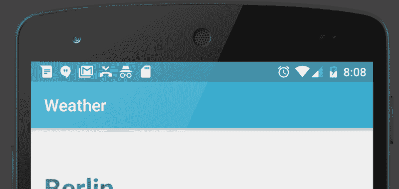
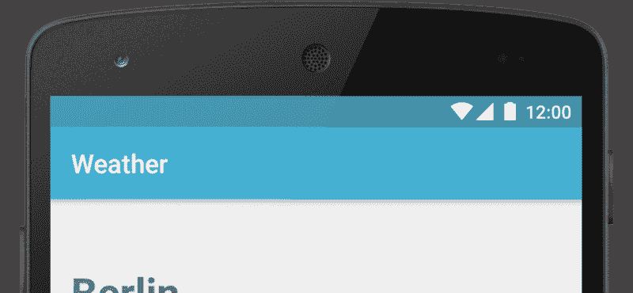

# 像专业人士一样清理你的状态栏！

> 原文:[https://dev.to/lariki/clean-your-status-bar-like-a-pro](https://dev.to/lariki/clean-your-status-bar-like-a-pro)

我们开发人员有时需要对我们的应用程序进行截图:要么是为了谷歌 Play 商店，要么是为了展示我们的开源项目。像其他人一样，我们设备的状态栏可能塞满了通知、低电量指示器和不太健康的时间😉。

[T2】](https://res.cloudinary.com/practicaldev/image/fetch/s--XgCtTI7K--/c_limit%2Cf_auto%2Cfl_progressive%2Cq_auto%2Cw_880/https://thepracticaldev.s3.amazonaws.com/i/ih1d6szdxmgmnrifhd6d.png)

你的潜在用户可能会被状态栏中的图标分散注意力，在最坏的情况下，这会给人留下你对产品不小心和不专业的印象。

到目前为止，每次我需要截图时，我都使用一款名为 [Clean Status Bar](https://github.com/emmaguy/clean-status-bar) 的应用，它会在真实的状态栏上绘制一个假的状态栏。这让我可以隐藏我的通知，以显示一个中立的时间和一个充满电的手机。我只需要打开应用程序，选择我想要显示的图标，给它一个背景颜色，就这样！我的状态栏看起来很好的截图！

但是我面临一个问题。在工作中，我们有一个脚本来在不同的模拟器中生成屏幕截图，但我们没有办法在每次需要时自动使状态栏看起来很好。

我找到了 Android 的[演示模式，它强制状态栏以给定的方式查看，目的是截图。所以我在这里解释我如何使用它。](https://android.googlesource.com/platform/frameworks/base/+/master/packages/SystemUI/docs/demo_mode.md)

# 如何使用演示模式

您需要从终端运行这些命令，因此您需要`adb`访问设备。

首先，启用演示模式:

```
adb shell settings put global sysui_demo_allowed 1 
```

其次，您输入命令来显示或隐藏状态栏上的图标。我喜欢用的是:

```
// display time 12:00
adb shell am broadcast -a com.android.systemui.demo -e command clock -e hhmm 1200

// Display full mobile data without type
adb shell am broadcast -a com.android.systemui.demo -e command network -e mobile show -e level 4 -e datatype false

// Hide notifications
adb shell am broadcast -a com.android.systemui.demo -e command notifications -e visible false

// Show full battery but not in charging state
adb shell am broadcast -a com.android.systemui.demo -e command battery -e plugged false -e level 100 
```

这是运行命令后的样子:

[T2】](https://res.cloudinary.com/practicaldev/image/fetch/s--AFYCG7CJ--/c_limit%2Cf_auto%2Cfl_progressive%2Cq_auto%2Cw_880/https://thepracticaldev.s3.amazonaws.com/i/4wgyo0lf2jqatqd9qz5d.png)

现在，您可以拍摄您需要的屏幕截图，但不要忘记在结束时退出演示模式:

```
adb shell am broadcast -a com.android.systemui.demo -e command exit 
```

可用命令列表可在以下位置找到:

[https://Android . Google source . com/platform/frameworks/base/+/master/packages/system ui/docs/demo _ mode . MD](https://android.googlesource.com/platform/frameworks/base/+/master/packages/SystemUI/docs/demo_mode.md)

你现在没有理由没有更好的截图了！我继续在我的个人项目中使用 Emma 的应用程序，但如果你需要自动截图，这是必须做的。

[最初发布于我的媒体博客。](https://android.jlelse.eu/clean-your-status-bar-like-a-pro-76c89a1e2c2f)