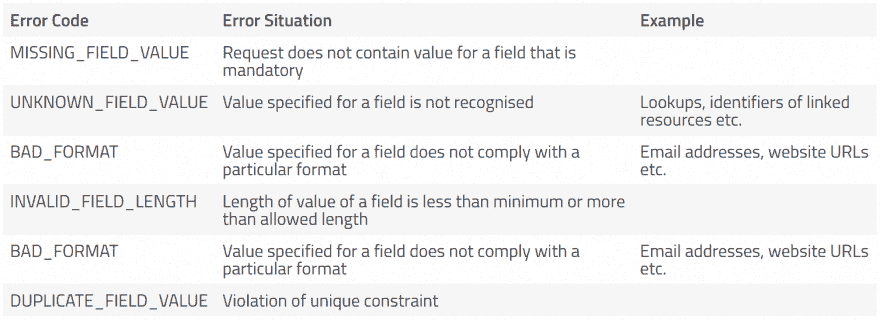

# 从 REST APIs 返回格式良好的错误响应

> 原文:[https://dev . to/suhas _ chatekar/return-well-formed-error-responses-from-your-rest-API](https://dev.to/suhas_chatekar/return-well-formed-error-responses-from-your-rest-apis)

* * *

REST 建议使用标准的 HTTP 状态代码来指示服务器上响应请求时发生了什么。来自 4xx 和 5xx 系列的错误用于指示请求未被处理，并且在客户端或服务器端存在一些错误，例如 401 Unauthorised 用于指示请求不能被处理，因为它不能证明发送者的身份。标准的 HTTP 状态代码是指示错误情况的良好起点，但这还不够。特别是如果您正在开发由大量开发人员使用或对任何人开放访问的 API，那么您可能希望返回格式良好的错误响应，提供有关错误的更多详细信息。这个想法的最初灵感来自于 [GitBook HTTP API 设计指南](https://geemus.gitbooks.io/http-api-design/content/en/index.html)的[生成结构化错误](https://geemus.gitbooks.io/http-api-design/content/en/responses/generate-structured-errors.html)一章。我个人推荐这本书给任何想要关于构建 REST APIs 的实用建议的人。
在[柯林森集团](http://collinsongroup.com)我们已经开始在一些`4xx/5xx`回复中返回类似下面的 JSON】

```
[{ 
  "errorCode": "BAD_FORMAT", 
  "field": "email", 
  "originalValue": "suhas.chatekar", 
  "mesage": "{email} is not in correct format",
  "helpUrl": "/help/BAD_FORMAT#email" 
  }] 
```

<svg width="20px" height="20px" viewBox="0 0 24 24" class="highlight-action crayons-icon highlight-action--fullscreen-on"><title>Enter fullscreen mode</title></svg> <svg width="20px" height="20px" viewBox="0 0 24 24" class="highlight-action crayons-icon highlight-action--fullscreen-off"><title>Exit fullscreen mode</title></svg>

每当我们认为标准的 HTTP 状态不足以让调用应用程序知道哪里出错时，就会在响应体中返回上面的 JSON。让我们快速了解一下这些字段的用途以及它们可能包含的值。

## errorCode

顾名思义，该字段包含一个唯一的错误代码。我们决定使用基于字符串的错误代码，因为它们易于阅读。人们也用数字来表示这一点。我个人觉得数字对于这种信息来说是隐晦的。

## 字段

出现此错误的字段的名称。这与传入请求中出现的名称相同。

## 原始值

该字段包含来自请求的原始值。在大多数情况下，这是可选的。虽然客户端可以在需要时使用这些信息，但是有一种情况下我们发现返回这些信息是有用的。我们有一个 POST API，它接受一组相同的资源。如果一个以上的资源在同一个字段上没有通过相同的验证，那么我们将返回两次相同的错误响应。客户端如何知道哪个资源出错了？在响应中添加原始值有助于跟踪客户机请求中的哪个资源有错误。

## 消息

此字段包含用户友好的消息。如果 API 的消费者是前端应用程序，那么它可以选择直接使用此消息向最终用户传达错误的详细信息。在这个领域有两件事需要注意。第一，上面的例子显示了使用`{email}`作为消息中的标记的消息。在返回响应之前，API 应该用请求中的原始值替换这个令牌。第二，该信息应该以客户喜欢的语言本地化。这假设您已经在 API 中为您的客户提供了一种指定首选语言的机制。

## helpUrl

此字段包含详细描述此特定错误的页面的 URL。帮助页面可能会回答以下问题(除了您可能想要包含的任何其他详细信息之外)

1.  是什么导致了这个错误？这里的例子会有所帮助。
2.  如何修复这个错误？
3.  如果您继续得到错误，您如何获得帮助？

我将这种机制称为**可发现的文档**,因为客户端应用程序的开发人员在遇到错误时不需要知道在哪里可以找到这种文档，他们可以立即自动发现适当的文档。

## 我们使用的错误代码

以下错误代码列表满足最常见的现场级错误。

[T2】](https://res.cloudinary.com/practicaldev/image/fetch/s--K0PbkkDm--/c_limit%2Cf_auto%2Cfl_progressive%2Cq_auto%2Cw_880/https://thepracticaldev.s3.amazonaws.com/i/q7hn1zn1rjcqog0ph2iw.png)

我省略了我们使用的一些特定领域的错误代码。您可以尽可能详细地定义错误代码。您在 API 中使用了格式良好的错误响应吗？你觉得这种方法有用吗？

* * *