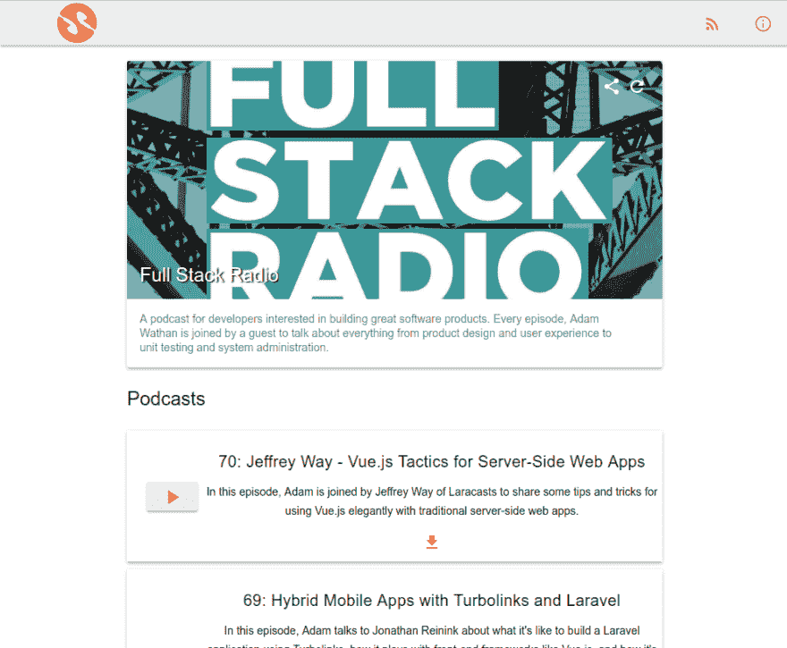

# scootalite -开源播客管理器

> 原文:[https://dev.to/vikkio88/scootalite-开源-播客-管理](https://dev.to/vikkio88/scootalite---the-opensource-podcast-manage)

嗨，伙计们，过去几个月我一直致力于一个想法，一个集中的播客管理器 webapp 工具(这是一个很大的单词)，它将允许我添加播客作为 rss 提要，并收听它们，保存我所在的位置，下载文件，添加收藏夹，共享位等等。

[T2】](https://res.cloudinary.com/practicaldev/image/fetch/s--4-4aFwdY--/c_limit%2Cf_auto%2Cfl_progressive%2Cq_auto%2Cw_880/https://thepracticaldev.s3.amazonaws.com/i/spar7z4qtf3srd57rlte.png)

我首先用 jquery 编写，然后用 angularjs 1.5，然后用 vuejs，最后用 react，这不是因为我是个疯子，而是因为我喜欢在一些我真正关心的项目中测试我学到的新东西。

我想听听一些意见，如果有人对此感兴趣的话，我们可以合作。我不想赚钱或任何东西，我希望它是开源和免费的，永远没有广告。我不是一个创业的人，我只是一个为自己的需求制造工具的人。

我将删除一些链接，以便您可以查看:

### 最新版本(reactjs)

[史酷比](https://scootalite.surge.sh)

### 其他版本(vuejs)

[阿斯库塔](https://ascoota.surge.sh)

## 代码

[scootalite we b-github](https://github.com/vikkio88/scootalite)(react js)
[scootalite API-github](https://github.com/vikkio88/scootalite-api)(PHP 7，slim [slime](https://github.com/vikkio88/slime)