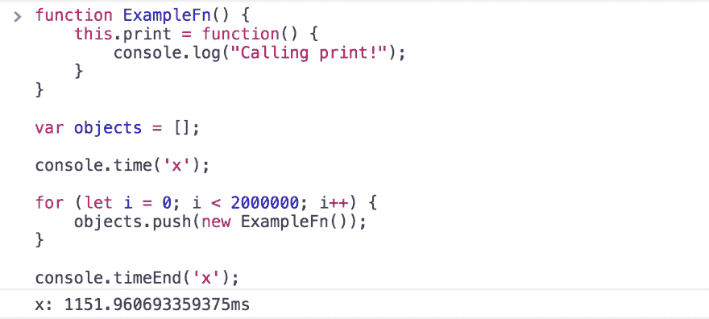
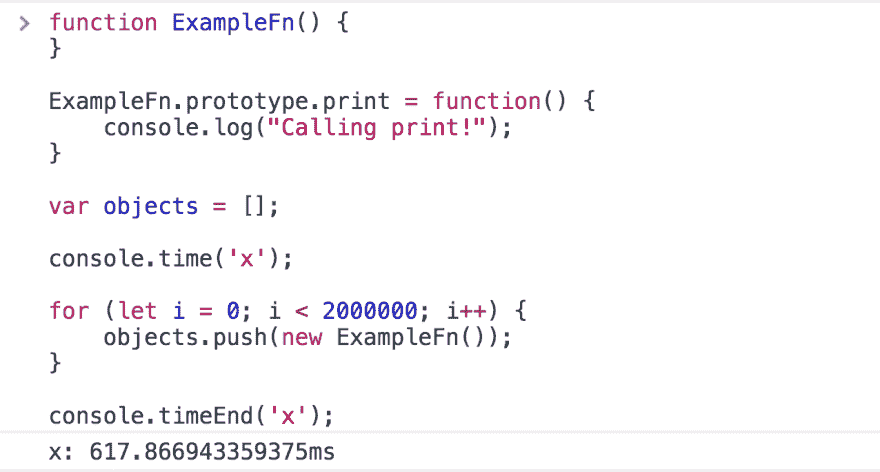

# 掌握 JavaScript 原型和继承

> 原文:[https://dev.to/arnavaggarwal/master-javascript-prototypes——传承](https://dev.to/arnavaggarwal/master-javascript-prototypes--inheritance)

这篇文章摘自我的课程，[提升你的 JS:中级 JavaScript 综合指南](https://www.educative.io/collection/5679346740101120/5707702298738688?authorName=Arnav%20Aggarwal)。

## 继承

继承是指一个对象从另一个对象访问方法和其他属性的能力。对象可以从其他对象继承东西。JavaScript 中的继承通过称为原型的东西工作，这种形式的继承通常被称为*原型继承*。

在本文中，我们将涵盖许多看似不相关的主题，并在最后将它们联系在一起。还有一个 TL；博士在最后给那些想要简短版本的人。

## 对象、数组和函数

JavaScript 让我们可以访问三个全局函数:`Object`、`Array`和`Function`。是的，这些都是函数。

```
console.log(Object); // -> ƒ Object() { [native code] }
console.log(Array); // -> ƒ Array() { [native code] }
console.log(Function); // -> ƒ Function() { [native code] } 
```

您可能不知道，但是每次您创建一个对象文字时，JavaScript 引擎都在有效地调用`new Object()`。对象文字是通过写`{}`创建的对象，如在`var obj = {};`中。所以对象文字是对`Object`的隐式调用。

数组和函数也是如此。我们可以认为一个数组来自于`Array`构造函数，一个函数来自于`Function`构造函数。

## 物体原型

### __proto__

所有 JavaScript 对象都有一个原型。浏览器通过`__proto__`属性实现原型，这就是我们将如何引用它。这通常被称为 *dunder proto* ，是双下划线原型的缩写。不要重新分配该属性或直接使用它。`__proto__`的 [MDN 页面](https://developer.mozilla.org/en-US/docs/Web/JavaScript/Reference/Global_Objects/Object/proto)用红色大块警告我们永远不要这么做。

### 原型

函数也有一个`prototype`属性。这与他们的`__proto__`属性截然不同。这使得讨论相当混乱，所以我将详细说明我将使用的语法。当我提到一个原型并且单词“原型没有用灰色突出显示”时，我指的是`__proto__`属性。当我用灰色的`prototype`时，我指的是函数的`prototype`属性。

如果我们在 Chrome 中记录一个对象的`prototype`,这就是我们会看到的。

```
var obj = {};
console.log(obj.__proto__);
// -> {constructor: ƒ, __defineGetter__: ƒ, …} 
```

属性`__proto__`是对另一个对象的[引用](https://codeburst.io/explaining-value-vs-reference-in-javascript-647a975e12a0)，该对象上有几个属性。我们创建的每个对象文字都有这个`__proto__`属性指向同一个对象。

有几个要点:

*   对象文字的`__proto__`等于 Object.prototype

*   Object.prototype 的`__proto__`为空

我们很快会解释原因。

## 原型链

为了理解对象原型，我们需要讨论对象查找行为。当我们寻找一个对象的属性时，JavaScript 引擎将首先检查对象本身是否存在该属性。如果没有找到，它将转到对象的原型并检查该对象。如果找到，它将使用该属性。

如果没有找到，它将继续寻找原型的原型，直到找到一个`__proto__`属性等于`null`的对象。因此，如果我们试图从上面查找 obj 对象的属性`someProperty`,引擎将首先检查对象本身。

它不会找到它，然后会跳转到它的等于`Object.prototype`的`__proto__`对象。它也不会在那里找到它，当看到下一个`__proto__`是`null`时，它会返回`undefined`。

这就是所谓的原型链。它通常被描述为一个向下的链，顶部是`null`，底部是我们正在使用的对象。

当执行查找时，引擎将遍历整个链来查找属性，并返回它找到的第一个属性，如果它不在原型链中，则返回`undefined`。

```
__proto__ === null
|
|
__proto__ === Object.prototype
|
|
{ object literal } 
```

这是可以论证的。这里我们将直接使用`__proto__`进行演示。再说一次，永远不要这样做。

```
var obj = {};
obj.__proto__.testValue = 'Hello!';

console.log(obj); // -> {}
console.log(obj.testValue); // -> Hello! 
```

这个原型链描述如下。

```
__proto__ === null
|
|
__proto__ === Object.prototype -> testValue: 'Hello!'
|
|
obj 
```

当我们记录`obj`时，我们得到一个空对象，因为属性`testValue`不直接出现在对象上。然而，记录`obj.testValue`会触发查找。引擎沿着原型链向上，发现`testValue`出现在对象的原型上，我们看到该值被打印出来。

## 拥有自己的属性

在对象上有一个方法叫做`hasOwnProperty`。根据对象本身是否包含被测试的属性，它将返回`true`或`false`。然而，对`__proto__`的测试将总是返回 false。

```
var obj = {};
obj.__proto__.testValue = 'Hello!';

console.log(obj.hasOwnProperty('testValue'));
// -> false

console.log(obj.__proto__.hasOwnProperty('testValue'));
// -> true 
```

## 功能原型

如前所述，所有函数都有一个不同于它们的`__proto__`属性的原型属性。它是一个物体。**函数原型的`__proto__`属性等于`Object.prototype`** 。换句话说:

```
function fn() {}
console.log(fn.prototype.__proto__ === Object.prototype);
// -> true 
```

### 功能原型和‘新’

函数的`prototype`属性显示了它在面向对象编程中的有用性。当我们[使用`new`](https://codeburst.io/javascripts-new-keyword-explained-as-simply-as-possible-fec0d87b2741) 调用一个函数时，在构造函数中绑定到这个的对象是特殊的。new 关键字将对象的`__proto__`设置为构造函数的原型属性。

**当我们用`new`调用一个函数时，它将返回对象的`__proto__`属性设置为等于函数的`prototype`属性。**这是传承的关键。

到目前为止，我们已经收集了一些要点:

*   用`new`调用函数创建的对象的`__proto__`等于该函数的`prototype`

*   函数的`prototype`的`__proto__`等于`Object.prototype`

*   `Object.prototype`的`__proto__`是`null`

这让我们组装以下原型链。

```
function Fn() {}
var obj = new Fn();

console.log(obj.__proto__ === Fn.prototype);
// -> true

console.log(obj.__proto__.__proto__=== Object.prototype);
// -> true

console.log(obj.__proto__.__proto__.__proto__ === null);
// -> true 
```

视觉绘制:

```
__proto__ === null
|
|             
__proto__ === Object.prototype
|
|
__proto__ === Fn.prototype
|
|
obj 
```

## 实现继承

我们可以直接安全地使用函数的`prototype`属性。通过将方法和其他属性放在一个函数的`prototype`上，我们使得由该函数创建的所有对象(使用`new`)能够通过继承来访问这些属性。

```
function Fn() {}

Fn.prototype.print = function() {
    console.log("Calling Fn.prototype's print method");
};

var obj = new Fn();
obj.print(); // -> Calling Fn.prototype's print method 
```

你可能想知道这有什么意义。我们可以把这个方法放在构造函数里面，就像这样。

```
function Fn() {
    this.print = function() {
        console.log("Calling the object's print method");
    };
}

var obj = new Fn();
obj.print(); // -> Calling the object's print method 
```

你说得对，这行得通。不同之处在于，通过这种方式，通过调用`new Fn()`创建的每个对象都将把自己的`print`的*版本*直接放在对象上。它们在内存中是不同的功能。这样做的问题是性能和内存使用。

### 表现

有时，您可能需要从构造函数中创建数千个新对象。使用附加`print`的第二种方式，我们现在有数千个`print`的副本，每个副本都附加到一个对象上。

使用原型链，无论我们用`Fn`创建多少个对象，我们都有一个`print`位于`Fn.prototype`上。

一个方法没什么大不了的。然而，大型程序通常有几十个对象需要的方法。如果一个对象需要访问 20 个方法，而我们创建了 100，000 个对象，那么 JavaScript 引擎已经创建了 2，000，000 个新函数。

如果这需要发生多次，这将导致明显的速度和内存问题。相比之下，总共有 20 个函数，并通过原型链赋予每个对象使用相同函数的能力。更具可扩展性。

使用`console.time`和`console.timeEnd`，我们可以直接显示所需时间的差异。这是创建 200 万个直接带有功能的对象与创建原型的时间差。我们将所有对象存储在一个数组中。

[T2】](https://res.cloudinary.com/practicaldev/image/fetch/s--GAW_5hyB--/c_limit%2Cf_auto%2Cfl_progressive%2Cq_auto%2Cw_880/https://cdn-images-1.medium.com/max/2872/1%2Ak0m7VzTBqP0TwQCVR-GwRQ.png)

[ ](https://res.cloudinary.com/practicaldev/image/fetch/s--XTRVr1z_--/c_limit%2Cf_auto%2Cfl_progressive%2Cq_auto%2Cw_880/https://cdn-images-1.medium.com/max/2552/1%2Av3j_bKs15FjzONFkID2ikg.png) *创建新函数(左)与使用原型继承(右)*

正如我们所见，将打印方法放在`prototype`上需要大约一半的时间。

## `__proto__`字面量

如上所述，一个对象的`__proto__`等于创建该对象的函数的`prototype`。这条规则也适用于文字。记住对象文字来自`Object`，数组来自`Array`，函数来自`Function`。

```
var obj = {};
var arr = [];
function fn() {}

console.log(obj.__proto__ === Object.prototype); // -> true
console.log(arr.__proto__ === Array.prototype); // -> true
console.log(fn.__proto__ === Function.prototype); // -> true 
```

我们现在可以解释为什么我们能够在数组和对象上调用方法。如果我们有一个数组`arr`，我们可以`call arr.map()`，因为方法`map`出现在`Array.prototyp` e 上。我们可以调用`obj.hasOwnProperty()`，因为`hasOwnProperty`出现在`Object.prototype`上。我们一直在使用继承，却不知道这一点。

`Array`和`Function`的`__proto__`链的末端等于`Object.prototype`。它们都源于同一个东西。这就是为什么数组、函数和对象都被认为是 JavaScript 中的一级对象。

## 构造函数

我们已经几次提到了构造函数这个词。让我们解释一下它是什么。每个函数的`prototype`都有一个指向函数本身的`constructor`属性。这是引擎为每个函数做的事情。

```
function Fn() {}
console.log(Fn.prototype.constructor === Fn);
// -> true 
```

通过运行`new Fn()`创建的对象的`__proto__`将等于 Fn.prototype。因此，如果我们试图记录该对象的构造函数属性，引擎将通过查找过程给我们`Fn`。

```
function Fn() {}
var obj = new Fn();
console.log(obj.constructor); // -> ƒ Fn(){} 
```

### 为什么有用

对象的`constructor`属性很有用，因为它可以告诉我们对象是如何创建的。直接在对象上记录`constructor`属性会告诉我们是哪个函数创建了我们的对象。

```
function Fn() {};

var normalObj = {};
var fnObj = new Fn();

console.log(normalObj.constructor);
// -> ƒ Object() { [native code] }

console.log(fnObj.constructor);
// -> ƒ Fn() {} 
```

## 创建对象

有一种方法可以手动设置对象的原型。`Object.create`。这个函数将接受一个对象作为参数。它将返回一个全新的对象，其`__proto__`属性等于传入的对象。

```
var prototypeObj = {
    testValue: 'Hello!'
};

var obj = Object.create(prototypeObj);
console.log(obj); // -> {}
console.log(obj.__proto__ === prototypeObj); // -> true
console.log(obj.testValue); // -> 'Hello!' 
```

这给了我们一个简单的方法来扩展原型链。我们可以让对象继承我们喜欢的任何对象，而不仅仅是函数的`prototype`。

如果你想要更多的信息和例子，Object.create 的 [MDN 页面是一个很好的资源。](https://developer.mozilla.org/en-US/docs/Web/JavaScript/Reference/Global_Objects/Object/create)

### Phew。

那真是太多了。我知道。然而，您现在对 JavaScript 中的继承有了深刻的理解。

## 原型总结

简而言之，JavaScript 中的继承是通过原型链实现的。每个正常创建的对象、数组和函数都有一个由`__proto__`属性组成的原型链，以顶部的`Object.prototype`结尾。这就是为什么它们都被认为是 JavaScript 中的一级对象。

除了`__proto__`属性之外，函数还有一个`prototype`属性。当使用带有`new`的构造函数时，最好将方法放在函数的`prototype`上，而不是放在对象本身上。返回对象的`__proto__`将等于函数的`prototype`，因此它将继承函数的`prototype`上的所有方法。这可以防止不必要的内存使用并提高速度。

我们可以通过使用`hasOwnProperty`方法来检查一个对象是否有自己的属性。我们可以使用`Object.create`手动设置继承。

### 就是这样。如果这是有帮助的，请击中心脏，所以这个故事到达更多的人。也可以随时查看我的其他工作。

## 我的工作

### 在线课程

我创建了一个[在线课程](https://www.educative.io/collection/5679346740101120/5707702298738688?authorName=Arnav%20Aggarwal)，涵盖了中级 JavaScript 主题，如作用域、闭包、OOP、this、new、apply/call/bind、异步代码、数组和对象操作以及 ES2015+。
[提升你的 JS:中级 JavaScript 综合指南](https://www.educative.io/collection/5679346740101120/5707702298738688?authorName=Arnav%20Aggarwal)

### 近期文章

[在 Javascript 中解释价值与参考](https://codeburst.io/explaining-value-vs-reference-in-javascript-647a975e12a0)
[React 生态系统设置—逐步演练](https://codeburst.io/react-ecosystem-setup-step-by-step-walkthrough-721ff45a7fc1)