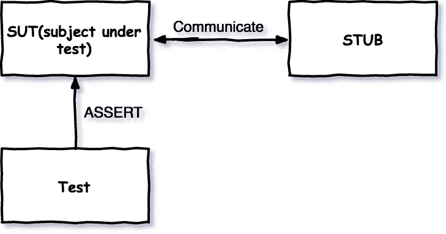
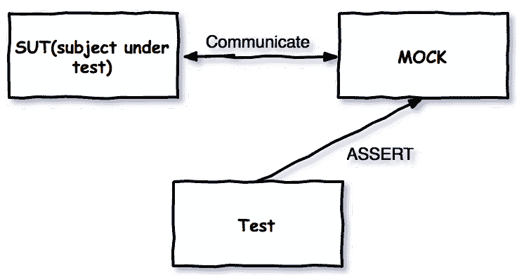

# 可维护单元测试的概念

> 原文：<https://dev.to/samueleresca/concepts-of-maintainable-unit-tests>

*原贴于[samueleresca.net](https://samueleresca.net)T3】*

下一篇文章将解释一些关于单元测试的概念和一些关于编写可维护单元测试的良好实践。虽然这个例子是用 C#写的，但是文章的概念和主题是独立于语言的。我以前在以下文章中写过单元测试:[单元测试 ASP.NET 核心身份](https://samueleresca.net/2017/03/unit-testing-asp-net-core-identity/) [控制反转和依赖注入](https://samueleresca.net/2017/07/inversion-of-control-and-unit-testing-using-typescript/)[TDD 过程如何工作](https://samueleresca.net/2016/03/how-tdd-process-works/)

## 一般概念

让我们采取以下自定义方法:

```
 class CustomArray{
    public int SumArray(int[] inputArray){

        if(inputArray.Length == 1) return inputArray[0];

        int sum = 0;

        for(int i = 0; i < inputArray.Length; i++){
            sum += inputArray[i];
        }

        return sum;
    }
} 
```

假设我们要测试`SumArray`方法，我们可以定义一组测试用例:[https://gist . github . com/samueleresca/153 af 46337325037932423 c 80 f 417 BD 2](https://gist.github.com/samueleresca/153af46337325037932423c80f417bd2)我们可以测试一些情况，比如:单值、零值、多值的情况。绿色测试证明代码是正确的吗？**测试并不证明代码的正确性。测试表明，对于特定的输入，代码会按预期运行。**

### 一种模式

A.A.A 模式代表:假设，行动，断言模式。举个例子，让我们进行下面的单元测试:

```
using Xunit;

namespace Blog.MaintainableUnitTests.test
{

    public class CustomArrayTests
    {
        [Fact]
        public void SumArray_ArrayContainsOnlyOneValue_ReturnThatValue()
        {
            //Arrange
            CustomArray sut= new CustomArray();
            //Act
            int result = sut.SumArray(new[]{5});
            //Assert
            Assert.Equal(result, 5);

        }
    }
} 
```

我们可以识别三个不同的部分:

1.  安排我们进行实验所需的一切。在这种情况下，我们简单地实例化一个习惯数组对象；
2.  **Act:**—我们调用 add 方法并捕获结果。“行为”代表了单元测试秀的明星。所有的安排都导致了它，之后的一切都是回顾；
3.  * * Assert _:_ * * Assert 类的调用可能泄露了这一点。但是单元测试中的 *assert* 概念代表了一个通用的动作类别，你不能忽略它，而进行单元测试。它断言假设本身。断言某事代表了测试的本质；

### 测试命名约定

测试的另一个重要方面是测试的命名惯例。首先，测试通常包含在另一个项目中——具有类似于主项目/文件夹的**镜面结构**。第二，测试文件和类有相同的名字**被测对象(sut)** 。测试方法的名称将在测试执行过程中出现，然后我们希望通过只读取测试方法的名称，可能还有它的封闭类的名称，来知道确切的**测试场景**通过了还是失败了。方法和测试的名称将首先出现。然后，我们想知道测试进行的**条件**。名称的这一部分将与单元测试的安排部分紧密相关。最后，第三部分将指示期望的行为。这在测试行为时是没问题的。我们还可以使用第三段来表示预期的状态或返回值。让我们看一个例子:

```
using Xunit;

namespace Blog.MaintainableUnitTests.test
{

    public class CustomArrayTests
    {

        [Fact]
        public void SumArray_ArrayContainsOnlyOneValue_ReturnThatValue()
        {
          //...
        }
    }
} 
```

测试方法公司由以下人员组成:

1.  被测试方法的**名称**:`SumArray`，我们可以称之为 subject
2.  主题的**条件**；
3.  **预期的**断言；

这是**而不是**唯一的(或最好的)命名约定。记住，重要的是测试方法的公司正确地识别了测试的意图。

## 选择要测试的内容

测试是责任。它们限制了我们以后更改生产代码的自由，一些代码更改将导致我们的测试套件的重构。所以选择测试什么以及如何测试我们的代码是非常重要的。有两种方法来验证我们的代码并证明正确的行为:**状态**测试和* *交互* *测试。

### 状态测试

状态测试检查主体类的状态。它通常遵循以下工作流程:

1.  执行操作；
2.  读取操作后的状态；
3.  与预期值进行比较；

为了执行操作，然后检查感兴趣的值，该类必须借出对其状态的访问。[封装原理](https://en.wikipedia.org/wiki/Encapsulation_(computer_programming))呢？封装并不意味着状态不可访问。它防止不加选择地暴露状态。

### 交互测试

交互测试意味着我们正在观察对某些对象的调用。当我们实现状态测试时，我们必须确保状态是可测量的。交互也是如此。首先，我们如何度量交互？集成测试覆盖的类通常**实现接口**。每种语言和平台都有很多嘲讽框架，允许你计算某个方法被调用了多少次。其次，**交互测试应该只用于测试交互，而不是实现**。这意味着特定的交互本身就是需求，然后交互测试帮助证明需求得到了满足。如果您使用交互测试来证明一个类已经以某种方式使用了它的依赖项，那么请注意一些实现的改变将会导致测试失败，即使新的实现是完全正确的。

## 建模依赖关系

为了编写稳定且可维护的单元测试，我们如何设计类之间的依赖关系通信是很重要的。我们可以将依赖关系分为两种类型:

*   **“经典”依赖关系**:它是一个简单的值容器，我们可以共享一个状态，接收一些值；
*   **服务**:执行一个操作，并反馈执行的操作；

在单元测试的情况下，我们可以用一个映射来代替我们的类依赖，这个映射提供测试类的固定答案，这被称为**存根**。替换类依赖的另一种方法是使用**模拟，**来模拟依赖的真实行为。

## 存根和嘲讽

首先，使用 mocks 来度量交互，使用 stub 来替代依赖是有用的。存根代表单元测试的责任要小得多，它们使得测试易于维护。**模仿**让测试变得更加严格，并承担更多责任。对于每个术语的意思有很多困惑，许多人似乎可以互换使用。**基本的区别是存根不会通不过测试，而模拟可以。**下图描述了一个使用 **stub 的测试。当使用 stub 时，断言在被测试的类上执行。存根有助于确保测试顺利运行: [](https://res.cloudinary.com/practicaldev/image/fetch/s--lJSGc4_h--/c_limit%2Cf_auto%2Cfl_progressive%2Cq_auto%2Cw_880/https://samueleresca.net/wp-content/uploads/2017/08/stub_dia.png) 另一方面，测试将使用模拟对象来验证测试是否失败。下图显示了测试和模拟对象之间的交互。注意，断言是在 mock 上执行的: [](https://res.cloudinary.com/practicaldev/image/fetch/s--1OwD4PVm--/c_limit%2Cf_auto%2Cfl_progressive%2Cq_auto%2Cw_880/https://samueleresca.net/wp-content/uploads/2017/08/mock_dia.png) 被测试的类与 mock 对象通信，所有通信都记录在 mock 中。测试使用模拟对象来验证测试是否通过。一般来说，* *状态**测试通常依赖于存根**交互**测试通常依赖于模拟。

## 重构我们的应用程序，使其可测试

为了打破测试代码之间的依赖，我们可以使用通用的设计模式、重构和技术，并在代码中引入一个或多个 seams。我们只需要确保生成的代码做完全相同的事情。这里有一些打破依赖的技巧。

#### 提取一个接口以允许替换底层实现

一般来说，每个执行外部任务或者具有外部依赖性类都需要被一个接口覆盖。接口描述了外部组件的方法，类提供了该组件的实现。

```
//Interface
interface ILogService{
  void WriteLogLine(string message);
}
//The class provides the implementation of ILogService
public class LogService : ILogService{

  public LogService(){}

  public void WriteLogLine(string message){
    ...
  }
} 
```

#### 将存根实现注入到被测类中

在我们的代码中创建基于接口的 seams 有几种经过验证的方法——在这些地方，我们可以将一个接口的实现注入到一个类中，以便在其方法中使用。以下是一些最著名的方法

1.  接收构造函数级别的接口；
2.  接收接口作为属性 get 或 set

在第一种情况下，我们**添加一个新的构造函数(或者一个新的参数到一个现有的构造函数中),它将接受我们之前**提取的接口类型的一个对象。然后，构造函数在类中设置一个接口类型的本地字段，供我们的方法或任何其他方法以后使用。

```
public class LogController{

  private ILogService logService;

  public LogController(ILogService logService){
    this.logService=logService;
  }

} 
```

第二个，我们**为我们想要注入**的每个依赖项添加一个属性 get 和 set。然后，当我们在测试中的代码需要它时，我们就使用这种依赖。

```
public class LogController{

  private ILogService logService;

  public LogController(){
    logService = new LogService();
  }

  public ILogService LogService
   {
        get { return logService; }
        set { logService = value; }
   }

} 
```

在这个场景中，我们回到基础，一个类在其构造函数中初始化管理器，但是它从工厂类中获取实例。工厂模式是一种允许另一个类负责创建对象的设计。

```
public class LogController{

  private ILogService logService;

  public LogController(){
    logService = LogServiceFactory.Create();
  }

  public ILogService LogService
   {
        get { return logService; }
        set { logService = value; }
   }

}

class LogServiceFactory
{
    private ILogService logService=null;
    public ILogService Create()
    {
       if(logService!=null)
         return logService;
       return new LogService();
    }
    //Defines factory that can use and return custom manager
     public void Set(ILogService srv)
    {
        logService = srv;
    }
} 
```

## 其他单元测试最佳实践

最后，关于单元测试的其他要点是:**每个测试方法一个断言**,**避免测试依赖，** **将测试与构建自动化集成；**

### 每个测试方法一个断言

常识告诉我们，一个单元测试应该有一个断言。让我们来看一系列断言:

```
using Xunit;

namespace Blog.MaintainableUnitTests.test
{

    public class CustomArrayTests
    {

        [Fact]
        public void SumArray_ArrayContainsOnlyOneValue_ReturnThatValue()
        {
          //...
          Assert.NotNull(result);
          Assert.Equal(3, result[0]);
        }
    }
} 
```

`line 14`断言结果不应该为空。`line 15`断言数组的第一个单元格应该等于 3。**如果第一个断言失败了呢？**第二个断言也可能通过或失败，因此导致**不确定**。总之，* *在测试不相关的声明时，避免多重断言*

### 避免测试相互依赖

不惜一切代价避免测试的相互依赖——测试运行程序将按照它喜欢的任何顺序执行您的东西，并且，根据您使用的特定运行程序(高级主题),它甚至可能并行执行它们。

### 将测试与构建自动化相集成

自动化构建的力量不能也不应该被忽视。运行测试让您知道您是否破坏了任何现有的或新的功能。将您的代码与其他项目集成将表明您是否破坏了代码的编译或者在逻辑上依赖于您的代码的东西。·欢呼:)*来源:* *[编写高度可维护的单元测试——佐兰·霍尔瓦特](https://app.pluralsight.com/library/courses/writing-highly-maintainable-unit-tests/table-of-contents)* *[单元测试的艺术:用 C#举例——罗伊·奥舍洛夫](http://amzn.to/2uDxFDX)* *封面演职员表:http://deweysaunders.com/*