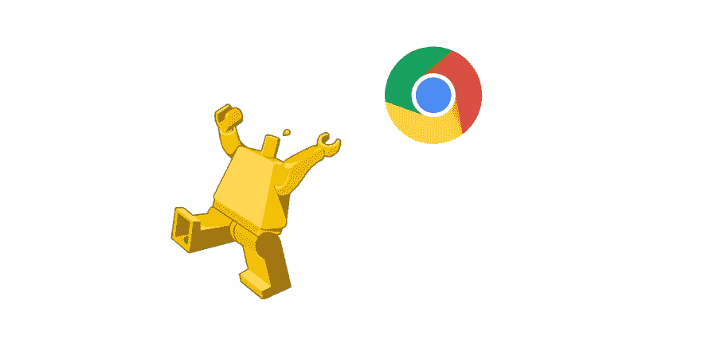

# 了解 Chrome headless

> 原文:[https://dev . to/ozymandias 547/so-many-testing-frameworks-so-little time](https://dev.to/ozymandias547/so-many-testing-frameworks-so-littletime)

[T2】](https://res.cloudinary.com/practicaldev/image/fetch/s--0yvinnZd--/c_limit%2Cf_auto%2Cfl_progressive%2Cq_auto%2Cw_880/https://thepracticaldev.s3.amazonaws.com/i/5x4e1iqbn4rrpn65uw9z.png)

由于 Chrome 在 v59 中的新的无头功能，一系列新的“自动化”东西刚刚到来。作为 [snaptest.io](https://www.snaptest.io) 的开发者，我的工作就是与他们保持同步。

***所以你需要知道的是:***

无头浏览器意味着当你启动它时，你看不到它是打开的，它都在内存中——这也意味着用户操作是自动的。 ***的用途*** 的自动化:

*   质量保证测试
*   擦
*   预渲染单页应用。

***无头*** 的用途:

*   资源密集度较低。
*   非常适合在部署前运行测试的构建系统。
*   可以在更多的服务器环境中运行，比如 Lambda。

***这是第一个无头自动化浏览器吗？*** 不，phantomJS 一直是这样的 goto 浏览器，但主要贡献者[在听说 Chrome 的新无头功能](https://groups.google.com/forum/#!topic/phantomjs/9aI5d-LDuNE)后几乎立即下台。原来维护一个完整的浏览器是很难的。

### 那么 Chrome v59 到底有什么新功能呢？

*   像这样运行可执行文件:`chrome – headless – disable-gpu – remote-debugging-port=9222`它会在没有可见窗口的情况下打开可执行文件。
*   然后向上面的端口发送命令……离金属节点库最近的是[这个](https://www.npmjs.com/package/chrome-remote-interface)。
*   上面的命令让您能够做几乎任何用户会做的事情…所以您可以收集数据或进行测试。

### 社区正在响应

社区已经决定我们需要一个漂亮的包装来包装这些“低级的东西”,并且已经开始制作这些:

*   [Chromeless](https://github.com/graphcool/chromeless) (由“Chrome 和”这两个词组合而成，无头，甚至可能是“无服务器”)。
*   木偶师(谷歌自己的“轻量级包装”)
*   简单无头 chrome (另一个包装器)可能还会有更多！

### 结论:

这些框架各自的状态如何？几个月后，等他们长大一点，我们就能知道了。现在进行比较和对比是徒劳的。