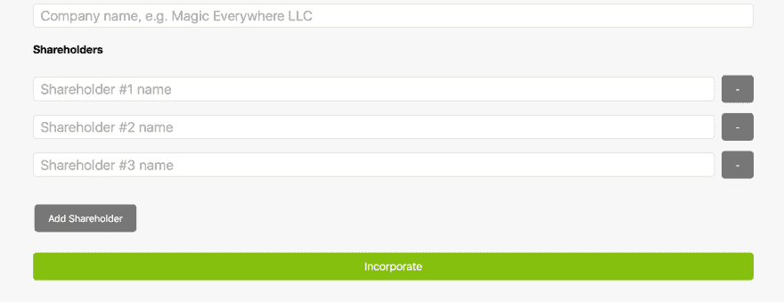

# 用 React 生成动态表单输入

> 原文:[https://dev . to/goshacmd/making-dynamic-form-inputs-with-react](https://dev.to/goshacmd/making-dynamic-form-inputs-with-react)

到目前为止，表单看起来非常简单。事实上，当我们只有一组固定的字段时，很容易将它们编写成代码。

然而，在真正的应用程序中，表单通常更加生动和动态。一个常见的例子是拥有一组由数组支持的相似输入。

例如，假设我们有一份公司注册表格。在其他领域中，一个公司的股东数量是可变的。

通常，在处理数组输入时，我们可以做以下事情:

*   添加新项目
*   删除现有项目
*   更改项目的详细信息

我们如何制作一个允许编辑这样一个数组的表单呢？

## 数据模型

首先考虑数据总是有帮助的。

乍一看，这似乎很简单。

```
['Shareholder 1', 'Shareholder 2'] 
```

<svg width="20px" height="20px" viewBox="0 0 24 24" class="highlight-action crayons-icon highlight-action--fullscreen-on"><title>Enter fullscreen mode</title></svg> <svg width="20px" height="20px" viewBox="0 0 24 24" class="highlight-action crayons-icon highlight-action--fullscreen-off"><title>Exit fullscreen mode</title></svg>

但是...生活中总是有更多的东西。

**避免原始类型。**
虽然制作一系列字符串来代表股东(或者任何其他*看起来只需要一个输入的东西)可能很诱人，但是有几个潜在的陷阱:*

 **   需求一直在变化。一个股东可能需要一个地址和一定数量的股份。将代码从字符串数组改为对象数组可能会很痛苦。
*   使用原语，我们只能通过索引来索引数组。然而，这与重新排序等功能不兼容。拥有一个对象意味着如果需要的话，我们可以很容易地为每个项目添加一个惟一的 ID。

一个更好的默认是总是从一个对象数组开始。

```
{ name: '' } 
```

<svg width="20px" height="20px" viewBox="0 0 24 24" class="highlight-action crayons-icon highlight-action--fullscreen-on"><title>Enter fullscreen mode</title></svg> <svg width="20px" height="20px" viewBox="0 0 24 24" class="highlight-action crayons-icon highlight-action--fullscreen-off"><title>Exit fullscreen mode</title></svg>

它给你一个机会给字段起一个有意义的名字，即使你只有一个；以及使将来添加字段变得更容易。

但是如果我真的需要一组原语呢？
这种存储格式在表单中很方便，但是需要注意的是，您可以向服务器发送任何格式的数据，也可以从服务器接收任何格式的数据。甚至是字符串数组。在与服务器交互时，您只需在字符串数组和对象数组之间进行转换，反之亦然。

## 对数据的操作

回想一下，我们需要对阵列执行以下操作:

*   添加新项目
*   删除现有项目
*   更改项目的详细信息

添加项目很容易。

要删除一个项目，我们需要以某种方式识别它。索引对我们的情况就够了。

要改变一个字段，除了标识符，我们还需要知道要改变哪个字段。有不止一种有效的方法来实现这个用例:

*   有一个接受字段名的通用函数；或者
*   有几个专门的函数，每个字段一个。

如果有几个字段，前者可以很好地减少样板文件。后者可能更灵活，因为它将允许根据字段执行不同的逻辑。

为了这个帖子的目的，我只有一个字段，并且将创建一个专门的函数。

## 不要突变阵列

虽然对阵列进行`push`或做类似`this.state.shareholders[idx].name = newName`的事情可能很有诱惑力，但这并不是一种合理的方法。

首先，如果你这样做，React 会不会**而不是**知道事情发生了变化。这是因为 React 仅在道具或状态改变时重新渲染。使状态对象或任何嵌套对象发生变化，会保持对象的身份，而 React 认为什么都没有改变。

我们必须用一个新值调用`setState`,让 React 知道它应该重新渲染。

第二，突变容易产生意想不到的 bug。使用非变异方法来改变数组并不难。

**要添加一个新的项目**，可以对 array 使用`.concat`方法，并用`setState` :
设置结果数组

```
this.setState({
  shareholders: this.state.shareholders.concat([{ name: '' }]),
}); 
```

<svg width="20px" height="20px" viewBox="0 0 24 24" class="highlight-action crayons-icon highlight-action--fullscreen-on"><title>Enter fullscreen mode</title></svg> <svg width="20px" height="20px" viewBox="0 0 24 24" class="highlight-action crayons-icon highlight-action--fullscreen-off"><title>Exit fullscreen mode</title></svg>

**要移除一个物品**，使用`.filter`是最简单的非变异替代:

```
// assuming `idx` is defined and is an index of an item to remove
this.setState({
  shareholders: this.state.shareholders.filter((s, _idx) => _idx !== idx),
}); 
```

<svg width="20px" height="20px" viewBox="0 0 24 24" class="highlight-action crayons-icon highlight-action--fullscreen-on"><title>Enter fullscreen mode</title></svg> <svg width="20px" height="20px" viewBox="0 0 24 24" class="highlight-action crayons-icon highlight-action--fullscreen-off"><title>Exit fullscreen mode</title></svg>

最后，**要改变一个已有的项目**，我们可以利用`.map`和`Object.assign`/对象展开符号:

```
this.setState({
  shareholders: this.state.shareholders.map((s, _idx) => {
    if (_idx !== idx) return s;
    // this is gonna create a new object, that has the fields from
    // `s`, and `name` set to `newName`
    return { ...s, name: newName };
  }),
}); 
```

<svg width="20px" height="20px" viewBox="0 0 24 24" class="highlight-action crayons-icon highlight-action--fullscreen-on"><title>Enter fullscreen mode</title></svg> <svg width="20px" height="20px" viewBox="0 0 24 24" class="highlight-action crayons-icon highlight-action--fullscreen-off"><title>Exit fullscreen mode</title></svg>

## 拼凑起来

呈现每个股东的输入是微不足道的:我们只需循环`this.state.shareholders`。

```
class IncorporationForm extends React.Component {
  constructor() {
    super();
    this.state = {
      name: '',
      shareholders: [{ name: '' }],
    };
  }

  // ...

  handleShareholderNameChange = (idx) => (evt) => {
    const newShareholders = this.state.shareholders.map((shareholder, sidx) => {
      if (idx !== sidx) return shareholder;
      return { ...shareholder, name: evt.target.value };
    });

    this.setState({ shareholders: newShareholders });
  }

  handleSubmit = (evt) => {
    const { name, shareholders } = this.state;
    alert(`Incorporated: ${name} with ${shareholders.length} shareholders`);
  }

  handleAddShareholder = () => {
    this.setState({
      shareholders: this.state.shareholders.concat([{ name: '' }])
    });
  }

  handleRemoveShareholder = (idx) => () => {
    this.setState({
      shareholders: this.state.shareholders.filter((s, sidx) => idx !== sidx)
    });
  }

  render() {
    return (
      <form onSubmit={this.handleSubmit}>
        {/* ... */}
        <h4>Shareholders</h4> 
        {this.state.shareholders.map((shareholder, idx) => (
          <div className="shareholder">
            <input
              type="text"
              placeholder={`Shareholder #${idx + 1} name`}
              value={shareholder.name}
              onChange={this.handleShareholderNameChange(idx)}
            />
            <button type="button" onClick={this.handleRemoveShareholder(idx)} className="small">-</button>
          </div>
        ))}
        <button type="button" onClick={this.handleAddShareholder} className="small">Add Shareholder</button>
        <button>Incorporate</button>
      </form>
    )
  }
} 
```

<svg width="20px" height="20px" viewBox="0 0 24 24" class="highlight-action crayons-icon highlight-action--fullscreen-on"><title>Enter fullscreen mode</title></svg> <svg width="20px" height="20px" viewBox="0 0 24 24" class="highlight-action crayons-icon highlight-action--fullscreen-off"><title>Exit fullscreen mode</title></svg>

[T2】](https://jsbin.com/nocecif/3/embed?js,output)

[jsbin.com 上的 JS Bin](https://jsbin.com/nocecif/3/embed?js,output)

*(dev.to 不允许嵌入 jsbin，所以请点击链接查看它的运行)*

代码并不完美，也不必如此。有很多方法可以让它变得更漂亮，但这不是一篇关于重构的文章。代码不是重点。从数据的角度考虑表单。

* * *

我专门写了 React 中的表单和其他与 React 相关的东西。
如果你喜欢你在这里看到的，[订阅这里](http://goshakkk.name/subscribe/)以确保你不会错过我的下一篇文章。*